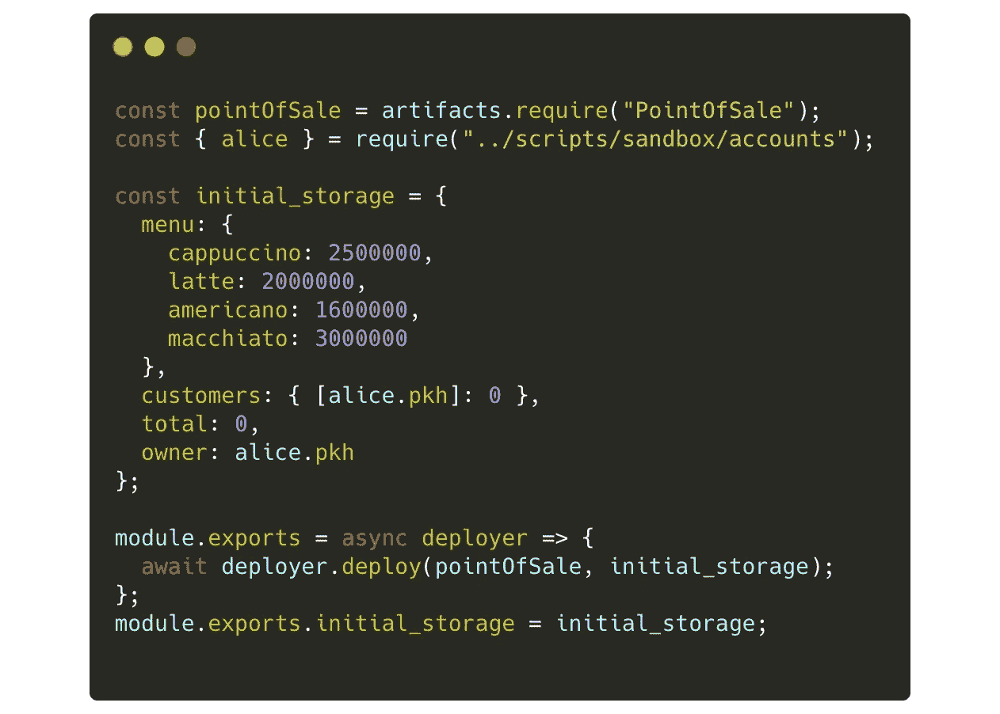
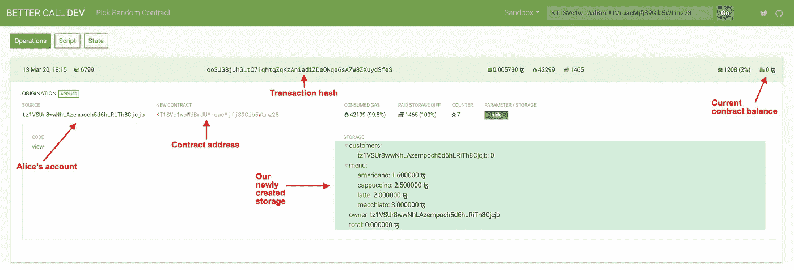
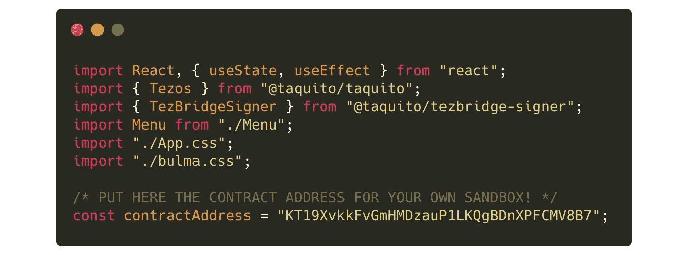
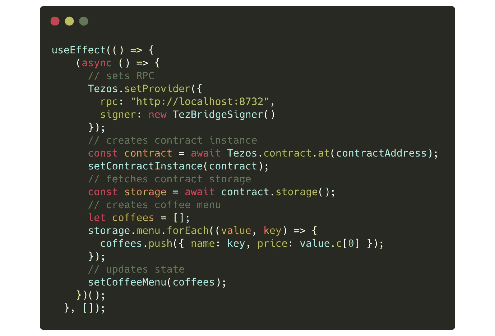
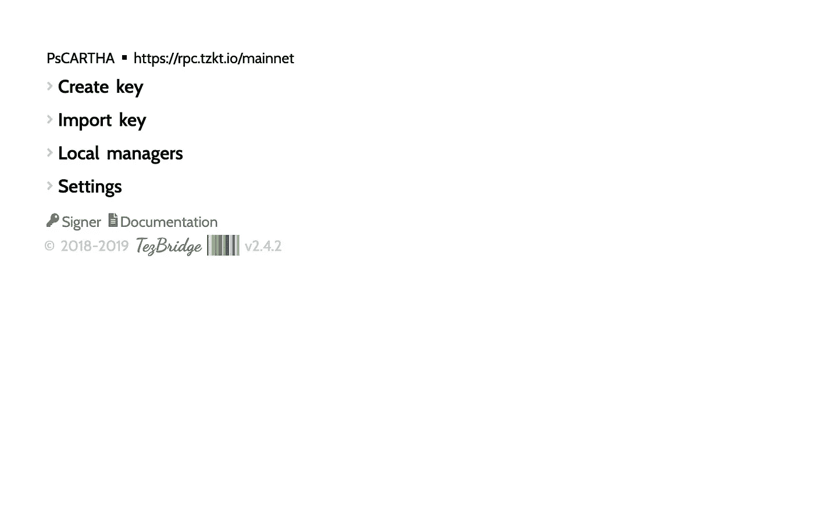
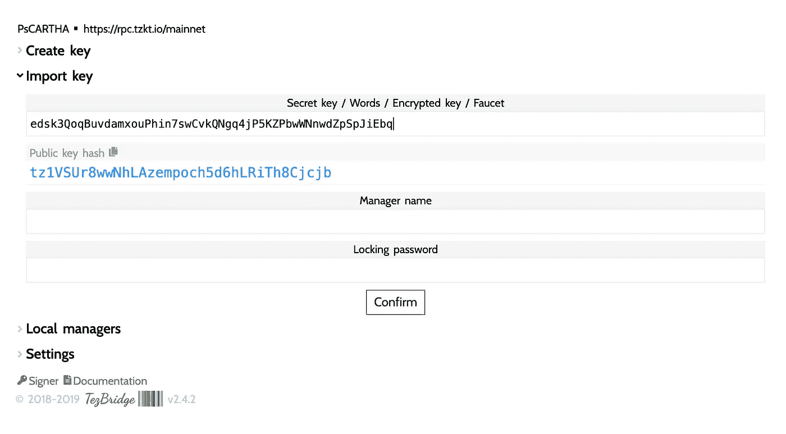
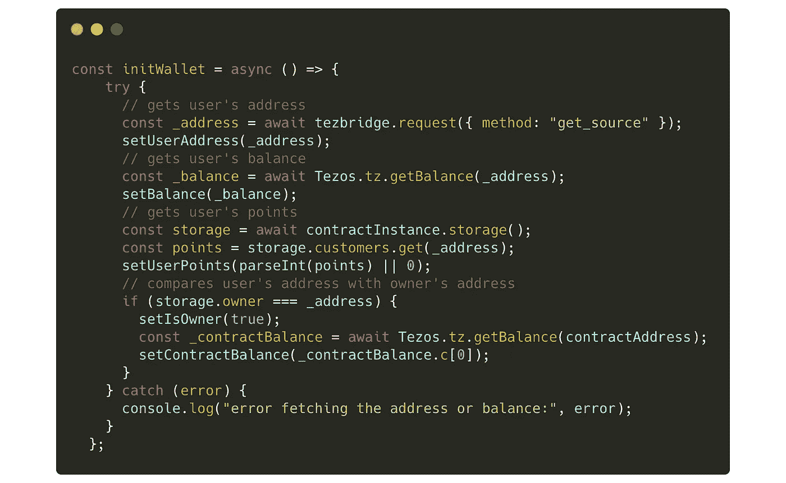
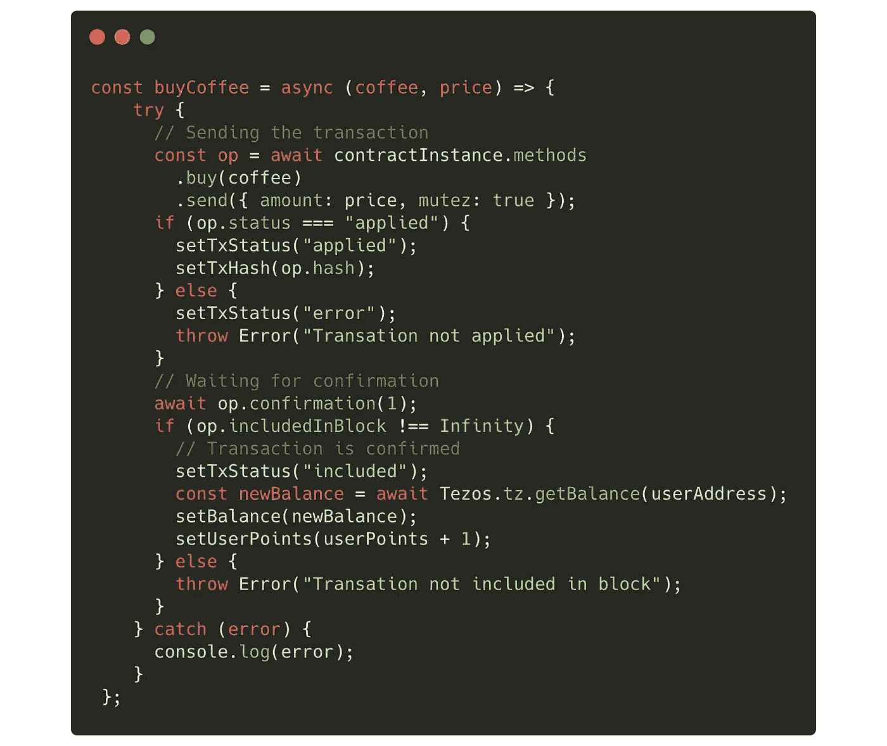
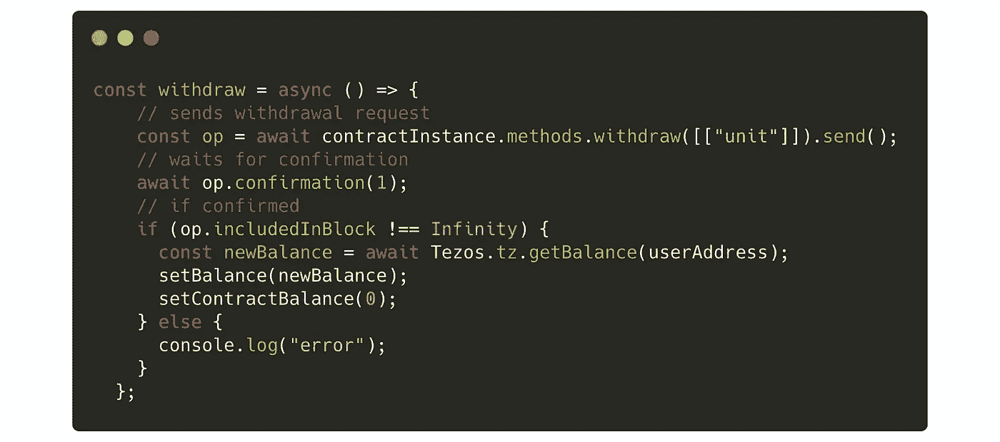

# 如何在 Tezos 上构建您的第一个 dApp

> 原文：<https://betterprogramming.pub/build-your-first-dapp-on-tezos-270c568d4fe9>

## 创建第一个简单的 dApp 所需的一切


图片由 [Pixabay](https://pixabay.com/de/photos/notebook-laptop-macbook-1280538/) 上的[安德里安·瓦雷亚努](https://pixabay.com/de/users/freephotocc-2275370/)拍摄

> **反对警告**:自从这篇文章发表以来，Tezos 生态系统已经进化了很多。这里展示的部分代码已经被弃用，或者已经创建了更好的工具。
> 请查看 [2021 版“在 Tezos 上构建您的第一个 dapp”](https://medium.com/ecad-labs-inc/how-to-build-your-first-tezos-dapp-2021-edition-b1263b4ba016)了解最新信息。

本文是我的 Ligo 智能合约开发系列教程的副产品([第 1 部分](https://medium.com/@claudebarde/getting-started-with-ligo-13ea2c4e844e)、[第 2 部分](https://medium.com/@claudebarde/getting-started-with-ligo-part-2-fb0c000e40c6)和[第 3 部分](https://medium.com/@claudebarde/getting-started-with-ligo-part-3-c1c4a403c5e4))。我们将花一些时间来看看前端应用程序如何与部署在 Tezos 区块链上的智能合约进行交互。

如果你已经在其他区块链上开发了 [dApps](https://blog.coincodecap.com/tag/dapps/) (比如[以太坊](https://blog.coincodecap.com/tag/ethereum/))，其中一些东西看起来会很相似，但其他的东西会完全不同。你还必须记住，在 Tezos 上，dApps 们还处于早期阶段，他们还没有准备好全力工作。然而，现在你仍然可以在 Tezos 上做很多很酷的事情。

我们将为一家名为 Café Tezos 的虚拟咖啡馆建立一个销售点系统。我最迫不及待想在不久的将来看到的事情之一是使用加密货币进行日常生活购物的可能性。如果你是一名开发人员，你可能会喝很多咖啡！这是一个很好的例子。

dApp 将基于反应。老实说，我更像是一个苗条的人，但由于 React 是目前最流行的前端框架，为了与尽可能多的人分享这些知识，使用它似乎是合乎逻辑的。

除了 React 之外，我们还将使用为与 Tezos 区块链一起工作而开发的不同工具:Truffle 来编译和部署合同，Stove Labs 的修改版 [Tezos starter kit 来运行沙盒节点，TezBridge 将我们的钱包与 dApp 连接并签署交易，最后，Taquito 与](https://github.com/stove-labs/tezos-starter-kit)[区块链](https://blog.coincodecap.com/tag/blockchain/)和智能合同交互。这些工具通常是分开展示的，但我相信看到它们如何协同工作会很有趣。

在深入研究代码之前，我希望您记住两点:

## **这款 dApp 还没有做好生产准备**

尽管它是可用的，但正如您将看到的，为了简单起见，还有一些考虑事项没有考虑。例如，React 代码没有进行优化以保持简单，以便初学者和高级用户都能够理解。

## 这不是一个 React 教程。

本教程需要 React.js 和 JavaScript 的基础知识。我在这里只复制重要的代码 dApp 的完整代码可以在[相关的 GitHub 库](https://github.com/claudebarde/tezos-react-tutorial)中找到。

现在是卖咖啡的时候了！

# 设置环境

在开始之前，必须确保您的计算机上安装了 Docker 和 Node.js。如果你有它们，启动 Docker 桌面。

接下来，你必须在全球范围内安装 Truffle Tezos。打开新的终端窗口，并键入:

```
$ npm i -g truffle@tezos
```

我已经在 GitHub repo 中准备好了本教程所需的一切。在终端窗口中键入:

```
$ git clone [https://github.com/claudebarde/tezos-react-tutorial](https://github.com/claudebarde/tezos-react-tutorial)
$ cd tezos-react-tutorial
$ npm install
```

在这一步之后，您有两个解决方案:您可以离开`client`文件夹，按照本教程检查代码。或者你可以删除`client`文件夹，在文件夹的根目录下创建一个新的 React app。我建议只对 React power 用户删除`client`文件夹，因为你必须填补本教程中不会出现的代码空白。

现在，让我们安装 React 依赖项:

```
$ cd client
$ npm install
```

至此，大部分设置已经完成。我们可以启动沙盒节点:

```
$ cd ..
$ npm run start-sandbox -- carthage
```

# 编译合同并部署它

我们将使用的契约已经存在于项目中。这与我们在 Ligo 教程的第 3 部分中创建的是同一个。Truffle 使得在一个叫做 [*迁移*](https://www.trufflesuite.com/docs/truffle/getting-started/running-migrations) *的过程中编译和部署新合同变得非常容易。*部署者文件如下所示:



部署者文件

这个文件做了几件简单的事情:

*   取合同进行部署:`artifacts.require("PointOfSale")`
*   它获取我们将用来部署合同的账户信息(在`alice`变量中)
*   它设置初始存储(这些值将被 Taquito 自动转换成 Ligo 兼容的值)
*   它导出部署器函数和初始存储

现在我们可以编译合同了:

```
$ npm run compile
```

只需要几秒钟，如果我没有犯任何错误，合同就编译好了。

如果你很好奇，你可能注意到这一步创建了一个`build`文件夹。在这个文件夹中，另一个文件夹`contracts`包含两个 JSON 文件，其中一个与我们的合同同名。如果你打开它，你会看到从我们的 Ligo 合同编译的迈克尔逊。

现在，我们可以将契约部署到沙盒节点:

```
$ npm run migrate
```

控制台中的输出应该类似于以下内容:

```
Starting migrations...
======================
> Network name:    'development'
> Network id:      NetXdQprcVkpaWU
> Block gas limit: 104000001_deploy_point_of_sale.js
==========================Replacing 'PointOfSale'
  -----------------------
  > operation hash:                 oo3JG8jJhGLtQ71qMtqZqKzAniadiZDeQNqe6sA7W8ZXuydSfeS
  > Blocks: 1            Seconds: 8
  > contract address:    KT1SVc1wpWdBmJUMruacMjfjS9Gib5WLmz28
  > block number:        6631
  > block timestamp:     2020-03-13T14:47:47Z
  > account:             tz1VSUr8wwNhLAzempoch5d6hLRiTh8Cjcjb
  > balance:             1999999.536464
  > gas used:            42199
  > storage used:        1208 bytes
  > fee spent:           5.73 mtz
  > burn cost:           1.465 tez
  > value sent:          0 XTZ
  > total cost:          1.47073 XTZ > Saving artifacts
  -------------------------------------
  > Total cost:             1.47073 XTZSummary
=======
> Total deployments:   1
> Final cost:          1.47073 XTZ
```

你会注意到有些值是不同的，比如`operation hash`或者`contract address`，这是完全正常的。这也给你提供了很多有价值的信息供以后使用，比如使用的气体和总成本。

我还建议您使用 [Better Call Dev explorer](https://better-call.dev/) 检查您新部署的契约——只需选择“沙箱”选项，并将契约地址复制粘贴到输入字段中。



更好的呼叫开发输出

既然我们已经建立了我们的开发环境，并且编译和部署了我们的契约，那么是时候构建我们的 dApp 了。

# 构建前端

## 设置事物

正如您从`client`文件夹中看到的，我们的 React 应用程序将非常简单:`App.js`文件是入口点，包含一个`Menu`组件，它将显示我们刚刚开始存储的不同种类的咖啡以及其他交互。

还有一个显示登录按钮和用户余额的小钱包组件。一些基本样式和加载动画样式位于`App.css`文件中，你也可以看到一个布尔玛 CSS 文件，它可以让我们快速创建一个更好的界面。

现在让我们看看`App.js`文件的顶部:



App.js

我们从 [Taquito 包](https://tezostaquito.io/)中导入我们需要的不同依赖项和两个函数(下面将详细介绍)。

无论您在这里找到什么样的契约地址，都用您输入到 Better Call Dev 接口中的地址替换它。Tezos 区块链上的合同地址以`KT1`开头——这就是你如何知道你有合适的价值。

接下来，我添加了两个简单的函数，使我们的界面更加友好:

*   `shortenAddress`会把`tz1VSUr8wwNhLAzempoch5d6hLRiTh8Cjcjb`变成`tz1VSU…8Cjcjb`，我相信你会同意，这样看起来更舒服
*   `mutezToTez`将 micro tez 中的值转换成 tez。通常，我只使用`mutez`值。在我看来，它们更容易使用，也不容易出现计算错误。您总是可以轻松地在前端显示用户友好的值，并避免 tez < = > mutez 转换或处理 mutez 的错误，而您认为它们是 tez，反之亦然！

## 添加 TezBridge

到目前为止，TezBridge 还没有 npm 包，所以不能像其他依赖项一样导入它。

如果你打开位于`public`文件夹中的`index.html`文件，你会在`<title>`标签前看到
`<script src="https://www.tezbridge.com/plugin.js"></script>`。这一行是导入 [TezBridge](https://docs.tezbridge.com/) 所必需的。

TezBridge 是一个工具，它允许你使用任何你想要的 Tezos 地址来签署交易。在区块链的背景下，*签署一项交易*仅仅意味着你批准了这项交易。在 Café Tezos 的例子中，当我们想买一杯咖啡时，我们将签署一项交易。TezBridge 插件将为我们提供一些有用的函数，我们可以用它们来签署交易和做其他重要的动作。

为 Tezbridge 插件添加脚本标签将在`window`对象中公开一个`tezbridge`对象。我们将把它保存在`window`对象中，这样我们就可以在任何时候访问它，我们将只编写`const tezbridge = window.tezbridge`来使它更容易在我们的 React 代码中使用。

## 设置 Taquito

在我们的组件安装完成后，我们将设置 [Taquito](https://tezostaquito.io/) 。塔基多是一个令人惊叹的图书馆，它将允许我们与合同和泰佐斯区块链进行交流。

正如你在`App`组件的顶部看到的，我们将从两个包中导入两个函数:`[@taquito/taquito](https://tezostaquito.io/typedoc/modules/_taquito_taquito.html)`是主包，包含我们将使用的所有可爱的功能，`[@taquito/tezbridge-signer](https://tezostaquito.io/typedoc/modules/_taquito_tezbridge_signer.html)`是我们需要的第二个包，以便使用 TezBridge 作为我们的签名者。为了安装它们，只需返回到`client`文件夹的根目录，并在控制台中键入:

```
$ npm install @taquito/taquito
$ npm install @taquito/tezbridge-signer
```

现在是时候实际使用 Taquito 了。



Taquito 设置

**先不说这个:**我们将使用的函数是异步的，但是你不能将异步函数传递给`useEffect`。诀窍是在传递给`useEffect`的函数中使用一个声明为 IIFE 的异步函数。

首先，我们需要设置我们的提供商。RPC 协议是由我们的沙盒节点(或者任何 Tezos 节点)公开的 API，它允许我们与节点通信。在本教程中，节点将使用端口`8732`来公开 RPC，所以我们使用`http://localhost:8732`作为我们的 RPC。

因为我们将使用 TezBridge 作为我们的签名者，所以我们还必须实例化 TezBridge 签名者并将其传递给 Taquito 提供者。我们调用`Tezos`对象的`setProvider`函数来设置它。一旦建立了`Tezos`对象，我们就可以使用它了。

首先，我们想要创建一个契约的*实例*。可以把这个实例看作是我们可以在 JavaScript 中使用的契约的副本:它将包含契约的入口点及其存储(以及其他有用的信息)。

只需键入:

```
const contract = await Tezos.contract.at(contractAddress);
```

这就是为什么在`truffle migrate`之后用控制台返回的地址更新合同地址很重要。Taquito 将使用您为 RPC 提供的端口来查找您的合同。然后，我们将保存契约实例，因为我们稍后将通过`useState`钩子再次使用它。

现在让我们来看看合同的存储:

```
const storage = await contract.storage();
```

契约实例有一个`storage`方法，您可以使用它来返回存储。Taquito 使得处理存储变得非常容易，因为您在 Ligo 的契约存储中声明的字段将是`storage`对象的属性。

`menu`属性作为具有不同方法的`[MichelsonMap](https://tezostaquito.io/typedoc/classes/_taquito_michelson_encoder.michelsonmap-1.html)` [给出，这些方法的功能超出了本文的范围。例如，`keys()`用`bigmap`的不同键返回一个生成器对象；`values()`对与键相关的值做同样的事情。这里我们将使用`forEach()`方法，该方法允许我们遍历`MichelsonMap`并获取字段/值:](https://tezostaquito.io/typedoc/classes/_taquito_michelson_encoder.michelsonmap-1.html)

```
storage.menu.forEach((value, key) => {
  coffees.push({ name: key, price: value.c[0] });
});
```

我们简单地用包含每种咖啡的名称和价格的对象填充一个 JavaScript 数组。

## 将钱包添加到 TezBridge

当你的用户使用你的 dApp 时，他们可能会做的第一件事就是连接他们的钱包。

由于来自以太坊，一开始没有像 MetaMask 这样的解决方案有点令人沮丧，在尝试 TezBridge 之前，我尝试了几个解决方案。我第一次看到它时，它并没有吸引我，因为它的界面有点——我们应该说——严厉！



TezBridge 页面

页面的百分之八十都是空白，点击菜单会打开跳动的窗口(和更多的空白),尽可能采用极简风格。但是不要让这欺骗了你，TezBridge 是一个很好的工具，它易于使用，并且为你的用户和你自己提供了有价值的信息。

现在，在我们可以使用 TezBridge 之前，我们必须导入我们的私钥来建立一个帐户。

如果你回到`tezos-react-tutorial`文件夹的根目录，你会发现一个`scripts`文件夹——在里面，还有一个`sandbox`文件夹。在后者里面，打开`accounts.js`文件。

在那里，复制`alice`对象(即`“edsk3QoqBuvdamxouPhin7swCvkQNgq4jP5KZPbwWNnwdZpSpJiEbq”`)的`sk`(如*密钥*)属性。

返回到 TezBridge 页面，在刚刚出现的字段中粘贴密钥之前，单击“导入密钥”:



在 TezBridge 中导入密钥

您知道您得到了正确的秘密密钥，因为它生成了正确的公共密钥(您可以在`alice`对象的`pkh`属性下找到的那个)。作为经理姓名，键入`alice`(或任何其他姓名)，并选择一个简单的密码(对于您的开发环境，它只与这个帐户相关联，您将会多次键入)。

点击“确认”，你就可以使用 TezBridge 了！

## 初始化钱包

作为 dApp 中的一个好习惯，我们不想自动连接或者有令人吃惊的欢迎用户的窗口。我们想让他们决定什么时候是他们连接钱包的好时机。Café Tezos 在右上角有一个按钮，当我们的用户按下它时，它会初始化钱包。当用户连接他们的钱包时，我们希望发生一些事情:

1.  我们将获得他们的地址，并显示在按钮上，以显示他们确实是连接的
2.  我们将获取他们的余额，这样他们可以很快知道他们是否有足够的钱购买咖啡
3.  如果合同的所有者登录，我们将为他们提供一个按钮来提取合同的余额

这是它看起来的样子:



钱包初始化

`tezbridge`对象公开了一个名为`request`的方法，在这里我们将传递一个属性设置为`get_source`的对象。这允许用户选择他们想要连接到 dApp 的[钱包](https://blog.coincodecap.com/different-types-of-crypto-wallets/)并返回相关的地址。Tezbridge 会在 dApp 旁边打开一个新标签页——你可以在完成后让它保持打开状态，也可以关闭它。用户连接后，我们保存他们的地址来更新按钮。

在 Taquito 的帮助下，我们使用`await Tezos.tz.getBalance(userAddress)`获取用户的余额。

再次感谢 Taquito 提供的令人难以置信的函数，我们可以获取存储的状态。我们只需要之前创建的契约实例，并在其上调用`storage`方法。`storage`对象将拥有以我们存储的字段命名的属性。

正如我们之前解释的，存储对象的每个属性现在都有一些可用的函数。我们想得到当前用户的点数，所以用`storage.customers.get(userAddress)`来找。

因为用户的地址可能在地图中丢失，并且在 JavaScript 中有一个`undefined`值，如果是这种情况，我们将在我们的前端 dApp 中将点数设置为`0`。

如果用户是合同的所有者，我们还将获得合同的总余额，并显示撤销它的按钮。如果你认为在我们的界面中使用这种按钮可能不安全，请记住，即使有不良意图的人获得了该按钮，他们也无法使用它——因为[智能合约](https://blog.coincodecap.com/tag/smart-contact/)将检查他们的地址。

## 买咖啡

编程中最迷人的一点是，从用户的角度来看，这只是点击一个按钮——但从开发人员的角度来看，改变一个值可能需要十几次或上百次的计算和检查！

当您向 Tezos 契约发送交易时，就会出现这种情况。该功能位于`Menu`组件中。在发送之前，您必须确保有正确的参数。您必须验证事务已被应用，并且必须等待其完成。再次，塔基多将有助于实现这一目标。这就是买咖啡的样子:



买咖啡

事务从以下函数开始:

```
const op = await contractInstance
    .methods
    .buy(coffee)
    .send({amount: price, mutez: true})
```

让我们分解一下:首先，我们需要之前声明的契约实例。这个契约实例让我们可以访问`methods`方法，它包含了契约的不同入口点。我们将使用`buy`。如果您还记得的话，智能合约中的`buy`入口点期望用户想要购买的`coffee`的名称，因此我们将其作为参数传递给`buy`方法。

最后，我们调用`send`方法，并向其传递一个具有两个属性的对象:`amount`，它包含用户为咖啡支付的 tezzies 的数量，以及`mutez`，它设置为`true`，以告诉 Taquito 我们传递的值以 micro tez 为单位。然后，事务返回一个我们接下来要使用的具有不同属性的对象。

这个操作会将用户的屏幕切换到 TezBridge 标签页(或者打开一个新的标签页，如果他们已经关闭了它)，并且会提示他们批准(或者拒绝，如果他们改变主意的话)这个交易。

一旦完成，事务返回的对象的`status`属性应该更改为`applied`。这意味着交易已发送。

现在，当沙盒节点确认事务并将其包含在块中时，我们可以坐下来放松一下了。为了做到这一点，我们调用`await op.confirmation(1)`，它将在继续执行您的代码之前等待一次确认。一旦交易被包含在一个块中，`includedInBlock`属性将从`Infinity`变为一个数字(块号)。这是信号——你可以开始煮咖啡了。

您可以从代码中注意到，在这个流程中，我们更新了 dApp 的状态。通知用户正在发生的事情是非常重要的，因为交易的确认可能需要一分钟的时间，并且您希望防止他们多次点击按钮并订购 10 杯咖啡！

花了这么多时间煮咖啡，是时候收获你的劳动果实了。

## 收回合同余额

在`App`组件中`withdraw`函数的实现将与`buy`函数非常相似，但有很大的不同，这需要深入研究一下 Taquito 文档才能发现:



撤回功能

如您所见，我们也使用契约实例来发送事务，但是请记住，`withdraw`入口点不需要任何参数。但是，契约中的`main`函数有！为了使它工作，您将一个包含另一个数组的数组以字符串`unit`作为第一个元素传递给表示您的入口点的方法——所以是`withdraw([["unit"]])`。对于`send`方法，不需要传递任何参数。

如上所示，然后等待事务被包含在块中的确认，并更新 dApp 的状态。

就是这样！现在您知道了如何使用 React、Ligo、TezBridge 和 Taquito 构建一个简单的 dApp。

# 概述

本教程提供了一个机会，让我们了解在 Tezos 上开发 dApps 的不同工具是如何协同工作的。这些工具通常是单独呈现的，但是最好记住它们实际上是您的全球 dApp 的不同部分。以下是我们在本教程中介绍的内容:

*   **React** :使用最广泛的前端框架就不用介绍了。React 与其他工具无缝协作，其 Hook API 允许我们高效地更新 dApp 的状态，以保持其与智能合约的存储同步。
*   Taquito 是一个非常有用的库，它允许与智能合约和数据操作进行多种类型的交互
*   这个小而方便的工具允许 dApp 用户选择一个钱包来签署他们的交易。如果你熟悉以太坊，它类似于 MetaMask 所实现的。

记住用户在开发 dApp 时将经历的不同步骤也很重要:

1.  他们连接他们的钱包。
2.  他们请求将交易发送到智能合约。
3.  他们签署交易。
4.  智能合约检查并处理交易。
5.  dApp 界面显示确认(或错误)消息。

# 结论

在花了几周时间寻找最佳解决方案后，我有信心如果你想在 Tezos 上构建一个 dApp，只要你使用下面的栈就不会出错:【你最喜欢的前端 JS 框架】/ Ligo / Taquito / TezBridge。

现在，您对如何在 Tezos 上构建一个简单的 dApp 有了更好的了解。这些工具非常容易使用，只要你遵循正确的步骤，就不会出错。

同样值得记住的是，在 Tezos 上开发 dApps 是一件很新的事情，而且库也在不断更新。Taquito 捆绑在您的 dApp 中，所以这不会是一个问题。但是，例如，TezBridge 的一个更新可能会打破你的 dApp。因此，关注 Tezos 社区的发展并相应地更新你的 dApp 是非常重要的。

您可能已经注意到，我们没有为我们的用户实施任何兑换积分的解决方案—您可以将它视为一个练习！否则，你能为 dApp 想到什么样的改进？也许 React 代码中存储的同步状态更好？更多数据验证？更可爱的加载动画？我迫不及待地想看看你做了什么。