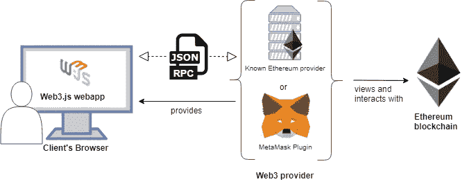

# 用 Web3.js 构建您的第一个 Dapp

> 原文：<https://betterprogramming.pub/build-your-first-dapp-with-web3-js-9a7306d16a61>

## web3.js 实用介绍


内森·达·希尔瓦在 [Unsplash](https://unsplash.com/s/photos/web-developer?utm_source=unsplash&utm_medium=referral&utm_content=creditCopyText) 上拍摄的照片。

欢迎来到学习可靠性系列的另一部分。在[的上一篇文章](https://medium.com/better-programming/learn-solidity-the-factory-pattern-75d11c3e7d29)中，我们看到了如何实现工厂模式。如果您从本系列的开始就一直在关注，那么您已经掌握了基本知识，可以开始编写自己的智能合同了。

因此，今天我将向您展示构建去中心化应用程序的全貌，并向您介绍[web 3 . js](https://web3js.readthedocs.io/en/v1.3.0/)——开始构建您自己的 dapps 所缺少的部分。

在深入讨论 web3.js 是什么以及它是如何工作的细节之前，我想先介绍一下背景，然后回答一个简单的问题:为什么选择 web3.js？



来源:[GitHub 上的以太坊书籍](https://github.com/ethereumbook/ethereumbook/issues/376)

分散式应用程序有三个主要组件:

*   前端:接受来自用户的输入，并构建要发送到智能合同的请求。
*   钱包:签署交易并将其发送到网络。
*   智能合同:这里的是您编写 dapp 的业务逻辑的地方。

现在的问题是如何只使用 JavaScript 从前端与智能合约交互。

在 web3.js 出现之前，我们可以与智能合约交互的唯一方式是通过充当 json-rpc 服务器的以太坊节点提供的 [json-rpc API](https://eth.wiki/json-rpc/API) 。这不是一项容易的任务。

但是多亏了 web3.js，您不必再担心 json-rpc 调用的底层细节，因为它提供了以太坊 JSON-RPC 接口的抽象。因此，您可以开始使用普通 JavaScript 与以太坊节点进行交互。简单来说，web3.js 将 JSON-RPC API 公开为 JavaScript APIs。

# web3.js 如何工作

正如我们之前所说，为了与以太坊网络进行交互，我们需要向一个以太坊节点发送 json-rpc 调用，这就是 web3.js 在幕后所做的事情。那么它是怎么做到的呢？

为了将 JavaScript 代码翻译成 json-rpc 请求，web3.js 使用了我们所说的*提供者*，这是一个符合 [EIP 1193](https://eips.ethereum.org/EIPS/eip-1193) 规范的 JavaScript 对象，并实现了负责进行以太坊 rpc 方法调用的`request`方法。Web3.js 有自己的上述规范的实现，并在`web3.providers`下提供，在这里您可以访问[文档](https://web3js.readthedocs.io/en/v1.2.0/web3.html#providers)中提到的以下三个提供者:`HttpProvider`、`WebsocketProvider`和`IpcProvider`。

关于这些供应商的更多信息可在文档中找到[。](http://IpcProvider)

其他项目也实现了这个规范，比如 [MetaMask](https://metamask.io/) ，在`window.ethereum`下的浏览器中注入 provider 对象。旧版本的 Metamask 用来在`window.web3`下注入 web3 的一个实例。

一旦我们有了提供者，我们就可以使用`new`关键字获得 web3 的实例:

```
let web3 = new Web3(Web3.givenProvider || 'ws://some.local-or-remote.node:8546');
```

这里您应该记住的是，web3.js 需要一个 provider 对象，该对象配置有 wallet 的信息，该信息将对交易进行签名并将其发送到网络。如果你在前端使用 web3，这个提供者将被注入到浏览器中，或者你将使用`websocketprovider`或`IpcProvider`自己构建一个对象。

*注意:MetaMask 使用*[*in fura*](https://infura.io/)*作为节点提供者。这就是为什么你不需要在电脑上安装以太坊客户端就可以与以太坊网络互动。*

# 快速浏览 API

web3.js 不仅允许与以太坊节点通信，还允许与 Whisper 和 Swarm 节点通信。它有五个主要包:

*   `web3.eth`:允许与以太坊区块链和以太坊智能合约交互。
*   `web3.bzz`:允许与 Swarm 交互，这是一个分散的文件存储库。
*   `web3.shh`:允许与广播的耳语协议交互。
*   为以太坊 dapps 提供实用函数，比如将字符串转换为十六进制，将以太值转换为 Wei。
*   `web3.*.net`:允许与以太坊节点的网络属性交互，如网络 ID 或对等点计数。

# 用 web3.js 构建您的第一个 Dapp

现在我们已经有了理论，让我们动手做我们的第一个 dapp。在这个例子中，我们将构建一个问候 dapp，它存储一个默认的问候字符串并允许用户更新它。对于钱包，我们将使用元掩码。你可以点击[他们网站](https://metamask.io/)首页的下载链接来添加扩展。

## 1.构建合同并将其部署到网络中

首先在您的工作空间中创建一个名为`greeting`的空项目，并使用`truffle init`初始化它:

```
> mkdir greeting
> cd greeting
> truffle init
```

我想你已经安装了松露。如果还没有，您可以使用下面的命令获得它:

```
npm install -g truffle
```

使用您最喜欢的代码编辑器打开项目(我使用的是 VS 代码)。接下来，编辑`truffle-config.js`文件，用以太坊网络的 IP 和端口更新网络(你可以用 Ganache 来完成)。您还需要配置编译器版本，以使用您已经安装的版本。
如果您还没有 Solidity 编译器，您可以使用以下命令安装它:

```
> npm install -g solc// check the installed version
> solc --version
```

现在，是时候在您的项目目录中创建`greeting`契约了。键入以下命令:

```
> truffle create contract Greeting
```

复制粘贴以下代码:

我们差不多准备好了。我们只需要在`migrations`文件夹下添加一个`2_deploy_greeting.js`迁移文件:

```
const Greeting = artifacts.require("Greeting");module.exports = function (deployer) {
      deployer.deploy(Greeting);
};
```

现在，您可以使用以下工具编译您的智能合约并将其部署到网络中:

```
> truffle compile
> truffle migrate
```

## 2.用智能合同连接前端

*   设置前端

用`package.json`和`index.html`文件在项目中创建一个名为`client`的新文件夹:

```
> mkdir client
> cd client
> npm init -y
> touch index.html
```

安装 web3.js 和 lite-server 依赖项:

```
> npm i web3 --save
> npm i lite-server --save-dev //for running a development server
```

创建一个名为`src`的新文件夹，添加两个脚本:`index.js`和`utils.js`。您还需要使用`script`标签和 web3 脚本在 HTML 文件中添加两个脚本:

```
<script type="text/javascript" src="node_modules/web3/dist/web3.min.js"></script><script type="text/javascript" src="src/utils.js"></script><script type="text/javascript" src="src/index.js"></script>
```

*   获取 web3 实例

一旦项目中有了 web3.js 作为依赖项，您需要做的就是使用提供者的实例实例化 web3 对象，以便享受 web3 提供的所有功能。

我们将使用浏览器中注入的`window.ethereum`元掩码提供程序，并请求用户允许使用`window.ethereum.request`访问他们的帐户，如[元掩码文档](https://docs.metamask.io/guide/rpc-api.html#permissions)中所述。

打开`utils.js`文件，添加此功能:

*   创建合同实例

如文档中的[所述，为了创建合同实例，我们需要合同 ABI 及其地址。如果您查看一下构建目录中的工件，您会发现一个名为`Greeting.json`的文件。如果你打开它，你会发现很多关于合同的信息，包括合同名称、ABI 等。如果您滚动到文件的末尾，您会发现一个 network 字段，其中包含部署了契约的网络的 ID 以及相应的地址，我们将使用该地址用 web3 实例化契约实例。](https://web3js.readthedocs.io/en/v1.3.0/web3-eth-contract.html)

在`client`文件夹下新建一个名为`contracts`的文件夹，复制粘贴`Greeting.json`文件。您还需要安装 jQuery 来读取 JSON 文件的内容:

```
> npm i jquery
```

首先，我们需要使用`web3.eth.net.getId()`获得元掩码所连接的网络的 ID。

*注意:我假设您已经将元掩码配置为使用 Ganache。如果你不确定如何去做，你可以遵循* [*这个指南*](https://www.trufflesuite.com/docs/truffle/getting-started/truffle-with-metamask) *。*

接下来，我们将使用返回的 ID 从`Greeting.json`文件中获取契约的地址，这也将为我们提供契约 ABI，并使用`web3.eth.Contract`创建一个契约实例:

## 3.与智能合同互动

一旦我们创建了契约的实例，我们就可以开始使用`myContract.methods.myMethod([arguments])`调用它的方法，如文档中的[所述。](https://web3js.readthedocs.io/en/v1.3.0/web3-eth-contract.html#id26)

如果要调用的函数是纯函数或只读函数，您需要使用:

```
myContract.methods.myMethod([arguments]).call()
```

如果要调用的函数要修改状态(即事务)，您将需要使用:

```
myContract.methods.myMethod([arguments]).send()
```

更多细节可在文档中找到[。](https://web3js.readthedocs.io/en/v1.3.0/web3-eth-contract.html#methods-mymethod-call)

你可以在 GitHub 上找到完整的代码[。](https://github.com/wissalHaji/DappTuto)

# 结论

我希望你喜欢这个教程。如果你有，那就留下来，因为接下来还有很多。