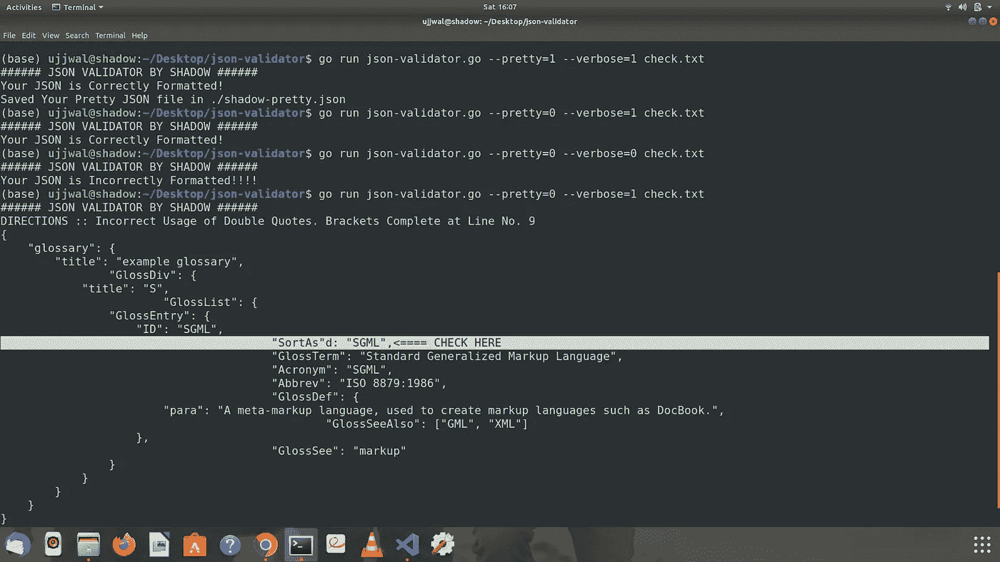

# 构建第一个用于 JSON 验证的 Golang CLI 工具

> 原文：<https://betterprogramming.pub/build-your-first-golang-cli-tool-for-json-validation-30dd4ff0b963>

## 检查 JSON 格式是否正确的工具


照片由[赛·基兰·阿纳加尼](https://unsplash.com/@_imkiran?utm_source=unsplash&utm_medium=referral&utm_content=creditCopyText)在 [Unsplash](https://unsplash.com/s/photos/linux?utm_source=unsplash&utm_medium=referral&utm_content=creditCopyText) 拍摄

在过去的 3 个月里，我一直在和 Golang 一起工作，我最终决定做一些有助于我提升技能的事情。除了命令行之外，还有什么比设计应用程序更好的方法呢！让我们开始吧。

# 我们将建造什么？

我们将构建一个命令行工具，帮助我们验证文本文件中的 JSON 文本，并告诉我们文件的格式是否正确。

如果文件格式正确，用户可以为我们提供一个选项，使用命令行参数生成一个格式正确的 JSON 文件。

我们还可以为我们的应用程序设置详细级别，这意味着我们可以告诉用户文件格式是否正确，错误是什么以及在哪一行检测到它。对于这个例子来说，错误处理是非常基本的，它包括一个括号和引号检查。然而，主要的复杂性在于为用户提供详细的能力并找出错误的位置。

# 先决条件

你应该知道基本的 Golang 语法来理解代码。如果你理解了[切片、函数、指针和控制结构](https://gobyexample.com/)，那么我们就可以开始了！我在要点代码中提供了注释，这样你就不会迷路。

您可以在这个 [Github 资源库](https://github.com/shadowshot-x/go-cli-jsonOps)中找到完整的源代码。

# 项目结构

你可以在`main.go`里面写完整的代码。然而，我决定以模块的形式编写代码，这样我就可以添加更多的功能。我采用这个项目结构来实现模块化。

```
- src/
-- example.com/
--- check.txt
--- go.mod
--- main.go
--- jsonvalidator/
    - jsonvalidator.go
    - jsonvalidator_test.go
```

# 项目索引

我把这个项目分成几个部分，以便你能更好地理解它。

1.  使用`flags`从 CLI 获取参数并解析
2.  使用`os`模块检查文件有效性并读取文件
3.  JSON 文件的验证逻辑和详细的处理
4.  保存格式良好的 JSON 文件

# 1.解析从 CLI 到 Golang 变量的参数

Golang 有一个名为 [flag](https://pkg.go.dev/flag) 的包，帮助我们在命令行级别进行解析。在这里，我使用这个包来解析 Golang 变量的参数。`flag`包帮助定义参数，提供描述，并通过引用指针变量来传递这些参数。

我们还检查用户是否提供了正确数量的参数。命名错误由 Golang 中的标志包本身处理。

# 2.文件验证并读取文件内容

我们希望确保用户在参数中提供的文件是正确的并且存在。使用函数处理这种情况有助于减少冗余代码。

# 3.JSON 文件的验证逻辑和详细处理

还记得验证括号代码[有效性的问题吗？](https://leetcode.com/problems/valid-parentheses/)

事实证明，我们在这里处理的问题是它的一个扩展版本。我在 Golang 中实现了一个 s [tack 来解决这个问题。首先，我们需要确保文件中没有前导或尾随空格。](https://yourbasic.org/golang/implement-stack/)

之后，我们逐个字符地检查文件。每当我们遇到`{`时，我们就把它添加到堆栈中，每当我们看到`}`时，我们就从堆栈中弹出。

如果堆栈在结束前的任何一点变空，我们知道括号是无效的。如果堆栈最后不是空的，我们知道括号是不平衡的。

我们还需要检查文件中是否没有`“”`以外的字符。所以，我使用了一个简单的计数器，当我们看到一个开始引用`“`时，它就会被设置。如果没有设置，我们看到一个字符，这意味着这个字符在引号之外。

我还添加了线条功能。每当看到换行符时，我们就增加 line 变量。因此，对于循环中的每次迭代，我们将得到当前的行号。

因此，在我们看到错误的每个位置，我们可以检查 verbose。如果设置了 verbose，我们可以描述错误和位置。我编写了一个单独的函数，打印文件内容，并在出错的行号上添加一个高亮显示:

# 4.保存格式良好的 JSON

这是一个简单的逻辑，使用`[ioutil](https://pkg.go.dev/io/ioutil)`包的`WriteFile`功能来实现。我们需要一个字节数组来做到这一点，我们可以根据用户提供的参数来控制它。

```
if *prettyPtr == 1 {err := ioutil.WriteFile("shadow-pretty.json", fileBytes, 0644)if err != nil {fmt.Println(err)os.Exit(1)}fmt.Println("Saved Your Pretty JSON file in ./shadow-pretty.json")}
```

# 将所有东西捆绑在一起

因此，在看到了独立工作的模块后，让我们将它们组合起来完成我们的项目。

厉害！如果您一直这样做，那么您已经构建了 Golang 的第一个 CLI 应用程序。要查看完整的代码，请务必访问上面提供的 Github 链接。

要查看这段代码在您的终端上会是什么样子，您可以查看下面的屏幕截图:



# 结论

我希望你从这篇文章中获得一些知识。感谢阅读。

一些帮助我建立这个项目的参考资料:

1.  [用 Golang 构建简单的 CLI 工具](https://www.rapid7.com/blog/post/2016/08/04/build-a-simple-cli-tool-with-golang/)
2.  [如何将整个文件读入一个字符串变量](https://stackoverflow.com/questions/13514184/how-can-i-read-a-whole-file-into-a-string-variable)