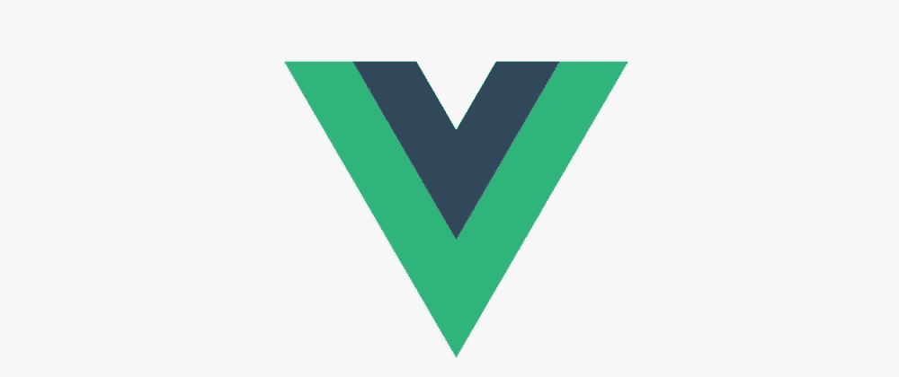
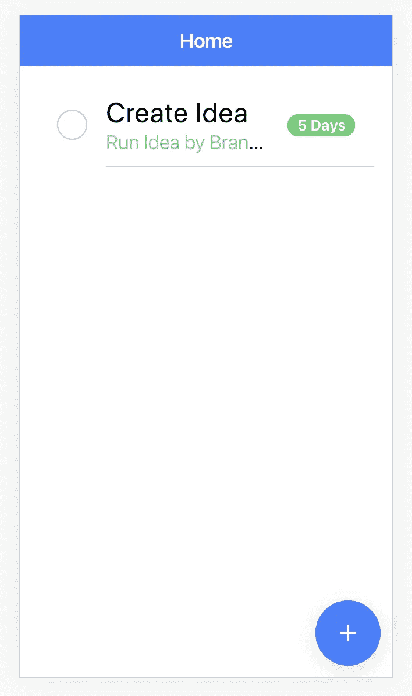
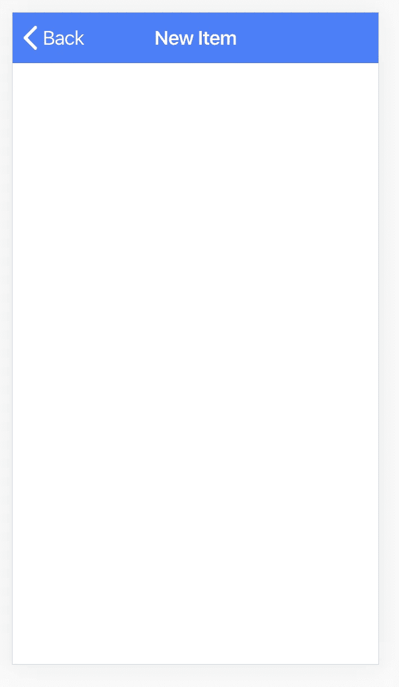

# 构建您的第一款 Ionic Vue 应用

> 原文：<https://betterprogramming.pub/build-your-first-ionic-vue-app-56db5bb1b7d5>

## 使用 Ionic 框架中的 beta Vue.js web 组件，并使用 Capacitor 将它们部署到模拟器中



vue . j

# 概观

这是一个复制 React 在 Ionic 框架文档中描述的示例应用程序的文档，但是在这种情况下，我们将使用 [Vue js](https://vuejs.org/) 。您可以通过查看[构建您的第一个 Ionic React 应用程序——概述文档](https://ionicframework.com/docs/react/your-first-app)来了解 ionic web 组件正在做什么的具体细节，该文档的详细程度不在此处讨论。

[@ionic/vue](https://github.com/ionic-team/ionic/tree/master/vue) 将 core-Ionic 体验与为 vue 开发人员量身定制的工具和 API 相结合。它目前处于测试阶段。

# 使用 Ionic CLI 创建项目

因为此时您不能使用 ionic-cli 来创建您的应用程序，所以我们将添加您需要的额外的 ionic 库和依赖项来运行您的项目。

让我们来看看最新版本的 Ionic:

```
npm install -g ionic@latest
```

使用`vue-cli`调用基础应用`my-app`，并选择默认设置:

```
vue create my-app
```

现在，添加所有特定的离子库。请注意版本的具体使用。

```
yarn add @ionic/vue@0.0.9 
yarn add @ionic/core 
yarn add vue-router
```

# 查看 Vue 应用程序结构

## 从`main.js`开始

如果你打开`main.js`，你会看到以下内容。

```
import Vue from 'vue'
import App from './App.vue'

Vue.config.productionTip = false

new Vue({
  render: h => h(App),
}).$mount('#app')
```

我们需要在这里添加一些离子代码。

```
import Vue from 'vue'
import App from './App.vue'

import Ionic from "@ionic/vue"
import "@ionic/core/css/core.css"
import "@ionic/core/css/ionic.bundle.css"

Vue.config.productionTip = false;
Vue.use(Ionic);

new Vue({
  render: h => h(App),
}).$mount('#app')
```

我们需要为离子组件添加额外的样式。

# 让我们开始路由工作

关于 vue-router 的更多信息可在此处获得: [Vue Router 文档](https://router.vuejs.org/)。

让我们接下来移动到`App.vue`并清理它，以包括支持离子路由器所需的基础知识。

```
<template>
  <div id="app">
    <ion-app>
      <ion-vue-router />
    </ion-app>
  </div>
</template>

<script>
export default {
  name: "app"
};
</script>

<style>
</style>
```

现在，我们需要返回到`main.js`并添加默认路由，它将指向`HomePage.vue`组件。

让我们添加导入来支持定制的 [ionic-vue-router](https://github.com/ionic-team/ionic/tree/master/vue) 。

```
// router
import { IonicVueRouter } from "@ionic/vue";
Vue.use(IonicVueRouter);
```

现在，让我们添加指向我们主页的基本路由；请注意 Ionic 的自定义 Vue 路由器的使用。

```
const router = new IonicVueRouter({
  routes: [
    { path: "/", redirect: "/home" },
    {
      path: "/home",
      name: "home",
      component: () =>
        import(/* webpackChunkName: "home" */ 
                        "@/components/HomePage"),
    }
  ]
});
```

首先，我们声明默认路由应该重定向到归属路由:

```
{ path: "/", redirect: "/home" },
```

然后，我们指定 home route 并延迟加载`HomePage`组件。

(参见 VueJS 文档中的“[惰性装载路线](https://router.vuejs.org/guide/advanced/lazy-loading.html)”。

```
{
   path: "/home",
   name: "home",
   component: () =>
     import(/* webpackChunkName: "home" */ "@/components/HomePage"),
}
```

既然我们已经初始化了`router`对象，我们需要让它可以被应用程序中的所有 Vue 组件访问。为此，我们需要在初始化时将路由器作为 Vue 对象的一个属性来传递。

```
new Vue({
  router,
  render: h => h(App)
}).$mount("#app");
```

# 我们的第一个离子页面

在这个页面上，`HomePage.vue`组件是 [Ionic 文档](https://ionicframework.com/docs/react/your-first-app#a-component-with-style)中描述的页面的`vue`版本

请注意，在`vue`中，我们没有使用驼峰式大小写——而是使用连字符。

```
<template>
  <ion-page>
    <ion-header>
      <ion-toolbar color="primary">
        <ion-title>Home</ion-title>
      </ion-toolbar>
    </ion-header>
    <ion-content padding>
      <ion-list>
        <ion-item>
          <ion-checkbox slot="start"></ion-checkbox>
          <ion-label>
            <h1>Create Idea</h1>
            <ion-note>Run Idea by Brandy</ion-note>
          </ion-label>
          <ion-badge color="success" slot="end">5 Days</ion-badge>
        </ion-item>
      </ion-list>
      <ion-fab vertical="bottom" horizontal="end" slot="fixed">
        <ion-fab-button >
          <ion-icon name="add" />
        </ion-fab-button>
      </ion-fab>
    </ion-content>
  </ion-page>
</template>

<script>
import { add } from "ionicons/icons";
import { addIcons } from "ionicons";
addIcons({
  "ios-add": add.ios,
  "md-add": add.md
});
export default {
  name: "HomePage",
  props: {
    msg: String
  }
};
</script>

<!-- Add "scoped" attribute to limit CSS to this component only -->
<style scoped>
</style>
```

# 添加图标

您会注意到这里的代码处理图标的方式与 ReactJS 版本中的略有不同。

1.从`ionicons`导入您想要单独使用的图标。
2。使用`addIcons`加载它们。

在下面的例子中，我们使用`add`图标来渲染`ion-fab-button`组件。

```
import { add } from "ionicons/icons";
import { addIcons } from "ionicons";
addIcons({
  "ios-add": add.ios,
  "md-add": add.md
});
```



# 使用路由器

如果你注意到了，我们在页面上有一个按钮，当用户点击它时，我们希望页面导航到下一页。我们可以通过让 [vue-router](https://router.vuejs.org/) 响应按钮上的点击事件来处理这个问题。

```
<ion-fab vertical="bottom" horizontal="end" slot="fixed">
  <ion-fab-button @click="$router.push({ name: 'new-item' })">
    <ion-icon name="add" />
  </ion-fab-button>
</ion-fab>
```

因为我们在`main.js`中将路由器添加到了`Vue`实例中，所以我们可以使用`$router`在我们的组件中访问它。

当用户点击按钮时，我们告诉路由器路由到名为`new-item`的新路径，我们将在`main.js`中将其定义为命名路由。我们回到`main.js`添加路线。

# 添加新路线

## 将路由添加到路由器对象

```
{
  path: "/new-item",
  name: "new-item",
  component: () =>
    import(/* webpackChunkName: "new-item" */    
                      "@/components/NewItemPage"),
}
```

## 添加与路线相关联的页面

新页面将遵循与其他页面相同的标题和工具栏内容结构，但我们需要找出新的后退按钮功能。

让我们创建一个名为`NewItemPage.vue`的新组件，并将其添加到`components`路径中。将以下代码添加到文件中:

```
<template>
  <ion-page>
    <ion-header>
      <ion-toolbar color="primary">
        <ion-buttons slot="start">
          <ion-back-button default-href="/"></ion-back-button>
        </ion-buttons>
        <ion-title>New Item</ion-title>
      </ion-toolbar>
    </ion-header>
    <ion-content padding></ion-content>
  </ion-page>
</template>

<script>
export default {
  name: "NewItemPage",
};
</script>

<!-- Add "scoped" attribute to limit CSS to this component only -->
<style scoped>
</style>
```

根据我们目前所见，这个页面非常简单——除了我们需要添加后退按钮。幸运的是，爱奥尼亚有这方面的东西。

```
<ion-buttons slot="start">
  <ion-back-button default-href="/"></ion-back-button>
</ion-buttons>
```

这段代码将把按钮放在标题中，并处理适当的导航，不需要任何额外的代码。



# 构建原生应用

以下概述来自[官方离子文档](http://We now have the basics of an Ionic React app down, including some UI components and navigation. The great thing about Ionic's components is that they work anywhere, including iOS, Android, and PWAs. To deploy to mobile, desktop, and beyond, we use Ionic's cross-platform app runtime Capacitor. It provides a consistent, web-focused set of APIs that enable an app to stay as close to web-standards as possible while accessing rich native device features on platforms that support them.):

> “我们现在已经有了 Ionic React 应用的基础，包括一些 UI 组件和导航。Ionic 的组件的伟大之处在于它们可以在任何地方工作，包括 iOS、Android 和 PWAs。为了部署到移动、桌面和其他平台，我们使用 Ionic 的跨平台应用运行时电容器。它提供了一组一致的、以网络为中心的 API，使应用程序尽可能接近网络标准，同时在支持它们的平台上访问丰富的原生设备功能。”

# 安装电容器

有关更多详细信息，请遵循此处提供的[说明。](https://capacitor.ionicframework.com/docs/getting-started/)

```
npm install --save @capacitor/core @capacitor/cli
```

对于 VueJS，web 资产目录是`build`。您可以在初始化应用程序时进行设置

```
npx cap init --web-dir=dist
```

否则，更新文件`capacitor.config.json`中的 web-assets 目录，以包含下面的`"webDir": "dist"`。

然后，系统会提示您回答一些关于您的应用程序的问题，例如:

```
npx cap init --web-dir=build
? App name myAppCap 
? App Package ID (in Java package format, no dashes) com.aks.mycapapp 
✔ Initializing Capacitor project in /Users/aaronksaunders/dev/projects/vuejs/my-app in 23.41ms 🎉 Your Capacitor project is ready to go! 🎉 Add platforms using "npx cap add": 
   npx cap add android 
   npx cap add ios npx 
   cap add electron Follow the Developer Workflow guide to get building: [https://capacitor.ionicframework.com/docs/basics/workflow](https://capacitor.ionicframework.com/docs/basics/workflow)
```

现在，您需要为生产构建应用程序，以便它可以被捆绑起来进行部署。

```
yarn run build
```

此时我遇到了版本问题，需要运行下面的命令来更新`core-js`库:`npm install --save core-js`。

然后，通过运行适当的命令添加您的平台。

*   现在，您可以运行`npx cap add ios`来添加 iOS
*   现在，您可以运行`npx cap add android`来添加 Android

然后启动应用程序。

*   现在，您可以运行`npx cap open ios`来启动 Xcode
*   现在，你可以运行`npx cap open android`来启动 Android Studio

## 修复标题问题的步骤，以解决新款 iPhones 上的安全区域/凹槽

对项目的`public`目录中的`index.html`文件进行如下更改:

```
<meta name="viewport" 
  content="width=device-width, initial-scale=1, shrink-to-fit=no ,    
            viewport-fit=cover" 
/>
```

最后，在`App.vue`文件中需要一些 CSS。

```
<style>
    ion-navbar.toolbar.toolbar-ios.statusbar-padding,
    ion-navbar.toolbar-ios ion-title.title-ios,
    ion-toolbar.toolbar.toolbar-ios.statusbar-padding,
    ion-toolbar.toolbar-ios ion-title.title-ios {
      padding-top: constant(safe-area-inset-top);
      padding-top: env(safe-area-inset-top);
    }
</style>
```

要推送应用程序更新，您可以运行以下命令:

```
yarn run build; npx cap sync
```

# 项目源代码

[打造你的第一款 Ionic Vue 应用](https://github.com/aaronksaunders/my-first-ionic-app-vue)