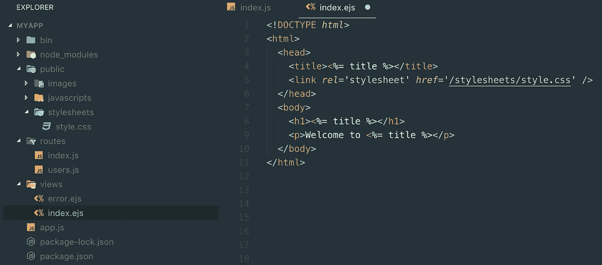
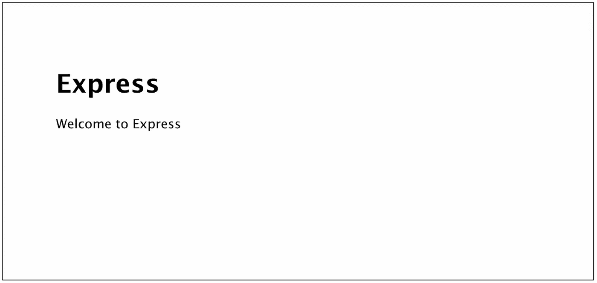

# 使用 Node.js 构建第一个本地服务器和 Web 应用程序

> 原文：<https://betterprogramming.pub/build-your-first-local-server-and-web-app-with-node-js-5a5d9e00aff0>

## 如何设置本地服务器并开始使用 Node.js 运行您的应用程序

在这个简短的教程中，您将学习如何使用 Node.js 设置本地服务器。最后，您将能够在自己的虚拟服务器上运行基本的应用程序版本。

我们开始吧！🚀

# 你为什么需要一个网络服务器，它到底是什么？

虚拟 web 服务器使用服务器软件在您自己的计算机上运行。如果你是一个有抱负的开发人员，你肯定想建立一个，因为它允许你测试你已经建立的任何 web 应用程序的特性。

想象一下，上传你的网站或应用程序，让全世界看到，而不用在线测试。没有任何方法可以确定它对其他用户是否有效。听起来很糟糕，对吧？因此，在线访问您的网站时，最好经常检查您创建的功能是如何工作的。

# 安装 Node.js

首先，我们需要安装 [Node.js](https://hackernoon.com/tagged/nodejs) ，这是 [JavaScript](https://hackernoon.com/tagged/javascript) (👉英文:Node 会帮你执行 JavaScript 代码)。

许多开发人员在谈到 Node 时都会兴奋不已。在 Node 之前，只有像 Google Chrome 这样的网络浏览器有 JavaScript 引擎，可以读取和显示用 JavaScript 编写的代码。对于 Chrome 来说，这个解释器叫做 *V8* 。Node 如此受欢迎的特性是它允许 JavaScript 基本上在所有机器上运行——这意味着浏览器不再是 JavaScript 执行的限制。

可以肯定地说，在为所有类型的 web 应用程序构建简单的服务器时，Node 是最佳选择。所以还是装吧。让我们来看看两种方法，一种是快速安装方法，另一种是一开始有点复杂，但后来更方便的方法。

## (1)快速安装 Node.js 的方法

1.  进入 Node.js 的[官方页面，下载你操作系统的安装包。使用 LTS 版本，而不是当前版本。](https://nodejs.org/en/download/)
2.  下载完成后，像在 Mac 或 PC 上安装任何其他应用程序一样安装软件包
3.  接下来，您可以进入您选择的终端程序。如果你没有安装 iTerm2 或 Hyper 之类的终端应用，只需打开每台 Mac 上预装的终端。如果您是 Windows 用户，请在此处查看。
4.  您可以在您的终端中键入以下命令，看看是否所有东西都安装正确:`$ node -v`。如果工作正常，您现在应该会看到一个节点版本号。另外，检查`npm`是否安装了`$ npm -v`和*。* `Npm`是 Node 安装时自带的节点包管理器。我们将在接下来的步骤中使用它来安装 Express 并启动我们的虚拟服务器。

## (2)更好的安装 Node.js 的方法

比起上述方式，我更喜欢用 [Homebrew](https://brew.sh/) ，这是一个 macOS 的包管理器。它允许你通过终端超快地安装缺失的应用程序。Windows 用户必须使用另一个包管理器，如 [Scoop](https://scoop.sh/) 来代替。它们非常相似，出于演示目的，我将向您展示如何通过自制软件安装 Node。

1.  同样，\转到终端并粘贴以下提示(不带$-符号)。如果你想知道:它只是检查家酿的 GitHub 库，并从那里安装应用程序。
    `$ /usr/bin/ruby -e “$(curl -fsSL [https://raw.githubusercontent.com/Homebrew/install/master/install](https://raw.githubusercontent.com/Homebrew/install/master/install))`
2.  如果家酿安装正确，我们现在将准备安装节点与这个简单的命令:`$ brew install node`
3.  您可以通过输入:`$ node -v`和`$ npm -v`来检查一切是否正常(这应该会给出您安装的节点的版本号)。

但是为什么要通过像 Homebrew 这样的包管理器来安装 Node 呢？有几个原因说明这是一个好主意:

*   如果您正在使用节点的安装管理器，您可能会遇到访问问题，需要您使用名为`$ sudo`的命令在系统中进行更改。
*   此外，如果你想卸载没有节点，这将是非常混乱的，因为你需要跟踪所有的文件被创建。
*   最后，当使用自制软件时，保持你的节点版本最新也容易得多。

# 设置您的第一个应用程序

你还和我在一起，对吗？太好了，让我们最后继续构建一个实际的 web 应用程序和本地服务器吧！

为了方便起见，我们可以使用`express-generator`，它是一个很棒的命令行工具，可以为我们创建一个应用程序框架。否则，您将需要编写更高级的代码，如设置服务器实例、配置视图引擎等。虽然知道这一点很好，但是没有必要在网络服务器上运行你的第一个应用程序。

`Express-generator`直截了当。只需将下面的命令黑进你的终端:`$ npm install express-generator -g`。通过`-g`，我们可以在全球范围内安装 Express，这意味着您可以从任何目录访问该软件包。

仍然在终端上，你现在可以通过输入`$ express -v ejs -c sass myapp`用`express-generator`创建一个新的应用。在本例中，`myapp`将是您的项目名称。你猜怎么着？您刚刚构建了您的第一个应用程序！要访问我们刚刚创建的`myapp`目录，您可以键入`$ cd myapp`。

# 欣赏你刚刚创建的应用程序

看一看您刚刚创建的`myapp`项目。要在代码编辑器中查看您的文件，只需在终端上的`myapp`文件夹中使用下面这一行:`$ code .`。

当然，要做到这一点，您必须安装像 Visual Studio Code 或 Atom 这样的代码编辑器。

当打开编辑器时，您可以看到项目和所有文件，这些文件都是使用 Express generator 自动为您创建的。在`index.ejs`中，你可以在那里编辑和构建你复杂的网络应用。现在，让我们保持原样，继续构建我们的服务器。

在代码编辑器中设置快速生成器

我们快到了。

最后一件事:我们必须安装各种额外的第三方包(在`package.json`文件中作为依赖项列出)。这些通常是 Express 运行服务器所需要的。好消息是这将非常容易，因为你可以通过`npm`一次安装所有这些。打开您的终端并使用以下提示:

`$ npm install`。您可以通过再次进入代码编辑器来检查安装是否成功。你会看到一个名为`node_modules`的新文件夹，就像我上面的例子一样(提示:如果你上传到 GitHub，请排除这个)。

# 在虚拟 Web 服务器上启动您的应用程序

最后，让我们在 web 服务器上运行我们的应用程序。前面的步骤已经完成了大部分必要的工作！两个简单的步骤，你就到了:

1.  在终端中，提示该命令:`$ npm start`。这将启动一个虚拟服务器。
2.  转到互联网浏览器的地址栏，键入`localhost:3000`。Localhost 和*一样是顶级域名(TLD)。com* 或*。org* 。然而，它是为文档和测试目的而保留的。用`*:3000*` 调用默认端口来访问新建的服务器。

Express 应用程序运行后，本地服务器上会出现欢迎屏幕

# 从这里去哪里

恭喜你。您已经创建了自己的第一个应用程序，并在自己的服务器上运行。从这里开始，您可以开始构建您的自定义应用程序。应用程序框架已经设置好，允许您在`index.ejs`内构建自己的站点。如果你想建立比简单网站更高级的东西，你应该考虑使用 partials。这意味着你可以用你的`index.ejs`引用的组件来构建你的应用。为了方便起见，我们已经安装了视图引擎 EJS，它将帮助您在组件中构建应用程序的特定部分。

感谢您的阅读。我真的希望这篇教程对你有所帮助。