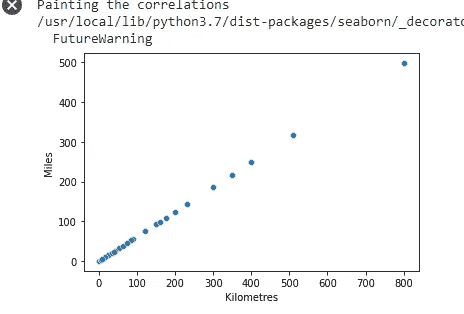
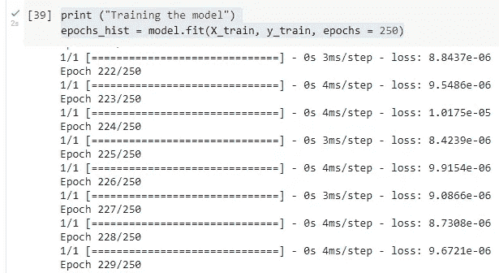
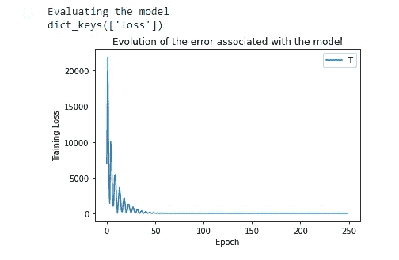

# 用 TensorFlow 建立你的第一个机器学习模型

> 原文：<https://betterprogramming.pub/build-your-first-machine-learning-model-with-tensorflow-ffc2f7cbf4f2>

## 理解机器学习如何工作的一步一步的实际例子

照片由[亚历山大·奈特](https://www.pexels.com/@agk42?utm_content=attributionCopyText&utm_medium=referral&utm_source=pexels)从[派克斯](https://www.pexels.com/photo/high-angle-photo-of-robot-2599244/?utm_content=attributionCopyText&utm_medium=referral&utm_source=pexels)拍摄

在这篇文章中，我将一步一步地解释如何使用 TensorFlow 创建一个简单的机器学习模型。

[TensorFlow](https://www.tensorflow.org/) 是谷歌开发的一个库，于 2015 年作为开源发布。TensorFlow 使建立和训练机器学习模型变得非常简单。

我们接下来要构建的模型将允许我们自动将公里转换为英里。用数学公式进行这种计算并不神秘，但我们在本例中要做的是创建一个模型，学习如何进行这种转换。

我们将为模型提供一个输入 [CSV](https://en.wikipedia.org/wiki/Comma-separated_values) 文件，其中包含已经执行的 29 种公里和英里之间的转换，基于这些转换，我们的模型将学习自动执行这种转换。

我们将使用监督学习算法，因为我们知道数据的输入和输出结果。

作为编程语言，我们准备用 Python。 [Python](https://www.python.org/) 提供了一系列方便的库和实用程序来处理机器学习。

本例中的所有步骤都是使用 [Google Colab](https://www.youtube.com/watch?v=inN8seMm7UI) 执行的。Google Colab 允许我们在零配置的情况下在浏览器中编写和执行 Python。

# 导入必要的库

我们从导入我们将在示例中使用的库开始。

导入必要的库。

*   我们将导入 TensorFlow 来创建我们的机器学习模型。
*   我们还将导入 Pandas 库来读取 CSV 文件，将公里转换为英里。
*   最后，我们将导入 Seaborn 和 Matlotlib 库来描绘不同的结果。

# 加载样本数据

我们将逗号分隔值(公里-英里. csv)文件读入数据框。这个文件包含了公里和英里值之间的一系列对应关系。我们将使用这个数据帧来训练我们的模型。

你可以从[这里](https://drive.google.com/file/d/1m63pJA-zUAA12XOCCBt3Aik9fnjrj_8s/view?usp=sharing)下载。

☝从谷歌 Colab 中读取文件，你可以使用不同的方式。在这种情况下，我将 CSV 文件直接上传到 Google Colab 中的 sample_data 文件夹，但是您也可以从 URL 读取文件，例如从 GitHub。

上传到 Google Colab 的问题是，当运行时重新启动时，数据会丢失。

*   数据框是一种二维的、大小可变的异构表格数据。

样本数据信息。

# 绘制数据框

我们使用“seaborn”库的“散点图”方法绘制上述值的图表，我们已经以“sns”的名称导入了该库。它向我们展示了 X(公里)和 Y(英里)对应关系之间的图形表示。

绘制数据帧。

公里和英里之间的相互关系。

我们定义数据帧的输入和输出来训练模型:X(公里)是输入，Y(英里)是输出。

输入和输出变量。

# 创建神经网络

现在，让我们使用“keras”。“顺序”方法创建一个“层”被顺序添加到其中的神经网络。每一层都具有逐渐提取输入数据以获得所需输出的功能。

[Keras](https://keras.io/) 是一个用 Python 编写的库，允许我们创建神经网络，访问不同的机器学习框架，比如 TensorFlow。

接下来，我们将使用“添加”方法给模型添加一个层。

创造神经网络。

# 编译模型

在训练我们的模型之前，我们将在编译步骤中添加一些额外的设置。

我们将建立一个优化器和一个损失函数，它将测量我们的模型的准确性。

*   Adam 优化是一种基于一阶和二阶矩的自适应估计的随机梯度下降方法。

为此，我们将使用基于均方差的损失函数，它测量我们预测的均方差。

我们模型的目标是最小化这个函数。

编译模型。

# 训练模型

我们将使用“拟合”方法来训练我们的模型。首先，我们传递自变量或输入变量(X 公里)和目标变量(Y 英里)。

另一方面，我们指出了历元的数量。在这种情况下，250 个历元。一个历元是对所提供的整个 X 和 Y 数据的迭代。

*   如果历元数少，误差就大，反之亦然。
*   如果历元的数量很大，算法的执行速度会比较慢。

训练模型。

训练模型控制台。

# 评估模型

现在，我们评估所创建的模型，其中我们可以观察到损失(Training_loss)随着更多迭代(epoch)的执行而减少，如果训练集数据有意义并且是足够大的组，这是合乎逻辑的。

从图中我们可以看出，用 250 步训练模型没有多大帮助，并且在第 50 次迭代之后，误差没有减小。

因此，训练该算法的最佳步骤数大约是 50 步。

# 做出预测

既然我们已经训练了我们的模型，我们可以用它来做一个预测。

在这种情况下，我们将值 100 赋给模型输入变量，模型将以英里为单位返回预测值:

做出预测。

从公里到毫勒的换算是 62.133785。

# 检查结果

检查结果。

使用数学公式从公里到英里的转换如下:62.139999999999999 预测误差:0.00621414

# 最后的想法

通过这个例子，我们看到了如何使用 TensorFlow 库来创建一个模型，该模型已经学会自动地将公里转换成英里，并且误差很小。

TensorFlow 用于执行此过程的数学非常简单。基本上，此示例使用线性回归来创建模型，因为输入变量千米和输出变量英里是相关的。

在机器学习中，过程中最耗时的部分通常是准备数据。

随着时间的推移，我们获得了帮助我们选择最合适的算法及其设置的经验和一些直觉，但总的来说，这是一项分析-测试和改进的任务。

如果你喜欢这篇文章，考虑通过我的[个人资料](https://kesk.medium.com/membership)订阅 Medium。谢谢大家！

# 参考

 [## keras:Python 深度学习 API

### Keras 是为人类设计的 API，不是为机器设计的。Keras 遵循减少认知负荷的最佳实践:it…

keras.io](https://keras.io/) 

[https://pandas . pydata . org/pandas-docs/stable/getting _ started/index . html](https://pandas.pydata.org/pandas-docs/stable/getting_started/index.html)

 [## 张量流

### 一个面向所有人的端到端开源机器学习平台。探索 TensorFlow 灵活的工具生态系统…

www.tensorflow.org](https://www.tensorflow.org/) 

【https://colab.research.google.com/notebooks/welcome.ipynb? hl=en