# 从头开始建立你的第一个神经网络

> 原文：<https://betterprogramming.pub/build-your-first-neural-network-from-scratch-c5d5490a3f76>

## 让我们教 AI 做一些简单的事情

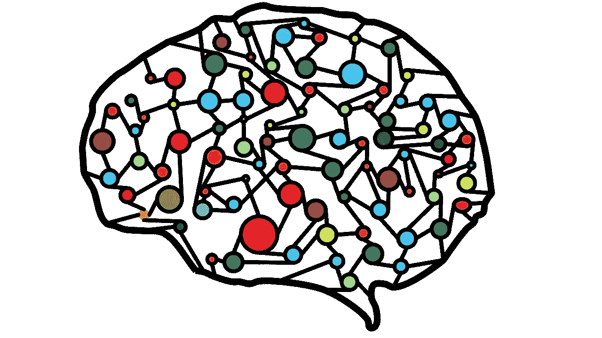

图片由[艾哈迈德·加德](https://pixabay.com/users/ahmedgad-9403351/?utm_source=link-attribution&utm_medium=referral&utm_campaign=image&utm_content=3501528)从[皮克斯拜](https://pixabay.com/?utm_source=link-attribution&utm_medium=referral&utm_campaign=image&utm_content=3501528)拍摄

我一直想玩神经网络很长一段时间，最后我发现了一个机会的窗口，可以在神经网络周围乱搞。它离天网相当远，我不认为我完全掌握了这背后的数学，但我们先教 AI 做一些简单的事情。

# 代码背后的理论

神经网络并不是一个新概念。它们是由沃伦麦卡洛克和沃尔特皮茨在 1943 年首次提出的。

我们将建立一个没有隐藏层或感知器的单层神经网络。它将由一个包含训练示例、突触或权重以及神经元的输入层和一个包含正确答案的输出层组成。这是神经网络的图示:

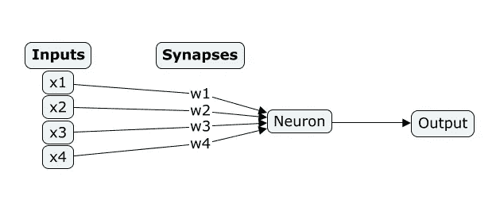

此外，我们需要了解一些数学概念，如 sigmoid 和导数，以了解神经元如何学习。但是神经元所做的仅仅是取一个输入值，乘以突触权重。然后，我们对所有这些乘法求和，并使用 sigmoid 函数来获得 0 到 1 范围内的输出。

神经元表示:

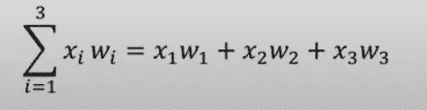

Sigmoid 函数:

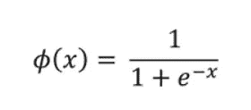

# 问题定义

我们在输入层有一系列的数字。我们希望神经网络在输入数据集样本的第一个数字为 1 时返回 1，在第一个数字为 0 时返回 0。这表现在输出层。这是问题集的样子:

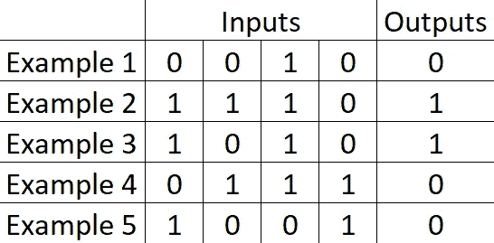

# 先决条件

我希望我们发展一些概念上的理解，我们可以开始编码。

我们将使用 Python 和 [NumPY](https://numpy.org/doc/stable/) 库。

NumPY 安装:

```
*pip install numpy*
```

如果安装成功，我们就可以进入编码部分了。首先，我们需要做的是将 NumPy 导入 Python 文件:

```
*import numpy as np*
```

现在我们准备好描述和训练我们的神经网络。

# 培养

首先，让我们创建一个 sigmoid 函数:

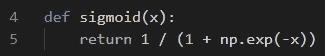

接下来，我们将定义训练示例、输入(在一个 4x 5 的矩阵中)和输出:

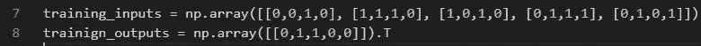

接下来，我们需要通过生成随机值来初始化突触权重，并将它们放入一个 4 乘 1 的矩阵中:

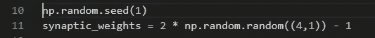

接下来，我们开始构建训练模型。我们将使用一个`for` 循环，所有的训练都将发生在这个循环内部。我们将调用 sigmoid 函数，并传递所有输入的总和乘以 sigmoid 权重。`Np.dot` 会给我们做矩阵乘法。以下是我们所掌握的情况:

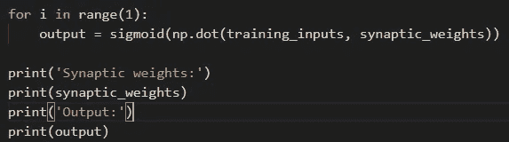

我们的输出是:

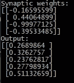

现在我们准备好进行训练了。我们将通过计算 sigmoid 函数的输出和实际输出之差来实现。然后我们可以根据错误的严重程度来调整我们的权重。我们要重复几次，比如说一万次。

让我们定义 sigmoid 导数:

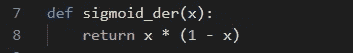

这是我们计算和调整权重的方法:

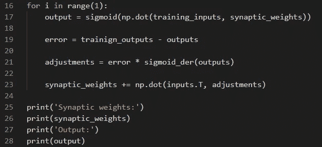

让我们开始学习，看看学习过程的长短会如何影响结果。我们将从 100 次迭代开始:

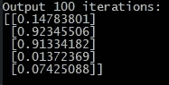

对于开始来说还不错——我们的人工智能学会了如何识别模式，但错误的百分比仍然很高。现在让我们做 1000 次迭代:

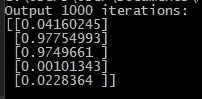

好多了，但是让我们继续做 10，000 次迭代:

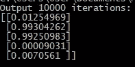

最后 100，000 次迭代:

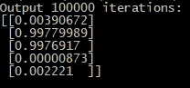

我们可以跟上增加更多的学习迭代，但我们永远不会达到 100%的准确性，因为那将需要无限量的计算。但即使在最坏的情况下，我们也有 99.77%的可能准确率，这已经很不错了。

对于最后的代码，我已经把它做得很漂亮，并按功能分开。我还添加了一个非常复杂的方法，将权重存储在文本文件中。这使得我们可以一次性完成学习过程，当我们需要使用我们的人工智能时，我们可以只导入权重并使用 sigmoid 函数。

# 结论

我们的第一个人工智能已经可以生产了。即使它只能在非常小的数据集上识别非常简单的模式，现在我们可以扩展它，例如，尝试教人工智能识别图片中的东西。我将在下一篇文章中讨论进一步的发展。

不断学习，不断成长！