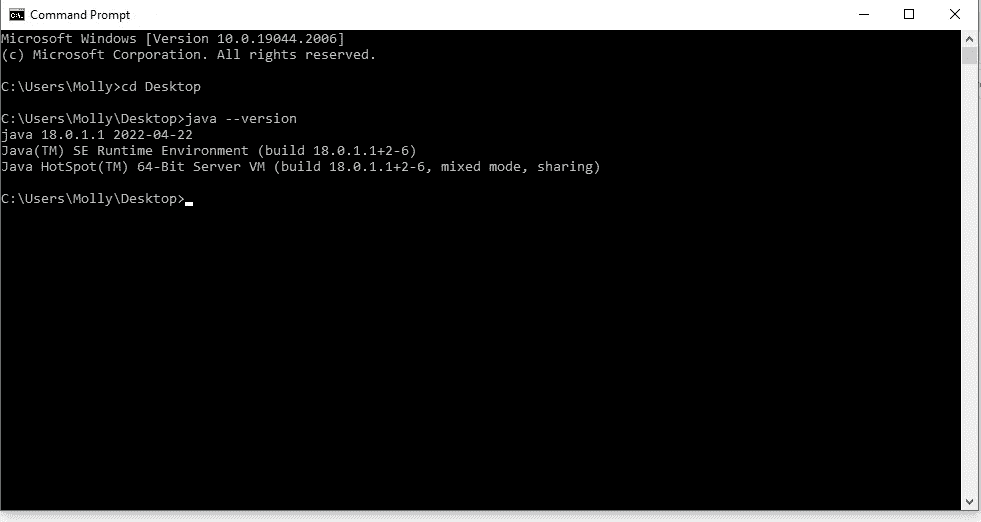
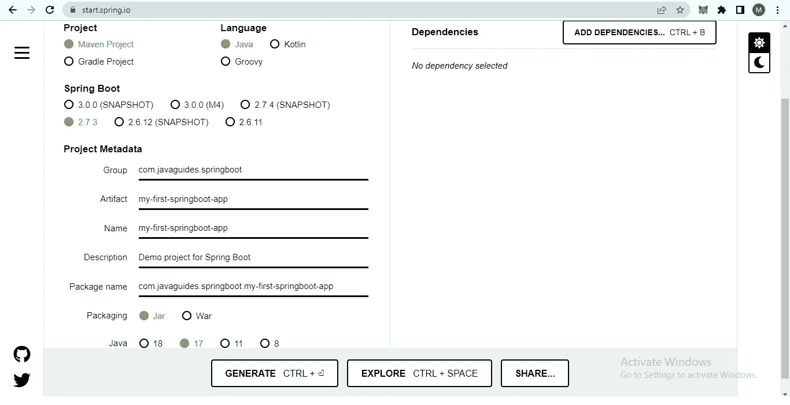
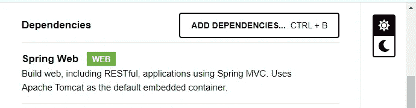
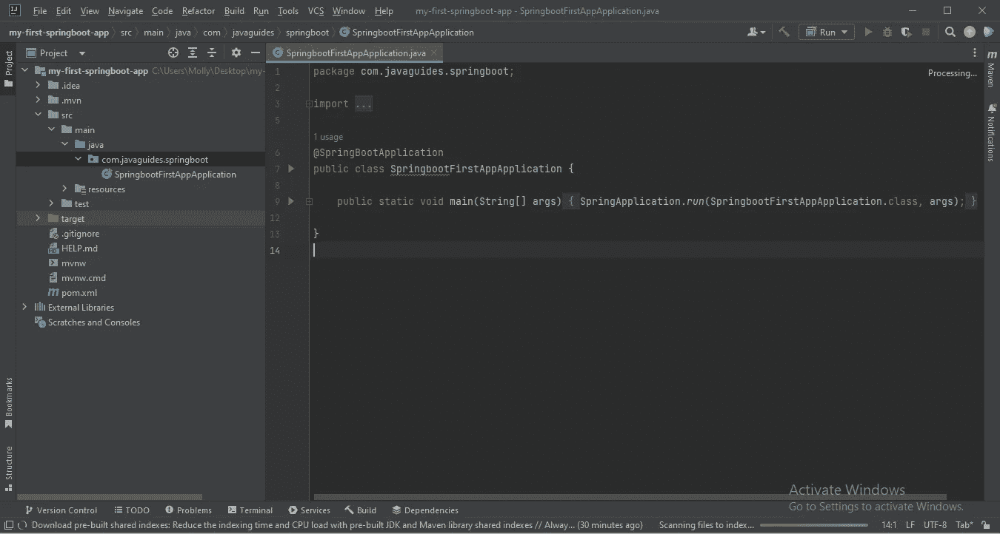
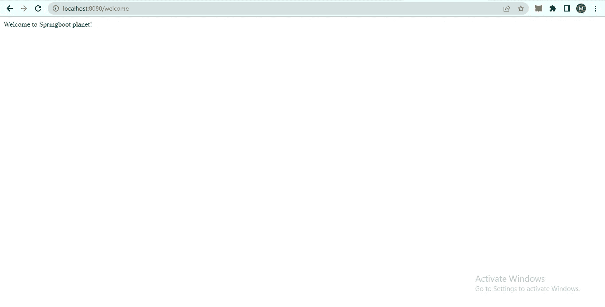

# 用 IntelliJ 免费社区版构建您的第一个 Spring Boot 项目

> 原文：<https://betterprogramming.pub/build-your-first-spring-boot-project-with-intellij-free-community-addition-44dc950601ef>

## 这一惊人组合的简介


图片来自[这篇 Salil Chincholikar 的文章](https://dev.to/chincholikarsalil/java-spring-boot-is-there-a-specific-learning-path-2meo)。

您可能正在阅读，因为您想要在您的智能上构建一个 Spring Boot 应用程序。不幸的是，IntelliJ 的免费社区插件没有预装 Springboot 插件。

有几种方法可以将您的 Java 连接到 IntelliJ free addition，我们在本文中采用的方法是创建一个关于 SpringBoot Initialzr 和 importing 的项目。

# 什么是 Spring Boot？

[Spring Boot](https://spring.io/projects/spring-boot) 是一个基于 Java 的开源框架，构建在 Spring 框架之上，用于创建微服务。在 Spring Boot 的帮助下，您可以从您的 IDE 中构建 Rest APIs，而无需在复杂的配置上花费时间。

# Java 是什么？

[Java](https://www.oracle.com/java/technologies/) 是世界上最流行、最受认可的编程语言之一。Java 用于开发移动应用程序、web 应用程序、桌面应用程序、游戏等等。

# 什么是 Spring Initializr？

Spring Initializr 是一个 web 应用程序，可以为您生成一个 Spring Boot 项目结构。

# 什么是 IntelliJ？

[IntelliJ IDEA](https://www.jetbrains.com/idea/) 是一个集成开发环境(IDE)，由 JetBrains 为 JVM 语言构建，用于开发计算机软件，旨在最大限度地提高开发人员的工作效率。IntelliJ IDEA community addition 是该软件的免费开源版本，因为它是免费的，所以它的开箱即用功能比 IntelliJ IDEA Ultimate 少。

# 先决条件

您应该在计算机上安装 Java，并在计算机上下载 IntelliJ 免费社区附加 IDE。

# Spring Boot 设置

打开命令提示符并导航到当前用户的桌面。当在文件中时，检查 java 是否安装在您的笔记本电脑上。您还可以看到您当前使用的是哪个版本的 Java。

```
java --version
```



命令提示符的快照

接下来，你可以进入你的浏览器，访问 [Spring Initializr](https://start.spring.io/) 。您将看到一个菜单，为您的 Spring 项目选择配置。

如下图所示设置您的应用程序:



SpringBoot 初始化设置

接下来，转到页面右侧的依赖项选项，搜索“Spring Web”添加依赖关系。



弹簧依赖关系

单击“生成”，这应该会将应用程序下载到您的计算机上。该文件是压缩的，所以确保为下一步解压缩它。

# IntelliJ 免费社区添加设置

在你的电脑上，打开你的 IntelliJ 应用程序，点击“打开”，你将导航到上面创建的 Spring Boot 项目。如果你被要求“信任并打开项目‘我的第一步-跳靴-应用’？”选择信任项目。

该项目现在应该已在您的 IntelliJ IDE 上打开。导航至 my-first-spring boot-app > src > main > Java > com > javaguides > spring boot > spring boot first application。在那里，你会找到主要的方法。这是你的应用程序的起点。您将从这个文件运行您的应用程序。



IntelliJ 的 Spring Boot 项目

如果您此时运行项目并查看控制台，它会让您知道您的应用程序正在运行哪个 localhost 门户。我们想测试一下是否一切都按预期运行。我们将通过在 IntelliJ 上构建一个 Rest API 端点来实现这一点。

# 创建一个简单的 Rest API

我们将在`com.javaguides.springboot`包中创建一个类，并将其命名为`WelcomeController`。在类中，我们将创建一个用于 Rest API 的方法，但是首先，我们将导入`RestController`和`GetMapping`(这些应该会自动导入，就像您在代码中调用它们一样)。最后，您的`WelcomeController`类将如下所示:

运行您的程序并检查您的控制台，以确保它已成功运行。它应该会告诉您应用程序可以在哪个端口找到。打开浏览器，导航到您在上面的`GetMapping`中使用的路线(在我的例子中是“/welcome”)。

您现在将看到以下内容:



最终产品

您的 Rest API 已经启动并正在运行。

# 结论

恭喜你！您已经成功地创建了您的第一个 Spring Boot 项目，并构建了一个简单的 Rest API 来测试是否一切正常。我希望你和我一样对建造这个并看到它工作感到兴奋。Spring Boot 是一个非常方便和简单的工具，拥有和探索它可以创建令人敬畏的应用程序。