# 用 WidgetKit 构建你在 iOS 14 中的第一个 Widget

> 原文：<https://betterprogramming.pub/build-your-first-widget-in-ios-14-with-widgetkit-9b893423e815>

## 今天是开始打造苹果新部件的好日子

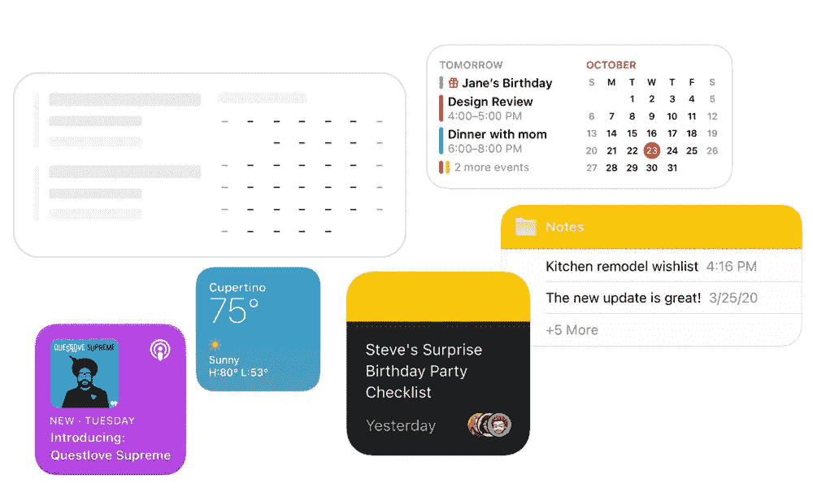

Widgets with WidgetKit】苹果 HIG

在有史以来第一次完全在线的全球开发者大会 WWDC20 上，苹果宣布在 iOS 14 的主屏幕上引入小工具。这一举动，以及将应用程序转移到应用程序库，是一个意想不到的举动，因为自第一版 iOS 推出以来，主屏幕没有发生任何变化。

在“[Meet widget kit”WWDC 会议](https://developer.apple.com/videos/play/wwdc2020/10028/)中，我们看到来自苹果的 Nahir 和 Neil 向我们展示了新发布的主屏幕小部件(这些小部件完全由 SwiftUI 构建，可以在 iOS 14、iPadOS 和 MacOS Big Sur 之间互操作)。

在我的[另一篇文章](https://medium.com/better-programming/widgetkit-in-ios-14-wwdc20-81cf10f51af9)中，有主题演讲要点的摘要文本，一篇四分钟的阅读。一定要仔细阅读，因为这篇文章是纯技术性的，建立在我在上面链接的文章中提到的概念之上。

## 先决条件

确保您拥有:

*   运行 macOS Catalina 10.15.5 或更高版本的 Mac 设备
*   安装了 Xcode 12.0 beta 1 或更高版本(尽管由于某种原因，我无法在 Xcode 12.0 beta 1 的 SwiftUI 预览窗格中预览小部件，这在我转移到 beta 2 后得到了解决)
*   SwiftUI 的基础知识。你可能会发现 raywenderlich.com 大学的这门免费课程很有帮助。

# 入门指南

打开您想要添加 widgets 的 Xcode 项目。如果你还没有一个，创建一个新的空白的也完全没问题。

该应用程序可以在 UIKit 或 SwiftUI 中制作，但由于小部件仅用于 SwiftUI，我将继续使用 SwiftUI 界面。

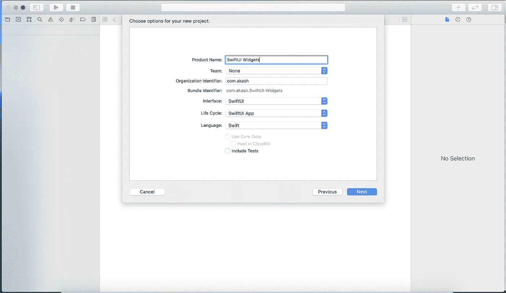

创建一个空白 Xcode 项目

完成后，通过进入文件➡新➡目标➡选择小部件扩展来添加新的小部件扩展。


添加小部件扩展

您有一个允许您“包含配置意图”的复选框在本教程中，我们将涵盖静态配置，因为我们不想给用户一个选项来编辑小部件中的东西。取消选中复选框，并选择“完成”

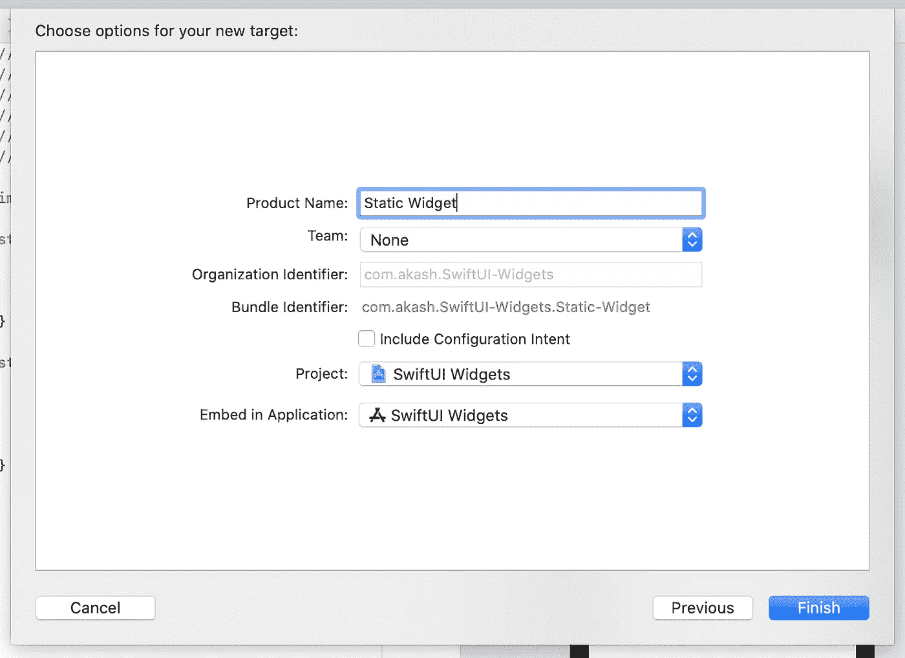

选择您的静态意图模板

在接下来的屏幕上选择“激活”。

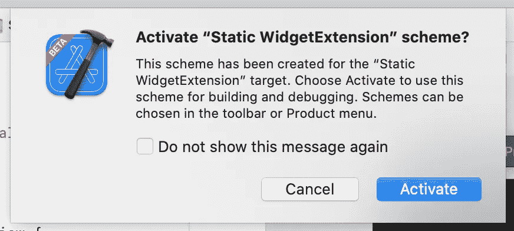

激活新创建的方案

导航到新创建的扩展下的 Swift 文件，以在预览窗格中查看小部件的预览。

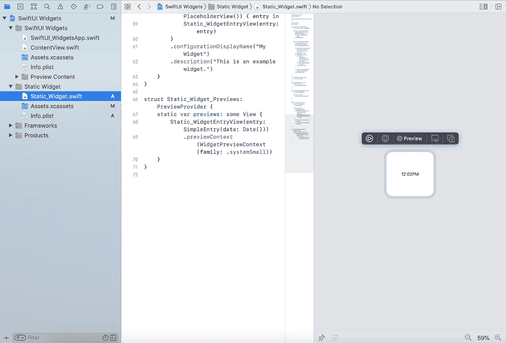

预览新创建的模板小部件

您还可以通过在预览画布中点击小工具上方的播放图标来预览小工具在手机上的外观。

# 理解样板文件

查看小部件类的框架，您会看到类型为`TimelineEntry`的`struct Provider`，它有两个功能:`snapshot`和`timeline`。我们将在稍后的时间点回到这些。

然后，有一个类型为`TimelineEntry`的结构`SimpleEntry`，具有`date`属性。这通常是要在小部件中显示的数据结构。

然后就是两个视图，`PlaceholderView`和`Static_WidgetEntryView`。这些视图最终显示在您将要创建的小部件的主屏幕上。`PlaceholderView`在没有数据可显示时显示，例如，当用户刚刚安装了您的应用程序，还没有打开它，但已经在屏幕上放置了一个 widget。


iPhone 重新启动时显示的占位符 widgets

另一个`Static_WidgetEntryView`，这是一个在主屏幕上看起来不错的视图，其中填充了数据。在正常情况下显示。在接下来的几分钟内，我们将全面设计要在小部件中显示的视图。

然后还有这个重要的`struct`类型`Widget`。

这里，第 7 行返回了定制的小部件视图，需要根据您想要在小部件的实际空间中显示的视图进行修改。当用户将小部件添加到主屏幕时，`configurationDisplayName`和`description`会显示给用户，所以您可能也想修改它们。

最后，`PreviewProvider`结构负责在预览画布中显示您的小部件:

# 让我们来玩吧！

## **‘时间线提供者’**

`TimelineProvider`是小部件的引擎——`provider`类主要负责在时间轴中提供一组视图，以及一个提供小部件快照的选项。

例如，当用户想要放置微件时，微件的预览显示给用户，这是从`snapshot`获得的。放置在屏幕上后，`timeline`将返回要在主屏幕上显示的视图。

由于微件加载在主屏幕上，苹果不希望用户看到一堆加载的微件。因此，iOS 14 中的小部件只是捆绑在时间轴中的一堆视图。

当应用程序打开时，它给系统一堆视图和一个时间标签。例如，如果您的应用程序希望在一个小部件中显示某个事件的倒计时，您的应用程序需要从当前时间到事件日期制作一系列视图，并且它需要告诉系统在什么时间显示哪个视图。

例如，如果活动还有四天，应用程序可以发送五个视图:

*   **视图 1:** 今天要展示的。“有内容”活动还有 4 天
*   **观点二:**明天上映。“有内容”活动将在 3 天后举行
*   **视图三:**后天上映。“有内容”活动将在两天后举行
*   **视图 4:** 在活动前一天显示。“有内容”活动将在 1 天后举行
*   **视图 5:** 活动当天显示。“有内容”事件已经开始

iOS 根据系统时间显示适当的视图，因此小部件在任何时间点都会正确显示。

此外，创建这样一堆视图是一项廉价的任务，不需要恒定的计算时间。因此，这也有助于 iOS 保存电池，增加流畅的性能。

查看代码:

在第 14 行，创建了五个条目，每小时一个。对于每个条目，用`Static_WidgetEntryView`创建一个视图。

这些视图随后被提供给 iOS 系统，以便根据时间显示适当的视图。

你可以试着用`byAdding: .minute`代替`byAdding: .hour`，在模拟器中测试。显示小部件后，在最初的五分钟内，小部件视图将每分钟更新一次。在此之后，小工具不会改变，并将继续显示小工具扩展发送到 iOS 的最后一个视图。

## 设计小部件视图

现在，让我们创建一个自定义视图，它的内容将被呈现到小部件中。

此时，我们将分离小部件视图和提供商，因为所有内容都在同一个 Swift 文件中。

我们知道`TimelineProvider`负责构建视图并将其显示在时间轴上。(时间线只不过是基于当前时间在主屏幕上显示的一系列带有时间标签的视图。更多理论可以在我的[上一篇](https://medium.com/better-programming/widgetkit-in-ios-14-wwdc20-81cf10f51af9)中找到。)

主结构`Static_Widget`负责定义应用程序中的小部件视图。我们将把小部件视图移动到一个新文件中。

首先通过添加新文件来创建一个`WidgetView` Swift 文件➡ SwiftUI 查看➡接下来。命名为`WidgetView`。确保在目标扩展下选中了小部件扩展，然后单击“创建”

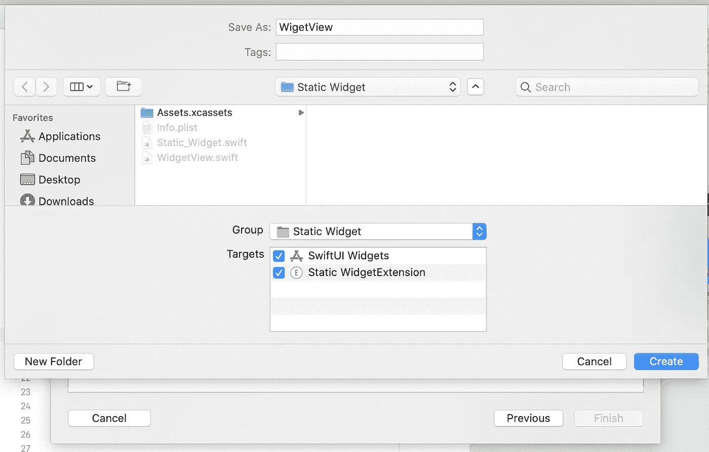

添加新的 SwiftUI 视图以呈现到小部件中

创建的 Swift 文件将具有 SwiftUI 视图的模板代码；然而，我们想在这里设计一个小部件。在新创建的文件中，`**import** WidgetKit`也是如此。

现在，让我们看看要创建的小部件

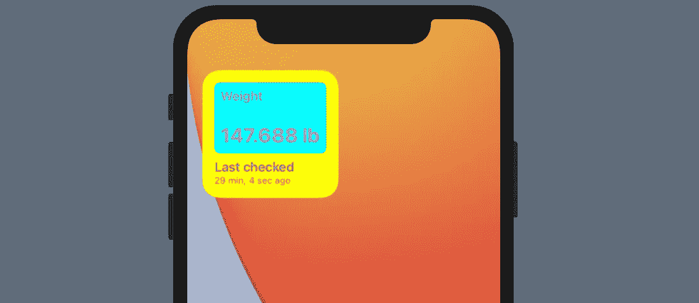

要创建的小部件

这是一个时髦的静态小部件，显示静态重量和相对时间——需要保持更新。

由于小部件只需要两个变量，我们将创建一个结构来存储它们。此外，我们将创建一个 struct 的扩展来预览数据，以便轻松地填充`WidgetData`，这只是为了演示的目的。

既然已经添加了数据结构，让我们为小部件准备视图和预览。为预览创建一个`WidgetView`和一个提供者，如下所示:

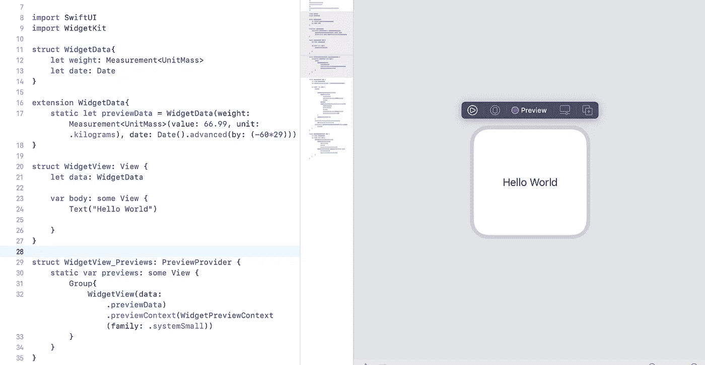

写样板文件

在这里，您会注意到预览已经用`.previewContext(WidgetPreviewContext(family: .systemSmall))`预览了`WidgetView`，它像一个小部件一样渲染视图。在这里，该系列可以更改为`systemMedium`和`systemLarge`以预览中大型格式的内容。

通过添加其他小部件系列的预览，`WidgetView`的代码更新为:

从在第 17 行向小部件主体添加视图开始。查看设计，我们需要两个标签:一个用于静态文本`“Weight”`，另一个用于来自`data: WidgetData`的权重。所以在一个`VStack`中添加了两个`Text(“”)`视图，中间有一个`Spacer()`之后，让我们也添加字体和前景色，让它们看起来更好。

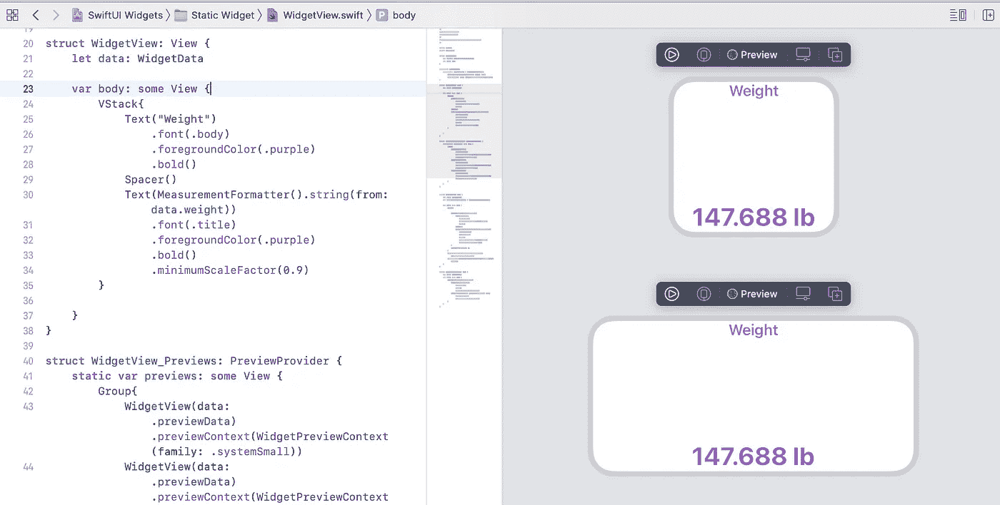

要使小部件的内容左对齐，请将 VStack 的`alignment`设置为`leading`。

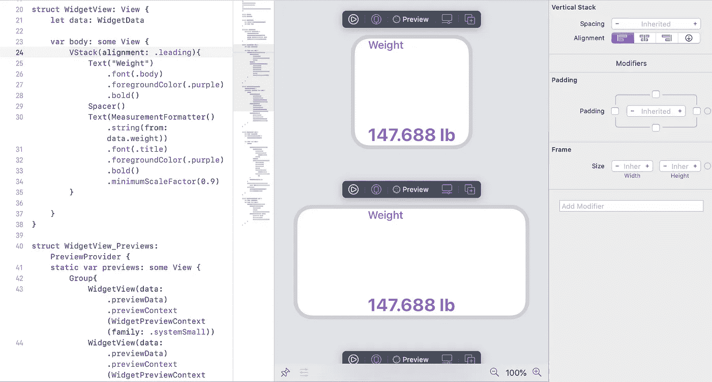

现在，我们需要将这个 VStack 放在另一个背景颜色为青色的视图中，所以让我们将 VStack 放在一个 HStack 中，并添加背景颜色。此外，一点点填充可能看起来不错。

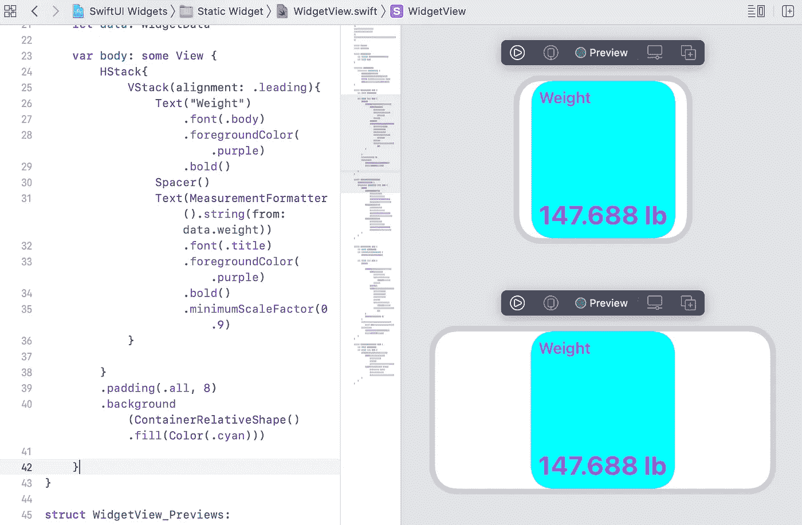

这里，我们使用`ContainerRelativeShape().fill()`作为背景的半径。值得注意的是，根据小部件设计指南，不建议使用固定圆角，而是使用`CornerRelativeShape`，它的半径与其超级视图同心。

为了让 HStack 完全占据视图，让我们在 HStack 中添加一个`Spacer(minLength: 0)`和 VStack。

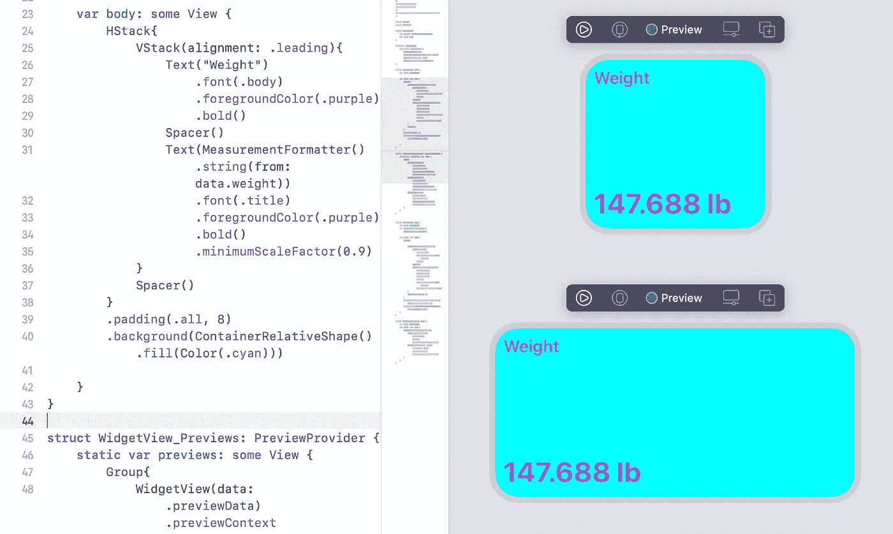

现在，我们差不多已经完成了需要建设的一半。


为了构建`last checked`视图，添加一个新的 VStack 来添加两个`Text`视图。

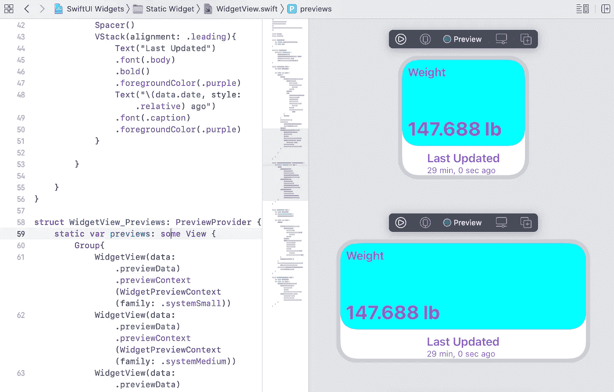

这里，我们为`Text`使用了新的 Swift 语法来显示相对于当前时间的日期，例如`Text(“data.date, style: .relative”)`。将它与小部件一起使用可以确保小部件中显示的时间相对于当前系统时间，并且总是每秒更新一次。

Widget 视图并不意味着每秒更新一次，所以 iOS 提供了一个放置动态时间文本的选项。每秒的更新得到有效处理。

现在，最后，将它们放在 ZStack 中以获得黄色背景色，并为其中的 VStack 添加一些填充，让我们使用 Xcode 将两个子视图提取到`WeightView`和`LastUpdatedView`。

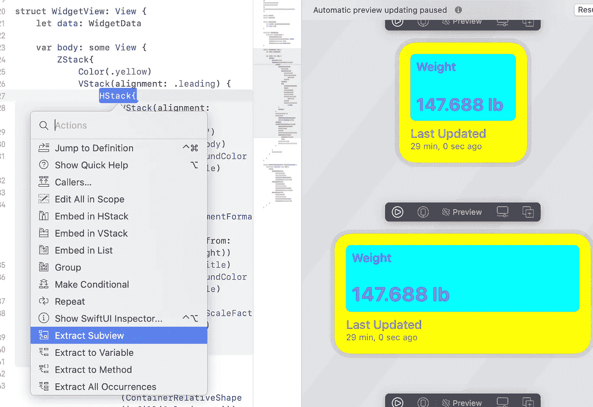

完成后，`WidgetView`的最终代码将是:

创建的小部件看起来像这样:

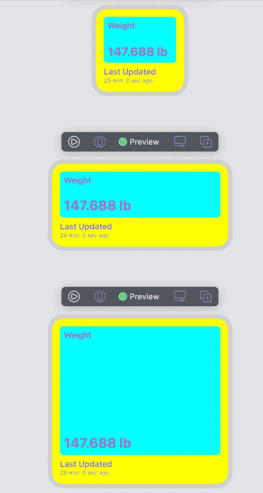

新创建的小部件的预览

到目前为止，您可能已经注意到我们已经为`.systemSmall`家族设计了视图，而这个小部件对于其他尺寸来说看起来不太好。为了让`.systemMedium`小部件看起来更吸引人，让我们添加一个相关图标，该图标只为`.systemMedium`小部件显示。

首先，使用以下内容创建一个环境变量:

`@Environment(\.widgetFamily) **var** widgetFamily`

如果用户在主屏幕上放置了一个中等大小的窗口小部件，这个变量的值被设置为`.systemMedium`。在这种情况下，您可以使用:

```
if widgetFamily == .systemMedium {
  //Render view here
}
```

您可以将图像添加到当前内容的任意一侧。


制作。“systemMedium”小部件更漂亮

## **练习**

为`.systemLarge`格式设计好看的小部件。目前，它看起来像:

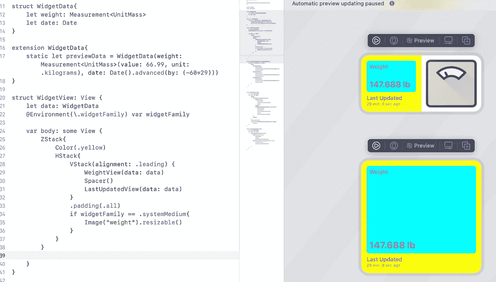

目前，我们不会支持大尺寸的部件。为了只支持想要的小部件尺寸系列，直接进入主函数，添加`.supportedFamilies([.systemSmall, .systemMedium])`以确保用户不能在主屏幕上放置`.systemLarge`小部件。

正在添加。第 9 行的“supportedFamilies”显示具体的尺寸等级

## 把所有的放在一起

既然我们已经设计了 widget 视图，剩下的就是将这个 widget 视图添加到应用程序的 widget 扩展中。还记得我们之前说过的`@main`函数吗？(滚动到上面的“了解样板文件”部分。)将`WidgetView`作为应用程序中的小部件:

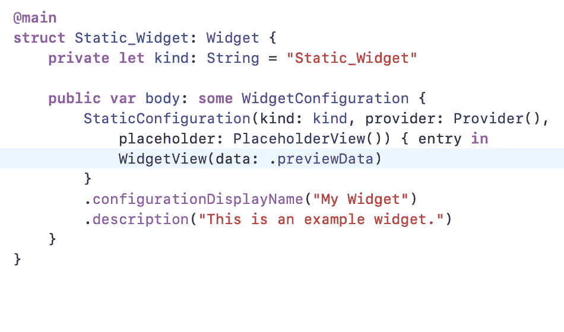

添加`WidgetView(data: .previewData)`，如图所示，替换默认的小部件视图，并在模拟器上运行:

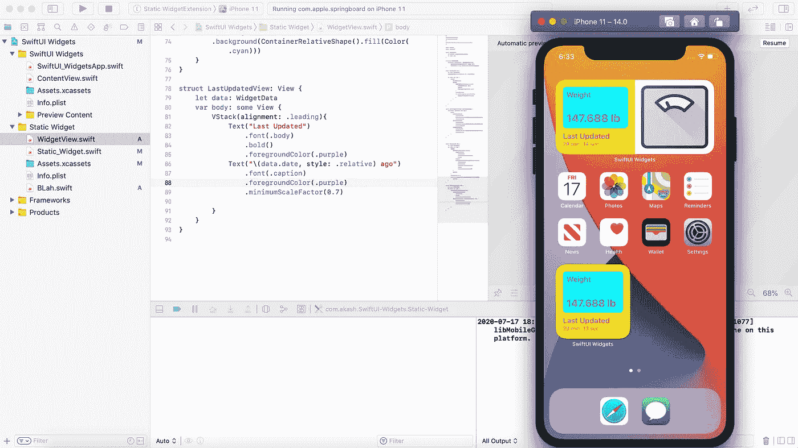

添加到主屏幕的 Widgets

瞧啊。您已经将第一个小部件添加到了您的 iOS 应用程序中！

你可以[在 GitHub 这里下载完成的项目](https://github.com/iAkashlal/SwiftUI-Widgets)。

# 从这里去哪里

祝贺您将第一个 widget 添加到您的 iOS 应用程序。到目前为止，我们讨论的只是使用 widgetss 可以做的最基本的事情，所以我想我应该添加一些可以使用 widget 完成的事情。

## **'TimelineReloadPolicy'**

`TimelineProvider`提供一系列时间的小部件视图。然而，在提供并显示了最后一个条目之后，`TimelineReloadPolicy`可以用来帮助 WidgetKit 安排更新，以便可以刷新小部件。`TimelineReloadPolicy`是一个带有:

```
struct TimelineReloadPolicy{
   atEnd
   after(date)
   never
}
```

*   `atEnd`:显示最后一个条目后，会安排一次更新。当更新发生时，iOS 可以从`TimelineProvider`请求后续条目，这可以循环发生。
*   `after(date)`:计划在提供的日期更新，不考虑现有条目
*   `never`:系统不会独立更新小工具。我们可以在小部件通过 [WidgetCenter API](https://developer.apple.com/documentation/widgetkit/widgetcenter) 重新加载时进行设置。

除此之外，该系统还智能地安排更新——通过板载智能并基于用户行为，确保小部件始终保持最新。您可以在“[Widgets-Code Along(第 2 部分)](https://developer.apple.com/videos/play/wwdc2020/10035)”中了解更多信息

## **“相关性”**

`Relevance`是时间轴条目上的一个可选属性，当多个小部件被放置在一个堆栈中时，它帮助 WidgetKit 决定在顶部显示哪个小部件。在计算时间轴中的条目时，您可以为每个条目添加一个浮点值`relevance`，帮助 WidgetKit 处理与您的小部件最相关的所有提交条目。

这在 WWDC20 会议的第 2 部分“Widgets-Code Along”中有说明。

## **配置**

如果您想给用户一个选项来编辑小部件，并从几个影响小部件显示方式的可用选项中进行选择，那么您需要在小部件中进行配置。WidgetKit 配置由 SiriKit 驱动，配置的核心技术是 SiriKit。

更多信息可在 WWDC20 " [将配置和智能添加到您的小部件](https://developer.apple.com/videos/play/wwdc2020/10194/)"专题讲座中获得。

## **深度链接**

使用视图上的`.widgetURL`修改器，微件的整个实体可以深度链接到应用程序的一个部分，而`.systemMedium`和`.systemLarge`微件可以使用`.widgetURL`修改器或 SwiftUI 链接 API 来创建可点击区域，以链接到不同的页面。这显示在“ [WWDC20 小部件—会话代码(第 3 部分)](https://developer.apple.com/videos/play/wwdc2020/10036/)”中

## **多个微件(微件包)**

如果你的应用想拥有多个 widget，你就不能一直添加多个 widget 扩展。由于一个小部件扩展只能有一个 main 方法，所以不能使用我们以前添加更多小部件视图的方式。为此，您可以使用`WidgetBundle`并将主标签移动到那里，例如:

```
@main
struct MultipleWidgets: WidgetBundle{
  @WidgetBundleBuilder
  var body: some Widget{
    WidgetView1()
    WidgetView2()
  }
}
```

`WidgetView1()`和`WidgetView2()`是有效的 SwiftUI 视图。

# 资源

如果没有以下内容，这部分内容是不可能的:

*   [“了解 iOS 14 中的 widget kit](https://medium.com/better-programming/widgetkit-in-ios-14-wwdc20-81cf10f51af9)”
*   [为小部件构建 SwiftUI 视图](https://developer.apple.com/videos/play/wwdc2020/10033)
*   [“小部件——沿着](https://developer.apple.com/videos/play/wwdc2020/10034/)的代码”(第 1、2 和 3 部分)
*   ["关于 WidgetKit 的更多信息](https://www.raywenderlich.com/11303363-getting-started-with-widgets)"