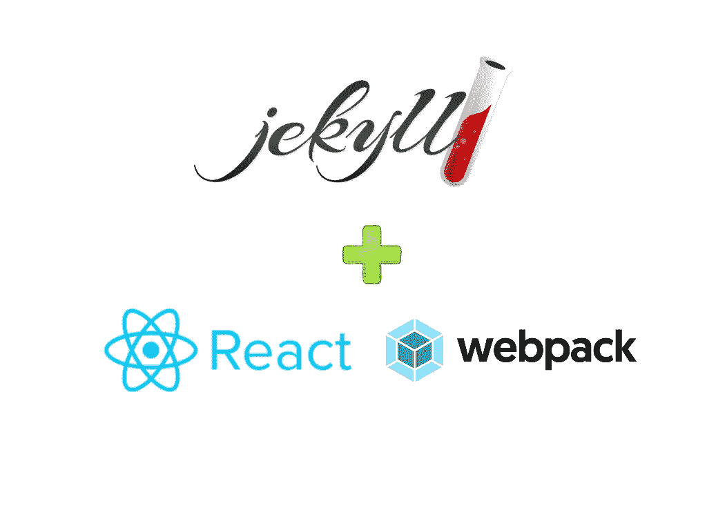
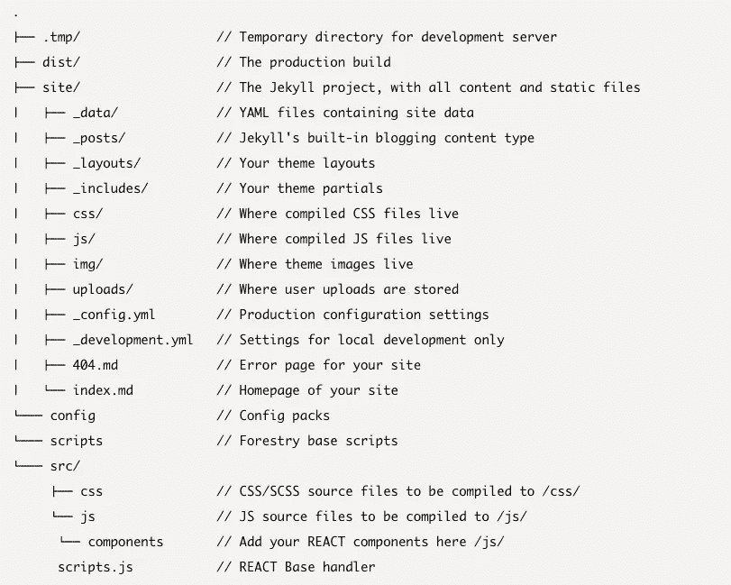

# 将 React 组件和 webpack 与 Jekyll 一起使用

> 原文：<https://betterprogramming.pub/build-your-great-modern-static-website-with-this-boilerplate-using-jekyll-react-and-webpack-cd63e03e4984>

## 使用 Jekyll、React 和 webpack，用这个样板文件构建一个现代化的静态网站



# 概观

我是杰基尔的超级粉丝，这是一个快速创建现代静态网站的伟大工具，正如我在之前的[帖子](https://medium.com/@mlombog/build-a-static-website-with-jekyll-and-automatically-deploy-it-to-aws-s3-using-circle-ci-26c1b266e91f)中所展示的。

然而，如果你想在你的网站上包含更多的交互式内容，你可以使用 npm 包管理器利用节点模块，并用 [webpack](https://webpack.js.org/) 和 [Babel](https://babeljs.io/) 组合它们来“编译”你的网站。

然后，您可以使用[gupp](https://gulpjs.com/)添加 CSS、image 和 JS minifications，并使用 React 组件来利用令人惊叹的 React 社区。

这是开始使用 Jekyll、React 和 webpack 构建网站的样板文件。我的 [GitHub](https://github.com/mlomboglia/jekyll-react-webpack) 上有。

我使用了林业团队构建的伟大样板作为基础参考，结合了 Alli Zadrozny 在他的帖子“ [*使用 webpack 和 React with Jekyll*](https://medium.com/@allizadrozny/using-webpack-and-react-with-jekyll-cfe137f8a2cc) ”中分享的思想。

所有的库都已更新，所以现在可以使用 webpack 作为包装器来运行 Jekyll 和 React。这个样板文件包装了 [Jekyll](https://jekyllrb.com) 并与 [gulp](https://gulpjs.com/) 一起作为您的本地开发构建管道。

[PostCSS](https://postcss.org/) 和 [webpack](https://webpack.js.org/) 加 [Babel](https://babeljs.io/) 用于 CSS 和 JS 的编译和传输。浏览器同步用于提供现代的本地开发体验，允许你在多个设备上同步预览你的站点。

[浏览器列表](https://github.com/ai/browserslist)用于配置浏览器支持。

# 先决条件

要使用 gulp，您必须安装[节点](https://nodejs.org/en/download/)和 [npm](https://www.npmjs.com/get-npm) 。

*   安装 npm: `$ sudo install npm -g`
*   安装 webpack: `$ npm install webpack -g`
*   安装杰基尔:`$ gem install jekyll -g`

# 设置

安装完必备组件后，将存储库克隆到您的本地计算机上，然后运行:

```
gem install bundle 
bundle install 
npm install
```

这将安装软件包和运行 Jekyll 环境的所有要求。这可能需要一点时间！您也可以以此为基础创建您的 CI/CD 管道。

使用`npm run`执行所有开发任务。完整的命令列表见 [package.json](https://marcoslombog.com/package.json) 中的`"scripts"`。

# 地方发展

本地开发由 BrowserSync 提供支持，您将能够通过以下方式快速开发网站:

*   在`http://localhost:3000/`的本地开发服务器。
*   自动 CSS 更新，无需重新加载页面。
*   内容更改时自动重新加载页面。

运行本地开发服务器就像运行以下命令一样简单:

```
npm start
```

这将显示所有草稿、未来日期或过期的内容，这些内容不包括在您的生产版本中。

如果您希望开发将在生产中出现的站点，请运行:

```
npm run preview
```

# 生产构建

要在本地机器上生成最终的生产版本，您可以运行:

```
npm run build
```

# 项目结构



Jekyll 内容将从`site`文件夹提供。webpack 和 gulp 处理的所有资产都应该在`src`中。

您站点的生产构建文件将被复制到`dist`文件夹中。

# 反应组分

拥有一个 webpack 目录的好处是，我们现在可以在一个新的文件夹中组织我们的组件，并以模块化的方式导入所需的东西。

在 components/文件夹中添加 React 组件。举个例子，`Hello.js`已经有了。

```
import React, { Component } from 'react';
  class Hello extends Component {
    render() {
      return (
        <div>Hello World</div>
    )
  }
}
export default Hello;
```

在`scripts.js`中，加载 React 并导入您的组件:

```
import React, { Component } from 'react';
import {render} from 'react-dom';
import Hello from './components/Hello';
class App extends Component {
  render() {
    return (
      <Hello />
    )
  }
}
render(<App />, document.getElementById('root'));
```

添加将在`.html`布局中呈现组件的`div` React:

```
<div id="root"></div>
<script type="text/javascript" src="/assets/javascripts/bundle.js" charset="utf-8"></script>
```

运行`$ webpack`来编译你的 JS 和`$ jekyll build`,这样 Jekyll 就会捕获新编译的文件。您现在应该能够在您的 Jekyll 页面上看到一个可爱的 React 组件了！

# 测试

这个样板文件带有标准的 [ESLint](https://eslint.org/) 和 [StyleLint](https://github.com/stylelint/stylelint) 配置，可以过滤掉 CSS 和 JS 中的错误或常见的样式问题，适用于大多数流行的 ide。

这些测试也可以从命令行运行:

*   JS: `npm run eslint`
*   CSS: `npm run stylelint`

如果您想自动修复 lint 错误，也可以从命令行完成:

*   JS: `npm run eslint:fix`
*   CSS: `npm run stylelint:fix`

# 清除

这个样板文件是自我清理的，每次运行命令时都会删除生产`dist/`和开发`.tmp/`文件夹，以确保它们的内容总是最新的。

如果您希望手动清理，请运行:

`npm run clean`

所有配置文件都位于 config 目录中:

*   `babel.config.js` —巴别塔预置和插件。
*   `gulp.config.js` —吞咽`styles`、`scripts`、`images`和`svg`的任务。
*   `webpack.config.js` —网络包生成。

# 小路

所有构建源和目标路径都可以从`static-scripts.config.js`进行配置。

# 吉基尔博士

Jekyll 的构建命令可以从`stat-cscripts.config.js`配置。

有四个选项可用:

*   `default`:始终运行的默认构建命令。
*   `development`:开发服务器的附加构建命令。
*   `preview`:生产开发服务器的附加构建命令。
*   `production`:用于生产构建的附加构建命令。

# BrowserSync 开发服务器

浏览器同步的配置可在`.browsersyncrc.js`中找到。

# CSS/SASS

[后置 CSS](https://postcss.org/) 的配置见`.postcssrc.js`。

# 浏览器支持

PostCSS 和 webpack 在编译时都使用`.browserslistrc`来决定浏览器支持。

# 批准

这个样板工程是在麻省理工学院的许可下发布的。

在我的 [GitHub](https://github.com/mlomboglia/jekyll-react-webpack) 里有。

恭喜你！

— — —

## **2020 年 12 月 26 日更新**

# 如果你在 MacOs Catalina 运行这个有问题。

下面的文章将帮助你:

[](https://medium.com/@mythreyi/the-agony-of-setting-up-jekyll-on-macos-catalina-aedd0a536ae) [## 把杰基尔安置在马科斯·卡特琳娜岛上的痛苦

### 对几个小时痛苦的、尽管有些增长见识的实验的总结。

medium.com](https://medium.com/@mythreyi/the-agony-of-setting-up-jekyll-on-macos-catalina-aedd0a536ae) 

# 如何修复“ReferenceError: primordials 未定义”错误

您是否收到一条`ReferenceError: primordials is not defined`错误信息？事情是这样的，`gulp v3`在`node v12`下无法工作(截至目前)，因为这取决于`graceful-fs@^3.0.0`哪个补丁节点的`fs`模块，而那个补丁在`node v12`之前工作得很好。

## 你需要做的是:

在`package.json`所在的目录下创建一个`npm-shrinkwrap.json`文件，包含以下内容:

```
{
  "dependencies": {
    "graceful-fs": {
        "version": "4.2.2"
     }
  }
}
```

删除您的`node_module`文件夹

运行`npm install`，它将更新`npm-shrinkwrap.json`

运行`npm start`现在一切都应该工作了！