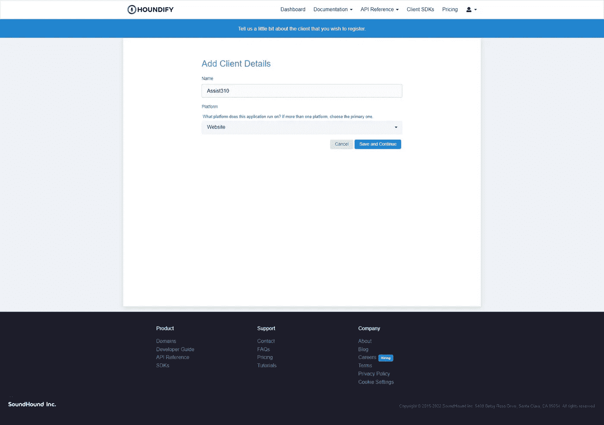
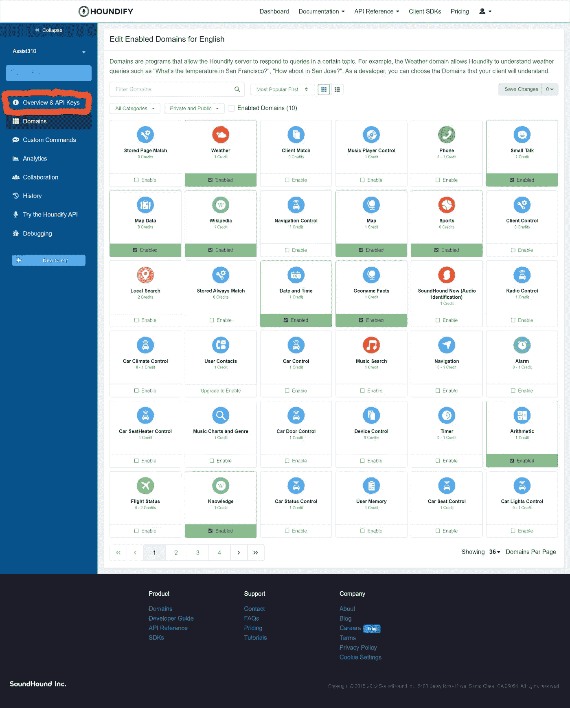

# 在网络上建立你自己的人工智能虚拟助手

> 原文：<https://betterprogramming.pub/build-your-own-ai-powered-virtual-assistant-on-the-web-175fc9e61973>

## 使用 Houndify API


在这篇文章中，我将向你展示如果你不想花这笔钱，你可以如何集成 [Houndify API](https://www.houndify.com/dashboard) 来制作一个类似 Alexa 或 Siri 的个人助理。下面是我们将要制作的演示。

# 安装

我们将使用`create-react-app`和 Typescript 制作这个项目。

```
npx create-react-app my-assistant --template typescript
```

一旦完成，让我们安装我们需要开始的库。

```
npm i houndify jotai react-feather
```

这将为我们提供以下信息:

*   扩展节点 SDK
*   Jotai:一个简单的状态管理库(作为 React 上下文 API 的替代)
*   react-feather 是来自 feathericons.com 的伟大开源图标的包装器

我们还将使用 Sass 来设计我们的组件，并使用`npm i -D sass`进行安装。

# 创建服务器

我们首先需要一个服务器来验证对 Houndify API 的请求。Houndify SDK 提供了一个`HoundifyExpress`对象。这将连接到一个 Express 服务器，并在`server.js`中添加我们需要的路线。添加以下代码来设置服务器:

注意，它还服务于来自`build`目录的`index.html`文件。因此，如果我们要部署这个应用程序，我们将首先运行`npm run build`来生成静态文件。然后运行`node server.js`启动服务器并从那里访问应用程序。

另外，注意我们正在使用的环境变量，在`.env`中配置，我们还没有添加。我们也没有客户 ID 和客户密钥。所以让我们从 Houndify API 开始吧。

# 使用 API 仪表板

在 [Houndify](https://www.houndify.com/signup) 免费创建一个开发者账户，然后创建一个新的客户端。进入后，输入应用程序的名称和类型，如下所示:



现在，你应该会看到一个页面，询问你想要为应用程序启用哪些域。我们将使用以下十个域(全部来自第一页):


如果你看一看，其中一些领域需要客户端集成。客户端必须应用额外的逻辑来集成功能。我们可以在以后添加其他域，但是现在，我们不需要它们。

点击显示概述和 API 键的按钮:



在那里，复制客户端 ID 和客户端密钥，并将它们添加到下面的`.env`文件中:

```
HOUNDIFY_CLIENT_ID={YOUR_CLIENT_ID}
HOUNDIFY_CLIENT_KEY={YOUR_CLIENT_SECRET}
```

现在我们准备开始构建前端。

# 创建语音请求

首先，打开`src`目录，删除以下我们不需要的文件:

*   徽标. svg
*   setupTests.ts
*   App.test.tsx

然后，定义一个函数来初始化对 houndify API 的语音请求。它获取关于音频流的信息，并使用处理程序来捕获各种事件。

让我们来分解这段代码:

*   RequestHandlers:响应语音请求状态的函数的类型接口

*   对话状态:在此阅读文档
*   记录器:来自 SDK 的一个`AudioRecorder`对象。它允许从用户的麦克风捕获音频流。我们必须在这里使用`any`类型，因为 SDK 没有定义类型(真遗憾！)
*   enableVAD:启用时，一旦用户停止讲话，就会发送请求
*   ts-ignore:禁用编辑器中访问`window.Houndify`的 linter 警告。这包含对 Houndify 浏览器 SDK 的引用。我们可以在`public/index.html`中包含来自 CDN 的 SDK，代码如下:

`<script src="https://unpkg.com/houndify@3.1.12/dist/houndify.js"></script>`

# 语音输入显示器

现在在`src`目录中创建一个名为`VoiceInput.tsx`的文件，并添加以下代码:

该组件执行以下操作:

*   获取一个转录字符串，该字符串将记录用户当前所说的内容
*   利用`lib/store.ts`中定义的原子。这允许我们访问我们的`AudioRecorder`对象和一个`recording`布尔值。这决定了用户的麦克风是否被捕获
*   当点击按钮时，录音机被切换。该按钮的图标也会随之更新

我们现在可以用下面的代码添加样式表了:

我们可以在`src/lib/store.ts`文件中定义我们的`atoms`:

```
import { atom } from "jotai";export const recorderAtom = atom<any>(null);
export const recordingAtom = atom(false);
```

# 构建应用程序组件

用以下代码替换`src/App.tsx`的内容:

首先，定义我们的语音请求处理器功能:

你可以在这里查看服务器响应格式[。](https://www.houndify.com/docs#server-response)

我们现在可以创建一个挂载效果来初始化 AudioRecorder 对象。然后，它将其事件与初始化的 VoiceRequest 对象联系起来:

# 首次预览

首先，在`src/index.css`中添加我们的全局样式:

这使得我们的主 div 元素占据了整个页面，并将所有内容保存在一个视图中。

为了让来自`create-react-app`的服务器了解我们的另一个服务器，我们需要向我们的`package.json`文件添加一个`proxy`:

```
{
    ...
    "proxy": "http://localhost:8080",
    ...
}
```

现在在项目目录中打开一个终端窗口，在另一个窗口中运行`node server.js`和`npm start`。

如果一切正常，端口 8080 上的服务器应该记录 8080，dev 服务器应该记录它自己的端口。在您的浏览器中打开后者，您应该会看到以下内容:


如果您尝试单击按钮并说出一个命令，客户端会向服务器发送请求。同时，它显示部分转录。但之后不会发生其他事情。因此，让我们向应用程序添加输出。

# 向语音添加文本

我们希望显示来自服务器的书面响应或口头响应。让我们使用语音响应并使用 [Web 语音 API](https://github.com/mdn/dom-examples/tree/master/web-speech-api) 实现 TTS，这样应用程序就可以“说出”响应。

设置这一点很简单，只需首先将以下内容添加到`App.tsx`文件的顶部:

然后将这段代码添加到我们的`handleResult`函数中:

```
const handleResult = (result: any) => {
    // We'll add more here later
    say(result["SpokenResponseLong"]);
};
```

一切都准备好了！

# 声频反馈

当用户按下主按钮时，我们还可以添加一些听觉反馈。我们可以用 Howler.js 库来播放音频文件，我们可以用下面这行代码来安装它:

```
npm i howler
```

然后在`lib/playSound.ts`创建一个文件，该文件具有播放任何音频源的功能:

现在，在我们的`App.tsx`文件顶部导入我们需要的所有内容，如下所示:

你可以在这里下载麦克风提示音。用各自的名字:`start`和`stop`将它们添加到`src/audio`文件夹中。

然后将下面一行添加到`setRecording`函数中:

```
playSound(sources[value ? "start" : "stop"]);
```

现在打开浏览器。您应该会听到播放的音频和口头回应。

# 奖励—可视化音频输入

我们可以使用 Wave.js 库来可视化来自用户麦克风的音频，并使用以下代码行安装它:

```
npm i [https://github.com/WoolDoughnut310/Wave.js](https://github.com/WoolDoughnut310/Wave.js)
```

确保从我的回购安装它，而不是从 NPM。这是因为我对它做了一点小小的改动，使它可以和我们的`AudioRecorder`对象一起工作。我已经发出了一个 pull 请求，但是我仍然在等待库作者的响应。

打开`src/VoiceInput.tsx`并添加以下导入语句:

```
import { Wave } from "@foobar404/wave";
```

然后将以下代码添加到我们之前创建的`onClickMic`函数的末尾:

现在运行代码，我们应该和开始展示的演示一样了。

# 最终注释

如果您有任何问题，请随时发表评论。如果你对这个基于网络的 Jarvis 克隆感到满意，一定要和朋友们分享。下一次，我们将实现额外的功能，如音乐播放和歌曲识别。和以前一样，我把代码留在了我的 [GitHub](https://github.com/WoolDoughnut310/houndify-voice-assistant/tree/part1) 上，所以尽情享受吧。

*原载于*[*https://cs 310 . hash node . dev*](https://cs310.hashnode.dev/build-your-own-ai-powered-virtual-assistant-on-the-web-part1)*。*