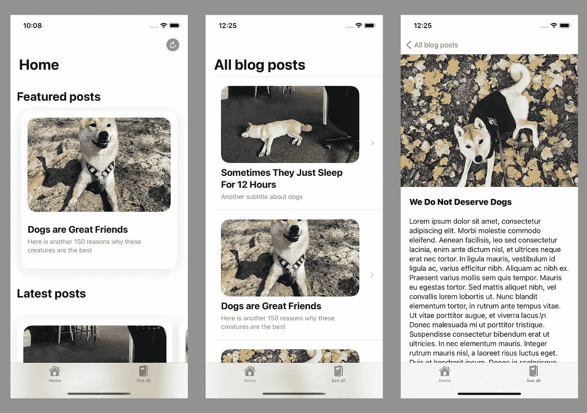
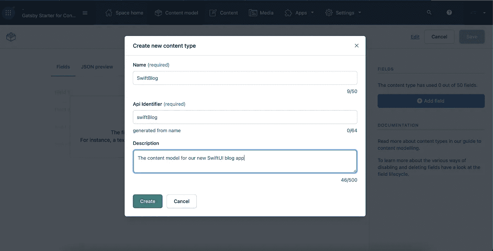
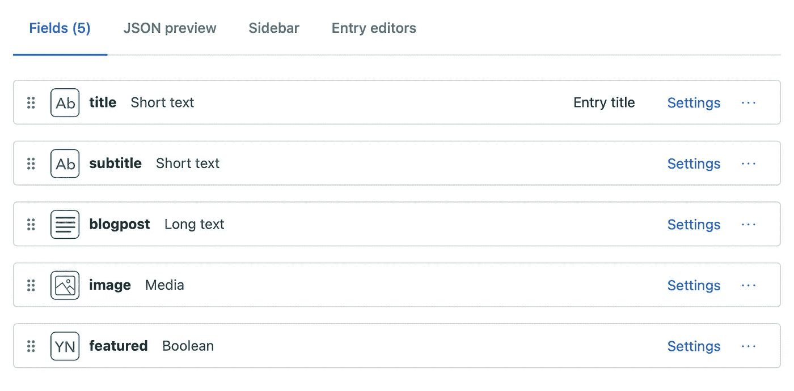
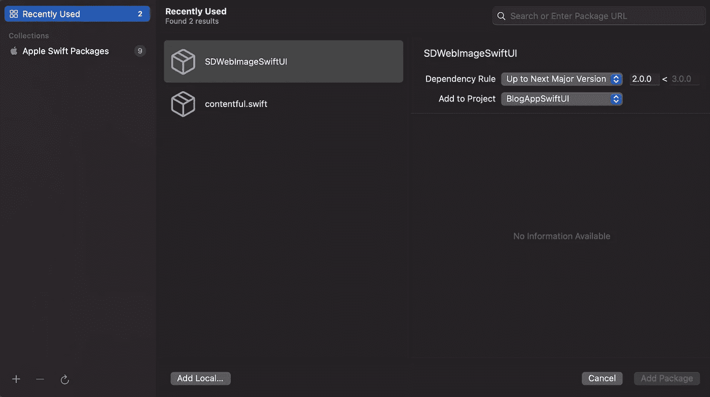
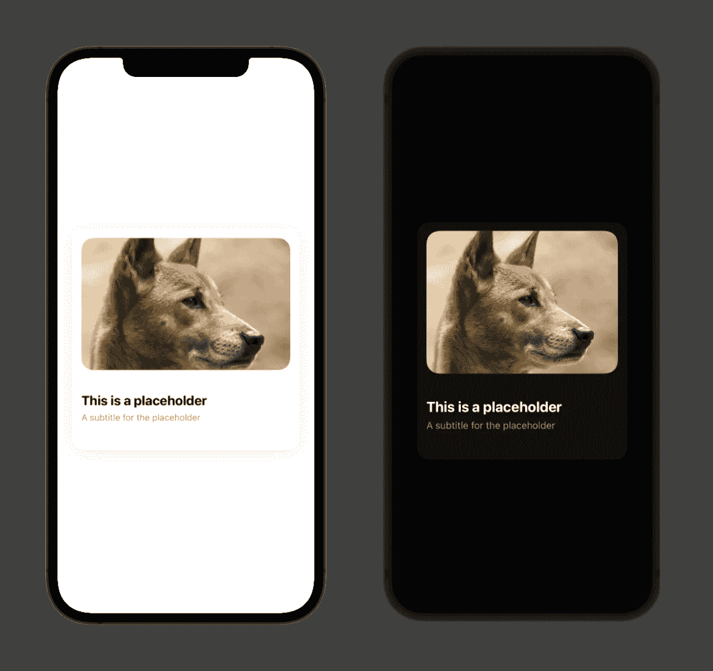
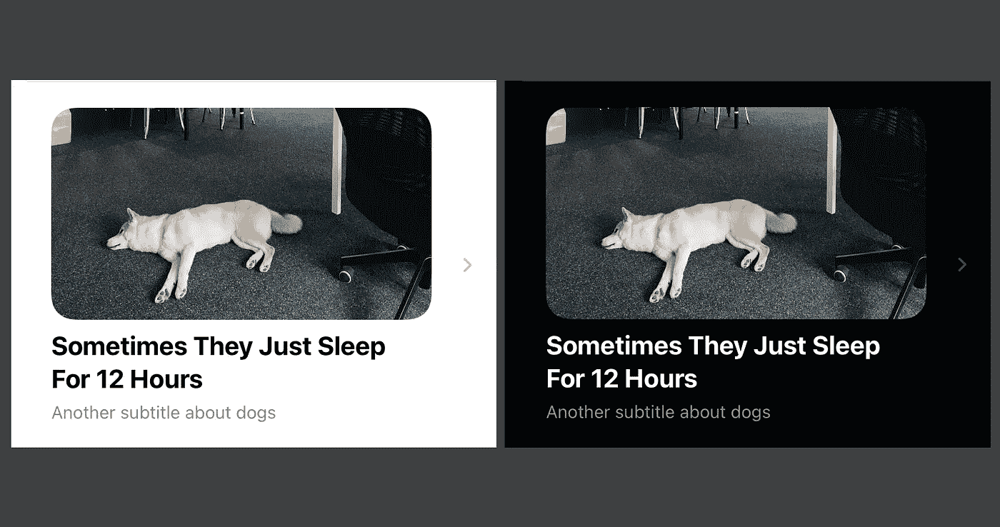
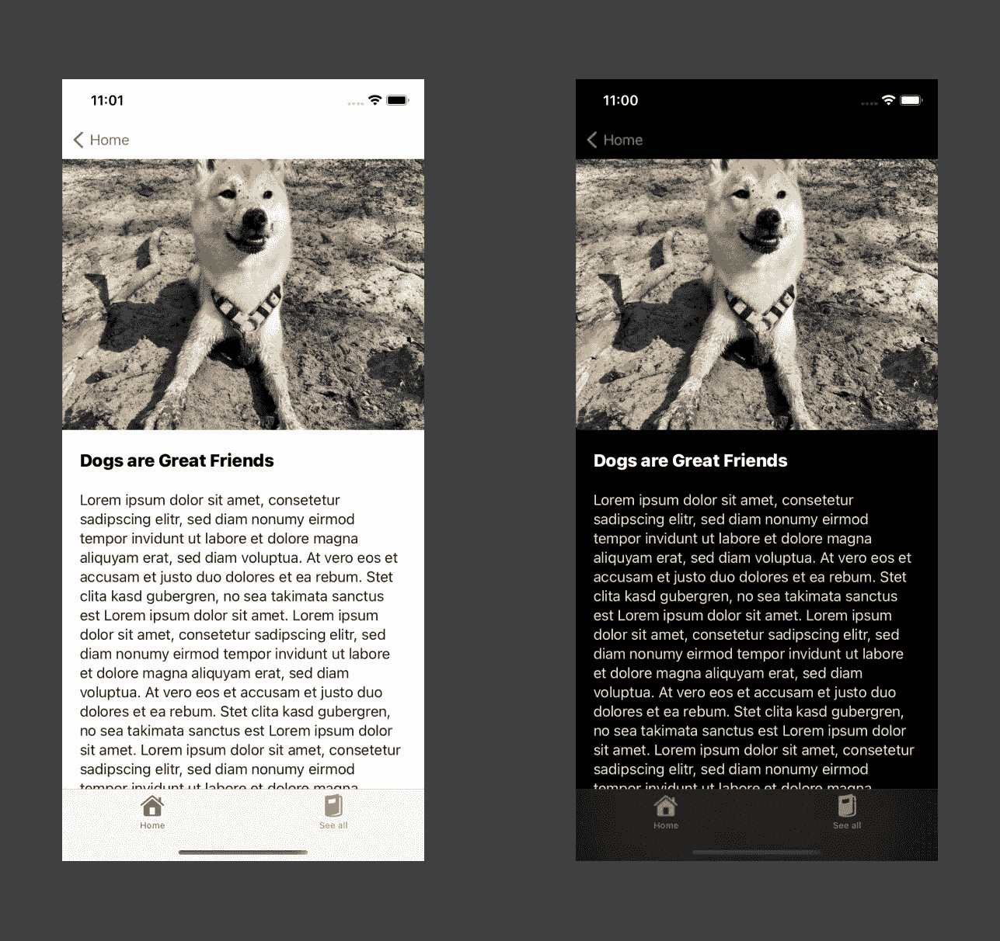
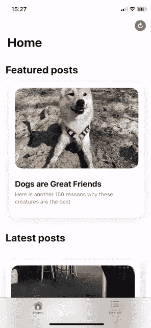

# 使用 SwiftUI 构建您自己的博客应用程序

> 原文：<https://betterprogramming.pub/build-your-own-blog-app-with-swiftui-3ee8196ecb84>

## 使用 SwiftUI 和 Contentful 快速创建一个简单的博客应用程序，并提供可靠的内容管理系统



图片由作者提供。

通常情况下，新技术给应用程序开发领域带来了更多的复杂性，使得外部受众更难理解编码。

使用 SwiftUI，情况通常相反——该框架使得从零开始快速构建全面的应用程序或使用编码迭代设计思想变得难以置信的容易。

为了展示在复杂的项目中使用 SwiftUI 是多么简单，我构建并开源了一个博客应用程序，它使用内容管理系统来交付帖子，并支持许多设计功能，如黑暗模式和辅助功能。

# 先决条件

为了启动项目，需要采取以下步骤:

*   下载 Xcode 12+。
*   创建新的 SwiftUI 项目。
*   在项目设置中选择 14.0 或更高版本的 iOS 部署目标。

## GitHub 知识库

您可以通过从 GitHub 下载完成的项目来跟进。

# 为内容管理设置内容

第一步是在内容管理系统(CMS)上建立您的模型。这个模型将定义一旦你建立了应用程序，它到底会发布什么。在我们的例子中，由于我们正在创建一个博客应用程序，我们需要为一篇博客文章创建一个模型——标题、副标题、文本等。

对于 CMS，我们将使用 [Contentful](https://www.contentful.com) ，因为它有一个慷慨的免费层，并且特别与 Swift 和 SwiftUI 集成良好。

创建帐户后的第一步是为我们的博客文章创建内容模型。为此，转到内容模型→添加内容类型，并为模型选择一个名称。我们将使用 API 标识符为 SwiftBlog 的 swiftBlog。



图片由作者提供。

下一步是向内容模型添加所有必需的字段:添加字段→选择类型和名称→创建。下面您可以找到我们将使用的所有字段的列表，但是可以根据您的需要随意定制。



图片由作者提供。

在这一步，我们还可以创建几个帖子来简化未来应用程序的调试。要创建帖子，您可以进入内容→添加 SwiftBlog，并创建一个带有标题、副标题、图片和文本的帖子。我们可以暂时将*特色的*字段留空，等我们开始开发应用程序的相应部分时再回来。

# 构建应用程序

一旦 Contentful 设置好了，就该创建实际的应用程序了。在我们开始有趣的东西之前，我们需要连接几个必要的库。

最重要的是，我们需要从 Swift 包管理器添加`Contentful`和`SDWebImageSwiftUI`。如果你不确定它是如何做到的，进入文件→添加包，搜索上面的两个名字。或者，将这些 GitHub 目录用于 [Contentful](https://github.com/contentful/contentful.swift.git) 和 [SDWebImageSwiftUI](https://github.com/SDWebImage/SDWebImageSwiftUI.git) 。一旦您添加了这些依赖项，Xcode 将负责剩下的工作。



图片由作者提供。

现在我们可以开始实际应用了。

## 创建数据模型

现在我们继续为我们的博客文章创建数据模型。这个模型应该反映我们在 Contentful 上为内容模型设置的相同结构，这意味着我们将有一个标题、副标题、图像、实际文本(博客文章)和一个用于*特色*字段的布尔值。

我们将*特性*设置为默认为假，除非我们另外指定。通过这样做，我们可以在 Contentful 的内容模型中使这个字段可选，并且只在我们想要真正展示一篇文章时才关心它。

注意，我们还通过添加一个 UUID 使`BlogPost`结构符合`Identifiable`协议。这是必要的，因为我们将在未来的视图模型中使用`ForEach`语句。

## 建立内容丰富的连接

接下来，我们将创建一个连接到 CMS 的逻辑。为此，您需要空间 id 和访问令牌。你可以在 Contentful 上的设置→ API 键中得到这些。

空间 id 和访问令牌都应该被传递到一个`Client`实例中(是`Contentful`库的一部分)，然后在一个函数中使用它来获取我们的博客文章数组。您还可以使用以下代码对任何字段返回的列表进行排序:

```
try! query.order(by: Ordering(sys: .createdAt, inReverse: **true**))
```

之后，我们只需要创建一个`BlogPostStore`可观察类，并使用`getArray`函数来填充博客文章列表。因为我们对我们的博客文章使用了`@Published`属性包装器，所以我们以后所有显示博客文章列表的视图都会在我们刷新列表时自动重画。换句话说，当我们发布一个新帖子，用户刷新列表时，新内容将直接出现在我们的视图中。

另一个重要的注意事项是，我们将图像转换为 URL，这就是为什么我们需要在开始时导入`SDWebImageSwiftUI`库。该库将允许我们使用`WebImage`类显示来自这个 URL 的图像。

这就是我们 CMS 集成的后端部分！剩下的工作就是设计我们的应用程序。

# 设计应用程序

对于我们的博客应用程序，我们将构建两个屏幕(包含几篇特色文章的主屏幕和包含所有文章的列表)和三个组件(主屏幕的博客明信片、列表的博客文章行和实际的博客文章视图)。

## 为主屏幕创建卡片设计

使用所有标准组件，如垂直和水平堆栈和文本，在 SwiftUI 中设计卡片相当容易。这里唯一的小麻烦是呈现来自我们 CMS 的网络图像，正如前面提到的，我们通过使用`SDWebImageSwiftUI`库来解决这个问题。

此外，由于 Swift 本身不支持颜色的十六进制值，我们将使用一个扩展来实现这一点。

现在谈谈卡片本身。这里我们要解决两件至关重要的事情。

首先，我们将通过最小化卡片尺寸的硬编码值，使卡片尽可能适应屏幕尺寸。这一点通常很容易在 SwiftUI 中实现，无需做任何额外的事情(所有的`VStack`和`HStack`视图都会自动适应屏幕尺寸)，但当涉及到图像时，我们希望确保它们在任何屏幕尺寸上都好看。这就是为什么我们要将图像的高度固定为 220 像素，同时使用下面的代码来设置宽度:

```
.frame(maxWidth: UIScreen.main.bounds.width — 80)
```

这意味着我们将利用应用程序将在其上打开的设备的实际屏幕尺寸，采用屏幕的宽度，并使我们的图像比任何尺寸都小 80 像素。和 SwiftUI 一样，这不是实现适应性的唯一方法，但是对于我们特定的卡，这种方法效果最好。

其次，卡片在黑暗模式下要好看。SwiftUI 支持黑暗模式作为标准，但我们的工作仍然是确保所有的颜色在两种外观模式下看起来像样和干净。

有几种方法可以实现深色模式的配色方案，但由于我们在卡的应用程序中只需要一种自定义颜色，如果`@Environment(\.colorScheme) **var** colorScheme`值为`.dark`，我们将只使用深灰色的实际十六进制值:

```
.background(colorScheme == .dark ? Color(hex: “#121212”) : Color.white)
```

以下是我们主要博客明信片的完整代码:

这是 iPhone 12 和 iPhone 8 的测试结果。请注意，该卡自动适应屏幕大小和外观模式，看起来都很好。



图片由作者提供。

## 设计列表行

对于所有博客文章的列表，我们需要设计每行的外观。在这里，我们将借用主卡中的大部分代码，但是由于这个视图将被用作列表中的一行，我们不需要阴影或不同的颜色方案用于黑暗模式，这使得事情变得更加容易。

下面是我们为每篇博客文章的列表行使用的最终代码:

这是每一行的结果。



图片由作者提供。

## 创建博客文章详细视图

下一步是设计我们的博客文章打开时的样子。这里，我们再次没有做任何特别的事情:我们只是在一个垂直堆栈上排列一个图像、标题和文本，并用一个`ScrollView`包装它。像往常一样，SwiftUI 将负责可访问性和黑暗模式。

在下图中，你可以看到当我们打开帖子时，里面会是什么样子。



图片由作者提供。

## 创建最终屏幕

现在我们已经创建了我们的主要组件，我们可以在最终的屏幕上以我们想要的方式排列它们。在我们的应用程序中，我们将只有两个标签——*主页*，其中有几篇特色文章和最新文章，以及*查看所有文章*，其中我们将有所有博客文章的列表。

后者很容易成为 SwiftUI 简单性的生动展示。既然我们已经有了博客文章的存储和在列表中显示它们的组件，剩下要做的就是创建一个带有`List`的`NavigationView`，使用`ForEach`语句显示博客文章。请注意，我们不需要做任何额外的工作来使列表适应屏幕大小或外观模式——swift ui 做了所有的事情。

现在到主屏幕。主屏幕有两部分——一部分是特色文章，另一部分是最新文章。后者相当简单，不值得太多关注——我们只是对之前制作的卡片使用一个水平的`ScrollView`,并将 ForEach 语句中的帖子数量限制为我们想要的数量。你可以在 repo [这里](https://github.com/roman-luzgin/BlogAppSwiftUI/blob/main/BlogApp/MainView.swift)找到这个视图的完整代码。

至于特色帖子，这是我们最终将使用我们在 Contentful 中添加到内容模型中的*特色*布尔字段的地方。要仅检索特色帖子，我们可以使用一个计算属性，在该属性中我们过滤所有帖子，只返回那些将*特色*字段设置为`true`的帖子。

## 用选项卡视图排列屏幕

最后一步是用一个`TabView`来排列`ContentView`文件中的两个屏幕，并为博客文章存储创建一个@StateObject，以便在所有子视图中使用。

就这样，现在我们的应用程序可以使用了！

# 结论

按照上面的步骤，我们能够很快创建一个带有内容管理系统的博客应用程序。这是我们的最终结果:



正如我们所看到的，SwiftUI 使得创建具有复杂界面的应用程序变得非常容易，无需太多额外的工作就可以适应不同的屏幕和外观模式。

使用这个博客应用程序的例子，您还可以在现有应用程序中发布新内容，而无需重新发布应用程序本身，这对于显示不同的图像、文章或有用的提示来说是完美的。

感谢阅读！