# 在 SwiftUI 中从头开始构建您自己的按钮组件库

> 原文：<https://betterprogramming.pub/build-your-own-button-component-library-from-scratch-in-swiftui-14cfa2f0036b>

## 创建一个库来查看应用程序中处于不同状态的所有按钮

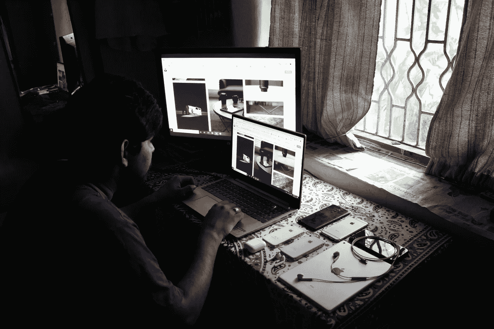

照片由[西达尔特·辛格](https://unsplash.com/@s1ddharth?utm_source=unsplash&utm_medium=referral&utm_content=creditCopyText)在 [Unsplash](https://unsplash.com/?utm_source=unsplash&utm_medium=referral&utm_content=creditCopyText) 上拍摄

按钮是我们应用中最常用的组件。

让它们看起来与它们触发的动作相适应是很重要的。它们应该在整个应用程序中保持一致和可访问，并向用户提供视觉反馈。

在我的[上一篇文章](https://medium.com/better-programming/a-beginners-guide-to-view-modifiers-in-swiftui-8782c3e44d75)中，我谈到了视图修改器，以及如何使用它们为我们的 SwiftUI 应用创建一个时尚的 UI。

在这里，我将展示如何应用它们来创建可重用的按钮样式。这将是一次漫长而愉快的旅程。

# SwiftUI 按钮

在 SwiftUI 中创建一个按钮非常简单。它需要一个动作和显示的实际内容才能点击。

当然，要设计这个`Button`视图的样式，你必须添加视图修改器。你有两个选择:

*   将修改器应用于内容内部的(每个)视图
*   将修饰符应用到按钮视图—这将把修饰符应用到内容中的所有视图

两者会有相同的结果:

但是，当您在内容中有多个视图时，这种差异就会显现出来:

正如你所看到的，在第一个按钮中,`Image`视图被忽略了，但它仍然是可点击的。

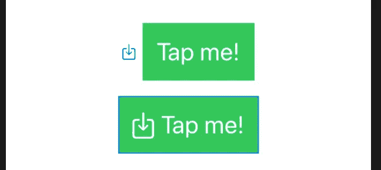

## **需要牢记的一些事情**

*   正如我在上一篇关于视图修饰符的文章中提到的，通常顺序很重要
*   `padding`应该(通常)放在按钮的背景或边框之前。让按钮透透气——给它一些空间。我们不想要这样的东西:

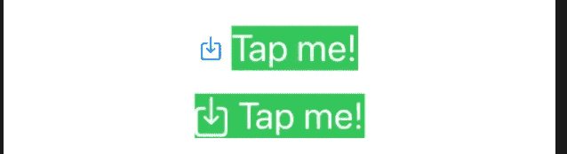

# “ButtonStyle”修饰符

有两种类型的视图修改器:

## **与“视图”协议捆绑的修改器，可用于任何视图**

例如:`padding`或`background`——两者都可以应用于任何视图。

## **特定于某个类型的修饰符，仅适用于该类型的实例**

这些用于利用该视图的特定特征。按钮就是一个很好的例子。例如，每当用户点击按钮时，我们可能想要改变外观和感觉。

我们有接受实现`ButtonStyle`协议的`struct`的`ButtonStyle`视图修改器。

默认情况下，我们有三种预定义的样式。

具有三种预定义样式的三个按钮

但是如果我们想进一步定制我们的按钮——比如改变按钮被按下时的不透明度呢？

这就是`ButtonStyle`协议发挥作用的地方。

# 构建自己的“ButtonStyle”修饰符

正如我之前所说的，特定于按钮的视图修饰符让我们可以访问特定的特征。这是通过`Configuration`(实际上是一个`typealias Configuration = ButtonStyleConfiguration`)完成的。

我们可以访问的是:

*   `label`:按钮内容整体视图
*   `isPressed`:一个布尔变量，每当按钮被按下时就变成`true`

让我们来做一个更有趣的例子:当按钮被按下时，缩小它并降低不透明度，给它一个高亮效果。此外，作为奖励，让我们动画这些变化。

结果是:

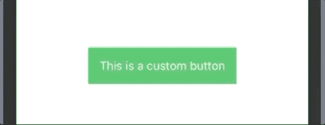

具有自定义样式和动画的按钮

# React 本机 UI 库

## 简短的背景故事

2019 年，我从原生 iOS 开发开始休假一年半。我开始把使用 React Native 开发移动应用作为我的主要工作。

我学到了很多，但让我惊讶的是用现有的 UI 库快速原型化应用程序的能力。在我来自的地方(本地开发世界)，这甚至不是一个想法。

我当时用的是 [Callstack 的 React Native Paper(材质设计)](https://callstack.github.io/react-native-paper/)然后是 [NativeBase](https://nativebase.io) 。

进口，使用，并仍然能够定制是令我兴奋不已。我开始理解 React Native 周围的力量和噪音。

# 以 NativeBase 为例

NativeBase 库由预构建组件构成，这有助于每个开发人员在所有屏幕上更快、更一致地构建内容。按钮也不例外。

它们提供了一长串*道具*——按钮组件的输入，告诉它如何看起来或如何表现——像`outlined`、`transparent`、`bordered`、`rounded`、`large`或`small`。

不再有`@IBOutlets`。不再子类化。不要再吃另一个了。

**注意:**我知道在 React Native 中，当你实现你的定制风格时，你最终会做同样的事情，但是使用 UIKit 远没有这么难。

快进到今天:我很高兴我重新发现了我对使用 SwiftUI 开发美好事物的热爱。

让我们看看如何为我们的按钮开发一个类似于 NativeBase 的主题 UI 库。

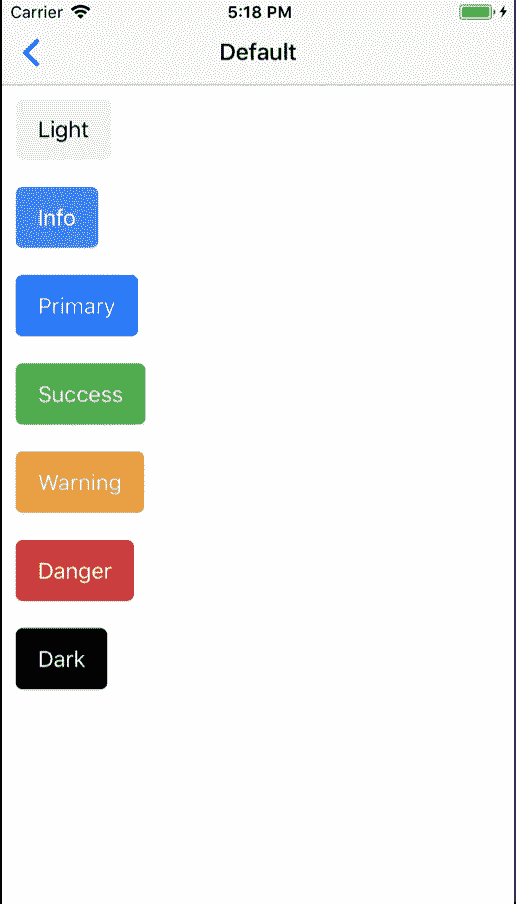

NativeBase 按钮

# 创建用户界面库

下面，我将总结基于 NativeBase 示例描述的按钮。

## ***类型***

*   `light`
*   `primary`
*   `success`
*   `info`
*   `warning`
*   `danger`
*   `dark`

## ***款式***

*   `default`(颜色填充)
*   `transparent`
*   `outline`
*   `rounded`(颜色填充)
*   `full width`

## ***状态*** s

*   `enabled`(默认)
*   `disabled`

## ***字号*** (字号)

*   `small`
*   `default`
*   `large`

我想要实现的是尽可能地宣称:

所有的变量都就位了，就像这样:

现在看看这些需求和 NativeBase 示例，我们可以看到描述这个 UI 的一些共同特征:

*   `foreground color`(文字颜色)
*   `background color`
*   `border color`(用于轮廓按钮)
*   `border radius`(默认按钮和圆形按钮)
*   `border width`

# 按钮式配置

因此，让我们创建一个名为`ButtonStyleConfig`的协议。

查看设计，我们可以看到大多数按钮没有边框，并且具有相同的圆角半径。作为任意值，我选择`6`作为圆角半径。

我们可以注意到的另一件事是，不管有什么类型的按钮，它们都有两种颜色:一种主要颜色和一种次要颜色。

例如，对于默认的成功按钮，我们有主要颜色`green`和次要颜色`white`。事实上，它们中的大多数都有第二种颜色`white`，所以让我们把它作为默认值。

现在，让我们创建描述每种样式的每种颜色的特定结构:

**注意:**当然，除了使用结构，还有很多方法可以做到这一点，比如 PLIST 或 JSON 文件。

让我们使样式更容易使用，并为它们创建一个枚举:

# 显示样式

现在让我们使用一个 enum 来描述显示样式——`default`、`transparent`、`outline`和`rounded` ——并通过实现`ButtonStyleConfig`协议来指定按钮样式的配置。

正如你所看到的，当在`transparent` / `outline`风格之间切换时，让类型返回主要和次要颜色对我们帮助很大。

我们错过了什么吗？哦，对了，按钮的大小，实际上就是字体的大小。所以我们可以创建一个简单的枚举:

有了这些组件，我们就可以开始创建自定义的按钮样式了。

# 将按钮主题化

让我们使用之前创建的`CustomButtonStyle`并添加一个定制的 init。就像我在[上一篇文章中描述的那样，](https://medium.com/better-programming/a-beginners-guide-to-view-modifiers-in-swiftui-8782c3e44d75)我们可以将参数传递给我们的自定义视图修改器。

作为一个微妙的接触，我添加了一个阴影组件，给按钮一点深度。

让我们来看看它的实际应用:

*   默认情况下是这样的:`.buttonStyle(CustomButtonStyle())`

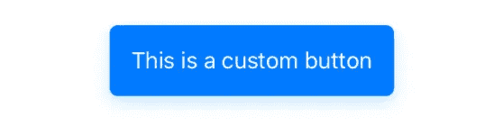

默认主要样式

*   `CustomButtonStyle(.rounded(type: .success))`

圆形成功按钮样式

*   `CustomButtonStyle(.transparent(type: .success)`

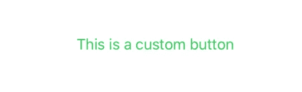

透明成功按钮样式

*   `CustomButtonStyle(.outline(type: .success))`

失败概述成功按钮样式

等等，什么？不应该勾勒出来吗？但是边界在哪里呢？让我们修理它！

# 边界

让我们修理它！我们可以通过添加一个`RoundedRectangle`作为叠加视图来添加边框:

勾勒出的风格是固定的！

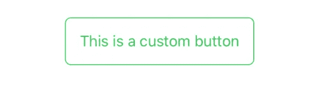

修正了成功按钮的轮廓样式

# **到目前为止我们已经取得的成绩**

让我们看看目前我们能做些什么:

# 全宽

现在，我们的按钮需要最小的宽度。

但是，如果我们想在表单中使用提交按钮，并希望它占据可用的全部宽度，该怎么办呢？

## **如何**

为了使视图具有可用的全宽度，我们可以使用`.frame`视图修改器，如下所示:

`.frame(maxWidth: .infinity)`。

## **哪里**

在上一篇文章中，我强调了修饰语的顺序很重要。

我们想要实现的不仅仅是全宽。我们想让角落、背景、阴影和覆盖影响整个视图，并保持比例。

为此，我们需要在`background`修饰符之前指定`frame`。

结果是这样的:

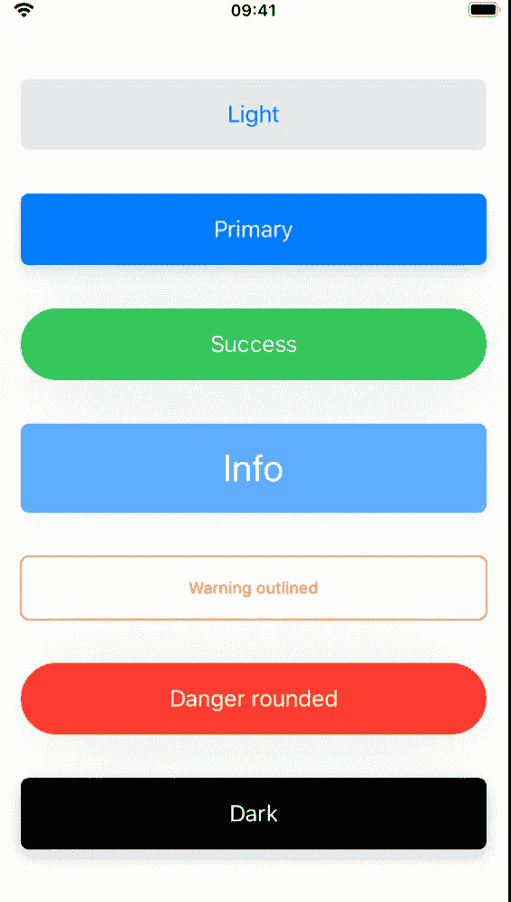

全宽按钮

这不是我一直想要的。我想通过一个类似于`CustomButtonStyle(.default(type: .dark), isFullWidth: true)`的布尔来指定。

所以在`init`方法中指定标志，并且只有在`makeBody`方法中为`true`时才应用`frame`修饰符。

如果我们在这里，让我们创建一个小的自定义修改器，使视图具有全宽。

不幸的是，目前还没有有条件地应用修饰符的方法。但是我们可以创造它！

在谷歌搜索这个问题时，我们发现了这篇关于视图修饰符的优秀文章。在这里我们可以找到一个非常有用的扩展，它只在条件为`true`时才应用指定的修饰符。

现在，我们已经拥有了所需的所有构件:

作为用法的示例，让我们看看它应用于同一个按钮:

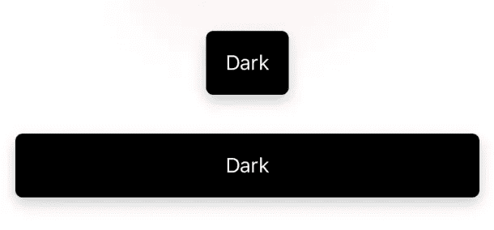

默认和阻止暗按钮

# 疯狂的动画

如你所见，我们指示按钮被按下的唯一方式是通过高亮效果:`.opacity(configuration.isPressed ? 0.7 : 1)`。

让我们添加回`scaleEffect`修改器，但这一次，改变动画效果，使其反弹。更疯狂的是，让我们改变它被按下时的半径:

瞧啊。

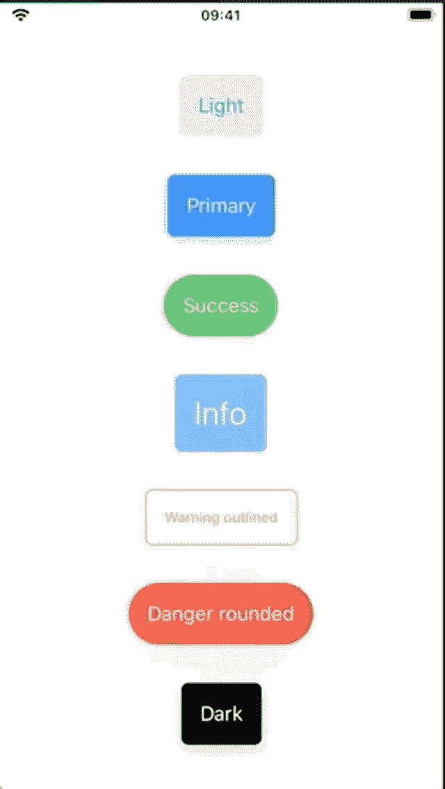

动画按钮

在现实生活中，我们真的需要这样吗？可能不会，但我们有时需要让我们的生活充满活力。

# 恭喜你！

您已经做到了这一步，回报就是您自己的按钮组件库，它很容易扩展和定制。例如，您可以做的是增强按钮组件以支持加载状态，显示微调器，或者使按钮不可使用。

# 有用的链接

*   [“查看扩展以提高代码可读性”](https://swiftui-lab.com/view-extensions-for-better-code-readability/)
*   [《在 SwiftUI 中查看修改器的初学者指南》](https://medium.com/better-programming/a-beginners-guide-to-view-modifiers-in-swiftui-8782c3e44d75)