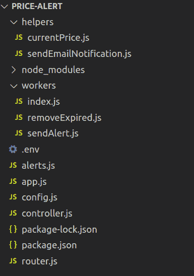
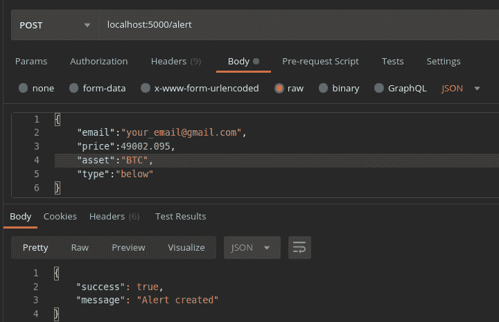
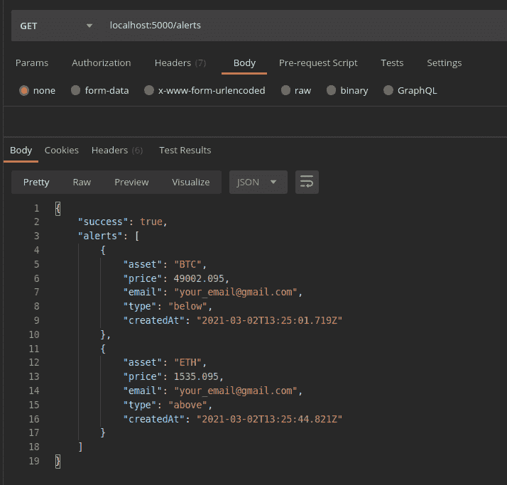
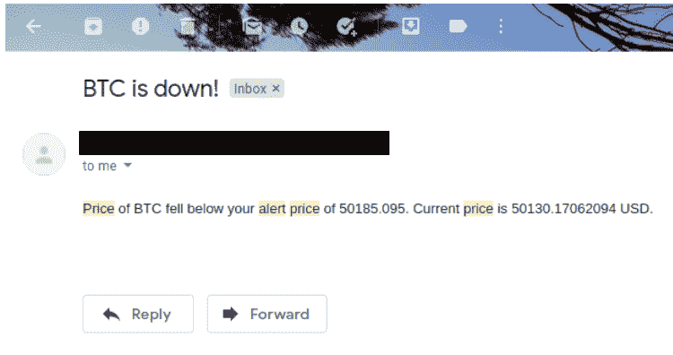

# 使用 Node.js 构建您自己的加密货币价格警报服务

> 原文：<https://betterprogramming.pub/build-your-own-cryptocurrency-price-alert-service-using-nodejs-51d6989dd062>

## 使用 Express.js、BullMQ、Cron 作业，并获得电子邮件通知


[CardMapr](https://unsplash.com/@cardmapr?utm_source=unsplash&utm_medium=referral&utm_content=creditCopyText) 在 [Unsplash](https://unsplash.com/s/photos/cryptocurrency?utm_source=unsplash&utm_medium=referral&utm_content=creditCopyText) 上拍摄的照片。

这个世界上的每个人都很忙，我们经常忘记事情。受这两种说法的激励，我决定构建一个简单的加密货币价格警报微服务，如果指定硬币的价格高于/低于某个阈值，它将发送电子邮件通知。

你再也不需要整天盯着市场查价格了。你所需要做的就是选择货币并指定门槛价格。就是这样。您将通过提供的电子邮件地址收到通知。

我使用 Node.js 来实现。您可以遵循以下步骤，并使用其他编程语言构建相同的微服务。本教程只是为了演示。它不是生产就绪或稳定的(为了简单起见，我将把警报存储在内存中)。但是，我相信您会发现这个演示非常有趣，因为我们将实现通知队列、服务工作者(Cron 作业)、发送电子邮件等等。您还可以通过添加更多功能来改进这一点。

说到这里，让我们看一下这个项目的主要特点:

*   设置价格警报(针对高于/低于阈值价格的价格)。
*   获取所有活动警报。
*   警报自动过期。
*   邮件通知。

开始之前，您需要以下内容:

*   为你的操作系统安装 [LTS 版本](http://nodejs.org)。
*   Postman:一个[工具](https://www.getpostman.com/)，可以动态地使用 API。在本演示中，我们将使用该软件来创建和检索警报。
*   Redis 服务器:[本地安装配置](https://redis.io/topics/quickstart)。或者，如果您愿意，也可以选择云服务提供商。我们需要 Redis 服务器来处理 BullMQ。
*   SendGrid API key: [创建一个新帐户](https://signup.sendgrid.com/)并获取 API key。需要发送电子邮件通知。

一旦建立了环境，我们就可以开始实施了。

# **初始化项目**

按照以下步骤初始化一个空 Node.js 项目:

1.  创建一个空目录:`mkdir price-alert`。
2.  导航到目录:`cd price-alert`。
3.  用`npm init`初始化一个新项目，并回答问题。或者您可以使用`npm init -y`来满足默认配置。

# 安装依赖项

我们将在项目中使用以下依赖关系:

*   [Express.js](https://expressjs.com/) :处理来自客户端的 HTTP 请求。有助于构建 API。
*   [Axios](https://www.npmjs.com/package/axios) :帮助我们向外部资源发出 HTTP 请求的库。
*   [Bull](https://www.npmjs.com/package/bull) :基于 Redis 的健壮消息队列。
*   [Cron](https://www.npmjs.com/package/cron) :用于作业调度。
*   [Nodemailer](https://www.npmjs.com/package/nodemailer) :用于发送邮件通知。

现在，让我们使用以下命令安装所有依赖项:

```
npm install express axios bull cron nodemailer --save
```

*注意:如果你愿意，你也可以像* `*nodemailer*` *一样安装开发者依赖项。*

# **项目目录结构**



# 让我们开始吧

在`app.js`文件中，配置 Express 服务器。添加以下内容并保存文件:

使用`node app`命令启动服务器。您将看到以下输出:

```
Server started listening!
```

如果您导航到 [http://localhost:5000/](http://localhost:5000/) ，您应该会看到状态为“`Up and running`”

酷毙了。现在我们的应用程序可以处理 HTTP 请求了。

# **实现端点**

现在让我们创建一个`router.js`文件，它将包含我们项目中使用的所有端点:

`controller.js`文件将包含每个端点的逻辑。

让我们定义端点的逻辑。首先，让我们从`CurrentPrice`端点开始:

您可以看到，我使用了`currentPrice`函数来获取当前的市场价格。

让我们在`helpers`文件夹中实现`currentPrice`函数。这是最重要的函数，因为我们将在这个应用程序的许多地方使用这个函数。

*注意:为了简单起见，我在这个演示中只实现了 BTC 和瑞士联邦理工学院的价格警报。您可以添加您喜欢的任何资产。*

为了获取 ETH 和 BTC 的当前价格，我使用了 [nomics api](https://p.nomics.com/cryptocurrency-bitcoin-api) 。你可以从任何渠道得到价格。

此外，我在 `config.js`文件中定义了一个`error`对象，如果在处理请求时出现任何未知错误，就可以发送这个对象:

将`error`对象和当前价格函数导入控制器文件并保存:

```
const currentPrice = require("./helpers/currentPrice");
const { errorObject } = require("./config");
```

现在让我们测试一下我们的`GET /prices`端点。启动服务器并导航到[http://localhost:5000/prices](http://localhost:5000/prices)。你可以看到价格对象在浏览器中显示或者通过 Postman 点击端点。

太好了！我们设法得到了 ETH 和 BTC 当前的美元市场价格。

让我们继续实现另外两个端点，用于创建警报和检索所有活动警报。为了在我们的应用程序中全局使用警报，我们将创建一个名为`alerts.js`的文件，该文件导出一个空数组:

```
module.exports = [ ];
```

导入`controller.js`文件顶部的文件:

```
var alerts = require(‘./alerts’);
```

让我们定义创建新警报的逻辑:

我将警报存储在内存中，以简化演示。如果我们停止服务器，警报将会丢失，因为它们临时存储在易失性内存中。如果要在生产中使用，请使用数据库。

接下来，定义检索所有活动警报的逻辑。这个终点很简单。我们只需要返回`alerts`数组:

```
exports.GetAlerts = async (req, res) => {
    return res.send({ success: true, alerts: alerts });
};
```

就是这样。我们需要定义端点来创建和检索警报:

```
router.get(“/alerts”, Controller.GetAlerts);
router.post(“/alert”, Controller.CreateAlert);
```

在定义了所有三条路线之后，`router.js`文件将如下所示:

我们需要在我们的`app.js`文件中导入并使用这个路由器文件:

现在是时候开心一下了。让我们打开 Postman 并测试我们的端点。首先，我们将尝试为 BTC 创建一个阈值价格低于 49，000.095 美元的警报:



您可以在响应中看到`Alert created`消息。同样，您可以尝试为阈值价格创建多个提醒，并指定接收提醒的电子邮件地址。

现在，我们可以尝试获取所有警报:



有用！我们已经实现了这个项目所需的所有端点。现在我们需要删除过期的警报。我已经将提醒的到期时间设置为五分钟。您可以根据自己的需求进行修改。

# **实施 Cron 作业(调度程序)**

我们需要实现两个调度程序。一个是删除过期的警报，另一个是如果指定硬币的价格高于/低于阈值，则向电子邮件地址发送警报。

首先，让我们实现`removeExpired`服务。为了简单起见，worker 将每十秒遍历一次所有活动的警报，并删除五分钟前创建的警报。

保存文件并在`controller.js`文件中要求它:

```
require(./workers/removeExpired.js)
```

我们一启动应用程序，调度程序就会启动。

现在，启动服务器并添加一些警报。您可以看到，警报在创建五分钟后就被删除了。您可以使用`GET /alerts` 端点来确认`removeExpired`服务是否按预期工作。

在实现我们的第二个调度程序(`sendAlert`)之前，我们需要实现`sendEmailNotification`助手函数来发送电子邮件通知。

打开`helpers/sendEmailNotification.js`并添加以下内容:

保存文件。确保在配置文件中添加了`USERNAME`、`PASSWORD`、`EMAIL`和`NAME`:

在`workers/sendAlert.js`中增加以下内容:

我每 25 秒运行一次调度程序。你可以根据你的要求改变它。一旦警报被推送到队列中，我们将把它从`alerts`数组中删除，以防止出现多余的警报。

此外，如果使用`localhost`，确保`redis-server`在端口`6379`上启动并运行，并且`REDIS_URL`在`config.js`文件中输入正确。

我已经在`3`设置了最大重试次数，并将回退时间设置为三秒，这意味着如果在发送电子邮件时出现错误，BullMQ 的消费者进程将尝试以三秒的时间间隔处理请求。如果请求失败三次，那么它将被丢弃。

现在保存文件并通过运行`npm run start`命令启动服务器。

打开邮差并添加一些提醒。您将收到如下所示的指定电子邮件地址的警报:



如果电子邮件没有到达收件箱，请确保检查垃圾邮件和促销文件夹。此外，您需要将发件人列入 SendGrid 帐户中的白名单，这样您的电子邮件就会到达收件箱。

# **结论**

如前所述，该应用程序不适合生产，除非您进行更多的改进(例如，将警报保存到数据库、将密钥作为`env`变量传递、配置流程管理器等)。).

通过添加更多功能，尝试将此演示提升到下一个级别。你可以试试:

*   添加推送通知或短信提醒。
*   添加更多硬币/代币。
*   向多个电子邮件地址发送警报。
*   通过设计 UI，将此演示变成全栈应用。
*   通过部署在云服务器上使其在线。

你可以在 GitHub 上找到这个项目[的完整源代码。](https://github.com/PraneshASP/cryptocurrency-price-alert)

就这些了，伙计们。一如既往，欢迎分享您的想法和建议。

编码快乐！