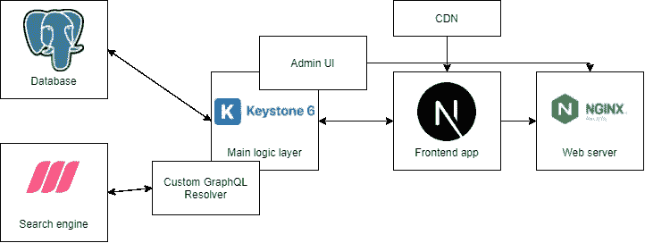

# 构建您自己的基于 Keystone.js 的电子商务系统——需求和架构

> 原文：<https://betterprogramming.pub/build-your-own-e-commerce-keystone-js-based-system-requirements-and-architecture-3d639241b963>

## 我们的电子商务系统的基本概述

马库斯·温克勒在 [Unsplash](https://unsplash.com/s/photos/commerce?utm_source=unsplash&utm_medium=referral&utm_content=creditCopyText) 上的照片

# 介绍

不久前，我还在开发一个基于 [Keystone.js](https://keystonejs.com/) CMS 的系统。但在那里，它的使用方式要复杂得多，不仅仅是作为基本的无头 CMS。我可以轻松地用搜索引擎(基于 Rust 的 [Meilisearch](https://www.meilisearch.com/) )扩展它，并连接到外部 API。

在那之后，我有了几个可以用 Keystone.js 构建项目的想法，其中一个是电子商务系统。这个想法太吸引人了，所以我决定试一试，真的造出来。这篇文章是关于这个主题的系列文章的第一篇。

经过简短的研究，我发现了一个类似的项目，但它使用的是 Keystone.js 的以前版本( [details](https://github.com/sophiabrandt/nextjs-ecommerce) )。这个项目很棒，但是有些事情我相信我会以不同的方式去做。

首先，它使用 MongoDB，我不太确定这是电子商务的最佳解决方案(我也是一个 SQL 人)。此外，从我的角度来看，一些功能缺失，如交付处理等。

另一个类似的项目来自另一个 node . js headless CMS—[Strapi](https://strapi.io/)。但它是一个相当简化的教程类型([细节](https://strapi.io/blog/how-to-build-an-e-commerce-store-with-nuxt-js-and-strapi))，而且使用 [Nuxtjs](https://nuxtjs.org/) 。这不是我喜欢的；我是一个反应型的人。

在我的职业生涯中，我在一个相当大的电子商务系统上工作了几年，所以我相信我对它应该是什么样子(以及不应该是什么样子)有一些想法。这里先说我们的目标。

# 目标

好吧，但是这个电子商务系统应该是什么样的呢？首先，可伸缩性不是我在这里主要关心的，所以我不会太关注它。当然，我会打开一些门，允许一些基本的扩展，但仅此而已。

这样一来，让我们假设我们的系统将使用三层方法来构建。第一层是面向用户的表示层，第二层是业务/逻辑层，最后一层是数据层。

## 表示层

包含应用程序的前端部分，这应该允许用户浏览产品目录。他们还可以按类别过滤、搜索、添加到购物车中，并通过支付和交付处理完成订单。

此外，它应该允许用户查看订单的状态和历史。

## 逻辑层

下一层包含系统的所有后端流程:处理产品、库存、订单处理、支付和交付集成。

此外，带有访问控制的用户授权和认证在这里也至关重要。基本上，它的目标是转换和处理来自表示层或数据层的数据，并进一步双向传递。

## 数据层

最后一层负责数据存储及其持久性。基本上就是我们系统的数据库。其目标是维护数据可用性和一致性，并确保我们遵循 ACID 原则。

所以基本上，我要创建一个包含所有这些层的电子商务系统。总而言之，这个系统应该包括:

*   允许用户浏览产品和处理订单的前端层
*   负责处理数据并允许您管理订单、产品等的逻辑层
*   数据层以 ACID 方式保存所有必需的数据

我认为有必要澄清一下。这个三层模型与软件架构无关。我们仍然可以使用它来创建微服务架构，并且我们可以坚持旧的但却是黄金的整体模型。

我在这里的主要目标是练习设计和实现一个工作系统的技巧(并写下来)，而不是卷入一种方法优于另一种方法的理论讨论。

# 系统元素

现在是时候讨论构建每个独立层的所有元素以及它们之间的联系了。虽然我将在本文中对每一层进行简要的分析和描述，但我将主要关注逻辑层。

## 表示层元素

前端层将由三个主要元素构建而成:主应用程序、本例中的 Next.js 应用程序以及 CDN 服务和 Nginx web 服务器。

这是一个相当简单的解决方案:在 Next.js 的服务器站点渲染的帮助下，React 中内置的主应用程序创建了一种具有单页面应用程序交互性的最佳点——并具有所有的 SEO 优势和来自服务器端渲染的更快的初始加载。

CDN 在这里的作用是帮助提供静态文件，主要是图像。Nginx 就像一个反向代理和负载平衡器。没什么太复杂的。与逻辑层的所有通信都通过 GraphQL 进行。

## 逻辑层元素

这个主层基本上只包含两个元素:作为主处理的 Keystone.js 应用程序，以及命令单元和 GraphQL 解析器，它们充当内置元素的扩展，并作为底层搜索引擎的文本搜索功能的包装器。

但这种说法是一种巨大的简化，让我们进入细节。

Keystone 管理整个系统的三个基本模型:`User`、`Product`和`Order`。

其余的模型可以直接或间接地从它们中导出。首先，`User`保存了我们电子商务系统的客户和员工的基本信息，主要是授权信息和分配的角色。

另外`User`有一个`Cart`并且可以有多个`Order`型号和多个`Address`型号。每个`Order`模型有一个连接的`Payment`和`Shipment`并容纳多个`Product`模型。

`Product`有一个`Stock`模型(为了简单起见，我们假设不使用多仓库设置)和多个`ProductImage`模型。

最后，它连接到多个`Category`模型，每个模型都可以关联到父`Category`生成树。

看起来很复杂，其实(目前)还不是。

基本模型结构

此外，Keystone 的作用是管理主前端应用程序的基本页面的内容。但更重要的是，它的作用也是管理副作用和外部集成。

这种副作用的一个例子可能是与订单处理步骤相关的电子邮件通知，以及通知客户相关信息，或者在发生变化后在搜索引擎中索引产品数据。

另一方面，外部集成的示例包含 Stripe 的使用，以便处理支付或连接到处理交付的外部 API(例如， [DHL API](https://developer.dhl.com/) )。

这些功能将主要利用 Keystone 模式中钩子的能力。不仅如此，我们还需要创建额外的 rest 端点作为 webhooks，以便处理来自这些集成的异步响应。

最后，Keystone admin UI 在这里充当一种仪表板，供员工管理和处理订单。

## 数据层元素

系统主要职责的最后一层是收集数据并确保其持久性。和上一个一样，这里会有两个元素:PostgreSQL 数据库和 Meilisearch 搜索引擎。

目前，我在没有选择数据库的情况下写这篇文章。Keystone.js 只支持 PostgreSQL 或者 SQLite，相信第二个对于电商系统来说有点太小了。

对于搜索引擎，我们需要自定义集成，所以这里的选择余地要大得多，不过我最熟悉的还是 Elasticsearch 和 Meilisearch。

我决定选择第二个，因为我觉得它的 JavaScript 集成更好一些，并且使用 facet 过滤器进行查询更容易。此外，它的占地面积比 Elastic 小几倍。

这总结了我们尚未建立的电子商务系统的所有元素:

系统概况

# 摘要

好了，总结一下。现在，我们已经对我们将在本系列的下一部分中构建的内容有了基本的概述。

建立一个电子商务系统可能看起来很难，令人生畏，但是当我们把这个任务分成小的、计划好的块时，它就不那么可怕了。

下一次，我们将编写一些代码，从项目的设置开始。

我希望你喜欢它。如果您有任何问题或意见，请随时提问。

祝您愉快！