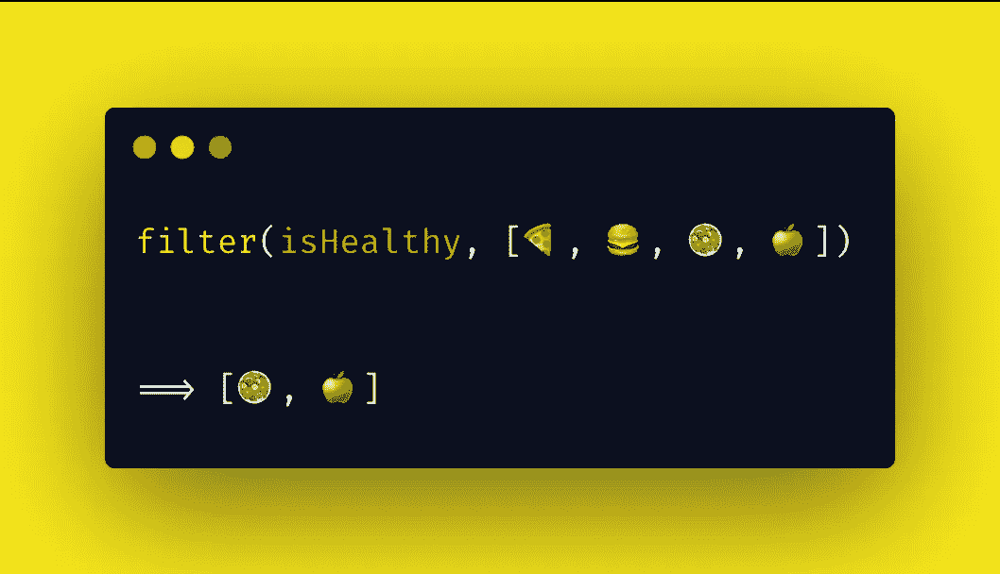

# 构建您自己的过滤器

> 原文：<https://betterprogramming.pub/build-your-own-filter-e88ba0dcbfae>

## 为了更好地理解它

照片由 [Alex Block](https://unsplash.com/@alexblock?utm_source=unsplash&utm_medium=referral&utm_content=creditCopyText) 在 [Unsplash](https://unsplash.com/s/photos/sort?utm_source=unsplash&utm_medium=referral&utm_content=creditCopyText) 上拍摄

过滤是一种常见的编程模式，在这种模式下，我们迭代一组元素，只返回一组通过过滤函数提供的条件的新元素。与[映射](https://medium.com/better-programming/build-your-own-map-b9a0c9d6fbab)不同，我们不能逆转应用过滤函数以获得原始数据集的过程；然而，这可以在映射中通过对变换后的集合应用映射函数的逆来得到原始集合来实现。

在函数式编程的上下文中应用过滤将帮助我们在更好的意义上实现可读性。我们所要做的就是提供原始数组和过滤函数。使用这个[声明性方法](https://en.wikipedia.org/wiki/Declarative_programming)，从一组数据(在本文中是数组)中过滤项目的步骤是隐藏的，我们将注意力集中在我们想要实现的最终结果上。

例如，在上图中，我们确实提供了[🍕,🍔,🥗,🍏]和过滤功能`isHealthy`。过滤器遍历每一种美味的食物，并根据它的过滤功能，决定哪些是健康的，哪些是不健康的。只有健康的数据将被保存在新数组中，并最终被返回[🥗,🍏].

与映射类似，我们有一些选择来过滤数组中的元素，既有声明性的，也有命令性的。

对过滤器使用`[for](https://developer.mozilla.org/en-US/docs/Web/JavaScript/Reference/Statements/for)` [循环](https://developer.mozilla.org/en-US/docs/Web/JavaScript/Reference/Statements/for)是一种必不可少的方法，它遍历元素并将元素推送到一个数组中，该数组传递嵌套在`for`循环中的条件。

如您所见，我们需要跟踪条目索引，定义一个初始数组，并在`for`循环中嵌套条件语句。尽管可以执行这种过滤方式，但可读性不是很好。

# 为每一个

我们的另一个选择是使用`[forEach](https://developer.mozilla.org/en-US/docs/Web/JavaScript/Reference/Global_Objects/Array/forEach)`，它像一个`for`循环一样，遍历一个元素数组。但是使用它的好处是我们不必担心索引跟踪。我们来看一个例子:

就可读性而言，这似乎是对前一种选择的改进，但是在迭代器的上下文之外对[和](https://lorenstewart.me/2017/01/22/javascript-array-methods-mutating-vs-non-mutating/)T2 数组进行变异并不理想。如果我们有一个总是返回新数组的过滤方法，那就更好了。

事实上，我们有一个更好的选择，叫做*原生 JavaScript 过滤器*。

# 本机 JavaScript 过滤器

[本地 JavaScript 过滤器](https://developer.mozilla.org/en-US/docs/Web/JavaScript/Reference/Global_Objects/Array/filter)在过滤数组元素时采用声明性方法。因为它是在`Array.prototype`上定义的方法，所以它在提供的数组上迭代并在其上调用回调。这个回调函数充当我们的过滤函数，它接受三个参数:

*   `element` —数组中被迭代的当前项
*   `index` —当前元素在数组中被迭代的索引或位置
*   `array` —应用过滤方法的原始数组

让我们以这个过滤方法为例。请注意，过滤器可以应用于任何类型的阵列。在本例中，我们将根据对象属性过滤对象数组。

仅用一行代码，我们就能够过滤一组项目。这太棒了。此外，正如您在第 12 行中看到的，链接映射和过滤方法对于处理不同类型的数据集非常有用。

到目前为止，我们已经学习了一些关于过滤的基本知识，以及在 JavaScript 中处理过滤的不同方式。尽管我们主要关注的是可读性，但是当我们在数据集上应用一个方法时，我们不应该忘记性能。

# 构建一个过滤函数

我们现在将注意力转向构建我们自己的过滤函数。正如我们在为 JavaScript 的原生过滤器制作的 [polyfill](https://developer.mozilla.org/en-US/docs/Web/JavaScript/Reference/Global_Objects/Array/filter) 中所看到的，构建一个可扩展到更大数据集并考虑不同边缘情况的生产就绪过滤方法并不简单。然而，在我们的例子中，我们将关注过滤数组的核心。

## 自带过滤功能(用于循环型)

用`for`循环抽象过滤过程非常简单。我们提供过滤函数和原始数组，让`FilterLoop`为我们处理过滤过程。

## 自带过滤功能(递归版本)

现在我们将创建一个递归版本的过滤函数。确保首先检查构建映射函数的递归版本[。](https://medium.com/better-programming/build-your-own-map-b9a0c9d6fbab)

像`for`循环版本一样，我们需要传递一个数组和一个过滤函数。然而，正如你在第 2 行看到的，我们正在[析构](https://developer.mozilla.org/en-US/docs/Web/JavaScript/Reference/Operators/Destructuring_assignment)数组参数，并把它分成两个新的变量，叫做`head`和`tail`。

这种方法允许我们在每一步决定如果通过了`validFn`验证，是否需要返回`head`元素(如第 9 行所示)。如果没有，我们简单地忽略该迭代的元素`head`，继续递归调用`FilterRecursive`函数(如第 13 行所示)。

每次迭代后，原始数组的长度都会缩小，直到最后我们到达一个空数组。此时`head`将被设置为`undefined`，因为我们将试图析构一个空数组。然后我们开始返回通过验证器的数组元素。

## 自带过滤功能(发电机版本)

这是一个用[生成器函数](https://developer.mozilla.org/en-US/docs/Web/JavaScript/Reference/Statements/function*)构建的过滤函数的非常简单的例子。正如您在代码下面的日志中看到的，每次调用生成器函数时，它都会返回一个`iterator object`。通过传递我们的验证器函数，我们只返回通过验证的迭代器对象中的值。

[https://www . freecodecamp . org/news/implement-array-map-with-recursion-35976d 0325 b 2/](https://www.freecodecamp.org/news/implement-array-map-with-recursion-35976d0325b2/)

[https://developer . Mozilla . org/en-US/docs/Web/JavaScript/Reference/Global _ Objects/Array/filter](https://developer.mozilla.org/en-US/docs/Web/JavaScript/Reference/Global_Objects/Array/filter)