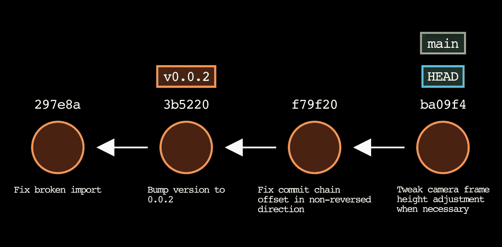
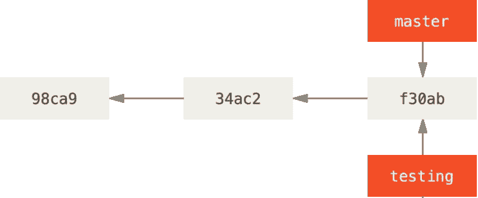
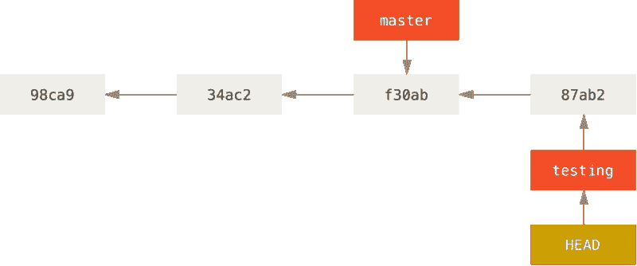
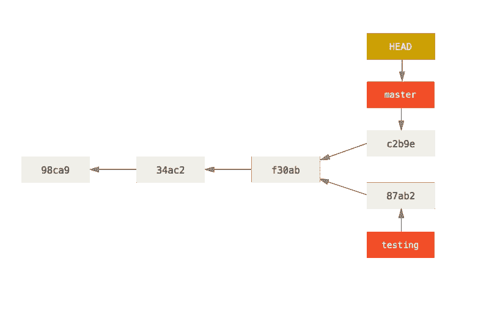
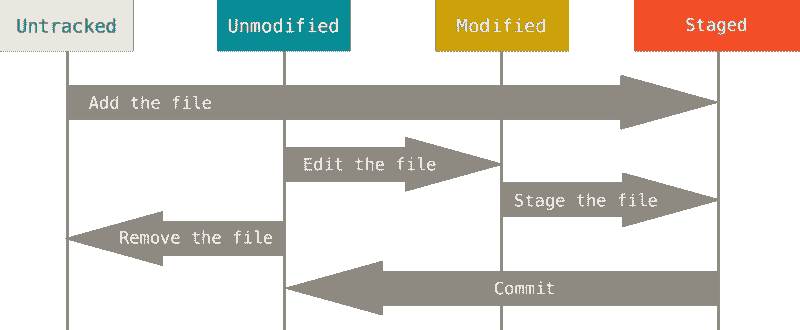
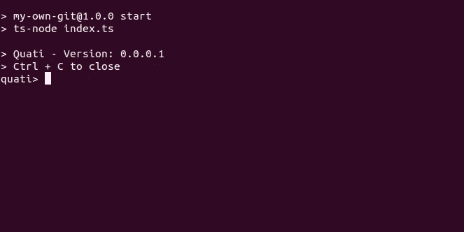

# 用 TypeScript 构建您自己的 Git

> 原文：<https://betterprogramming.pub/build-your-own-git-with-typescript-64571ae7c6d0>

## 让我们构建一些很酷的 git 特性


在今天的实验中，我想和大家分享如何用 TypeScript 构建 Git 的几个特性。当然会有更好的方法来做这件事，但这里是我如何看待和解决这个问题。这是一个复杂事物的简单化观点，希望你喜欢。

在我们开始之前，如果你想跟随我并和我一起编码，你将有一些以前使用工具和技术的经验，下面是列表:

*   VS 代码
*   结节
*   以打字打的文件
*   Git 基础

这里有一个链接，您可以在其中查看最终代码:

[](https://github.com/maaxg/my-own-git) [## GitHub - maaxg/my-own-git:教育资源

### 此时您不能执行该操作。您已使用另一个标签页或窗口登录。您已在另一个选项卡中注销，或者…

github.com](https://github.com/maaxg/my-own-git) 

# 我们将要建造的

在这篇文章中，我们将构建 6 个基本功能，为了比我在这里给你的解释更好，请查看官方文档，你可以在这里开始。

*   贮藏室ˌ仓库
*   犯罪
*   提交链接
*   分支
*   暂存文件
*   用户输入和命令

# 配置项目

让我们开始用一些依赖项来配置我们的项目

创建 ***babel.config.js*** 文件

添加完这些依赖项后，确保使用冒烟测试来测试`jest`，例如:

一切都解决了，让我们开始建造我们的东西=)

# 贮藏室ˌ仓库

当你想在你的项目中使用 Git 时，首先要创建一个存储库，然后我们将从它开始，考虑到存储库是将要包装我们将要实现的特性的一切，我们将在我们的项目中调用 GIT，让我们从创建一个名为`GitI`的接口开始。

在这个接口中，我们将声明 Git 类的外观

现在，让我们在我们的`Repository` (Git)类中实现这个接口

在这第一个时刻，我们的存储库将只负责存储库的名称。

在创建了这个类之后，我们现在可以很容易地用 jest 来测试它:

该命令与以下内容相关:

```
git init
```

`git init`初始化一个存储库，这意味着这个命令创建所有的文件，这些文件将封装所有的东西，并允许我们使用其他命令，如:`git log`。

# 犯罪

简而言之，提交是您暂存的文件内容的快照。让我们从创建我们的*提交接口开始。*

为了生成我们的 id，我们将使用 [sha-1 库](https://www.npmjs.com/package/sha1)来生成类似于 GIT hash 的东西，首先让我们使用我们的消息作为内容来生成我们的 id。

在这第一个时刻，我们不会为这个提交设置作者，如果你愿意，你可以这样做，但是我不会关注我们如何跟踪用户的提交。

现在，让我们测试我们的提交类，验证我们的 id 是否是用正确的散列生成的，请记住，对于特定的字符串，输出将总是相同的，这样，字符串`message`将总是:`6f9b9af3cd6e8b8a73c2cdced37fe9f59226e27d`

查看 Git 如何知道文件如何更改以及他如何能够进行转移的简单方法是通过比较哈希，让我们在一个示例中看到它

```
// index.ts
export * from "./git"
export * from "./commit"
```

我们可以认为这个特定的文件只不过是一个格式化的字符串，因此这个格式化的字符串将生成一个特定的哈希，如果我们进行这个测试，并将这个文件的内容放到 sha1 函数上，它将返回这个特定的哈希:

```
const sha = sha1(fs.readFileSync('./index.ts', {encoding: 'utf-8'}))
console.log(sha)
// sha = 0280670383ddc7cd6640f60f6e4a10eb1799f807
```

现在，如果我们修改我们的文件并添加一个新的行，我们期望这个函数会产生这个散列

```
// index.ts
export * from "./git"
export * from "./commit"
export * from './branch'const sha = sha1(fs.readFileSync('./index.ts', {encoding: 'utf-8'}))
console.log(sha)
// sha = 84d89b5dbc2a304b1564d1761a68e8938ee7ea07
```

您将会注意到散列已经改变，这是 GIT 知道文件改变的方式。

# 提交历史记录

在创建了我们的*提交类*之后，我们现在可以用提交历史将提交相互关联起来。

历史是旧的提交和新的提交之间的关系，其中新的提交被添加到列表的头部，而旧的提交更靠近尾部。

让我们从向*提交接口添加一些新功能开始:*

你可以注意到我们在提交接口中添加了两个新东西，父属性和`getCommitLog`函数。

父属性是如何将提交相互关联，Git 使用[链表](https://www.geeksforgeeks.org/data-structures/linked-list/)来保存分支的提交历史。

链表是一种数据结构，本质上是内存中彼此相关(双重)或与下一个元素相关(简单)的元素序列:


`Head`是链表开始的地方，链表的最后一项将指向空。

在我们的实现中，基本上是相同的，但是当向我们的提交列表追加新的提交时，我们将把新的提交设置为列表的头部。

在我们创建`getCommitLog`函数之前，让我们稍微修改一下构造函数:

让我们开始创建`parent`提交并在我们的构造函数中初始化它，将创建`Commit`类的实例的类或文件将负责给出与该实例相关的提交信息。

现在，我们可以创建提交历史并在`Commit`类中创建`getCommitLog`

这个函数所做的是返回一个 id(我们的散列)数组，你可以自定义它，用一个我已经满意的散列数组，如果你想添加整个类或者只是一个自定义对象，请这样做，和我分享一下你是如何自定义这个函数的。

现在让我们逐行了解正在发生的事情，让我们从`commitAux`开始，这是`CommitI`类型或`null`的辅助变量，所以它可以是我们列表的头、尾或任何元素。在第一时间，它会接受我们自己的阶级的价值。另一个变量是`history`,在这个变量中，我们将保存列表的 id。

现在，我们可以直接查看我们的 while 循环，它接收`commitAux`作为条件，这意味着当`commitAux`不为空时将继续循环，在 while 循环中，我们将`[commitAux.id](http://commitAux.id)`添加到`history`中，并为`commitAux`设置一个新值，作为上一次提交的父项，在某个时候`commitAux`将成为`null`，while 循环将结束，并将返回我们的数组:



当我们实现 Branch 类时，我将让测试代码的这个特定部分，所以让我们继续我们的实验

# 树枝

分支是我们在 Git 中分离代码的方式。

让我给你举个例子，你和另外两个开发人员在一个团队中，他们在云上运行相同的代码库。您已经有了一个准备投入生产的特性，您需要生成一个具有该特性的构建，并需要将它发送到您的基于 could 的代码中。另一方面，你的同事正在开发一个测试功能，不应该投入生产，但是他们需要把它发送到云中。分支可以很容易地解决这个问题，分支是代码库的克隆，在那里你可以做任何你想做的改变，而不会弄乱原来的代码，避免冲突，并且将责任与特定的分支分开。在这个例子中，我们可以创建两个分支，一个分支只接受准备生产的代码，另一个分支是测试分支或开发分支。

所以在一天结束的时候，分支指向一个修改，我们以提交的形式保存修改，这意味着一个分支指向一个提交，那个分支指向另一个提交，等等。

在下图中，您可以认为可以交付给生产的代码在**主**中，我们可以认为分支**测试**可以在没有描述的情况下进行测试，两个分支指向相同的提交



现在，考虑您的同事将他们的变更推送到测试分支，这将看起来像这样:



现在你的同事所做的改变不会影响到主节点，他们在这个树的不同分支中。

现在，如果您将您的更改推送到 master，看起来会是这样:



变化互不影响，但都指向同一个起点。

现在只是用 TypeScript 复制这个。

让我们从创建我们的*分支接口开始，*我们将从添加一个`name`和一个`commit`作为分支的属性开始。

实现该接口将如下所示:

简单，现在让我们测试我们的分支类:

这很酷，但这并没有做太多，我们只有一个类，可以返回给我们一个名字和一个提交，这基本上是什么都不做。

让我们对 Git 接口进行一些修改并添加一些真正的功能:

将这些特性添加到我们的 Git 类:

哇，现在 Git 类中发生了很多事情，所以让我们从新属性开始，最后让 checkout 函数。

`branch`属性将是存储库的当前分支，因此它将是存储库此刻将看到的代码。

分支是私有属性，这意味着只有类可以访问，这个属性不对外公开，它是一个分支数组，这意味着我们要在这个数组中存储我们创建的分支。

在构造函数中，我们将分支初始化为一个空数组，下面我们创建第一个名为“`main`”的分支，添加到`branches`数组中，并将其设置为当前分支。

私有方法`add`正在向我们的数组推送新的分支。

现在，最后，我们在`checkout`方法上，这个方法接收您想要检查的分支的名称作为属性。

这意味着如果分支存在于我们的存储库中，我们将切换到它

```
// checkout
 const branchIdx = this.branches?.findIndex((branch) => branch.name === name);
 /* If branch already exists changes to existing branch */ 
 if(branchIdx !== undefined && branchIdx !== -1 && this.branches?.length) {
    this.branch = this.branches[branchIdx];
    console.info(`Switched to branch: ${this.branch.name}`)
    return this.branch;
	}
```

如果它不存在，我们将创建并切换:

```
// checkout
      /* Create if does not exists */
      this.branch = new Branch(name, this.branch?.commit);
      this.add(this.branch)
      console.info(`Created and Switched to: ${name}`)
      return this.branch;
```

如果没有传递名称，它将返回当前分支:

```
// checkout
     if(!name){
        console.info(`Current branch: ${this.branch.name}`)
        return this.branch;
      }
```

现在，在实现之后，我们终于可以测试我们的新代码和提交历史。

让我们创建这些新的测试用例:

# 暂存文件

暂存文件只不过是让 Git 知道一个文件或一组文件已经准备好提交。

该操作由命令表示

```
git add file.txt
```



存储库中的每个文件都有两种状态:已跟踪或未跟踪。

跟踪的文件是上次快照(提交)中的文件，以及任何新转移的文件，简而言之，跟踪的文件是 GIT 知道的文件。

未跟踪的文件是其他所有文件，这种状态表示位于工作目录中但不在最后一个快照中且不在临时区域中的任何文件。

请检查[文件](https://git-scm.com/book/en/v2/Git-Basics-Recording-Changes-to-the-Repository)以获取更多信息

现在，我们将创建暂存被修改的跟踪文件的操作，我们希望暂存它`**.**`

让我们创建这个动作，并尝试用 TypeScript 来表示它

首先创建添加接口

该接口将只有一个名为 **stageFile 的方法，**该方法将接收一个文件路径作为属性。

在这之后，我们可以在 ***中创建并实现我们的接口添加类***

现在，我们只考虑一次存放一个文件。

让我们了解一下 Add 类中发生了什么。

首先，我们有一个私有属性叫做`dbPath`这是 DB(一个简单的路径。txt 文件)，我们将在这里存储已暂存并准备提交的文件，我们将在构造函数中使用自定义路径或默认路径`store.txt`初始化该属性。

在`stageFile`方法中，我们验证它是否是一个有效的路径，如果是，我们将在文件中写入路径，如果不是则返回 false。

现在我们可以测试`stageFile`功能了

现在我们必须在 Git 类和接口中公开这个方法。

让我们首先在 *Git 接口:*中创建一个`stageFile`函数的声明

添加这个声明后，我们可以在我们的 *Git 类:*中实现这个函数

该函数只是对 *Add 类的一个调用。*

# 提交中的文件内容

在我们将文件存放在`store.txt`文件中之后，我们需要将特定路径的内容转换成一个散列。

让我们修改一下`Commit class`中的一些东西:

您可能会注意到，我们已经修改了要用存储在`store.txt`文件中的文件路径内容生成的散列，这些内容由`private function getStore`读取。在读取并生成散列后，我们用`clearStore`函数清除该文件。

# 用户输入和命令

到目前为止，我们已经构建了一些 git 特性，它们是:Repository、Branch、Commit 和 Add。

现在，我们只测试 jest 的特性，它很好，但没有功能，让我们通过读取用户输入在我们的应用程序中创建一些真实的体验

首先创建一个文件，程序将从这个文件开始，我将把这个文件命名为:index.ts

这个文件将是程序的入口点，所以向用户提供一些信息是很酷的

我将使用`ts-node`在桌面上构建我们的应用程序，所以请确保在您的`package.json`中添加脚本`start`:

回到`index.ts`，从节点创建一个`readLine`模块的实例:

创建了这个实例之后，让我们创建一个 Git 类的实例来访问这些特性，并使用`question`函数读取用户输入。

在这里，我们创建了一个名为`readCommand`的函数，并创建了一个递归函数，在用户的每个回答之后，该函数再次被激活，要求一个新的命令。

最后，添加`on`监听器来观看节目，并向用户说“再见”

现在，你可能注意到我还没有解释`syntaxValidator`函数是做什么的，让我们深入一下。我从创建一个有效命令的数组开始，实际上类似于 GIT 命令，除了`qti`，它是`[quati](https://www.google.com/search?q=quati&client=ubuntu&hs=Kq5&channel=fs&sxsrf=ALiCzsZBLZjb-vm0PRIfNesZ-9bU04OmmA:1661788759027&source=lnms&tbm=isch&sa=X&ved=2ahUKEwi9rrHFtez5AhV8GLkGHZAzBP4Q_AUoAXoECAIQAw&biw=1920&bih=939&dpr=1#imgrc=XSSSpP3fxv31oM)`的缩写，是一种非常可爱的动物

在定义了这些有效值之后，我创建了`syntaxValidator`函数，函数内部有很多东西，很多 if 和 elses，真的不是你将看到的更清晰的代码，所以如果你有任何想法让事情变得更好或更可读，请在下面发表评论或在 repo 中打开 PR，我将非常高兴听到你的意见。

我不会深入研究这些函数，因为它们真的很简单，它们只是验证用户输入是否有效，所以你可以根据需要定制。

`isCommandStartingProperly`功能验证用户输入是否以“qti”命令开始，以及“qti”之后是否有有效命令

`isCheckoutCommandValid`函数验证用户输入是否有分支名称，如果有，是否传递给`git.checkout`函数。

`isBranchCommandValid`功能与`isCheckoutCommandValid`几乎相同，但该功能使`branch -m`命令有效。

`isLogCommandValid`函数验证日志命令是否有效，如果历史中有提交，它返回历史，如果没有，告诉用户先提交。

`isCommitCommandValid`函数验证`commit -m`命令是否有效，并将消息提交给我们的提交。

`isAddCommandValid`函数验证`add`是否有效，并将文件的路径发送给`stageFile`函数。

`syntaxValidator`是入口点。

实现这些函数后，您应该会看到类似这样的内容:



现在它只是测试你的命令和你实现的功能。

# 结论

今天的文章到此结束，我们用 TypeScript 构建了 Git 的一些很酷的特性，我真的希望你喜欢它，任何建议或更正请在评论中告诉我。

## **参考与启发**

*   [https://github.com/codecrafters-io/build-your-own-x](https://github.com/codecrafters-io/build-your-own-x)
*   [https://kushagra.dev/blog/build-git-learn-git/](https://kushagra.dev/blog/build-git-learn-git/)
*   [https://www.youtube.com/watch?v=_7nISfpofec](https://www.youtube.com/watch?v=_7nISfpofec)
*   [https://git-scm.com/](https://git-scm.com/)

```
**Want to Connect?**[Linkedin](https://www.linkedin.com/in/maxsuel-gomes-79a2a1181/)[Github](https://github.com/maaxg)
```