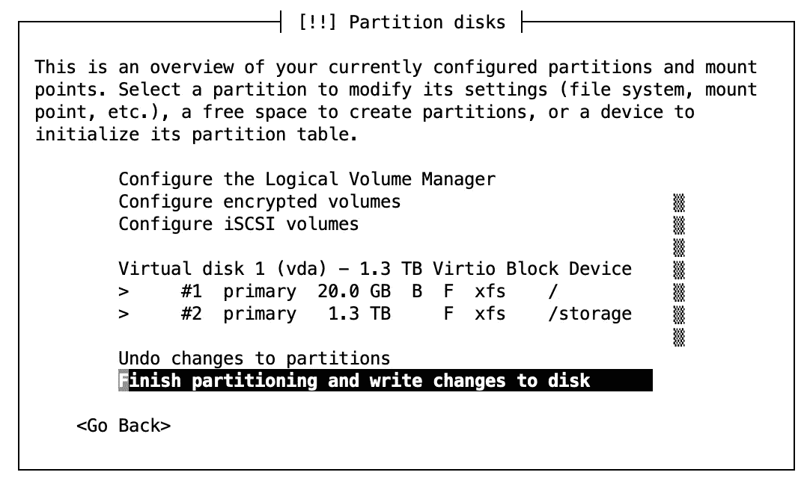
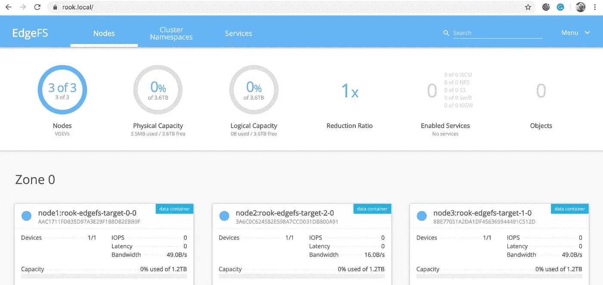

# 构建您自己的家庭云存储(第 2 部分)

> 原文：<https://betterprogramming.pub/build-your-own-in-home-cloud-storage-part-2-8fe86e9bd5bf>

## 使用 Rook/EdgeFS 向 Kubernetes 集群添加存储


帕特里克·林登伯格在 [Unsplash](https://unsplash.com/s/photos/harddrives?utm_source=unsplash&utm_medium=referral&utm_content=creditCopyText) 上的照片

在我的文章“[构建你自己的家庭云存储(第一部分)](https://medium.com/better-programming/build-your-own-in-home-cloud-storage-1aa74b5c6397)”中，我基于 [GlusterFS](https://www.gluster.org/) 和[NFS·甘尼萨](https://github.com/nfs-ganesha/nfs-ganesha)构建了一个基本的网络附加存储系统(NAS)。在后续文章中，我展示了如何在您的家庭 Kubernetes 集群中使用新的存储解决方案。但我用作存储盒的电脑只有 150 的硬盘空间，如果你想处理大数据，这并不是很多。此外，在 [Kubernetes](https://kubernetes.io/) 中，它是静态存储，您可以在其中预定义固定的持久卷。

我需要一个动态存储解决方案，允许我根据需要配置持久卷。要以这种方式使用 GlusterFS，您需要使用 [Heketi](https://github.com/heketi/heketi) ，并且深入了解一下，设置起来似乎相当复杂。此外，赫克提似乎处于某种准维持模式，没有足够的人来支持它。这太糟糕了，因为它看起来是一个非常灵活但复杂的存储分配系统。

所以我要扔掉所有的经验，我不得不在我的职业生涯中做了很多，并完全走向另一个方向。在谷歌上搜索，我发现很少有关于为 Kubernetes 创建存储系统的文章，其中很多文章都谈到了这有多难。所以这篇文章可能有点长，但是我会试着一步一步地解释，如何在不使用晦涩难懂的术语或者晦涩难懂的内核设置的情况下，设置一些有用的东西。它可能不是最佳的，但我决心让它发挥作用。这只是为了我的家庭沙盒。它不像是要为饥渴的互联网提供视频流。

如果你从云提供商那里运行你的 Kubernetes 集群，比如 GCP 或者 AWS，你不需要这些。这些系统内置了动态卷分配。我在这里这样做是为了展示幕后可能发生的事情，这与我的文章“ [Kubernetes from Scratch](https://medium.com/better-programming/kubernetes-from-scratch-4691283e3995) ”的意图是一致的。


图片由[乔纳森·达纳](https://pixabay.com/users/jonathanmdana-2994675/?utm_source=link-attribution&utm_medium=referral&utm_campaign=image&utm_content=1547055)从 [Pixabay](https://pixabay.com/?utm_source=link-attribution&utm_medium=referral&utm_campaign=image&utm_content=1547055) 拍摄

我认为由 [EdgeFS](http://edgefs.io/) 支持的 [Rook](https://rook.github.io/) 是一个相对简单但灵活的存储解决方案。Rook/EdgeFS 是一个严格的 Kubernetes 解决方案，所以你不会有独立的存储；这些都将纳入 Kubernetes 系统。我将使用我现有的裸机系统，并添加三个新节点，作为一个 EdgeFS 集群来处理系统其余部分的所有持久存储。

我将从我在“ [Kubernetes from Scratch](https://medium.com/better-programming/kubernetes-from-scratch-4691283e3995) ”和“ [Kubernetes from Scratch(第 2 部分)】](https://medium.com/better-programming/kubernetes-from-scratch-part-2-e30b48f7ca6b)”文章中构建的机器开始，添加三个新的虚拟机，每个虚拟机将完全控制一个新的 4tb 外部驱动器的三分之一。我选择 3 是因为，对于集群来说，3 是工作良好的最小数字。我可能应该有三个 1tb 的驱动器，但他们在一个 4T 驱动器上有交易，我无法抗拒交易。

如果您没有遵循“Kubernetes 从零开始”的文章，您将需要一台能够运行几个虚拟机的主机，至少有 32g 的 RAM 和十几个 CPU 核心。它还应该至少已经安装了控制面板 Kubernetes 节点，并与一组常用的附加组件(如网络和入口)一起运行。就我而言，我使用的是翻新的机架式服务器。它不是很漂亮，但它在一个扁平闪亮的盒子里集成了大量的计算能力。我的猫喜欢躺在上面，因为它很温暖。

不过，在我们创建虚拟机之前，我会将硬盘分成三个分区，这样每个新虚拟机都可以完全控制一个分区。

插入外部驱动器后，使用`lsblk`查找其名称。

由于我的电脑上只有一个 4tb 的驱动器，所以很容易推断出它是`sdb`。它已经被分成了`sdb1`和`sdb2`，但是我们将撤销它。

Linux 磁盘格式化的瑞士军刀是`fdisk`。假设磁盘是`sdb`，就像我的例子一样，然后运行`sudo fdisk /dev/sdb`。当提示符出现时，键入“m”以获取命令列表:

我要做的第一件事是‘g’创建一个新的空分区表:

```
Command (m for help): g
Created a new GPT disklabel (GUID: 743C7681-2815-C044-B0F0-BB82C7427D0D).
```

接下来，“n”命令将创建一个新分区:

```
Command (m for help): n
Partition number (1-128, default 1): 
First sector (65535-976754640, default 65535): 
Last sector, +/-sectors or +/-size{K,M,G,T,P} (65535-976754640, default 976754640): 325584880
```

前两个值是默认值。我用 325584880 作为第三个值，因为它是 976754640 的三分之一。现在，我们为第二个分区运行“n”命令:

```
Command (m for help): n
Partition number (2-128, default 2): 
First sector (325584880-976754640, default 488432355): 
Last sector, +/-sectors or +/-size{K,M,G,T,P} (488432355-976754640, default 976754640): 651169760
```

这次我用 651169760 做最后一个扇区。为最后一个分区再键入一次“n”。

```
Command (m for help): n
Partition number (3-128, default 3): 
First sector (651169760-976754640, default 651169760): 
Last sector, +/-sectors or +/-size{K,M,G,T,P} (651169760-976754640, default 976754640):
```

这一次，我可以接受所有的默认值。现在用' p '命令列出分区表:

最后，键入“w”写出新的分区表。再次使用`lsblk`命令查看您的块设备:

现在你可以看到`sdb`被平均分为`sdb1, sdb2`和`sdb3`。

现在，我们需要三台虚拟机，每台虚拟机都有一个分区。我使用`virt-install` KVM 命令创建了一个 VM，它有一个`vcpu`，2gb 的 RAM 和一个新的磁盘分区。下面是该命令的样子:

名字会是`node1`，磁盘会是`/dev/sdb1`，第一个分区。

> 注意:我的经验是 2048 兆的内存是不够的，我已经把它改成了 4096 和 2 个 vcpus。此外，重启后`/dev/sdb1`不一致。我推荐用`/dev/disk/by-partuuid/<partition-uuid>`代替。用`lsblk -O`命令找到分区 uuid。

随着虚拟机安装的进展，我们可以采用大多数选项的默认值。当它询问主机名时，为了一致起见，您应该使用`node1`。

> 注意:从 2020 年 6 月 6 日开始，以下部分不再适用于安装程序。我建议使用默认分区，稍后创建`/storage`目录。

在准备磁盘时，您需要制作两个分区，一个 20gb 的分区用于操作系统，其余的用作存储区域。选择“引导—使用整个磁盘”并按照说明创建第一个格式化为`xfs`的 20 GB 驱动器，可引导并安装在`/`上。另一个分区也应该是`xfs`并安装在`/storage`上。你可以选择`ext4`或者其他文件系统，但是`xfs`听起来很酷，为什么不呢？您的最终屏幕将如下所示:



选择“完成分区并将更改写入磁盘”,并在询问您是否确定时回答“是”。

您将再次被提示问题。对于大部分，你可以采取默认或者合理的答案。当它问你要安装什么软件时，只需选择 OpenSSH，我们将需要它来与服务器通信。

安装完成后，使用`virsh domifaddr node1`找到 IP 地址并将其添加到您的`/etc/hosts`中。然后就可以用`ssh-copy-id node1`把主要主机的 ssh 密钥复制到新主机上。

现在对`node2`和`node3`做同样的操作。将名称改为`node2`和`node3`，并使用我们创建的第二个和第三个分区。对我来说，那是`/dev/sdb2`和`/dev/sdb3`。

现在，我们有三个虚拟机，每个都有大约 1.2 的存储。下一步是使每个 VM 成为 Kubernetes 节点，并将其加入主集群。我们需要 ssh 到每个节点，并执行以下任务。

要准备新虚拟机进行安装，首先要确保 swap 处于关闭状态:

通过向您的`/etc/modules-load.d/modules.conf`文件添加几行来启用桥接和覆盖:

```
overlay
br_netfilter
```

并在您的`/etc/sysctl.conf`文件中添加几行:

```
# added for kubernetes bridge
net.bridge.bridge-nf-call-ip6tables = 1
net.ipv4.ip_forward                 = 1
net.bridge.bridge-nf-call-iptables  = 1
```

然后重新启动你的虚拟机，使其生效。

因为 Kubernetes 是一个容器编排系统，我们需要一个它可以编排的容器系统。您可以使用许多容器系统，但是我们将使用 [containerd](https://containerd.io/) 。这是一个两行的 Ubuntu 安装程序:

```
sudo apt-get update 
sudo apt-get install containerd
```

现在你可以安装 Kubernetes 的神圣三位一体，`kubeadm/kubectl/kubelet`。

为了测试`kubeadm`可以访问我们之前安装的`containerd`，我们可以运行`sudo kubeadm config images pull`。它会花一些时间提取一些它需要的图像，我们知道它可以和`containerd`对话。

现在我们需要将新节点`join`到现有集群。您必须 ssh 到您的控制面板节点，在我的例子中是`kube1`，并获得一个新令牌以允许新节点加入:

```
rkamradt@kube1:~$ kubeadm token create --print-join-command
kubeadm join 192.168.122.39:6443 --token XXXXX.XXXXXXXXXXXXX \
    --discovery-token-ca-cert-hash sha256:XXXXXXXXXXXXXX
```

复制它的输出，然后 ssh 到您的新节点并运行它(前缀为`sudo`)。

```
sudo kubeadm join 192.168.122.39:6443 --token XXXXX.XXXXXXXXXXXXX \
    --discovery-token-ca-cert-hash sha256:XXXXXXXXXXXXXX
```

回到您的主机，您可以列出节点:

```
rkamradt@beast:~$ kubectl get nodes
NAME    STATUS   ROLES    AGE   VERSION
kube1   Ready    master   37d   v1.18.1
kube2   Ready    <none>   37d   v1.18.1
kube3   Ready    <none>   35d   v1.18.1
kube4   Ready    <none>   35d   v1.18.1
node1   Ready    <none>   13m   v1.18.2
```

它可能暂时不会显示准备就绪；花了几分钟时间来解决新节点和集群之间的所有问题。我们只给了节点 2gb 的内存，所以事情有点紧张，但我们应该在新节点上运行的唯一东西是与存储相关的。

现在在另外两个虚拟机上安装 Kubernetes 节点。

一旦您的所有节点启动并运行，我们就可以安装 Rook 并启动一个存储集群。首先，启动基本系统。在您的主主机上，运行以下命令:

```
git clone --single-branch --branch master \
          https://github.com/rook/rook.git
cd rook/cluster/examples/kubernetes/edgefs
kubectl create -f operator.yaml
```

这很简单。现在等一分钟，然后验证一切都在运行。

你会注意到的一点是`rook-discover`是一个`daemonset`。一个`daemonset`是一种特殊的`replicaset`，它确保每个工作者节点上都有一个 pod 在运行。我们有六个工作节点，所以您应该有六个单元。

一旦一切运行完毕，我们就可以设置拓扑并将 EdgeFS 集群部署到 Kubernetes pods 中。在`rook/cluster/examples/kubernetes/edgefs`目录中有一个名为`cluster.yaml`的文件，需要稍加编辑。大部分都没问题，但是文件末尾的实际集群定义需要了解我们的节点和磁盘。这是我们刚刚创建的设置的新集群定义:

注意对于`spec.storage.directories.path`，只有一个条目。所有节点都需要有相同的路径指向我们之前设置的已装载驱动器。删除`cluster.yaml`末尾的集群定义，并替换为上面的定义。然后就可以应用了:`kubectl apply -f cluster.yaml`。

我将所有这些文件复制到一个名为 [storage-deploy](https://github.com/rkamradt/storage-deploy/tree/v1.0) 的 GitHub 存储库中。在上面，我将`cluster.yaml`分成两个文件，`clusterprep.yaml`和`cluster.yaml`，最后一个文件只包含集群定义。

过一会儿，您应该会看到这样的内容:

现在你有一个`rook-edgefs-mgr`吊舱和三个`rook-edgefs-target`吊舱在运行。目标舱在你的每个节点上。我们刚刚创建的 Kubernetes 节点已经被转换为`edgefs`节点 1–3。请注意，您也有一个`rook-edgefs-ui`。我将通过一个入口(你可以在上面提到的 GitHub 页面上找到的定义)来公开它，然后，在将`rook.local`添加到我的`/etc/hosts`文件后，我可以浏览到 https://rook.local。使用用户`admin`和密码`edgefs`登录，并查看你的 EdgeFS 集群的所有 GUI 荣耀！



在我的下一篇文章中，我承诺对我的 Kubernetes 集群中的所有新存储做一些事情。但在此之前，我将沉浸在 EdgeFS 集群实际启动和运行的喜悦中。

这是一次漫长的跋涉，如果你一路走到了终点，我为你鼓掌。如果你真的让它运行起来，那是一个很大的成就。在此过程中，我不得不解决许多不同的问题。仅仅因为我以线性叙述的方式解释了这一切，并不意味着我不需要回溯几次才能把事情做好。但是我希望我的努力已经给了你正确构建这个东西所需要的指导。

这里是本文脚本的 GitHub 存储库:[https://github.com/rkamradt/storage-deploy/tree/v1.0](https://github.com/rkamradt/storage-deploy/tree/v1.0)

提到的其他文章:

*   [Kubernetes 从零开始](https://medium.com/better-programming/kubernetes-from-scratch-4691283e3995)
*   [Kubernetes 从零开始(第二部分)](https://medium.com/better-programming/kubernetes-from-scratch-part-2-e30b48f7ca6b)
*   [打造您自己的家庭云存储(第一部分)](https://medium.com/better-programming/build-your-own-in-home-cloud-storage-1aa74b5c6397)