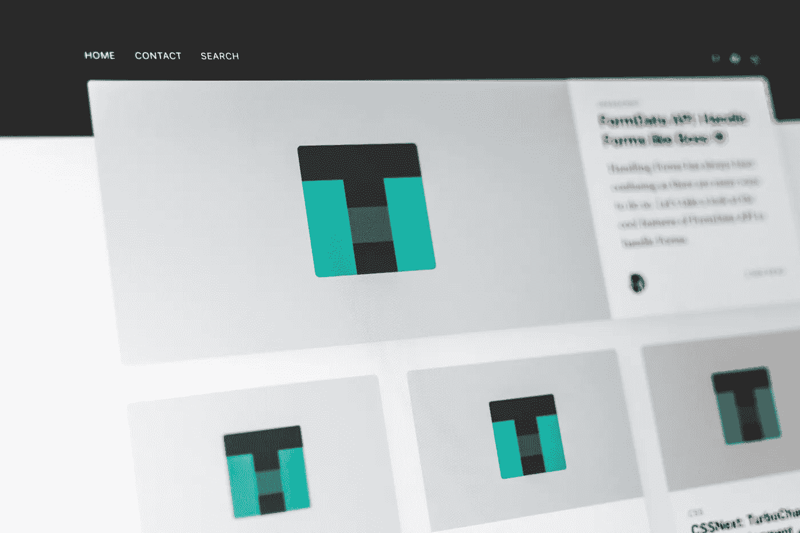
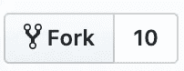
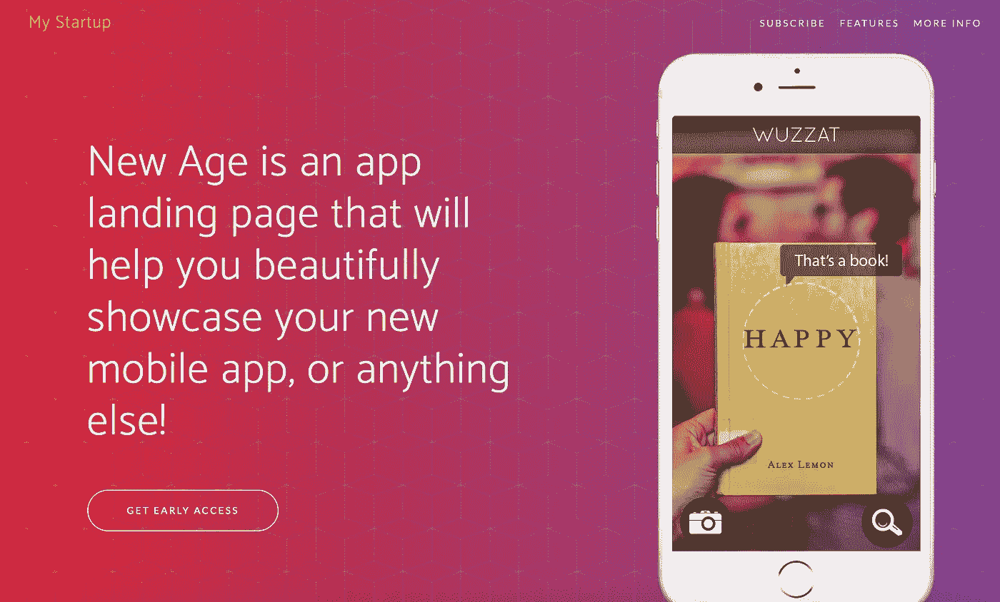
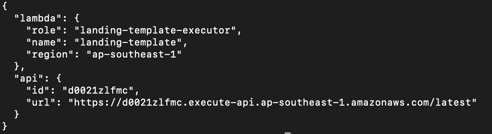
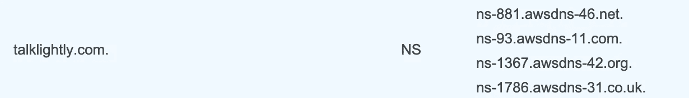
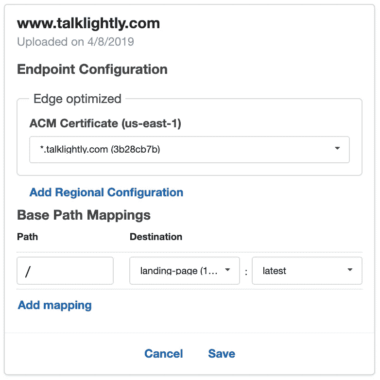
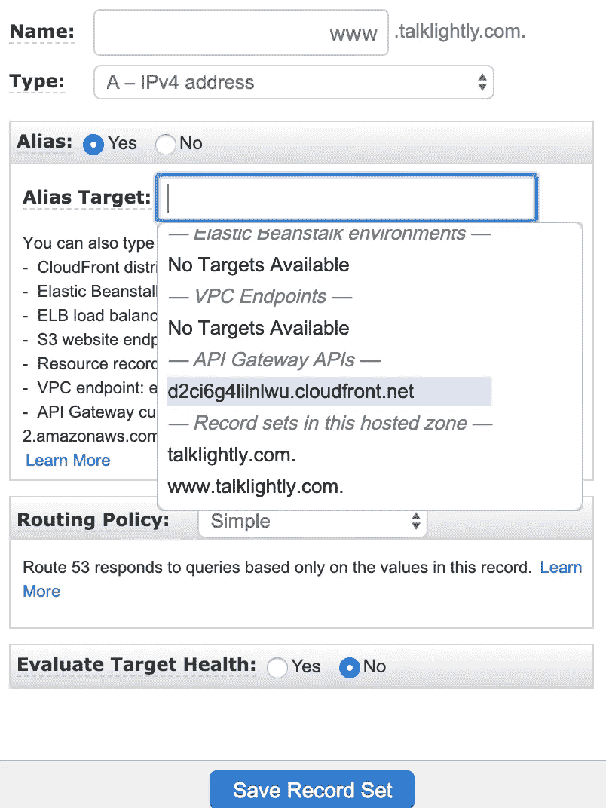

# 在 AWS Lambda 上构建您自己的登录页面，并开始验证您的想法

> 原文：<https://betterprogramming.pub/build-your-own-landing-page-on-aws-lambda-and-start-validating-your-idea-2d4ce49e0196>

## 构建您自己的登录页面的编码说明



潘卡杰·帕特尔在 [Unsplash](https://unsplash.com/search/photos/website?utm_source=unsplash&utm_medium=referral&utm_content=creditCopyText) 上的照片

构建自己的数字产品的关键活动之一是开始构建一个*最小可行产品* (MVP)。这是创业社区常用的一个术语，指的是你的产品的最简单版本，但仍然能解决实际用户的问题。这个想法是为了避免浪费大量的时间去构建不能解决任何问题的复杂的东西。这是为了早期验证您的数字业务。

创建一个 MVP 大约需要 2 到 6 个月的时间。

如果你的 MVP 诱饵没有被目标用户吃掉，你需要进一步迭代产品以获得早期牵引力。你需要找到大量的早期用户，他们经常使用你的产品解决他们的问题。为此，可能还需要 6 个月甚至 5 年的时间。

这真的是一个漫长的旅程，即使付出了巨大的努力，也有可能失败。

实际上，如果你在早期就能察觉到你正在开发一个糟糕的产品，你就不需要浪费这些年的时间。你真的可以从第一天开始验证，通过建立一个描述你的想法的登陆页面，并要求潜在用户订阅早期访问。

当足够多的用户在早期访问列表上提交他们的名字时，这是开始构建你的 MVP 的一个很好的指标。

# 为你的想法建立一个登陆页面

有两种方法可以让你的想法登陆页面。

**简单易行的方法。你可以使用一个网站构建服务，比如说 Wordpress 或者 LaunchRock，在几分钟内就可以完成你的登陆页面。简单又快捷。然而，当你想把你的登陆页面升级成一个真正的网站，并真正实现其承诺的功能时，会有一些困难。本文不会过多介绍这项服务。不过这很简单，如果你想在他们的网站上进一步探索的话。**

**技术途径** 你要建立一个技术创业公司，为什么不建立自己的登陆页面，用真正的编码和东西。开始吧，我会指导你的。

不管你是否有技术背景，我可以向你保证你会有一个像样的登陆页面。遵循我下面的指导方针。

*   我们将使用 [Node.js](https://nodejs.org/) 编程语言，前端有 HTML、js、CSS。所以，确保你[安装了 Node.js](https://nodejs.org/en/download/) 。
*   我会提供模板项目，所以你不需要从头开始编码。模板项目托管在 [GitHub](https://github.com/antonrifco/t_shaped_surfer) 上。如果你还没有 GitHub 账户，你需要注册一个。下面提供了进一步的使用说明。
*   上面的模板项目包括对[谷歌分析](https://analytics.google.com/analytics/web)和[反馈像素](https://business.facebook.com/events_manager)的基本跟踪(首先创建一个反馈页面)
*   如果需要，您可以使用 Gmail API 作为可选的电子邮件服务。在[谷歌云平台](https://cloud.google.com/)注册一个免费账号，然后[启用 Gmail API](https://console.cloud.google.com/marketplace/details/google/gmail.googleapis.com) 。
*   我们将在 [AWS Lambda](https://aws.amazon.com/lambda/) 上托管我们的登录页面。从[注册一个 AWS 账户](https://aws.amazon.com/)开始。

# **在本地机器上运行你的登陆页面**

完成以上说明后，转到[模板项目](https://github.com/antonrifco/t_shaped_surfer)，然后点击右上角的`Fork`按钮。



然后，点击绿色的`clone or download` 按钮下载项目代码。将下载的文件解压到你喜欢的目录中。

对于熟悉 Git 的读者来说，您也可以在您的终端上使用`git clone`来执行上面的步骤。

解压缩下载的文件后，在终端上运行以下命令，开始下载项目依赖项并创建配置文件:

```
**> npm install**
# you should get this result: 
added 256 packages from 190 contributors and audited 742 packages in 5.641sfound 0 vulnerabilities**> cp config.template.js config.js**
```

现在，您已经准备好运行登录页面的本地版本。启动 Node.js 服务器(下面的命令)，在 [http://localhost:4000](http://localhost:4000) 上打开浏览器

```
**> node app.local.js**
```



看起来不错，是吧？

# **修改内容并进行自己的配置**

你做得很好。让我们做得更好！

该模板已经在您的本地计算机上运行。现在是时候制作自己的登录页面了。

基本上，你需要做两件事:**修改模板内容**，创建一个**配置文件**。

对于内容，您可以替换 HTML 页面的所有文本、链接和图像，这些内容位于以下文件中:

```
***<project_folder>***/res/index.html
```

## 找到重要内容的一些提示

*   谷歌分析跟踪代码。找到此代码，并将其替换为您自己的跟踪代码:“UA-136413741–1”
*   FB 像素跟踪代码。查找此代码，并将其替换为您自己的跟踪代码:“2320065204723698”
*   HTML 元数据。填写 HTML 标题的元数据:

```
<meta name="description" content=""><meta name="author" content=""><title>Product Title Description</title>
```

*   登录页面标题。找到这段文字，并用你自己的标题替换它:“我的创业”
*   英雄部分描述。找到模板描述，并用一个简短的句子来描述你的想法。要查找的文本是:“新时代是一个应用程序登录页面…”
*   两个显示实体模型的图形。你可能想向读者展示你的想法的模型。模板包含两个要替换的图形。找到并替换为你的实体模型图片的 url 推荐尺寸为 286 x 509 像素:`res/img/demo-screen-1.jpg`
*   特性描述的四个部分。这些部分描述了你的想法的特点。每个部分都包含一个图标、一个功能标题和一个简短描述。用您自己的内容替换以下内容:

```
<i class="icon-screen-smartphone text-primary"></i><h3>Device Mockups</h3><p class="text-muted">Ready to use HTML/CSS device mockups, no Photoshop required!</p>
```

注意图标标签`i`使用*简单线条图标*；*一个开源的图标库。你可以找到一个适合你的项目的图标，在矢量实验室用一个替换掉 T2 CSS 类。*

*至于配置文件，它包含一些凭证——发送电子邮件的 Gmail API 和存储数据的[AWS dynamo db](https://aws.amazon.com/dynamodb/)——以及将发送给订阅用户的电子邮件的细节。*

*打开以下配置文件，并用您的数据填充/替换该值:*

```
****<project_folder>/***config.js*
```

# ***在您的域名上托管您在 AWS Lambda 上的登录页面***

*让我们继续将您的项目放在 AWS Lambda 上，并在您的上访问它。com 域。*

***注意**:要继续，您需要有一个 AWS 帐户和一个网站域。域名可以在 godaddy.com[或 name.com](http://godaddy.com)[购买。)](http://name.com)*

*   ***第一步。**在您的 [AWS 账户](https://console.aws.amazon.com/iam/home#/users)上创建一个具有“编程访问”权限的新用户。将您的 AWS 凭证(**访问密钥 id** 和**秘密访问密钥**)放到全局环境中。在 Linux 机器上，它是这样的:*

```
*> more ~/.aws/credentials
[default]
aws_access_key_id = xxxxxxxxxxxx
aws_secret_access_key = yyyyyyyyyyyy*
```

*   ***第二步。**通过运行以下命令，将项目代码上传到 AWS Lambda:*

```
*# Run below commands sequentially:
npm start
> generate_lambdanpm start
> deploy*
```

*当你完成时，你应该得到这样的东西。您可以访问下面的 url 来查看您的登录页面。请注意，页面已损坏，因为 css 路径不正确。*

**

*   ***第三步。**按照以下步骤，将您的域名服务器更改为 AWS 域名服务器:*

1.  *使用您的域名在 [AWS Route53](https://console.aws.amazon.com/route53) 上创建一个 DNS 托管区域。里面有一个记录集，有四个名称服务器(NS 类型)。*
2.  *去你的域名注册网站，访问你的域名，然后尝试用 AWS 的域名服务器来更换域名服务器。完成 DNS 传播可能需要几个小时。*

**

*Route53 托管区域的 AWS 名称服务器示例*

*   ***第四步。**在 [AWS ACM](https://console.aws.amazon.com/acm/home?region=us-east-1#) 上为您的域创建一个免费的 SSL 证书。点按“请求证书”按钮，并按照说明进行操作。*
*   ***第五步。**获得证书后，[为你的登陆页面创建一个自定义域名](https://ap-southeast-1.console.aws.amazon.com/apigateway/home?region=ap-southeast-1#/custom-domain-names)。请遵循以下步骤。*

**

*API 网关自定义域*

1.  *单击“创建自定义域名”按钮。*
2.  *用你的域名选择“HTTP”选项。*
3.  *选择“Edge optimized”选项，并选择您创建的 ACM 证书。*
4.  *保存后，添加带有登陆页面模块的“BasePathMapping”。
    -路径:**/**/
    -目的地:服务的名称(登陆页面)。
    -选择最新版本。*

*   ***步骤 6:** 作为最后一步，您需要在您的 [Route53 记录集](https://console.aws.amazon.com/route53/home?region=ap-southeast-1#hosted-zones:)上注册您的自定义域。请遵循以下步骤。*

**

*在路线 53 上创建记录集*

1.  *在您的托管区域(域)上，创建一个新的记录集。*
2.  *在记录集名称中输入“www”。*
3.  *对于记录集类型，选择“A-IP v4 地址”。*
4.  *使用别名(是)，并在“API 网关 API”部分选择一个别名。*
5.  *然后保存记录集。*

*现在，一切都完成了，你在自己的领域有了自己的登陆页面。*

*向尽可能多的人推销你的想法；朋友和陌生人。请他们在您的登录页面上留下联系方式，并留下对您项目的反馈。*