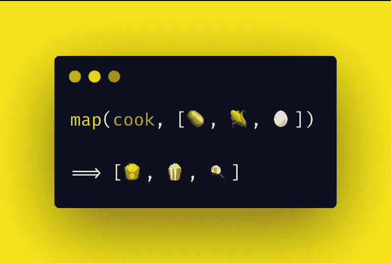

# 构建您自己的地图

> 原文：<https://betterprogramming.pub/build-your-own-map-b9a0c9d6fbab>

## 为了更好地理解它

[捕捉人心的照片。](https://unsplash.com/@dead____artist?utm_source=medium&utm_medium=referral) on [Unsplash](https://unsplash.com?utm_source=medium&utm_medium=referral) 。

映射是使用映射器函数将元素数组转换为新数组的过程。它形成了一个[多对多关联](https://en.wikipedia.org/wiki/Many-to-many_(data_model))，并且您将获得与您最初提供的数据长度相同的数据。

请看下图。它使用带有[声明性方法](https://en.wikipedia.org/wiki/Declarative_programming)的映射过程。我们并不指定*如何*进行映射，而是*用做什么。我们只是提供了[🥔,🌽,🥚]和映射器函数`cook`，让`map`处理对它们的迭代，并对每个函数应用映射器函数。最后，它将返回新的数组[🍟,🍿,🍳].*

作者照片(灵感来自 [Overflowjs](https://overflowjs.com) )。

说到映射，我们有几个选择(声明式和命令式方法)。

# For 循环

我们可以使用简单的 [for 循环](https://developer.mozilla.org/en-US/docs/Web/JavaScript/Reference/Statements/for)来迭代数组元素:

如您所见，索引跟踪、初始化以及将结果推送到数组的工作由我们来完成。这是[命令式编程](https://en.wikipedia.org/wiki/Imperative_programming)的一个明显例子，它告诉计算机我们想要如何使用一步一步的过程来实现某件事情。

# 为每一个

另一个选项是 [forEach](https://developer.mozilla.org/en-US/docs/Web/JavaScript/Reference/Global_Objects/Array/forEach) ，它遍历数组中的每个元素:

感觉好点了，对吧？我们不再需要跟踪元素索引。但是我们同意在函数范围之外改变一个项目，在这个例子中是`result`，是不理想的。如果我们能进一步抽象这一点，那就太好了。

原生 JavaScript 映射是更好的选择。

# 原生 JS 映射

我们用 JavaScript 的[原生映射方法](https://developer.mozilla.org/en-US/docs/Web/JavaScript/Reference/Global_Objects/Array/map)。我们需要的只是一个数据数组和一个映射函数。将获得一个数组，并迭代数组中的每个元素，同时对它们应用映射函数。最后，这将返回一个长度相同的转换后的数组。

就可读性而言，这比像 forEach 的[或 loop](https://developer.mozilla.org/en-US/docs/Web/JavaScript/Reference/Global_Objects/Array/forEach) 的[要好得多。然而，](https://developer.mozilla.org/en-US/docs/Web/JavaScript/Reference/Statements/for)[性能](https://github.com/dg92/Performance-Analysis-JS)是决定选择哪个选项的一个非常关键的因素。

# 构建映射函数

现在到了有趣的部分。您知道构建一个映射函数并没有那么难吗？让我们来看看实际情况。

## 自带地图功能(用于循环版本)

在这个例子中，我们抽象出索引跟踪并初始化一个起始数组。我们需要传递的只是一个映射函数和一个项目数组，我们已经准备好了。

## 自带地图功能(递归版本)

构建 map 函数的递归版本是一件有趣的事情。但是它是如何工作的呢？

我们仍然将映射器函数和数组传递给该函数，但是我们使用 [ES6 析构赋值](https://developer.mozilla.org/en-US/docs/Web/JavaScript/Reference/Operators/Destructuring_assignment)将数组分成两个参数，称为`head`和`tail`。

使用这种方法，我们希望采取一步一步的方法，递归地对每个数组元素执行映射函数。在这个过程中，我们使用[扩展语法](https://developer.mozilla.org/en-US/docs/Web/JavaScript/Reference/Operators/Spread_syntax)将每个`MapRecursive`调用的结果与映射的`fn(head)`的结果连接起来。

这一直持续到`head`变成`undefined`，意味着数组中不再有元素。这时我们从`line 8`上显示的递归函数中退出，然后开始返回新的转换后的数组。

## 自带地图功能(生成器版本)

你也可以使用[生成器函数](https://developer.mozilla.org/en-US/docs/Web/JavaScript/Reference/Statements/function*)来构建一个地图函数。这不是处理映射的理想方式，并且不能给出与前面例子相同的结果，因为生成器函数返回一个迭代器对象。这仅仅是教育性的，也是为了看看类似的概念如何应用于生成器函数。

您可以在下面的评论部分看到调用`MapGenerator`的最终结果是什么样的:

# 参考

*   [https://www . freecodecamp . org/news/implement-array-map-with-recursion-35976d 0325 b 2/](https://www.freecodecamp.org/news/implement-array-map-with-recursion-35976d0325b2/)
*   [https://www . digital ocean . com/community/tutorials/list-processing-with-map-filter-and-reduce](https://www.digitalocean.com/community/tutorials/list-processing-with-map-filter-and-reduce)