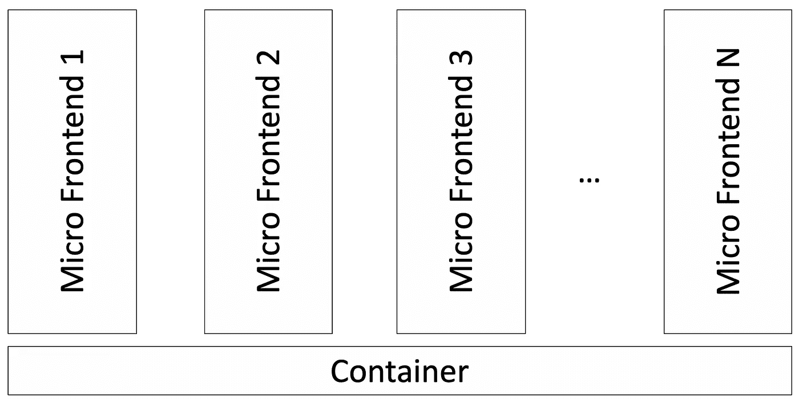
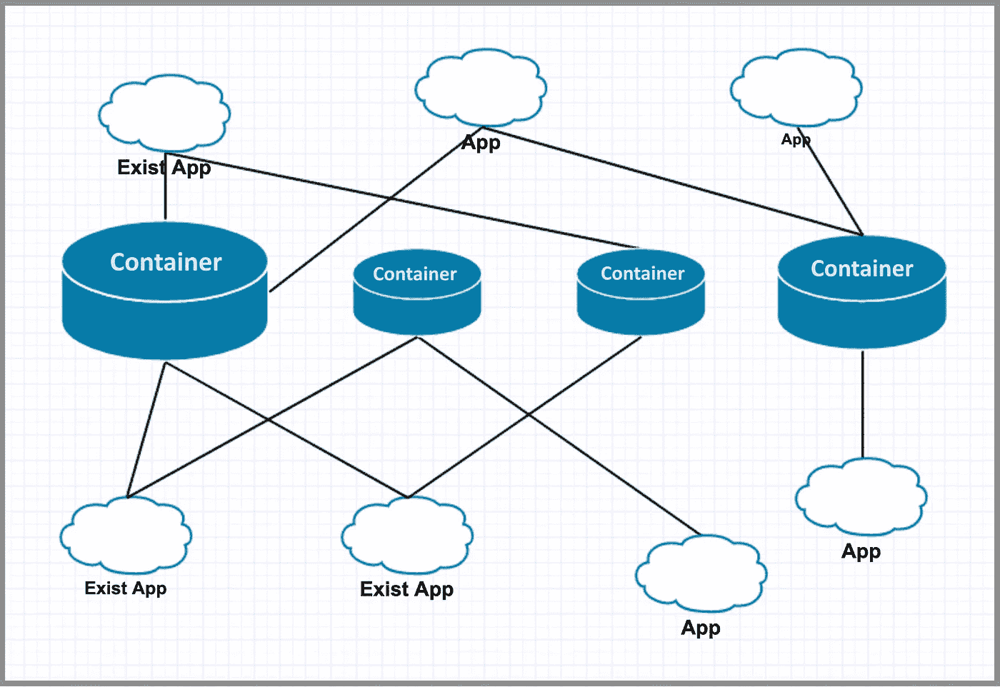
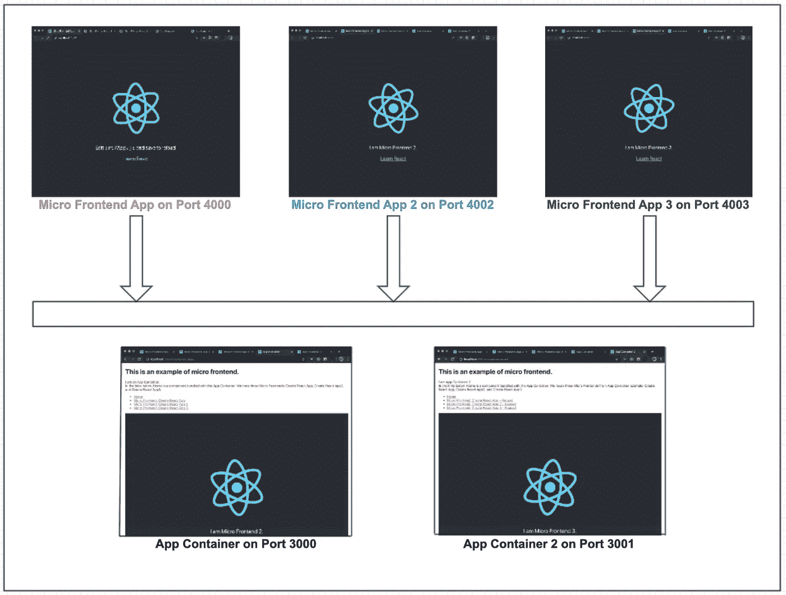
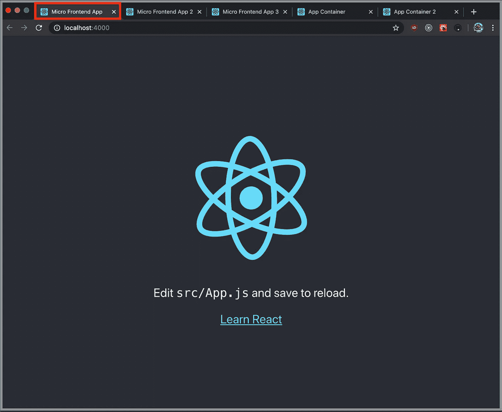
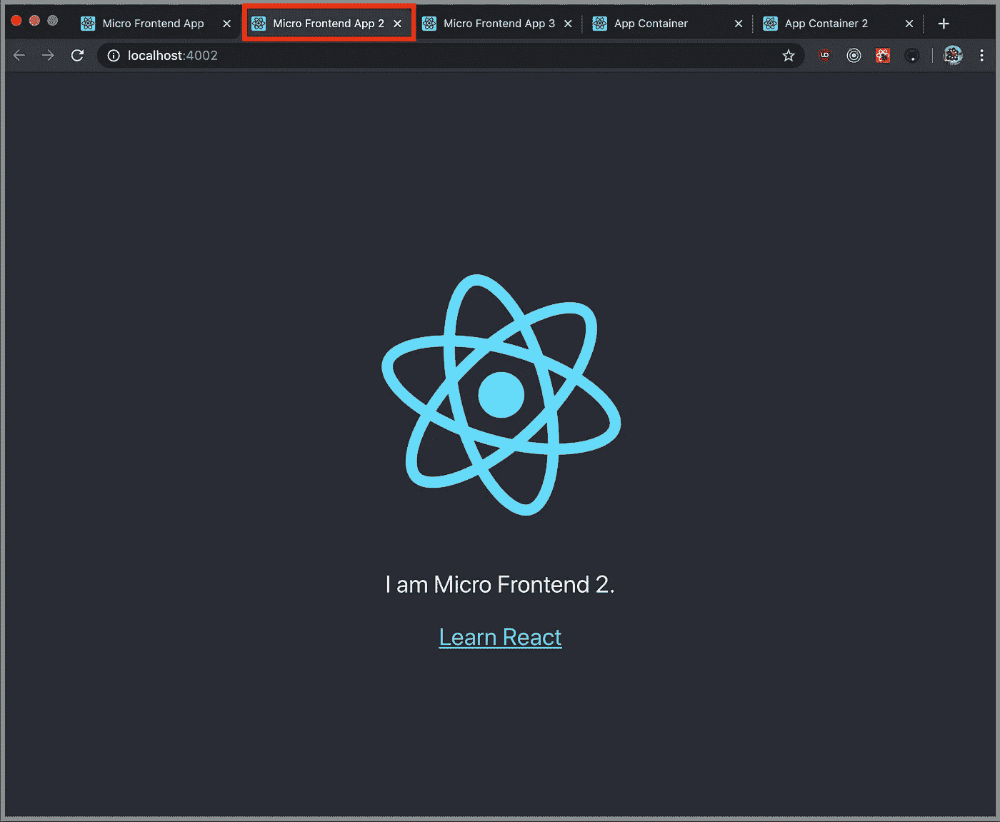
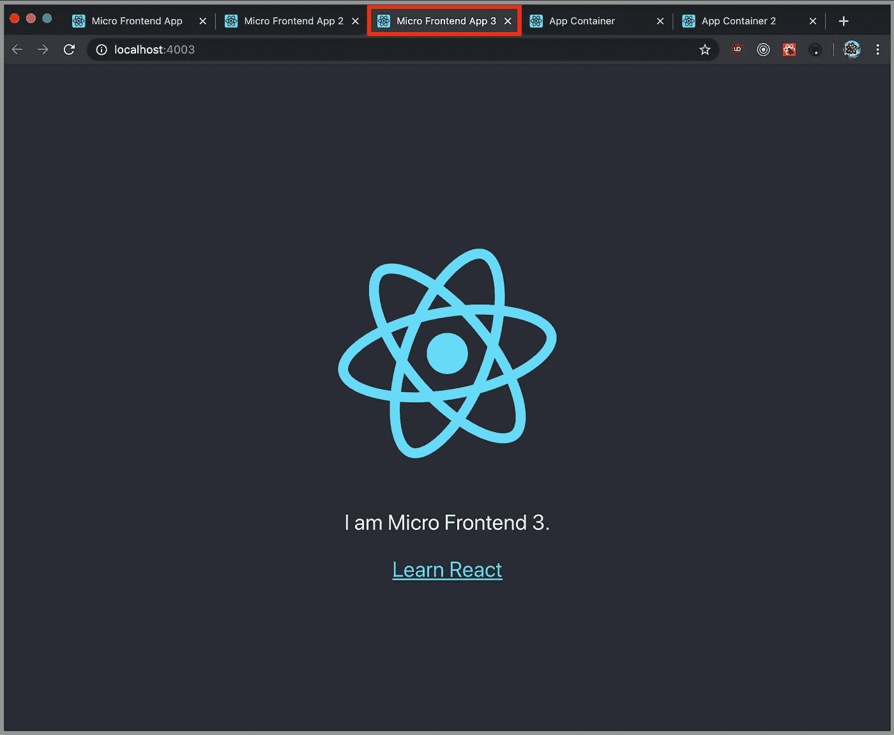
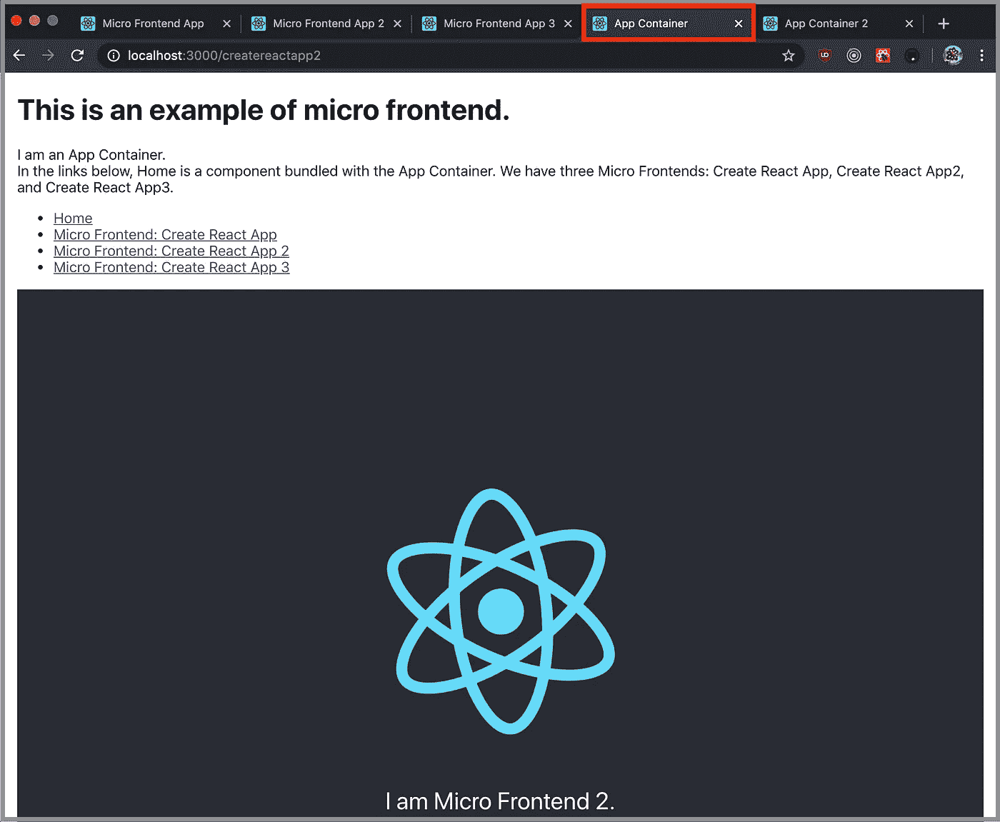
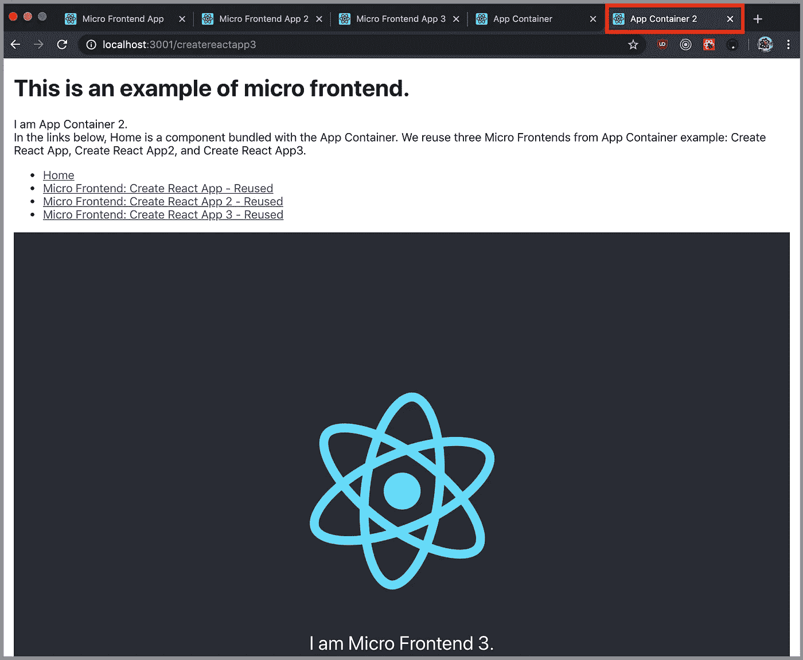

# 构建自己的微前端生态系统

> 原文：<https://betterprogramming.pub/build-your-own-micro-frontend-ecosystem-a05128c74f99>

## 开始使用微前端，这是一种运行多个应用程序的新方法，就像运行一个应用程序一样



微前端架构是一种设计方法。它将一个单片应用模块化为多个独立的较小应用，这些应用被称为*微前端*。微前端*T3 也可以拼成*微前端、微前端、微前端、*或*微前端。**

微前端方法的目标是去耦。它允许每个微前端独立实现、测试、升级、更新和部署。一个瘦的微前端容器启动多个微前端。

我们发表了两篇文章:

*   [“将随机 React 应用转变为微前端的 5 个步骤](https://medium.com/better-programming/5-steps-to-turn-a-random-react-application-into-a-micro-frontend-946718c147e7)”
*   [“将随机 React 应用程序转变为微前端容器的 3 个步骤](https://medium.com/better-programming/3-steps-to-turn-a-random-react-application-into-a-micro-frontend-container-a80e33b6a066)”

完成这两项工作后，我们对微前端及其容器的工作方式有了更深入的了解。我们不再将容器视为由微前端打包或捆绑的单个应用程序。我们提出了一个新的术语，*微前端生态系统*，并提供了一个演示。

在云或内部环境中，有多个容器在运行。微前端容器也叫*应用容器*或 *app 容器。*它们可以是薄的容器，也可以是厚的、现有的应用程序转换的容器。这些容器按需启动其他微前端。同时，有多个微前端在运行。它们也被称为*微前端应用。*它们可以是作为微前端编写的新应用程序，也可以是现有应用程序转换的微前端。

每个微前端可以同时服务多个容器。同时，每个容器在这个生态系统中挑选一些微前端来构造一个特定的 UI。利用生态系统中可用的构建模块(微前端)，我们加快了开发多功能 ui 的过程。



# 演示



以上是我们演示的测试平台。有三个微前端应用程序和两个应用程序容器。微前端应用在[这个库](https://github.com/JenniferFuBook/micro-frontend)中被捕获，应用容器在[这个库](https://github.com/JenniferFuBook/app-container)中被捕获。

以下是如何运行演示的步骤:

## **1。创建一个目录来存放演示文件**

```
$ mkdir ~/demo
```

## 2.在端口 4000 上安装第一个微前端

```
$ cd ~/demo
$ git clone https://github.com/JenniferFuBook/micro-frontend.git
$ cd micro-frontend
$ npm i
$ npm start
```

该步骤可以通过在端口`4000`上运行`Micro Frontend App`来验证。



## 3.在端口 4002 上安装第二个微前端

```
$ cd ~/demo
$ git clone --single-branch --branch microfrontend2 https://github.com/JenniferFuBook/micro-frontend.git micro-frontend2
$ cd micro-frontend2
$ npm i
$ npm start
```

该步骤可以通过在端口`4002`上运行`Micro Frontend App 2`来验证。



## 4.在端口 4003 上安装第三个微前端

```
$ cd ~/demo
$ git clone --single-branch --branch microfrontend3 https://github.com/JenniferFuBook/micro-frontend.git micro-frontend3
$ cd micro-frontend3
$ npm i
$ npm start
```

该步骤可以通过在端口`4003`上运行`Micro Frontend App 3`来验证。



## 5.在端口 3000 上安装第一个应用程序容器

```
$ cd ~/demo
$ git clone --single-branch --branch original https://github.com/JenniferFuBook/app-container.git
$ cd app-container
$ npm i
$ npm start
```

该步骤可以通过在端口`3000`上运行`App Container`来验证。



确保所有链接都工作正常:

*   `Home`路线显示了属于`App Container`一部分的普通组件
*   原图`Create React App`显示了路由`createreactapp`上的微前端应用
*   `Create React App 2`显示了路由`createreactapp2`上的微前端应用。
*   `Create React App 3`显示了路由`createreactapp3`上的微前端应用。

## 6.在端口 3001 上安装第二个应用程序容器

```
$ cd ~/demo
$ git clone --single-branch --branch container2 https://github.com/JenniferFuBook/app-container.git app-container2
$ cd app-container2
$ npm i
$ npm start
```

该步骤可以通过在端口`3001`上运行`App Container 2`来验证。



确保所有链接都工作正常:

*   `Home`路线显示了属于`App Container`一部分的普通组件
*   最初的`Create React App`展示了`createreactapp`路线上的一个微前端应用。这个微前端是和`App Container`共用的。
*   `Create React App 2`显示了路由`createreactapp2`上的微前端应用。这个微前端是和`App Container`共用的。
*   `Create React App 3`显示了路由`createreactapp3`上的微前端应用。这个微前端是和`App Container`共用的。

## 7.在一个命令中启动整个演示

此时，该演示将两个应用程序容器作为独立的 UI 应用程序运行。它们共享生态系统中运行的三个微前端应用程序。

正如我们在第二篇文章中提到的,`[concurrently](http://micro front-end)`命令可以用来在一个命令中启动整个演示。

在 Bash 配置文件中设置以下别名:

```
alias   runDemo='cd ~/demo/app-container; concurrently "npm start --prefix ~/demo/micro-frontend" "npm start --prefix ~/demo/micro-frontend2" "npm start --prefix ~/demo/micro-frontend3" "npm start --prefix ~/demo/app-container2" "npm start"'
```

`runDemo`将在一个命令中启动一切。这样，我们在生态系统中启动了多个应用程序。

# 结论

我们基于 [Cam Jackson](https://camjackson.net/) 的[算法](https://github.com/micro-frontends-demo/container/blob/master/src/MicroFrontend.js)构建了这个演示。容器和微前端之间的契约是两个接口:`render`函数和`unmount`函数。细节在前两篇文章中有解释。

在微前端生态系统中，每个微前端充当内容服务器，它将其`[manifest](https://github.com/facebook/create-react-app/issues/6436)` [文件](https://github.com/facebook/create-react-app/issues/6436)提供给请求容器。共享模式是在源代码级别。容器从微前端加载源代码，并通过脚本标签创建新的实例。虽然这个演示是通过源代码共享实现的，但是这个架构可以扩展到不同级别的共享。

这项工作的一部分是由乔纳森马贡献。

感谢阅读。我希望这有所帮助。

这是一个关于微前端的系列。以下是其他文章的列表:

*   [“将随机 React 应用转变为微前端的 5 个步骤](https://medium.com/better-programming/5-steps-to-turn-a-random-react-application-into-a-micro-frontend-946718c147e7)”
*   [“将随机 React 应用程序转变为微前端容器的 3 个步骤](https://medium.com/better-programming/3-steps-to-turn-a-random-react-application-into-a-micro-frontend-container-a80e33b6a066)
*   "[你不必失去对微前端的优化](https://medium.com/better-programming/you-dont-have-to-lose-optimization-for-micro-frontends-60a63d5f94fe)"
*   "[微前端方法的 10 个决策点](https://medium.com/better-programming/10-decision-points-for-micro-frontends-approach-4ebb4b59f40)"
*   "[创建多版本 React 应用程序的 6 个步骤](https://medium.com/better-programming/6-steps-to-create-a-multi-version-react-application-1c3e5b5df7e9)"
*   "[使用 Webpack 5 模块联盟的微前端](https://medium.com/better-programming/micro-frontends-using-webpack-5-module-federation-3b97ffb22a0d)"