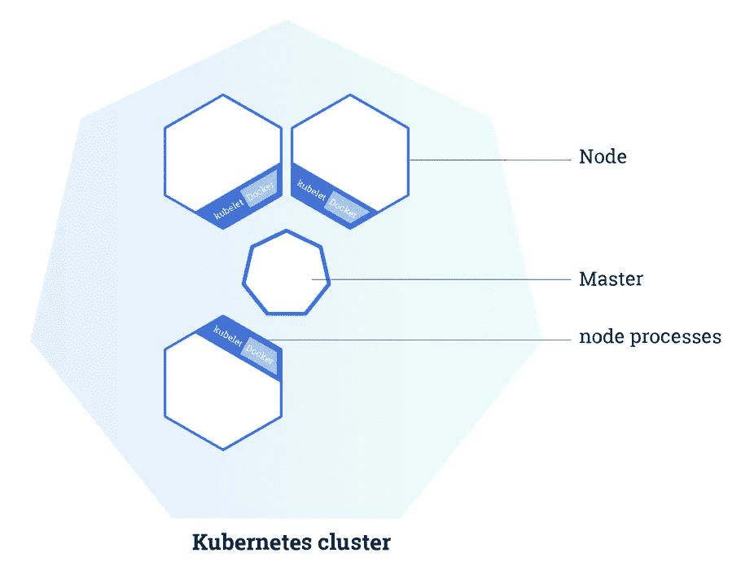
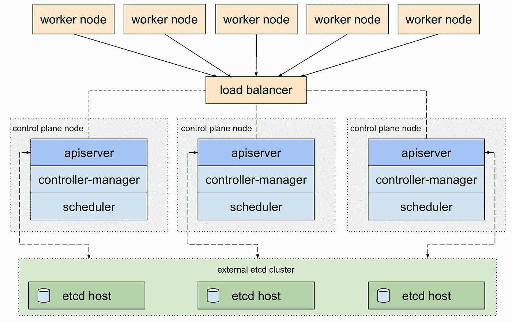
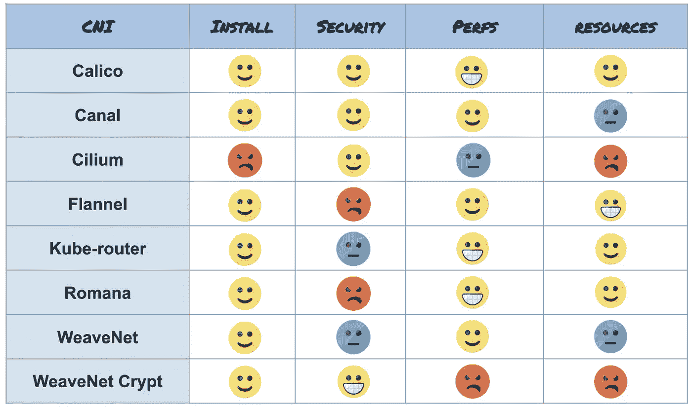
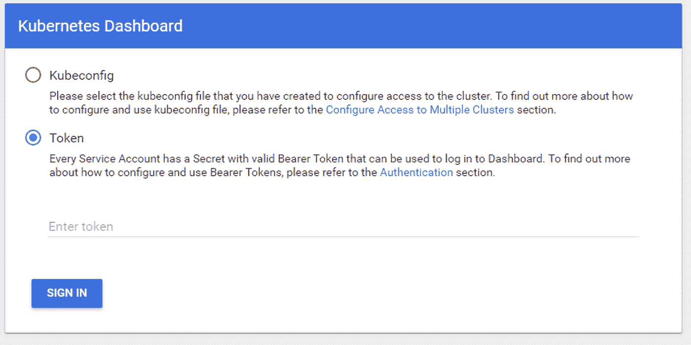
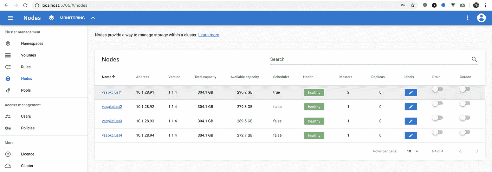
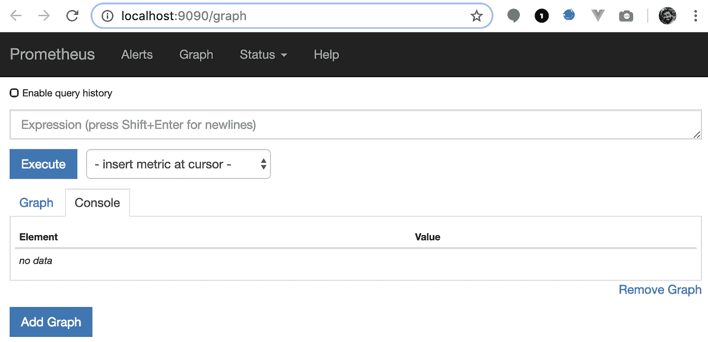
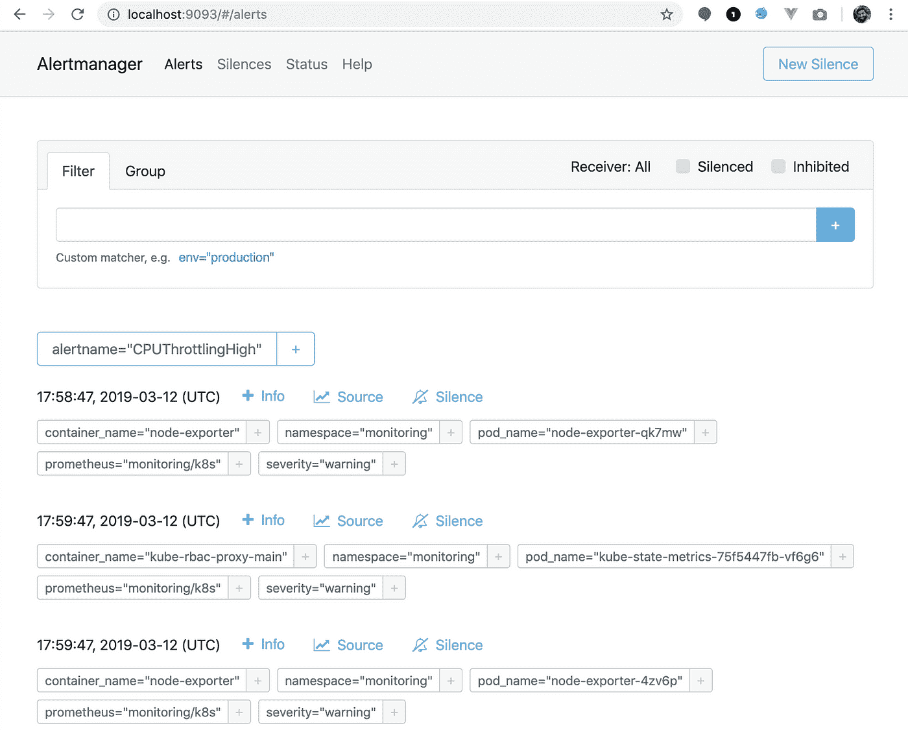
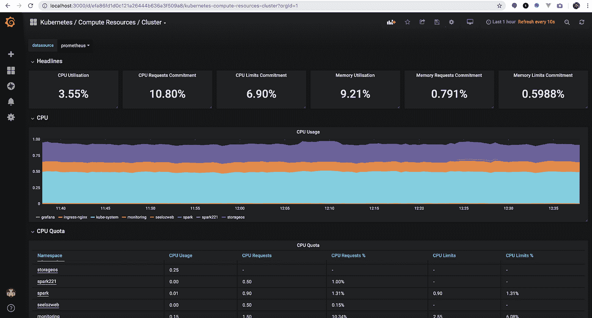

# 构建您自己的带监控的多节点 Kubernetes 集群

> 原文：<https://betterprogramming.pub/build-your-own-multi-node-kubernetes-cluster-with-monitoring-346a7e2ef6e2>

## 使用 Grafana monitoring 从头开始构建您自己的多节点 Kubernetes 集群(BYOC)。


斯科特·韦伯在 [Unsplash](https://unsplash.com/s/photos/cluster?utm_source=unsplash&utm_medium=referral&utm_content=creditCopyText) 上拍摄的照片

在 [Seeloz](https://seeloz.com) ，我们正在构建人工智能，以减少供应链管理中的浪费和低效。我们最近开始探索将我们的大数据管道迁移到 Kubernetes。虽然我们强烈建议一家初创公司使用托管的 Kubernetes 解决方案，但我们已经获得了几个强大的非云虚拟机的访问权限，我们希望加以利用。

在本文中，我们将带您从头开始构建自己的多节点 Kubernetes 集群(BYOC)，包括为您的集群设置网络(通过 [Calico](https://github.com/projectcalico/calico/) )和存储卷(通过 [StorageOS](https://storageos.com) )。我们还将设置用于可视化编排的 Kubernetes 仪表盘、 [helm](https://helm.sh) /tiller 来帮助我们部署预打包的解决方案，以及 [Prometheus](https://prometheus.io) 和 [Grafana](https://grafana.com/) 来显示您的集群的详细实时监控和警报。

如果您想了解 Kubernetes 的更多信息，以及它能为您做什么，请查看它们的官方文档:

[](https://kubernetes.io/docs/concepts/overview/what-is-kubernetes/) [## 什么是 Kubernetes？

### Kubernetes 是一个可移植、可扩展的开源平台，用于管理容器化的工作流和服务。

kubernetes.io](https://kubernetes.io/docs/concepts/overview/what-is-kubernetes/) 

# 集群设计注意事项

## 集群拓扑和节点数量

您需要做出的第一个决定是您希望构建的集群拓扑类型。最简单的选项只需要一个节点，而可用性最高的拓扑至少需要九个节点。您的决定将基于各种因素，从可用的节点数量到预算限制。您有以下选择:

*   **单节点集群** 不建议为生产构建单节点 Kubernetes，例如使用 [MiniKube](https://kubernetes.io/docs/setup/minikube/) 。使用 Kubernetes 的一个重要原因是它处理节点故障的能力，因此构建单节点集群就失去了使用 Kubernetes 的意义。如果您主要想获得容器化的诸多好处，可以考虑只在您的节点或虚拟机上安装 Docker，然后使用[重启策略](https://docs.docker.com/engine/reference/run/#restart-policies---restart)运行您的服务。
*   **单主机、多节点集群** 这是我们在这篇文章中要关注的内容。这意味着我们将有一个单独的 Kubernetes 主节点运行在一个节点上，然后有三个或更多的从节点(又名 *Minions* )，总共最少有四个节点:



*   **HA(高可用)集群**
    这里有两种选择:堆叠 etcd 和外部 etcd。对于堆叠方法，您至少需要六个节点(三个节点用于控制平面，至少三个节点用于您的爪牙)。对于外部 etcd 方法，您至少需要九个节点。你可以在这里读到更多关于他们的信息:[https://kubernetes.io/docs/setup/independent/ha-topology/](https://kubernetes.io/docs/setup/independent/ha-topology/)



在这一部分中，我们将构建一个单主节点、多节点集群，其中有一个主节点和三个或更多的从节点。

# 节点规格

根据官方文档([链接](https://kubernetes.io/docs/setup/independent/create-cluster-kubeadm/#before-you-begin))，集群中的每个节点至少应该有两个 CPU 和 2 GB 的 RAM。但是根据您打算在节点上运行什么，您可能需要更多。您还必须至少拥有 Ubuntu 16.04.6 LTS 或 CentOS 7.5+(某些附加软件的最低要求)。然而，我们强烈推荐使用 Ubuntu 18.04.2 LTS 版，因为它有更新的 Linux 内核版本 4.15(你也可以考虑非 LTS 的 Ubuntu 18.10，它有来自[内核 4.18](https://kernelnewbies.org/Linux_4.18) 的最新容器化改进)。较新的 Linux 内核包含增强功能，以更好地支持容器世界，这个世界在 6 年前内核 3.10 发布时并不存在，CentOS 7.x 使用的就是这种形式。话虽如此，本指南是针对使用 CentOS 7.6 的节点编写的，因为这是虚拟机上提供给我们的版本。指令的主要区别在于使用 apt-get 而不是 yum。

# 建立工作关系网

你要做的下一个最重要的决定是决定你将使用什么样的网络解决方案。在做出这个决定之前，您甚至不能启动 Kubernetes 集群。不幸的是，这令人困惑，因为有很长的列表可供选择，而且没有默认的或推荐的列表。虽然有许多官方选项可供选择，但似乎最受欢迎的是印花布、法兰绒和编织网。我们找到了一篇很棒的文章来帮助你做决定:

[](https://itnext.io/benchmark-results-of-kubernetes-network-plugins-cni-over-10gbit-s-network-36475925a560) [## Kubernetes 网络插件(CNI)在 10Gbit/s 网络上的基准测试结果

### Kubernetes 是一个很棒的集装箱装配工。但是它不管理点对点通信网络。这是…

itnext.io](https://itnext.io/benchmark-results-of-kubernetes-network-plugins-cni-over-10gbit-s-network-36475925a560) 

在本文的最后，作者得出结论，最好的整体网络解决方案是 *Calico，*它不仅具有出色的性能，还具有良好的安全性、资源利用率和安装体验。本指南将向您展示如何将 Calico 设置为 Kubernetes 的网络层。

# 存储卷

最后，为了拥有一个可用的 Kubernetes 集群，您必须设置一个持久存储类。同样，有一长串选项可供选择([链接](https://kubernetes.io/docs/concepts/storage/#types-of-volumes))。当我们浏览列表时，我们发现每个选项都有自己的一组约束。例如，如果我们想使用`gcePersistentDisk`选项，我们只能在运行我的集群的节点是 Google Cloud 虚拟机的情况下这样做。同时，Kubernetes 强烈反对使用更简单的本地节点存储选项`HostPath`:

> 主机路径(仅单节点测试—本地存储不受任何支持，在多节点群集中不起作用)

浏览所有选项后，最适合我们用例的选项如下:

*   `[Glusterfs](https://docs.gluster.org/en/latest/)`
    这是一个流行的免费选项，可以将你可能有的任何存储挂载转化为你的 pods 可以使用的分布式文件系统。
*   `[StorageOS](https://storageos.com)`
    该选项最高可免费使用 500 GB，但比`Glusterfs`或`Portworx`更易于设置和使用。StorageOS 的主要问题是缺乏对`ReadWriteMany`策略的支持，这意味着您不能让多个 pod 对同一底层存储进行写访问。
*   这似乎是另一个不错的选择。但是，它需要在虚拟机上运行几个服务，这是我们希望避免的，而且通常有点繁重。

在本指南中，我们将使用`StorageOS`作为我们的存储卷解决方案，主要是为了简单起见。

# 设置集群

下面是您应该在集群中的每个节点上运行的命令。请注意，这些说明假设您有一个 CentOS 7+节点。Ubuntu 指令大部分是相似的，当然，除了你必须使用 apt-get 而不是 yum。另外一些`kubeadm`的安装说明也有点不同，你可以在这里找到:[链接](https://kubernetes.io/docs/setup/independent/install-kubeadm/)。

您应该能够在不做任何更改的情况下将以下内容复制粘贴到一个`CentOS`节点上:

```
**sudo** -i                 # Become root
**sudo** yum update -y      # Update all packages*# Install the yum-config-manager and add the repo to install docker* **sudo** yum install -y yum-utils device-mapper-persistent-data lvm2
**sudo** yum-config-manager --add-repo [https://download.docker.com/linux/centos/docker-ce.repo](https://download.docker.com/linux/centos/docker-ce.repo)

*# Configure iptables for Kubernetes* **cat** <<EOF >  /etc/sysctl.d/k8s.conf
net.bridge.bridge-nf-call-ip6tables = 1
net.bridge.bridge-nf-call-iptables = 1
EOF
**sysctl** --system

# Add the kubernetes repo needed to find the kubelet, kubeadm and **kubectl** packages
**cat** <<EOF > /etc/yum.repos.d/kubernetes.repo
[kubernetes]
name=Kubernetes
baseurl=[https://packages.cloud.google.com/yum/repos/kubernetes-el7-x86_64](https://packages.cloud.google.com/yum/repos/kubernetes-el7-x86_64)
enabled=1
gpgcheck=1
repo_gpgcheck=1
gpgkey=[https://packages.cloud.google.com/yum/doc/yum-key.gpg](https://packages.cloud.google.com/yum/doc/yum-key.gpg) [https://packages.cloud.google.com/yum/doc/rpm-package-key.gpg](https://packages.cloud.google.com/yum/doc/rpm-package-key.gpg)
exclude=kube*
EOF

# Set SELinux in permissive mode (effectively disabling it)
**setenforce** 0
**sed** -i 's/^SELINUX=enforcing$/SELINUX=permissive/' /etc/selinux/config

# Turn off the swap: Required for Kubernetes to work
**sudo** swapoff -a

# Install Kubernetes and Docker
**sudo** yum install -y kubelet kubeadm kubectl --disableexcludes=kubernetes docker-ce docker-ce-cli containerd.io

# Start Docker
**sudo** systemctl enable --now docker

# Start Kubernetes
**systemctl** enable --now kubelet
```

## 主节点的附加说明

```
*# Make sure you are NOT root for these commands! But it must be a sudoer user.**# For sanity, just disable the entire firewall until you've figured out exactly what services you'll want to install.* **systemctl** disable firewalld --now # Disable the firewall*# Start kubeadm*
**sudo** kubeadm init --pod-network-cidr=192.168.0.0/16*### NOTE THE OUTPUT: It has the token you need to add workers!!! ###*
```

运行上面的命令后，在您的输出中，您应该会看到以“kubeadm join”开头的一行。复制这一行—稍后您将需要它来向集群添加节点。

## 安装 Pod 网络(Calico)

接下来，我们需要在 Kubernetes master 上安装一个 Pod 网络。如前所述，我们将使用印花棉布。以下是在您的 Kubernetes 主机上运行以安装 Calico 的命令(来自他们的[快速入门](https://docs.projectcalico.org/v3.5/getting-started/kubernetes/)):

```
**kubectl** apply -f [https://docs.projectcalico.org/v3.5/getting-started/kubernetes/installation/hosted/etcd.yaml](https://docs.projectcalico.org/v3.5/getting-started/kubernetes/installation/hosted/etcd.yaml)**kubectl** apply -f [https://docs.projectcalico.org/v3.5/getting-started/kubernetes/installation/hosted/calico.yaml](https://docs.projectcalico.org/v3.5/getting-started/kubernetes/installation/hosted/calico.yaml)
```

## 安装 Kubernetes 仪表板

```
*# Install the K8s dashboard* **kubectl** create -f [https://raw.githubusercontent.com/kubernetes/dashboard/master/aio/deploy/recommended/kubernetes-dashboard.yaml](https://raw.githubusercontent.com/kubernetes/dashboard/master/aio/deploy/recommended/kubernetes-dashboard.yaml)*# Create an admin account called k8s-admin***kubectl** --namespace kube-system create serviceaccount k8s-admin
**kubectl** create clusterrolebinding k8s-admin --serviceaccount=kube-system:k8s-admin --clusterrole=cluster-admin
```

# 在您的笔记本电脑/工作站上安装 kubectl

## 马科斯

```
**brew** install kubernetes-cli
```

## 人的本质

```
**sudo** apt-get update && sudo apt-get install -y apt-transport-https
curl -s [https://packages.cloud.google.com/apt/doc/apt-key.gpg](https://packages.cloud.google.com/apt/doc/apt-key.gpg) | sudo apt-key add -
**echo** "deb [https://apt.kubernetes.io/](https://apt.kubernetes.io/) kubernetes-xenial main" | sudo tee -a /etc/apt/sources.list.d/kubernetes.list
**sudo** apt-get update
**sudo** apt-get install -y kubectl
```

## CentOS

```
**cat** <<EOF > /etc/yum.repos.d/kubernetes.repo
*[kubernetes]
name=Kubernetes
baseurl=*[*https://packages.cloud.google.com/yum/repos/kubernetes-el7-x86_64*](https://packages.cloud.google.com/yum/repos/kubernetes-el7-x86_64) *enabled=1
gpgcheck=1
repo_gpgcheck=1
gpgkey=*[*https://packages.cloud.google.com/yum/doc/yum-key.gpg*](https://packages.cloud.google.com/yum/doc/yum-key.gpg)[*https://packages.cloud.google.com/yum/doc/rpm-package-key.gpg*](https://packages.cloud.google.com/yum/doc/rpm-package-key.gpg) *EOF*
**yum** install -y kubectl
```

## 设置工作站的代理

在你的笔记本电脑上创建一个`~/.kube`目录，然后将 k8s (Kubernetes)主文件中的`~/.kube/config`文件压缩到你的`~/.kube`目录中。

然后获取连接到仪表板所需的身份验证令牌:

```
**kubectl** -n kube-system describe secret $(kubectl -n kube-system get secret | grep k8s-admin | awk '{print $1}')
```

将此令牌存储在安全但容易获取的地方；您将(经常)需要它来访问 Kubernetes 仪表板。现在启动代理:

```
**kubectl** proxy
```

现在，转到
[打开仪表板:http://localhost:8001/API/v1/namespaces/kube-system/services/https:kubernetes-dashboard:/proxy/](http://localhost:8001/api/v1/namespaces/kube-system/services/https:kubernetes-dashboard:/proxy/)



您应该会看到上面的对话框。选择“令牌”,然后复制粘贴上一步中的令牌并登录。希望这是一次成功！

# 设置您的 Minion 节点

```
*# Setup your firewall settings**#****sudo*** *firewall-cmd --zone=public --add-port=10250/tcp --permanent        # Kubelet API
#****sudo*** *firewall-cmd --zone=public --add-port=30000-32767/tcp --permanent  # NodePort Services
#****sudo*** *firewall-cmd --reload**# For sanity, we'll just disable the firewall. Once you know exactly what services you want you can expose desired ports via firewall-cmd.* **systemctl** disable firewalld --now   # Disable the firewall

*# Now paste the kubeadm join command from the kubeadm init command on master*
**sudo** kubeadm join <master-cluster-ip>:6443 --token <something.token> --discovery-token-ca-cert-hash sha256:<hash>
```

请注意，init 命令的 join 命令输出会过期。如果您遇到了这种情况，您可以重新生成一个新的 join 命令，方法是转到您的 k8s master 并键入以下命令:

```
**sudo** kubeadm token create --print-join-command
```

对要添加到群集的每个节点重复上述步骤。请注意，join 命令对于每个节点都是相同的。

# 安装舵

Helm 就像是 Kubernetes 的包装经理。它将允许您将一组预打包的 Kubernetes 对象部署为一个集合，然后您甚至可以轻松地删除名称集合。例如，我们将使用 helm 来安装 StorageOS。要安装 helm，只需在您的工作站上运行以下命令:

## 马科斯

```
**brew** install kubernetes-helm
**helm** init
```

## Linux 操作系统

头盔的卡扣包由[卡扣师](https://github.com/snapcrafters/helm)维护。

```
**sudo** snap install helm --classic
```

# 安装存储

我们将使用头盔安装`storageos`。在下面的命令中，用每个节点的`hostnames`替换`node1–3`:

```
**helm** install storageos/storageos --name=storageos --namespace=storageos --set cluster.join="***node1***\,***node2***\,***node3***"
ClusterIP=$(kubectl get svc/storageos --namespace storageos -o custom-columns=IP:spec.clusterIP --no-headers=true)
ApiAddress=$(echo -n "tcp://$ClusterIP:5705" | base64)
kubectl patch secret/storageos-api --namespace storageos --patch "{\"data\": {\"apiAddress\": \"$ApiAddress\"}}"
```

现在我们需要基于`StorageOS`创建一个新的 Kubernetes `StorageClass`，我们将把它用于我们所有的`PersistentVolume`对象。对于这一个，让我们使用 Kubernetes 仪表板来看看我们如何通过它来部署对象:

启动您的代理:

```
**kubectl** proxy
```

转到[http://localhost:8001/API/v1/namespaces/kube-system/services/https:kubernetes-dashboard:/proxy](http://localhost:8001/api/v1/namespaces/kube-system/services/https:kubernetes-dashboard:/proxy)。如果您最近没有登录，您将再次看到以下屏幕:


再次复制粘贴您之前保存的令牌。如果您丢失了它，只需再次运行以下命令:

```
**kubectl** -n kube-system describe secret $(kubectl -n kube-system get secret | grep k8s-admin | awk '{print $1}')
```

登录后，按下仪表板右上角的“+ CREATE”按钮:


现在，在“从文本输入创建”屏幕中，输入以下内容，然后按“上传”按钮:

```
kind: StorageClass
apiVersion: storage.k8s.io/v1
metadata:
  name: fast
provisioner: kubernetes.io/storageos
parameters:
  pool: default
  description: Kubernetes volume
  fsType: ext4
  adminSecretNamespace: default
  adminSecretName: storageos-secret
```

请注意，在上面的`StorageClass`中，我称之为“快速”,因为我的集群上的存储系统都是固态硬盘。如果对你来说不是这样的，或者如果你有一个组合，最好为每种类型的存储创建一个`StorageClass`并适当地命名它。

最后，让我们回到终端，将我们创建的新`StorageClass`作为默认终端，这样需要存储类的后续部署就不必明确知道它:

```
**kubectl** patch storageclass fast -p '{"metadata":{"annotations":{"storageclass.kubernetes.io/is-default-class":"true"}}}'
```

这就完成了`StorageOS`的安装。还有一个`StorageOS`仪表板，您可以通过运行以下命令来访问它:

```
**kubectl** --namespace storageos port-forward svc/storageos 5705
```

现在只需访问 [http://localhost:5705](http://localhost:5705/) 。默认用户名和密码应为“storageos/storageos”:



就是这样！我们的集群现在可以使用了。接下来，我们将在新集群上部署一个监控解决方案。

# 设置集群监控

现在我们已经有了一个 Kubernetes 集群，我们需要一个好的监控系统。在本指南中，我们将使用 Prometheus 来收集所有指标，并使用 Grafana 来可视化它们。有一个名为 [prometheus-operator](https://github.com/coreos/prometheus-operator/tree/master/contrib/kube-prometheus) 的伟大项目，它不仅为我们提供 Grafana 和 prometheus，还为我们提供预先构建的仪表盘。首先克隆回购:

```
**git** clone [git@github.com](mailto:git@github.com):coreos/prometheus-operator.git
**cd** prometheus-operator/contrib/kube-prometheus
```

不幸的是，我发现我不得不稍微调整一下，以便保留我在 Grafana 中所做的任何更改的状态，比如添加用户或安装自定义插件。因此，在开始之前，我将为 Grafana 创建一个 PVC(持久卷声明)。将以下内容应用到您的集群(通过 yaml 文件或通过复制粘贴到 Kubernetes，如前所示):

```
kind: PersistentVolumeClaim
apiVersion: v1
metadata:
  name: grafana-pvc
spec:
  accessModes:
    - ReadWriteOnce
  volumeMode: Filesystem
  resources:
    requests:
      storage: 10Gi
```

您需要将下面的`initContainer`添加到 grafana 部署的 spec 部分(位于 contrib/kube-Prometheus/manifests/grafana-deployment . YAML):

```
initContainers:
  - name: "init-chown-data"
    image: "busybox:1.30.0"
    command: [
      "chown",
      "-R",
      "472:472",
      "/var/lib/grafana"
    ]
    resources:
    volumeMounts:
      - name: "grafana-storage"
        mountPath: /var/lib/grafana
```

然后在同一个文件的`volumes:`部分，对于`grafana-storage`它被定义为`emptyDir: {}`。我们需要将它改为指向我们创建的`grafana-pvc`:

```
volumes:
- persistentVolumeClaim:
    claimName: grafana-pvc
  name: grafana-storage
```

我还必须删除那个`grafana-deployment.yaml`文件的`securityContext`部分。

就是这样！现在，只需使用以下命令将其全部应用到 Kubernetes 中:

```
**kubectl** create -f manifests/
**sleep** 30
**kubectl** create -f manifests/
**kubectl** apply -f manifests/
**sleep** 30
**kubectl** apply -f manifests/
**kubectl** --namespace monitoring port-forward svc/prometheus-k8s 9090 &
**kubectl** --namespace monitoring port-forward svc/grafana 3000 &
**kubectl** --namespace monitoring port-forward svc/alertmanager-main 9093 &
```

上面那个脚本中的休眠是因为，根据它的文档，它说[*这个命令有时可能需要执行两次(以解决竞争情况)*](https://github.com/coreos/prometheus-operator/tree/master/contrib/kube-prometheus#quickstart)。

要访问 prometheus 仪表板，请访问 [http://localhost:9090](http://localhost:9090) :



要访问 alertmanager 仪表板，请访问 [http://localhost:9093](http://localhost:9093/) :



最后，也是最重要的，要访问 Grafana，请访问。默认用户名和密码应该是“admin/admin”。

在 Grafana 中，单击一个预先构建的仪表板，例如名为“Kubernetes/Compute Resources/Cluster”的仪表板:



Grafana 确实很漂亮，但更酷的是它有如此多的预建插件和仪表盘。一些插件的安装需要你去 Grafana 机器并把它们安装在插件文件夹中(由于我们通过`StorageOS`为 Grafana 创建的持久卷，我们现在可以做到这一点)。为此，您首先必须通过 Kubernetes 仪表板或运行以下程序找出 Grafana pod 的名称:

```
**kubectl** --namespace monitoring get pods
```

然后运行以下命令:

```
**kubectl** exec --namespace monitoring -t <pod_name> grafana-cli plugins install <plugin_name>
```

感谢阅读！