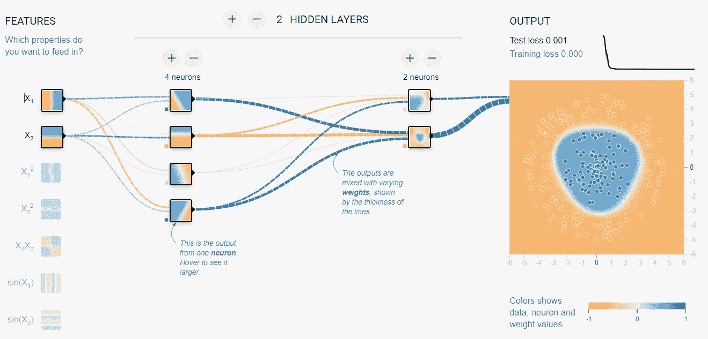

# 用 Python 和机器学习构建你自己的剽窃检查器

> 原文：<https://betterprogramming.pub/build-your-own-plagiarism-checker-with-python-and-machine-learning-7e81877fd970>

## 使用您的数据集训练一个模型来检测文本中的抄袭


来源: [Pexels](https://www.pexels.com/photo/letter-blocks-247819/)

# 介绍

Tensorflow 是一个非常强大的库，可以用来构建具有各种不同参数的神经网络。神经网络由输入层、隐藏层和输出层组成。这里有一张在 https://playground.tensorflow.org[的帮助下生成的图表，可以帮助你更好地理解它。](https://playground.tensorflow.org/)



神经网络。来源:T [ensorflow 游乐场](https://playground.tensorflow.org)。

我们需要的另一件事是自然语言工具包(NLTK ),用我们自己的文本准备数据集，以训练机器学习模型。机器学习模型不能只理解单词，所以我们必须从文本中标记出词根来训练模型。

## 输入:

输入将是一个只有一个“文本”列的 CSV 文件。我把它命名为`plagcheckfile.csv`文件。“文本”列的每一行都有不同的文本。这些文本可以是你想要的长度，不包含逗号或特殊符号。较长的文本将需要更多的历元来为模型提供更高的准确性。

# 创建 JSON 来训练模型

我们将从 CSV 文件创建一个 JSON，并使用它来训练和测试我们的模型。

首先，我们导入所需的包。

```
import pandas as pd
import numpy as np
import re
import json
import os
```

让我们获取当前工作目录的路径。

```
PATH = os.path.dirname(os.path.realpath(__file__))
```

让我们先创建一个函数来清除 CSV 文件中的文本。

接下来，从 CSV 文件中获取数据的函数。

它返回一个包含所有不同文本的字典。

现在，让我们将字典保存为一个文件。

# 创建机器学习模型

让我们创建另一个 python 文件来创建带有神经网络的机器学习模型。

首先，导入所有必需的包

```
import nltk
from nltk.stem.lancaster import LancasterStemmer 
import numpy
import tflearn
import json
import os
```

创建词干分析器函数，用于对单词进行词干分析。

```
stemmer = LancasterStemmer()
```

让我们初始化路径变量。

```
PATH = os.path.dirname(os.path.realpath(__file__))
```

让我们打开之前创建的字典。

```
with open(PATH + "\\file.txt") as file:
    dataset = json.load(file)
```

我们稍后将需要一些列表:

```
list_words = []
labels = []
docs_x = [] #List of all the question_patterns.
docs_y = [] #List of all the tags for specific Texts.
```

## 词干化和标记化

首先，让我们从字典中的文本中提取单词。

## 一袋单词

让我们建立单词袋。

创建单词包的函数。

## **构建神经网络**

## 检查文本是否抄袭的功能

现在，让我们调用 check 函数，我们就完成了！

```
check()
```

## 培养

培训的输出将如下所示:

```
Training Step: 1999  | total loss: 1.22456 | time: 0.035s
| Adam | epoch: 2000 | loss: 1.22456 - acc: 0.8818 -- iter: 152/160
Training Step: 2000  | total loss: 1.24915 | time: 0.037s
| Adam | epoch: 2000| loss: 1.24915 - acc: 0.8437 -- iter: 160/160
```

# 结论

这是一个简单的教程，演示了如何使用`tflearn`库来构建神经网络。剽窃检查器可能有很低的准确性，这取决于你在训练中使用了多少个纪元。还取决于训练中使用的文本长度。

它在商业上是不可用的。但是这个简单的教程应该给你神经网络、词干、标记化和自然语言处理的基本知识。

如果你觉得这篇文章有帮助，请查看我的 GitHub 简介以获得完整的源代码和其他项目。感谢阅读。