# 使用 Streamlit 构建您自己的 Pokedex Web 应用程序

> 原文：<https://betterprogramming.pub/build-your-own-pokedex-web-app-with-streamlit-10c550a98e22>

## 搜索，过滤和显示口袋妖怪统计数据，并确定类似的口袋妖怪

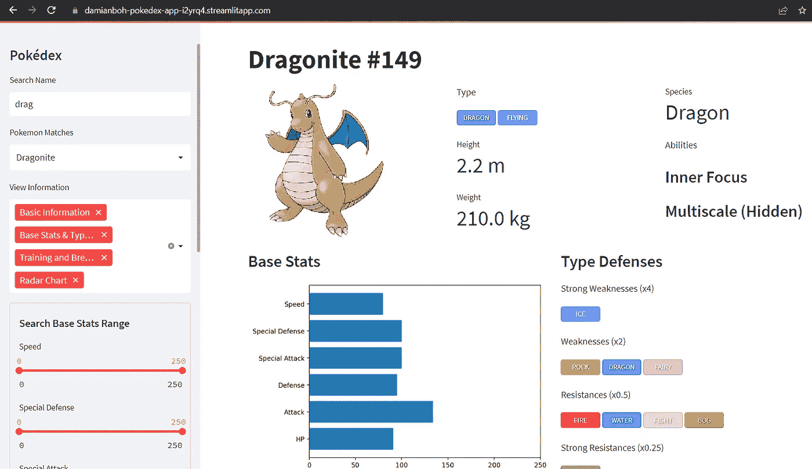

在本文中，我们将在 [Streamlit](https://streamlit.io/) 上构建一个 Pokedex web 应用程序(上面的截图)。最终产品部署在这里:[https://damianboh-pokedex-app-i2yrq4.streamlitapp.com/](https://damianboh-pokedex-app-i2yrq4.streamlitapp.com/)。

这个网络应用程序允许用户通过以下方式搜索口袋妖怪数据集:

*   它的名称和下拉菜单的名称匹配
*   过滤基础数据(攻击、防御等。)范围使用一系列滑块

对于每个口袋妖怪，它显示其图片，类型，物种，能力，在一个条形图的基础统计，弱点和阻力。还提供培训和育种信息。


我最喜欢的应用程序的一部分是，它显示了一个口袋妖怪的基础统计的雷达图，它可以搜索 20 个最相似的基础统计和它们相应的雷达图。我从这个功能中获得了很多乐趣，搜索类似于火焰鸟这样的传奇鸟类的口袋妖怪，像小火龙这样的新手口袋妖怪，甚至像波波这样非常弱的口袋妖怪。

这个项目的完整代码在下面的 GitHub repo 中给出。

[](https://github.com/damianboh/pokedex) [## GitHub - damianboh/pokedex

### 此时您不能执行该操作。您已使用另一个标签页或窗口登录。您已在另一个选项卡中注销，或者…

github.com](https://github.com/damianboh/pokedex) 

为了让应用程序工作，这些是必需的文件和文件夹，也在 GitHub repo 中。

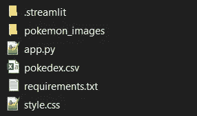

我们的 Streamlit 应用程序的目录结构

如果你想了解更多关于 Streamlit 和如何在线部署 web 应用的信息，可以看看我之前的文章。

[](https://towardsdatascience.com/3-easy-ways-to-deploy-your-streamlit-web-app-online-7c88bb1024b1) [## 在线部署您的 Streamlit Web 应用程序的 3 种简单方法

### 免费，也不需要码头集装箱

towardsdatascience.com](https://towardsdatascience.com/3-easy-ways-to-deploy-your-streamlit-web-app-online-7c88bb1024b1) 

# 数据集

首先，让我们看看涉及的数据集。

## 口袋妖怪数据集

第一个数据集可以从这个 [Kaggle 链接](https://www.kaggle.com/datasets/mariotormo/complete-pokemon-dataset-updated-090420?select=pokedex_%28Update_04.21%29.csv)中以. csv 文件的形式获得。可以想象，大部分代码将解析这个数据集，并在 Streamlit 上以一种格式良好的方式显示出来。为了让代码工作，这个文件应该被重命名为`‘pokedex.csv’`。

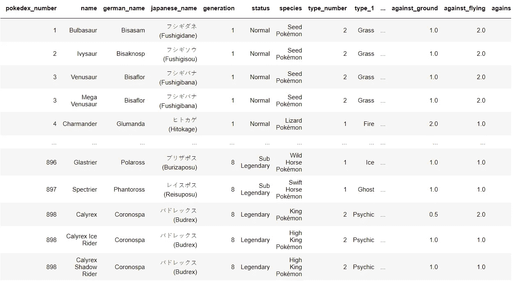

来自 [Kaggle](https://www.kaggle.com/datasets/mariotormo/complete-pokemon-dataset-updated-090420?select=pokedex_%28Update_04.21%29.csv) 的口袋妖怪数据集

## 口袋妖怪图像数据集

口袋妖怪的图片可以在一个文件夹里找到，也是从 Kaggle [这里](https://www.kaggle.com/datasets/kvpratama/pokemon-images-dataset)。这些图像是根据每个口袋妖怪的 Pokedex 编号命名的。请注意下面的截图，某些口袋妖怪有不同的变化，如原始 Groudon，原始盖欧卡，超级拉帝欧斯，还有代欧奇希斯的正常，攻击，防御和速度。

这意味着必须编写一个函数来查找每个口袋妖怪对应于其 pokedex 编号和变化的图像路径。所有图像都放在名为`‘pokemon_images’`的文件夹中，下面的代码才能工作。

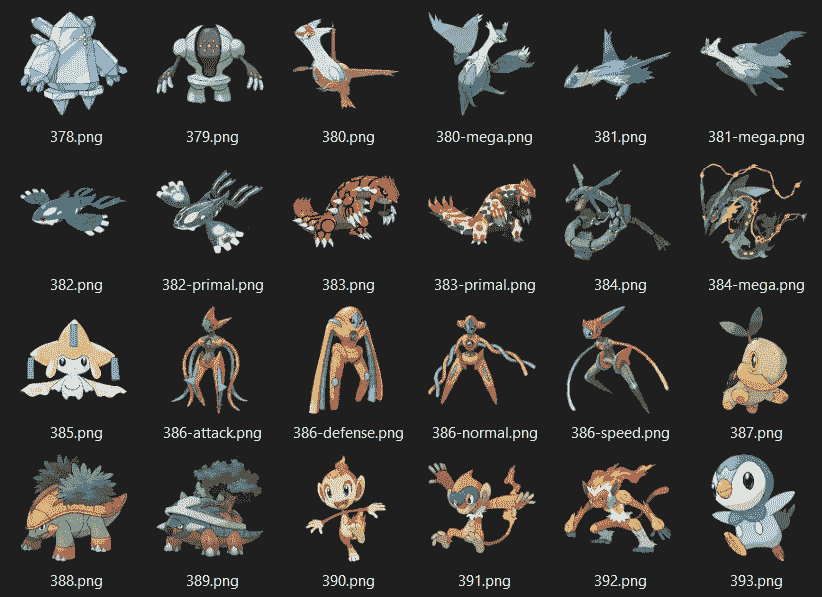

来自 [Kaggle](https://www.kaggle.com/datasets/kvpratama/pokemon-images-dataset) 的口袋妖怪图像数据集

事不宜迟，让我们深入研究代码。大部分代码在 [app.py 文件](https://github.com/damianboh/pokedex/blob/main/app.py)中给出。

# 导入和页面配置

首先，我们需要以下导入:`PIL`显示口袋妖怪图像，`numpy`和`pandas`读取和解析`pokedex.csv`文件，当然还有`matplotlib`和`plotly`显示口袋妖怪统计数据的情节。我们还设置了页面标题，并将布局配置为“宽”，以在我们的 Pokedex 中尽可能整齐地显示更多信息。

# 读入口袋妖怪数据集和 CSS 文件

接下来，我们定义两个函数，并在应用程序启动时调用它们。

`local_css`函数读入一个`style.css`样式表文件。我不会去浏览文件的细节，但你可以在这里查看它。基本上，它由样式信息组成，以良好的格式显示 Pokemon 类型，如下所示。这些类型以整洁的字体显示，每种类型都与不同的颜色相关联，使其看起来更“口袋妖怪”！


上述代码的第 4 行读入 CSS 文件，并将其作为 HTML 代码写入到`<style>`标签中间。HTML 代码可以使用`markdown()`方法在 Streamlit 中编写。我们现在可以稍后访问样式表中定义的类。

`get_data`函数将`pokedex.csv`文件读入一个名为`df`的数据帧，以便稍后进行解析和过滤。为了简单起见，我们只保留第一个 846 口袋妖怪(直到第 6 代)使用 iloc 切片。

# 侧边栏:按名称搜索口袋妖怪

我们现在准备编写一些 UI 元素了！让我们从按名称搜索口袋妖怪并返回名称匹配的元素开始。

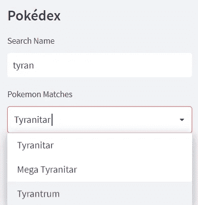

在侧边栏按名称搜索口袋妖怪

在下面的代码中，我们首先将侧边栏的标题打印为 Pokédex。然后，我们在第 3 行包含一个`text_input`字段，供用户输入姓名。我们将该输入与`df`数据帧中的所有姓名进行比较，并在第 5 行返回`matches`列表中的姓名匹配。为了避免任何区分大小写的问题，在比较之前，我们使用`lower()`方法将数据帧中的用户输入和 Pokemon 名称都转换为小写。

如果有任何名称匹配，我们在上面代码的第 8 行将`matches`列表输出到一个 dropbox(在 Streamlit 中称为 selectbox ),允许用户选择感兴趣的 Pokemonsof 的确切名称。在第 13 行，我们返回数据帧中与这个特殊的 Pokemon 对应的相关行。这一行被称为`match`，非常重要，因为其中的所有信息都将被解析并输出到主页面中。

与妙蛙种子相对应的行的示例如下所示。

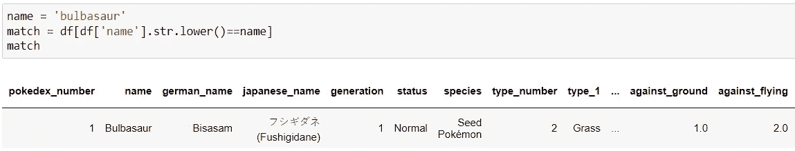

# 侧栏:选择要查看的信息

侧边栏的下一部分是一个`multiselector`，它允许用户选择在 Pokedex 的主页上显示哪些信息。比如觉得训练养殖信息枯燥的用户可以划掉。默认情况下，选择所有信息。

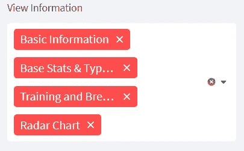

上面的代码显示了如何设计`multiselect`字段。主页面中的四段信息是`‘Basic Information’, ‘Base Stats & Type Defenses’, ‘Training and Breeding’, ‘Radar Chart’`。该字段的输出存储在`selected_info`列表中，当我们显示关于 Pokemon 的所有信息时，将在文章结尾使用该列表。

现在，让我们先深入研究一下显示每个信息的函数。

# 显示基本信息

口袋妖怪的基本信息包括它的形象，类型，身高，体重，物种和能力。以 Mewtwo 为例，这些信息以如下方式显示在三个整齐的列中。

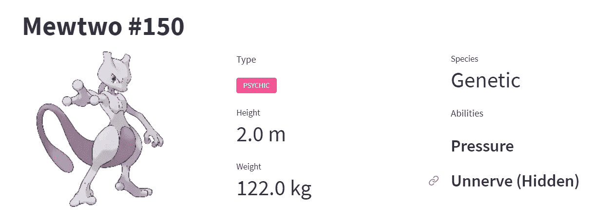

所有这些信息都存储在名为`display_basic_info`的函数中。该函数接受`match`变量，这是 DataFrame 中与前面解释的感兴趣的 Pokemon 相对应的行。

上述函数的第一部分提取相关信息(身高、体重、物种等。)来自`match`行和相应的列名。第 15 行打印口袋妖怪`name`和`id`作为标题，例如上面显示的“Mewtwo #150”。然后我们将 UI 拆分成三列:`col1`、`col2` 和`col3`在第 16 行整齐地显示信息。

上面显示的函数的下一部分在第一个和最左边的列`col1`中显示口袋妖怪的图像。首先，在第 3 行调用一个函数`get_image_path()`，从它的`name`和`id`中找到口袋妖怪的图像路径。你可以在 [app.py 文件](https://github.com/damianboh/pokedex/blob/main/app.py)中找到这个函数。我将不会进入该功能的细节，但基本上，代码必须手动编写，以拉不同变化的口袋妖怪的图像，如前所述(例如，Mega，X，Y，不同的形式，不同的斗篷，等等。).

然后我们使用`PIL`库下的`Image`方法打开图像并显示它(第 4 行和第 5 行)。我们将整个代码放在一个`try except`块中，这样如果找不到图像，应用程序不会中断。相反，它只会显示“图像不可用”

上面的代码在第二列`col2`中显示了类型、身高和体重属性。这些变量已经在函数开始时提取出来了。注意，第 5 行中的`type_text`是用 HTML 写在`<span>`标签之间的。`class`属性对应于前面提到的`style.css`文件中定义的类。这以一种很好的格式化方式显示了 Pokemon 类型。

例如，显示火灾类型的 HTML 代码是`<span class=”icon type-fire”>fire</span>`。如果口袋妖怪有第二种类型，第 6 行和第 7 行添加到存储在`type_text`的 HTML 代码中。

第 9 行用 HTML 显示了这段代码。第 10 行和第 11 行使用`metric`方法显示身高和体重，非常简洁，如前面的截图所示。

最后，上面的代码在最右边的列`col3`中显示了物种和能力。不是所有的口袋妖怪都有这三种能力，因此只有当它们存在时，if 循环才需要显示能力。

# 显示基本统计图表和类型防御

*基本属性和类型防御以下面的方式显示在两列中，再次使用 Mewtwo 的信息作为例子。*

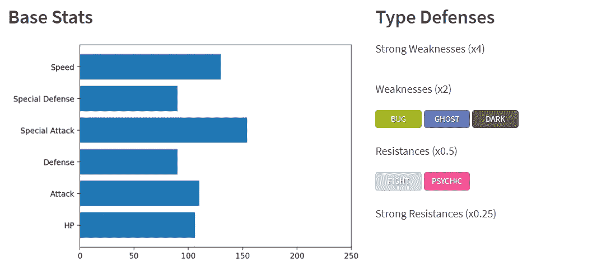

显示该信息的代码在`display_base_stats_type_defenses`功能下。

上面函数的第一部分显示了如何解析和存储类型弱点和抗性。数据集，即`match`行，不在列表中存储弱点和阻力。相反，它显示了每种类型对特定口袋妖怪的伤害乘数。

例如，在下面显示的一行中，口袋妖怪很弱`against_flying`，因为飞行类型造成 2 倍的伤害。此外，虽然它是抗性的`against_fairy`，因为精灵类型只对它造成 0.5 倍的伤害。注意多种类型的口袋妖怪对某些类型可以是双弱(x4)或双抗(x0.25)。

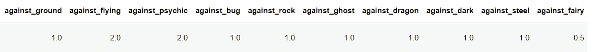

在上面代码的第 10 行到第 21 行，我们循环遍历每一列来找到伤害乘数的值，并将它们存储在第 3 行到第 6 行定义的相应弱点(x2 和 x4)和抗性(x0.25 和 x0.5)列表中。请注意，我们对 1.0 倍乘数的值不感兴趣，因为口袋妖怪对这些类型既不弱也不抵抗。

上面的代码然后得到基本的统计数据(hp，攻击，等等。)并在第 4 行到第 6 行中很好地重命名了这些列。结果存储在`df_stats`中，其结构如下所示。然后使用第 10 行的`matplotlib`将这些绘制在水平条形图上，并显示在第 12 行的左栏`col1`中。请注意，每个基础 stat 的范围是从 0 到 250，我们将这个范围固定在 x 轴上。

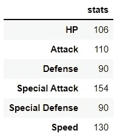

上面显示的代码的最后部分遍历弱点和抗性类型列表中的每一个类型，并相应地在右栏`col2`中显示它们。再一次，我们使用 HTML 来确保类型以良好的风格显示，就像前面解释的那样。

# 显示训练和育种信息

应用程序的下一部分在下面的两列中显示训练和繁殖信息:

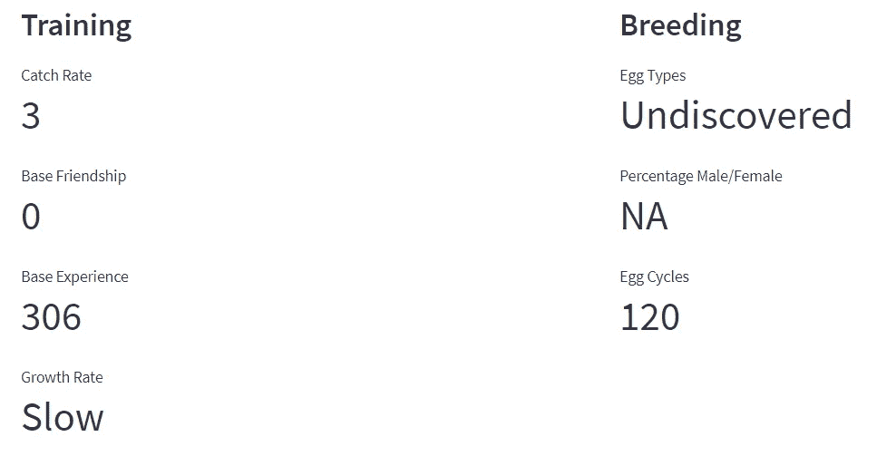

获取和显示这些信息的代码在`display_training_breeding`函数中。由于这类似于上面的其他显示函数，我将把它作为读者理解代码的练习！

请注意，育种信息并不总是可用的。比如上面 Mewtwo 的情况，卵型*未被发现。因此，*也没有可用的雄/雌卵百分比信息，所以我们必须在代码中相应地解析它。

# 显示基地状态的雷达图

我喜欢雷达图，因为它们以如此优雅和对称的方式显示口袋妖怪的统计数据。从这样的图表中可以很容易地看出优势和劣势。谢天谢地， [plotly express](https://plotly.com/python/plotly-express/) 库允许我们轻松地绘制出这一点。Mewtwo 的基本统计数据的雷达图如下所示。

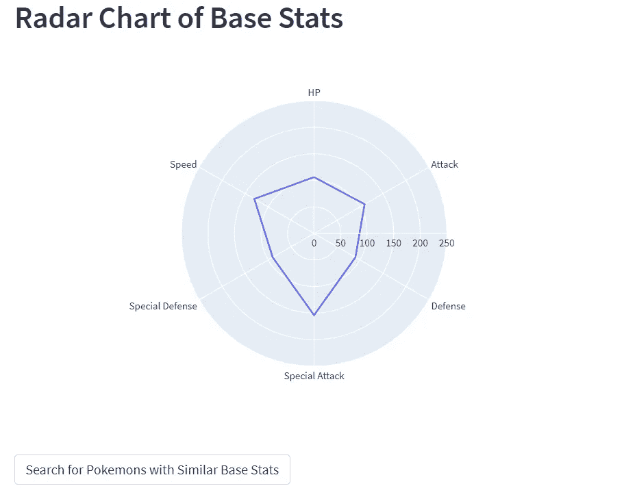

在上面的函数中，我们获取基本统计数据并将其存储在`df_stats`中，类似于我们在前面绘制水平条形图时所做的。第 9 行显示了我们如何使用 plotly express 库在雷达图中显示它，而第 10 行显示在 Streamlit 上。

现在，在整个口袋妖怪数据集中搜索具有相似基础统计的口袋妖怪不是很好吗？如果你注意到上面的截图，有一个按钮叫做`Search for Pokemons with Similar Base Stats`。当这个按钮被按下时，我们调用另一个函数来执行这个操作，如上面代码的第 12 和 13 行所示。

# 搜索基础统计相似的口袋妖怪

和 Mewtwo 一样厉害，类似的口袋妖怪也一样厉害。最相似的两只口袋妖怪如下图。注意他们的雷达图和上面显示的 Mewtwo 的雷达图是多么的相似。对于口袋妖怪的粉丝来说，洁咪的天空形成和 Mega Houndoom 与我的相似并不奇怪。

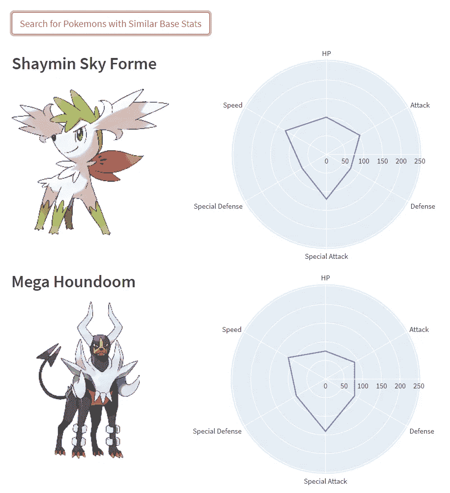

与我最相似的两个口袋妖怪

正如文章开头提到的，我真的在应用程序中使用这个功能获得了很多乐趣。随意尝试搜索类似于盖欧卡传奇的口袋妖怪，甚至是像小火龙这样的初级口袋妖怪。

现在，让我们学习用代码来做这件事:

首先，我们再次获得`df_stats`来显示感兴趣的口袋妖怪的所有统计数据。然后在第 7 行和第 8 行，我们获得了整个`df`数据帧中所有其他口袋妖怪的统计数据，并将其存储在`df_stats_all`中。然后我们获得这个特殊口袋妖怪的`df_stats`和第 11 行`df_stats_all`中所有行之间的统计数据差异。

然后，我们使用这个差异来计算每个口袋妖怪和这个特定口袋妖怪之间的赋范距离。这是通过使用第 14 行中的`np.linalg.norm`函数并将距离存储在`norm_df`中来实现的。最后，我们获取 20 个最小距离的口袋妖怪的统计数据(不包括原来的口袋妖怪本身),并将它们存储在`similar_pokemons_df`数据帧中。

从我们的`similar_pokemons_df`数据帧中，我们使用下面的代码输出每个口袋妖怪的名称、图像和雷达图，并显示它们。最后，我们在最后两行代码中显示了所有 20 个类似的口袋妖怪及其统计数据的汇总表。

# 侧边栏:在基本统计范围内搜索口袋妖怪

现在，让我们回到我没有讨论过的一个侧栏代码段。在这里，我们有一系列的滑块对应于每个口袋妖怪的基础统计数据，所以用户可以在一定的基础统计数据范围内搜索口袋妖怪。

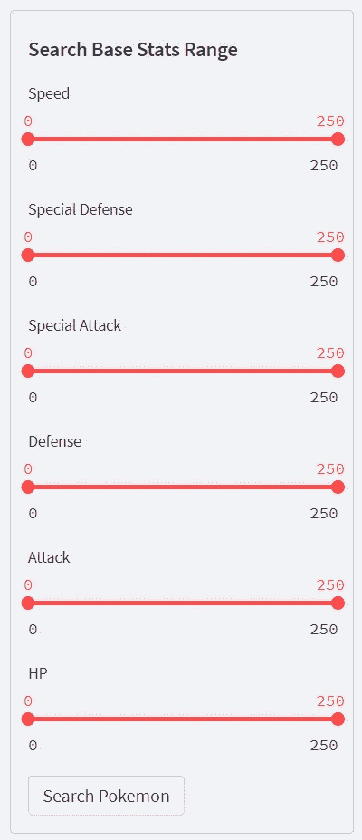

显示这些滑块的代码如下所示，基本上是不言自明的。注意，这些滑块通过将代码段分组到同一个`st.sidebar.form`下，并使用相应的提交按钮`Search Pokemon`链接在一起。代码的最后一行将按钮的状态存储在一个布尔变量`pressed`中。当按下按钮时，该变量变为真。

当按钮被按下时，我们希望显示与我们的搜索范围相对应的所有口袋妖怪。但首先，我们来谈谈如果`Search Pokemon`按钮没有按下会发生什么。

# 用户按名称搜索后显示数据

如果按钮没有被按下，这意味着用户正在使用`Search Name`功能搜索感兴趣的口袋妖怪，这由下面的代码处理:

回想一下文章前面的部分，这个口袋妖怪的数据存储在名为`match`的行中。在用户做出选择后，`match`将只有一行，上面代码的第 9 行到第 16 行调用每个显示函数来显示 Pokemon 的相关信息。

只有当用户选择了要显示的信息时，才会调用每个函数。回想一下，用户可以从之前描述的`multiselector`中进行选择，用户选择的信息存储在`selected_info`列表中。

# 按基本统计显示用户搜索后的数据

如果按下`Search Pokemon`按钮，下面的代码将获得所有口袋妖怪的统计数据，并对用户在滑块中指示的统计数据范围应用过滤器。所有相应的口袋妖怪和他们的统计数据将显示在一个表格中。请注意，我们没有显示每个口袋妖怪的图表或其他信息，因为这个列表可能相当大，我们不希望应用程序崩溃！

下面是一个用户搜索具有相当高的统计数字的口袋妖怪的例子。这些绝对不是普通的口袋妖怪！

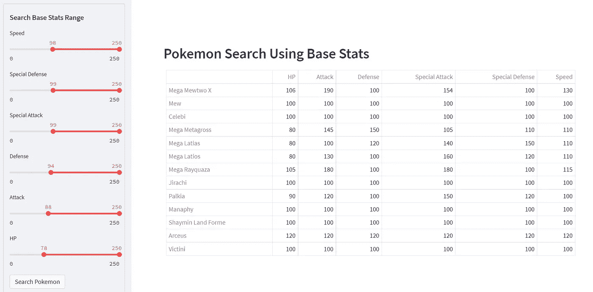

这是另一个有趣的事实:有 HP 高于 200 的口袋妖怪吗？是啊！介绍我们亲爱的尚西和桀伽德。

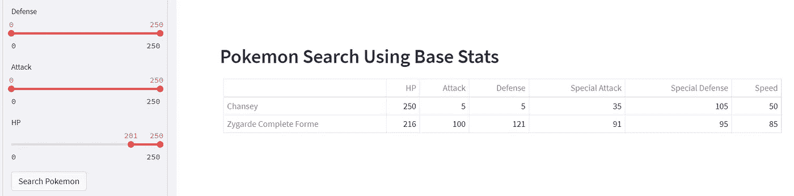

# 侧栏演职员表

最后，让我们以免责声明结束`app.py`代码，我们不拥有任何口袋妖怪数据或图像！:)

# requirements.txt 和 config.toml 文件

除了 app.py 文件之外，我们还需要包含一个`requirements.txt`文件来显示需要安装的 Python 库的列表，这样这些库就可以自动安装在部署了应用程序的服务器上。

```
streamlit
pandas
plotly
matplotlib
```

可选地，我还创建了一个名为`.streamlit`的文件夹，其中包含一个`config.toml`文件，将基本主题设置为“亮”而不是“暗”

```
[theme]
base=”light”
```

# 在本地运行应用程序

这就是应用程序所需的全部内容。要在本地启动应用程序，只需在终端中运行以下命令，与您的`app.py`文件放在同一个文件夹中。确保你的`pokedex.csv`文件和`pokemon_images`文件夹也在里面。

```
streamlit run app.py
```

如果成功，应该会出现以下内容:

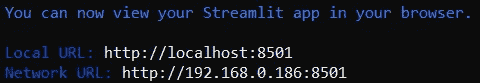

你的浏览器也应该弹出上面输入的本地 URL，你的 Pokedex 应用程序应该在浏览器中工作！恭喜你。

# 远程部署应用程序

如果你想像我在这里做的一样远程部署应用程序，我在下面的文章中总结了三个选项。

[](https://towardsdatascience.com/3-easy-ways-to-deploy-your-streamlit-web-app-online-7c88bb1024b1) [## 在线部署您的 Streamlit Web 应用程序的 3 种简单方法

### 免费，也不需要码头集装箱

towardsdatascience.com](https://towardsdatascience.com/3-easy-ways-to-deploy-your-streamlit-web-app-online-7c88bb1024b1) 

再次，这里是 GitHub 回购的链接。

[](https://github.com/damianboh/pokedex) [## GitHub - damianboh/pokedex

### 此时您不能执行该操作。您已使用另一个标签页或窗口登录。您已在另一个选项卡中注销，或者…

github.com](https://github.com/damianboh/pokedex) 

尽情享受你的 Pokedex 应用程序；请随意添加或建议新功能！