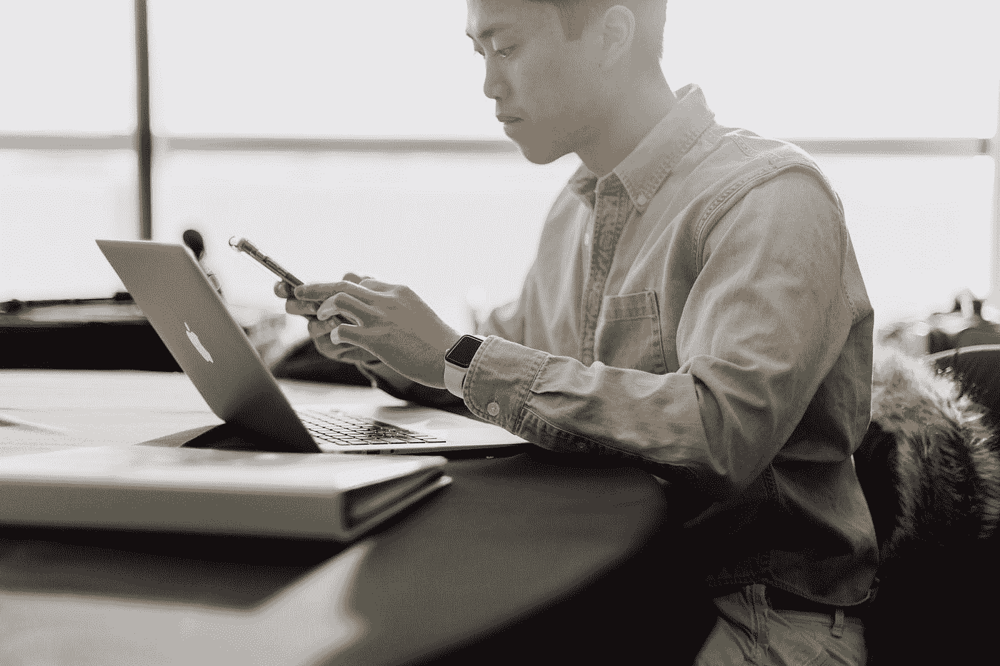
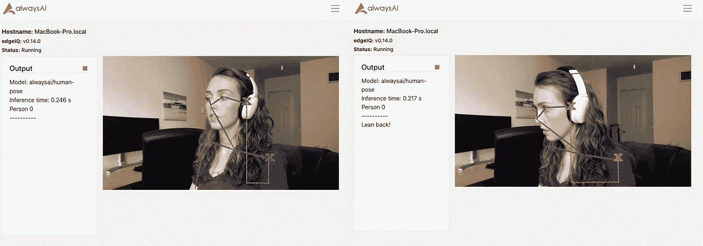
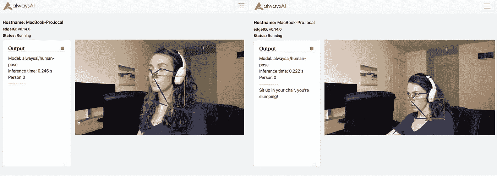
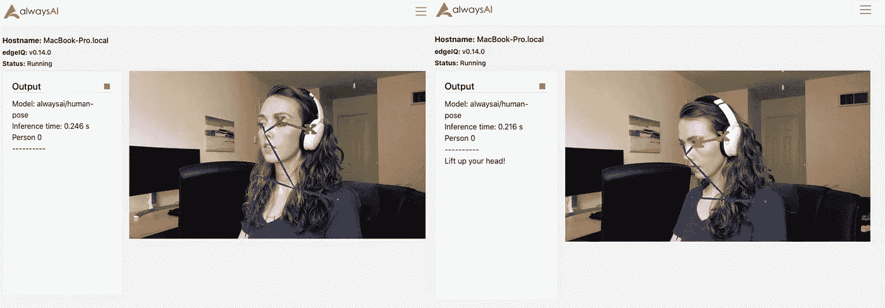

# 用姿势估计建立你自己的姿势修正器

> 原文：<https://betterprogramming.pub/build-your-own-posture-corrector-with-pose-estimation-97009943e484>

## 使用 alwaysAI 并调整您的姿势



普里西拉·杜·普里兹在 [Unsplash](https://unsplash.com?utm_source=medium&utm_medium=referral) 上的照片。

我们中的许多人每天大部分时间都在伏案工作，身体前倾看着电脑屏幕，或者瘫坐在椅子上。如果你像我一样，只有在几个小时后你的脖子或肩膀疼痛时，或者你有偏头痛时，你才会想起你的不良姿势。如果有人能提醒你坐直，那不是很好吗？

好消息是你可以提醒自己！在本教程中，我们将使用 alwaysAI 提供的姿势估计模型来构建姿势校正器应用程序。

要完成本教程，您必须具备:

1.  一个[永远在线账号](https://alwaysai.co/auth?register=true?&utm_campaign=Open%20Beta&utm_source=medium&utm_content=posture-corrector)(免费！).
2.  alwaysAI [在你的机器上设置](https://alwaysai.co/docs/getting_started/development_computer_setup.html?&utm_campaign=Open%20Beta&utm_source=medium&utm_content=posture-corrector)(也是免费的)。
3.  诸如 [sublime](https://www.sublimetext.com/) 之类的文本编辑器或者诸如 [PyCharm](https://www.jetbrains.com/pycharm/) 之类的 IDE，两者都提供免费版本，或者任何你喜欢的代码。

请参见 [alwaysAI 博客](https://learn.alwaysai.co?&utm_campaign=Open%20Beta&utm_source=medium&utm_content=posture-corrector)了解更多关于计算机视觉、开发模型、如何改变模型等方面的背景知识。你也可以在博客上找到为 [Mac](https://learn.alwaysai.co/setupformacusers?&utm_campaign=Open%20Beta&utm_source=medium&utm_content=posture-corrector) 和 [Windows](https://learn.alwaysai.co/developing-alwaysai-windows?&utm_campaign=Open%20Beta&utm_source=medium&utm_content=posture-corrector) 设置的开发机器上的逐步教程。

本教程的所有代码都可以在 [GitHub](https://github.com/alwaysai/posture-corrector?&utm_campaign=Open%20Beta&utm_source=medium&utm_content=posture-corrector) 上获得。

# 我们开始吧

拥有免费帐户并设置好开发环境后，下载入门应用程序。在继续本教程的其余部分之前，请使用[此链接](https://alwaysai.co/docs/reference/starter_applications.html?&utm_campaign=Open%20Beta&utm_source=medium&utm_content=posture-corrector)完成此操作。我们将通过修改`realtime_pose_detector` starter 应用程序来构建姿势校正器。您可能希望将内容复制到一个新目录中，以便保留原始代码。

本教程有三个主要部分:

1.  配置文件
2.  主要应用程序
3.  用于检测不良姿势的实用程序类

# 配置文件的创建

按照本教程中的[创建文件。对于这个示例应用程序，我们需要一个配置变量(如果需要，可以添加更多):`scale`。它是一个 int，将用于调整姿态函数的灵敏度。](https://learn.alwaysai.co/speed-up-development-with-a-json-configuration-file?&utm_campaign=Open%20Beta&utm_source=medium&utm_content=posture-corrector)

现在配置都设置好了！

# 创建应用程序

将以下导入语句添加到您的`app.py`文件的顶部:

```
import os
import json
from posture import CheckPosture
```

我们需要`json`来解析配置文件，而`CheckPosture`是用于检测不良姿态的实用程序类，我们将在本教程稍后定义。

*注意:您可以根据您的部署环境更改您在此应用程序中使用的引擎和加速器。由于我是在 Mac 上开发的，我选择引擎为“DNN”，所以我将引擎参数改为* `*edgeiq.Engine.DNN*` *。我还把加速器改成了“CPU”你可以在* [*alwaysAI 的文档*](https://alwaysai.co/docs/edgeiq_api/constants.html) *中阅读更多关于加速器和引擎的选项。*

接下来，从`app.py`中删除以下行:

```
text.append("Key Points:")
for key_point in pose.key_points:
    text.append(str(key_point))
```

添加以下行来替换您刚刚删除的行(就在`text.append`语句的下面):

```
*# update the instance key_points to check the posture*
posture.set_key_points(pose.key_points)*# play a reminder if you are not sitting up straight*
correct_posture = posture.correct_posture()
if not correct_posture:
   text.append(posture.build_message()) # make a sound to alert the user to improper posture
    print("\a")
```

我们在那里使用了一个未知的对象类型，并在其上调用了一些我们还没有定义的函数。我们将在最后一节中讨论这个问题！

将以下代码行直接移动到上面代码的末尾(直接在`for`循环之后和`finally`之前):

```
streamer.send_data(results.draw_poses(frame), text)fps.update()if streamer.check_exit():
    break
```

# 创建姿势实用程序类

创建一个名为`posture.py`的新文件。使用以下代码行定义该类:

```
class CheckPosture
```

为该类创建构造函数。我们将有三个实例变量:`key_points`、`scale`和`message`。

```
def __init__(self, scale=1, key_points={}):
   self.key_points = key_points
   self.scale = scale
   self.message = **""**
```

我们对`scale`和`key_points`使用了默认值，以防用户不提供它们。我们只是初始化变量 message 来保存一个空字符串，但是这将存储用户可以用来纠正他们姿势的反馈。您已经看到了在`app.py`部分设置的`key_points`变量。该变量允许`posture.py`中的函数确定用户的姿势。最后，当刻度减小或增大时，刻度简单地使`posture.py`中执行的计算变得更灵敏或更不灵敏。

现在我们需要为`posture.py`写一些函数。

为`key_points`、`message`和`scale`变量创建一个 getter 和 setter:

现在我们需要函数来实际检查姿态。我的不良姿势习惯包括向电脑屏幕前倾、无精打采地坐在椅子上、低头看笔记，所以我定义了检测这些用例的方法。如果您愿意，可以使用相同的坐标比较原则来定义自己的自定义方法。

首先，我们将定义检测前倾的方法，如下图所示。这种方法通过比较身体同一侧的耳朵和肩膀来实现。因此，它首先检测耳朵和肩膀是否在左侧或右侧都可见(即我们想要使用的坐标不是-1)，然后检查肩膀的 *x* 坐标是否大于耳朵的 *x* 坐标。



*注:* `*alwaysai/human-pose*` *的坐标为左上角的 0，0。此外，帧的大小会有所不同，这取决于您是使用流媒体工具来输入视频还是图像，这也会影响坐标。我使用 Streamer 对象开发，帧大小为(720，1280)。对于所有这些功能，您很可能需要调整坐标差异或修改比例，因为每个人都有不同的姿势基线。然而，坐标算法的原理将保持不变，并可用于在其他姿势估计用例中更改应用程序的行为！* *你也可以使用角度或帧的百分比，这样就不会束缚于绝对数字。请随意修改这些方法，并向 GitHub repo 提交一个 pull 请求！*

接下来，我们将定义瘫坐在椅子上的方法，如下图所示:



在这种方法中，我们将使用*y*-协调颈部和鼻子关键点来检测鼻子何时过于靠近颈部，这种情况发生在某人的背部弓在椅子上时。对我来说，大约 150 分代表了我想允许的最大距离。如果我的鼻子离我的脖子少于 150 点，我希望得到通知。同样，这些硬编码值可以用`scale`因子进行缩放，或者按照上面的说明进行修改。

现在，我们将定义检测头部何时向下倾斜的方法，如下图所示。该方法将使用耳朵和眼睛关键点来检测给定眼睛的 *y* 坐标何时比身体同侧的耳朵更靠近图像的底部。



现在，我们将创建一个检查所有姿势方法的方法。这个方法通过使用 Python 的`all`方法来工作，如果一个列表中的所有 iterables 都返回`True`，那么这个方法只返回`True`。因为如果检测到不良姿态，我们定义的所有姿态方法都返回`False`，如果这些方法中的任何一个返回`False`，我们现在定义的方法将返回`False`。

```
def correct_posture(self):
    return all([self.check_slump(), self.check_head_drop(), self.check_lean_forward()])
```

最后，我们将构建一个方法，返回一个定制的字符串，告诉用户如何修改他们的姿势。这个方法在`app.py`中被调用，结果显示在流媒体工具的文本上:

就是这样！现在你有了一个工作姿势矫正 app。您可以通过创建自己的姿势检测方法，使用不同的关键点坐标，使`build_message`返回不同的有用提示，以及创建自己的自定义音频文件来代替`print(“\a”)`来定制这个应用程序。你甚至可以修改应用程序，给你发送一条[短信](https://alwaysai.co/blog/build-simple-computer-vision-texting-application-using-twilio?&utm_campaign=Open%20Beta&utm_source=medium&utm_content=posture-corrector)，而不是打印到控制台！

如果你想在 Jetson Nano 上运行这个应用，更新你的 docker 文件和`app.py`中的加速器和引擎参数，如本文[中所述](https://learn.alwaysai.co/using-pose-estimation-on-the-jetson-nano-with-alwaysai?&utm_campaign=Open%20Beta&utm_source=medium&utm_content=posture-corrector)。

现在，只需启动您的应用程序(如果您需要复习如何为您的当前设置执行此操作，请遵循[本教程](https://learn.alwaysai.co/building-and-deploying-apps-on-alwaysai?&utm_campaign=Open%20Beta&utm_source=medium&utm_content=posture-corrector))并打开您的 web 浏览器到`localhost:5000`以查看正在运行的姿势校正器！