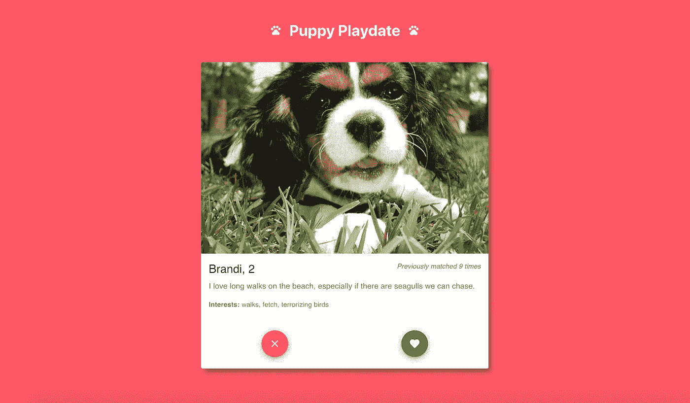
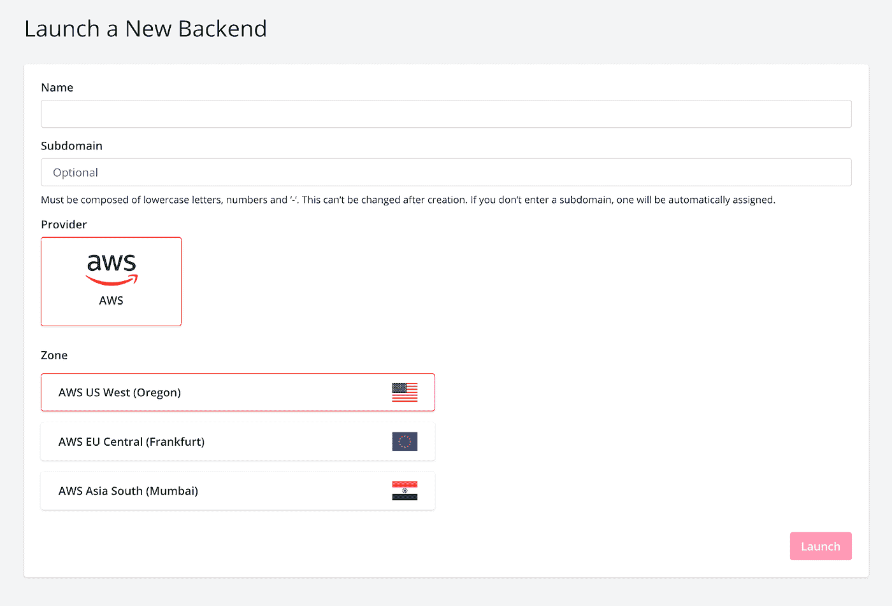
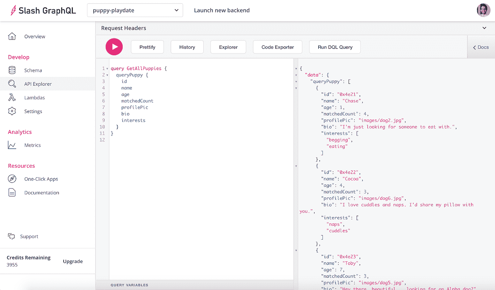
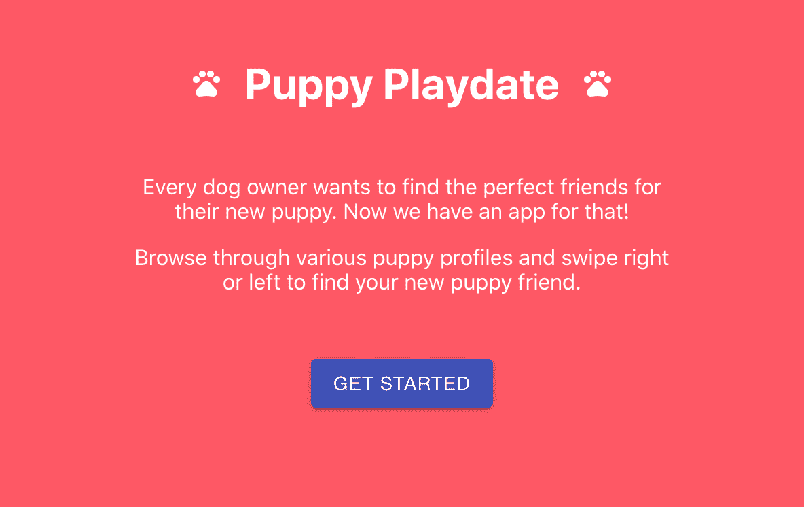
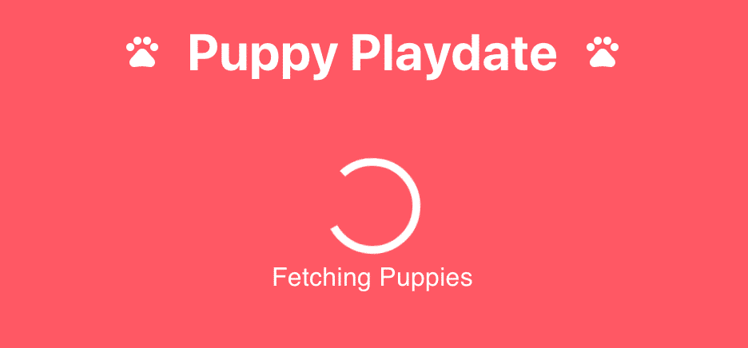
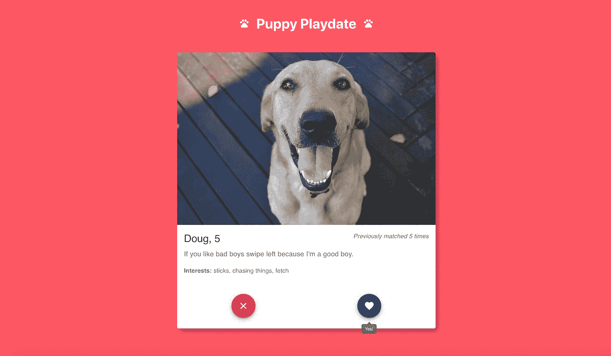
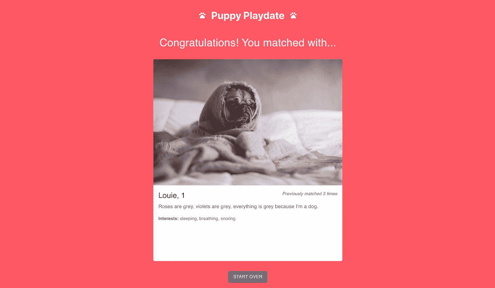

# 用 Slash GraphQL 构建你自己的小狗玩耍日 Tinder 应用程序

> 原文：<https://betterprogramming.pub/build-your-own-puppy-playdate-tinder-app-with-slash-graphql-34d35a96fbd8>

## 了解 Slash GraphQL

*一只柯基犬过着他最美好的生活(来源:*[*Pixabay*](https://pixabay.com/photos/dog-corgi-pets-cute-rain-4415649/)*)*

每个狗主人都想为他们的新小狗找到完美的朋友。现在我们有了一个应用程序！你可以浏览各种小狗档案，左右滑动来找到你的新小狗朋友。设置小狗玩耍日从未如此简单。

好吧，不尽然。但我们确实有一个古怪的演示应用程序，它是用 [React](https://reactjs.org/) 、 [Material-UI](https://material-ui.com/) 、 [Apollo Client](https://www.apollographql.com/docs/react/) 和 [Slash GraphQL](https://dgraph.io/cloud/) (一个托管的 GraphQL 后端，来自 [Dgraph](https://dgraph.io/) )构建的。

在这篇文章中，我们将探讨我是如何构建这个应用程序的，并且还将看看我所使用的一些基本技术。

准备好*释放*乐趣了吗？

*更新:2021 年 4 月 16 日，斜杠 GraphQL 正式更名为 Dgraph Cloud。以下信息仍然适用，您仍然可以按照描述构建应用程序。*

# 演示应用概述

*狗狗玩耍日 app*

我们的应用程序是小狗玩耍日的翻版。您可以查看我们的小狗档案，这是我包含在数据库中的预先生成的种子数据。你可以通过向左滑动或点击 X 按钮来拒绝小狗。你可以通过向右滑动或点击心形按钮来表示对小狗的兴趣。

在所有小狗上向左或向右滑动后，您的结果就会显示出来。如果你幸运的话，你将会和一只小狗配对，并且在你的下一次狗狗约会中表现良好！

点击查看[演示应用。也可以](http://tylerhawkins.info/puppy-playdate/build/)[在 GitHub 上看到代码](https://github.com/thawkin3/puppy-playdate)。

在本文中，我们将为我们的应用程序设置模式，并用种子数据填充数据库。我们还将研究如何获取小狗档案以及如何进行匹配更新。

# 建筑

如上所述，这款 app 背后的四大核心技术分别是 [React](https://reactjs.org/) 、 [Material-UI](https://material-ui.com/) 、 [Apollo Client](https://www.apollographql.com/docs/react/) 和 [Slash GraphQL](https://dgraph.io/cloud/) 。

我选择 React 是因为它是一个优秀的前端库，可以用可重用组件以声明的方式开发 ui。

Material-UI 帮助提供了 UI 组件的构建块。例如，我使用了他们的`Button`、`Card`、`CircularProgress`、`FloatingActionButton`和`Typography`组件。我也用了一些图标。所以我有一些基本的组件布局和样式作为起点。

我使用 Apollo Client for React 来促进我的前端组件和后端数据库之间的通信。Apollo Client 使得使用 GraphQL 以声明的方式执行查询和变异变得很容易，它还有助于在发出 API 请求时处理加载和错误状态。

最后，Slash GraphQL 是托管的 GraphQL 后端，它将我的小狗数据存储在数据库中，并为我提供一个 API 端点来查询我的数据库。拥有一个托管的后端意味着我不需要在自己的机器上安装和运行自己的服务器，不需要处理数据库升级或安全维护，也不需要编写任何 API 端点。作为一名前端开发人员，这让我的生活轻松了很多。

# Slash GraphQL 入门

让我们首先创建一个斜杠 GraphQL 帐户、一个新的后端和一个模式。

您可以[创建一个新帐户](https://cloud.dgraph.io/)或在线登录您现有的 Slash GraphQL 帐户。通过身份验证后，您可以单击“启动新的后端”按钮来查看下面显示的设置屏幕。

*用斜线图形 QL 创建新的后端*

接下来，选择您的后端名称(对我来说是`puppy-playdate`)、子域名(对我来说也是`puppy-playdate`)、提供商(目前仅 AWS)和区域(最好选择一个最接近您或您的用户群的)。谈到定价，有一个慷慨的免费层，这对于这个应用程序来说足够了。

单击“启动”按钮确认您的设置，几秒钟后，您将有一个新的后端启动并运行！

一旦创建了后端，下一步就是指定一个模式。这概述了您的 GraphQL 数据库将包含的数据类型。在我们的例子中，模式如下所示:

我们数据库的 GraphQL 模式

这里我们定义了一个`Puppy`类型，它有以下字段:

*   `id`，这是由斜杠 GraphQL 为存储在数据库中的每个对象生成的唯一 ID
*   `name`，这是一个也可以搜索的文本字符串
*   `age`，是一个整数
*   `matchedCount`，也是一个整数，将代表小狗与某人配对的次数
*   `profilePic`，是一个字符串，包含要在应用中显示的图片 URL
*   `bio`，这是一个包含关于小狗的简短描述的字符串
*   `interests`，这是一个表示小狗兴趣的字符串数组，也是可搜索的

# 添加小狗

现在我们已经建立了后端端点和模式，是时候添加一些小东西了！Slash GraphQL web 控制台中的 API Explorer 允许我们轻松地对数据库执行 GraphQL 查询和变更，而无需在我们的应用程序中编写或运行任何额外的代码。我们将使用这种变异向数据库中插入数据:

突变，将所有小狗添加到数据库中

然后，我们可以查询我们的数据库来获取小狗数据，作为对我们的种子数据被正确插入的快速检查。该查询如下所示:

查询从数据库中获取所有小狗

然后数据会显示在 API Explorer 的结果面板中，如下所示:

*查询我们所有小狗的数据库*

# 抓取小狗(哈哈…)

现在我们已经用种子数据填充了数据库，我们可以让我们的小狗出现在我们的应用程序中。我使用 [React](https://reactjs.org/) 为我的组件库构建 UI 和 [Material-UI](https://material-ui.com/) 来帮助加速开发过程。我没有直接执行 GraphQL 查询和变异，而是选择使用 [Apollo Client for React](https://www.apollographql.com/docs/react/) 来声明性地处理与我的后端 API 和数据库的交互。

Apollo 客户端利用 [React 的上下文 API](https://reactjs.org/docs/context.html) 。首先，初始化一个新的客户机，然后用提供者组件包装根组件。这使得数据库数据可以通过上下文在应用程序的任何地方使用。

创建新的 Apollo 客户端

将应用程序包装在 Apollo provider 组件中

然后在我们的`App.js`文件中，我们可以定义一个 GraphQL 查询来获取所有的小狗:

获取所有小狗的 GraphQL 查询

然后，我们在我们的`App`组件中声明性地执行查询，并通过使用 Apollo 客户端的`useQuery`钩子来处理响应数据:

使用 useQuery 钩子执行查询

调用该方法的结果是一个包含响应属性`data`、`loading`状态、`error`信息和`refetch`数据的方法的对象。我们只需要访问`data`属性和`refetch`方法，所以我们从对象中析构这两项，然后根据需要将它们传递给子组件。

*小狗玩耍日 app 中的欢迎画面*

*在获取小狗数据时，在小狗玩耍日应用程序中加载屏幕*

# 更新小狗(爱)

一旦小狗数据被获取，小狗就被一个接一个地显示为互动卡片。打火刷效果是使用一个名为 [react-tinder-card](https://www.npmjs.com/package/react-tinder-card) 的 npm 包实现的。

当向右滑动小狗卡时(或者当点击心形按钮时)，会向后端发出一个 API 请求，将小狗的`matchedCount`值加 1。这再次通过 Apollo 客户端完成，但是这次使用了`useMutation`钩子，因为这是 GraphQL 的一个变种。

和以前一样，我们首先编写我们的 GraphQL 变体:

GraphQL 突变来更新小狗的数据

然后我们在组件内部执行变异，这次是作为名为`swiped`的 swipe 事件处理方法的一部分:

使用 useMutation 挂钩和 swiped 事件处理程序执行变异

道格是个好男孩

每个喜欢的狗都被记录下来。一旦你刷过我们数据库中的所有 11 只狗，你的比赛结果就会显示出来！

*你和刘伟东般配！*

# 后续步骤

这就是我们的演示应用程序！如果你作为读者想继续这个项目，你可以通过创建一个[认证](https://dgraph.io/docs/graphql/authorization/authorization-overview/)工作流来扩展这个应用程序，允许用户创建账户和发布他们自己的个人资料。你也可以允许用户互相匹配，并在匹配发生时向他们发送通知。

# 包扎

当我构建这个应用程序并考虑我想要包含的特性和功能时，数据库模式随着时间而改变。我开始没有包括小狗的年龄或他们的兴趣。当我决定在小狗卡片上显示这些信息时，我简单地在 Slash GraphQL web 控制台中编辑了我的模式，以包含`age`和`interests`字段。

我最初还用一个布尔型`matched`字段来显示你是否与每只小狗匹配。然而，由于这个应用程序不包含身份验证，任何用户都可以使用，因此使用一个`matchedCount`字段来记录每只小狗之前被任何用户喜欢过的次数更合适。

对模式进行这种调整也很简单，只需用`matchedCount` int 类型替换`matched`布尔类型。

GraphQL 的灵活性允许我动态地编辑我的模式，而不必重写几个 API 端点，这大大加快了开发过程。Slash GraphQL 的 API Explorer 允许我在编写任何应用程序代码之前，直接针对我的数据库轻松地执行查询和突变，以试验我需要的语法和字段。

我选择的架构非常适合开发这款应用——它让快速原型制作变得简单！*手爪*无止境！

*更新-2021 年 1 月 20 日:*这篇文章提到了一个斜杠 GraphQL 自由层。Dgraph 最近更新了他们对 Slash GraphQL 的定价模型。5GB 的数据传输现在是每月 9.99 美元。没有隐性成本。没有数据存储成本。每个查询不收费。你可以在这里找到更多信息。