# 只需 60 行 Python 代码就能构建自己的特斯拉汽车游戏

> 原文：<https://betterprogramming.pub/build-your-own-tesla-with-just-60-lines-of-python-3e80c69625a>

## 程序员拥有免费制作任何东西的工具

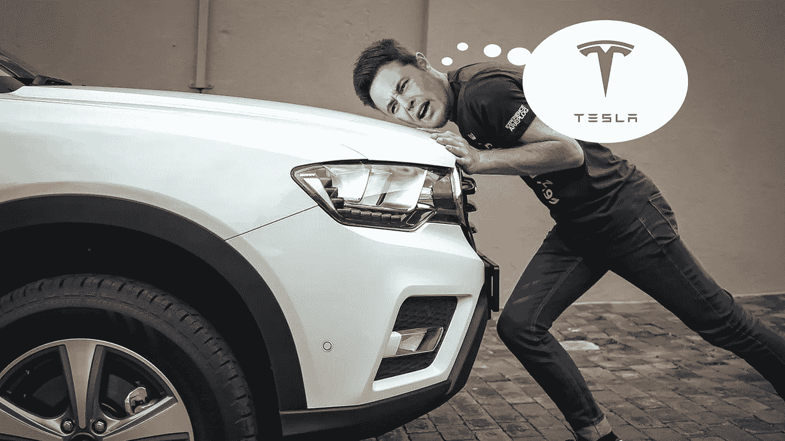

图片来自 [Carcody](https://carcody.com/can-you-push-start-an-automatic-car/) ，由作者编辑

短期来看，我讨厌埃隆·马斯克。

长期:我不能停止爱他。因为现在我还未成年，不能用他的任何产品。*迪斯科里的悲伤歌曲*

但不管怎样，我现在想开特斯拉。我去了[我的团队](https://www.programming-hero.com/)。他们让我吃惊。

# 这个项目是关于什么的？

1.  学习建造自动驾驶汽车的基本但至关重要的知识(虚拟展示)。
2.  通过用 60 行 Python 构建一辆自动驾驶汽车，了解运动、轨迹检测、方向检测和 Elon 财富秘密检测的基本原理—免费。
3.  你会变得更聪明，就像埃隆·马斯克一样(你的朋友会嫉妒)。

# 先决条件

姐姐，你不需要任何东西来跟踪埃隆。老弟，对你来说有两个简单的先决条件:

*   在你的系统中安装[最新版本的 Python](https://www.python.org/download/releases/3.0/) 。
*   选择一个你觉得舒服的代码编辑器(PyCharm 和代码比较酷)。

# 自动驾驶汽车的核心特征

*   首先，它可以在没有任何人类交互的情况下自动驾驶。
*   第二，如果路上有任何障碍，或者是路的尽头，或者是停车信号，它可以停止行驶。
*   第三，它可以检测道路，并据此轮流。
*   第四，它可以自己到达目的地。

理解这四个核心特征，你就可以开始这个项目了。

# 让我们跳过无聊的部分

我们需要创建一个有一些道路、汽车、转弯和障碍物的项目。这几乎就像设计一个游戏。

为此，Python 提供了一个名为 [pygame](https://www.pygame.org/news) 的第三方模块，这是一组为编写视频游戏而设计的 Python 模块。这允许你用 Python 语言创建全功能的游戏和多媒体程序。

因为它是第三方模块，我们需要先安装它，然后才能使用它。打开您的终端，输入以下命令来安装 pygame:

```
pip install pygame
```

安装后，我们只需将该模块导入到我们的项目中，就可以访问该模块提供的各种功能:

```
import pygame
```

# 让我们从有趣的代码开始

我们将用五个简单的步骤来完成这个项目。会很有趣的。

## 第一步。启动 pygame

从我的 [GitHub repo](https://github.com/programmer-karim/self-driving-car.git) 中获取资源，我们将一起跟进。

这些资源包含六种不同类型的赛道，汽车将在这些赛道上行驶。第六部有点难，但是和它一起工作会很有趣。

第一条赛道很简单:我们将有一条直路，我们必须在这条路上驾驶我们的赛车。

从第一个轨道开始，我们需要做三件事:

1.  初始化 pygame 模块
2.  创建所需大小的窗口
3.  加载轨道图像并将其添加到窗口中

我们将从导入 pygame 模块开始:

```
import pygame
```

使用模块前，请对其进行初始化:

```
pygame.init():
```

接下来，我们使用`display()`方法创建基本的 pygame 窗口。`display`方法将简单地创建一个空窗口，我们可以在其中放置我们的元素。但是我们需要定义我们需要创建的窗口的大小。我们可以使用`set_mode()`方法来做到这一点。

在`set_mode()`方法中，我们将以像素为单位的窗口大小作为 Python 元组来传递，该元组表示窗口的 XY 坐标。一个 [Python 元组](https://www.w3schools.com/python/python_tuples.asp)是有效 Python 数据类型的逗号分隔元素的集合，用括号括起来，比如:()。

一旦我们有了窗口，我们就可以加载图像并使用 pygame 提供的`image`模块创建图像表面对象。图像表面在[字节缓冲区](https://www.pygame.org/docs/ref/image.html)内共享数据。没有图像类。图像作为曲面对象加载:

```
window = pygame.display.set_mode((1200, 400))
track = pygame.image.load("track1.png")
```

`image`模块是 pygame 的必需依赖项，它提供了`load()`方法，通过创建图像表面对象来加载传递的图像。

方法`blit()` — *blit* 代表block image transfer —将一个表面的内容复制到另一个表面上。我们需要传递表面图像对象和我们想要在窗口中放置图像的位置。最后，我们可以使用`update()`方法更新空窗口。

上述代码产生以下输出:

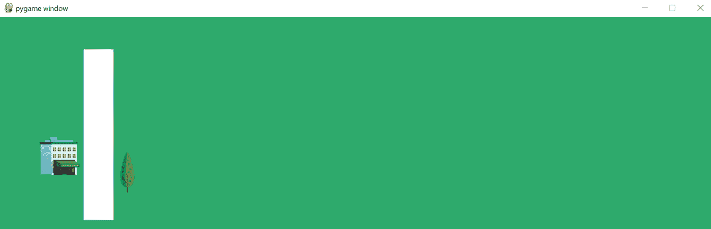

现在我们已经有了赛道，让我们添加赛车。我们将遵循与轨道相同的方法:使用`blit()`加载图像并将其传输到窗口:

```
import pygame
pygame.init()
window = pygame.display.set_mode((1200, 400))
track = pygame.image.load("track1.png")
while True:
    window.blit(track, (0, 0))
    pygame.display.update()
```

当我们添加汽车图像时，我们必须调整它的大小以符合我们的要求，因为默认的图像大小可能不合适。我们可以使用`transform`模块的`scale()`方法来调整图像的大小，并将图像对象和新的大小作为元组作为参数传递。

上述代码产生以下输出:

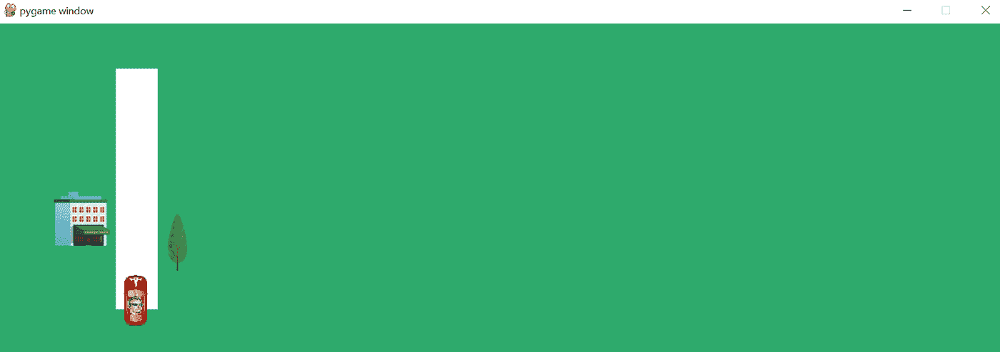

第一步完成。在第二步中，我们将在赛道上驾驶汽车，并在需要时停下来。

## **第二步。驾驶和控制汽车**

在赛道上驾驶赛车超级容易。

我们只需要改变汽车的 Y 坐标，它就会开始移动。简单的逻辑是在循环中减少两三个点的 Y 值，使其在 Y 轴上向上移动，让我们感觉汽车在移动:

这里，我们简单地将变量`‘car_x’` 和`‘car_y’`的值作为汽车在`blit()`方法中的位置传递，而不是像前面那样直接将[的值硬编码为](https://en.m.wikipedia.org/wiki/Hard_coding)的值。

此外，为了控制 pygame 中元素的移动并使它们可见，我们需要在每次迭代中引入一点延迟。这可以使用 pygame 中的`time`模块来完成。

就是这样。如果你现在运行代码，汽车就会移动。Whroom…！

但是有一个问题。赛车冲出了赛道，冲出了屏幕。一旦它到达路/道的尽头，我们需要停下来。为此，我们的汽车需要检测周围环境并做出相应的反应。

我们将在汽车上创建一个圆圈，作为摄像头:

我们简单地使用了一些数学知识，并用 Python 的`draw`模块创建了这个圆。

`circle()`方法有几个参数:首先是窗口对象，然后是 RGB 格式的颜色、圆的位置和圆的大小。

在上面的代码中，有两行是我们计算和分配圆的坐标的地方，也就是说，我们需要汽车前面的圆，所以我们给汽车位置的 XY 坐标添加了固定值 15:

```
cam_x = car_x + 15
cam_y = car_y + 15
```

上面更新的代码产生以下结果:

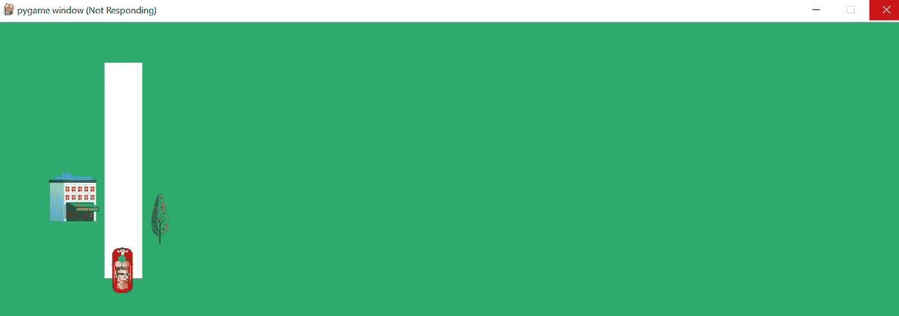

我们现在有相机了。当您运行代码时，您会注意到相机贴在汽车上，工作正常。

现在最后的部分是让赛车检测到赛道的终点。既然我们有相机，我们需要让它看得更远一点。如果白色轨迹结束，我们停止驾驶汽车。

为此，我们声明一个变量`focus_dis`,并给它赋值 25。这意味着它将负责预见未来 25 步。然后我们做一点数学:

```
up_px = window.get_at((cam_x, cam_y - focal_dis))[0]
    if up_px == 255:
        car_y = car_y - 2
```

我们通过使用当前位置值并检查前方轨道是否为白色(255 代表白色)来获得前方轨道的位置。如果是这样的话，我们才移动汽车。

此外，如果你注意到，当我们得到 pygame 窗口，我们的光标仍然在加载。我们将使用以下代码来消除它:

```
for event in pygame.event.get():
        if event.type == pygame.QUIT:
            drive = False
```

就是这样。现在我们的车停在了轨道的尽头。下面是完整的更新代码:

它会产生以下输出:

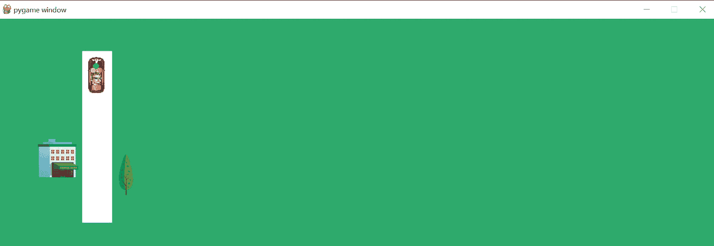

哇！那是我们自己的无人驾驶汽车。

有趣的是:上面的代码不仅能够检测道路的尽头，还能检测是否有任何障碍(就像下面的 track 2 图像所示):


我们的第二跑道有路障。但是我们的特斯拉可以探测到。它看到前面的车道是红色的而不是白色的，所以它停止了行驶。

在上面的代码中，只需将轨道中的图像更改为`‘track2.png’`:

```
track = pygame.image.load("track2.png")
```

现在让我们再次执行代码。它产生以下输出:

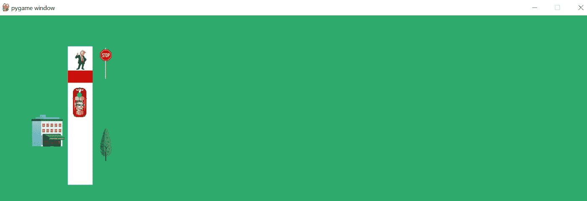

看，我们的车停下来了！我们摇滚。(眨眼)

## 第三步。处理转弯

让我们更进一步。让我们试试将`‘track3.png’`作为我们的赛道:

```
track = pygame.image.load(“track3.png”)
```

执行代码会产生以下输出:

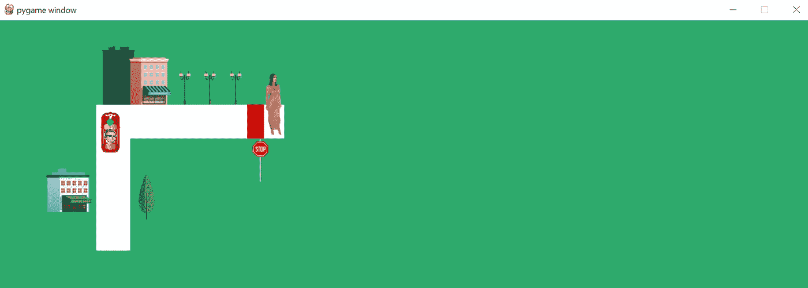

它工作正常。但是现在，我们面临另一个挑战:以一种能够转弯的方式旋转汽车。

哦，请理解这一点:在我们转弯之前，我们的汽车应该知道在那个特定的转弯之后有一条道路/轨道。所以在这个场景中，无论何时车停下来，我们都需要看右边。

我们的汽车停在一个特定的点上，从这里开始它必须水平行驶——也就是说，在 X 轴方向上，而我们的 Y 轴将保持不变。为此，我们将定义另一个负责看到右侧的变量`‘right_px’`，就像我们对`‘up_px’`所做的那样:

```
right_px = window.get_at((cam_x + focal_dis, cam_y))[0]
```

因此，X 轴+焦距和 Y 轴将保持不变。

让我们定义一个变量`‘direction’`，它将跟踪汽车必须移动的方向，让我们将其初始化为`‘up’`:

```
direction = ‘up’
```

现在，我们将有一个`if`条件来防止我们的`up_px`等于 255——也就是说，它不应该是一个白色轨道。如果`right_px`等于 255，这意味着右侧有一条白色赛道，需要转弯:

```
# change direction (take a turn)
    if up_px != 255 and right_px == 255:
        direction = 'right'
```

就是这样。我们有检查`up_px`是否是白色的`if`条件，如果是，它将在 Y 轴移动汽车，记得吗？现在我们简单的加一个`elif`条件，让我们的车向右拐:

```
# drive
    if up_px == 255:
        car_y = car_y - 2
    elif direction == 'right' and right_px == 255:
        car_x = car_x + 2
```

代码现在产生以下输出:

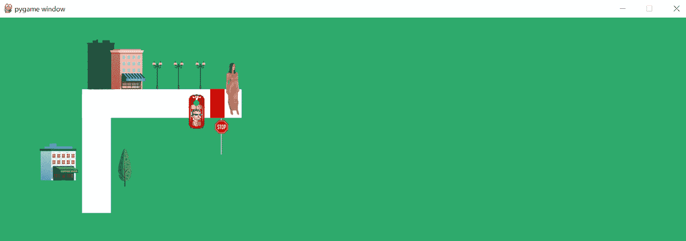

这在一定程度上满足了目的，赛车也在向右转。但是我们也需要旋转汽车，对吗？

我们可以使用`rotate()`方法来做到这一点。它需要两个参数:需要旋转的对象和角度。

```
car = pygame.transform.rotate(car, -90)
```

但当你这样做时，你会注意到车上的摄像头会粘在后面，而我们需要它在前面。为了解决这个问题，让我们定义一个初始化为零的变量`‘cam_x_offset = 0’`。因为我们稍后会更改这个变量的值，所以我们只将这个变量定义为 0。这个变量将决定摄像机的位置。所以当我们转弯的时候，我们也需要改变这个变量的值。

同样，让我们检查一下我们的条件中方向的值。以下是更新后的条件语句:

```
# change direction (take turn)
    if direction == 'up' and up_px != 255 and right_px == 255:
        direction = 'right'
        cam_x_offset = 30
        car = pygame.transform.rotate(car, -90)
```

我们完了。现在应该可以正常工作了。以下是到目前为止更新的全部代码:

让我们看看输出:

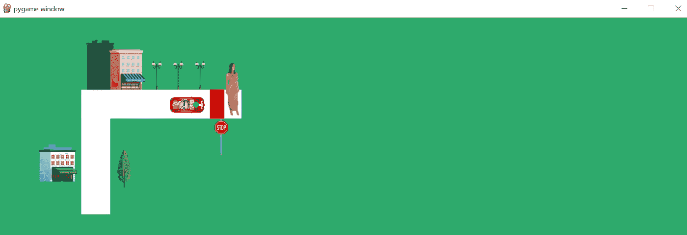

耶！那有效！

## 第四步。新轨道—向下移动

现在，让我们向前看，检查第 4 曲目:

```
track = pygame.image.load("track4.png")
```

执行代码:

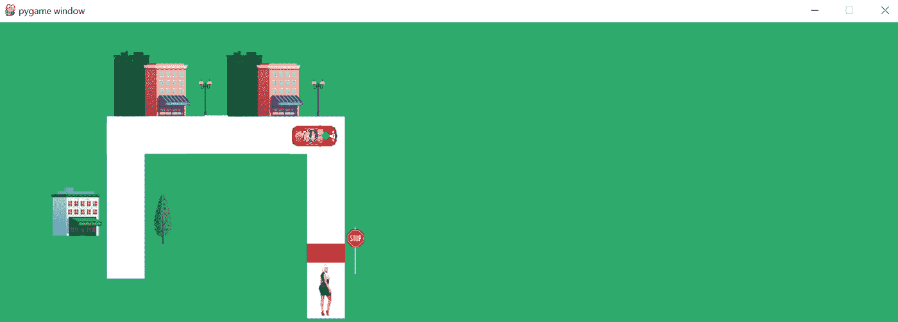

它工作得很好，但这一次，我们需要我们的相机向下看(在输出中可以看到，我们有一个向下的轨迹)，我们的汽车需要再次转弯。现在你知道该怎么做了，对吧？

1.  旋转汽车。
2.  创建`down_px`变量向下看。
3.  设置`cam_y`偏移，设置相机在 Y 轴上的偏移。

就这么简单，对吧？

下面是经过上述更改的更新代码:

执行它会产生以下输出:

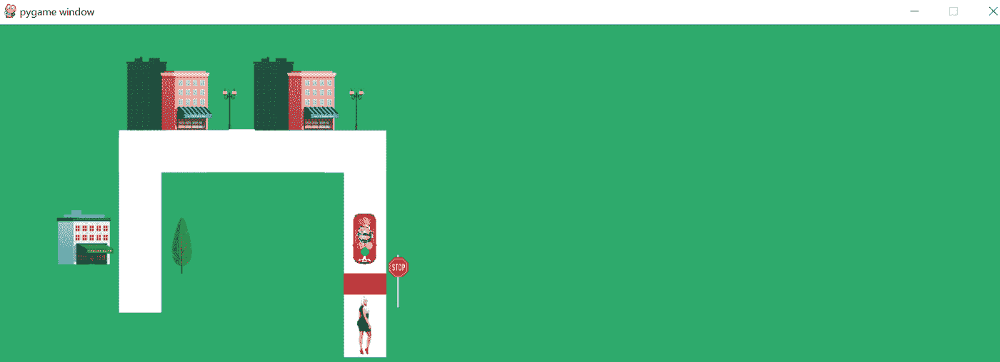

耶！我们的自动驾驶汽车已经在学习自动驾驶了。

## 第五步。新赛道——最终之路

现在，让我们继续，检查第 5 首曲目:

```
track = pygame.image.load("track5.png")
```

让我们看看输出:

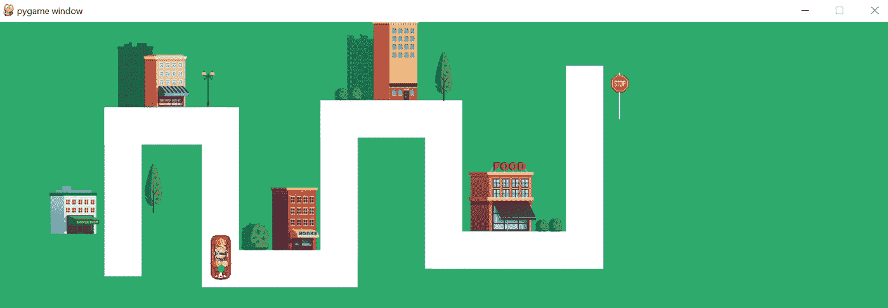

在我们的车左转之前，它一直工作得很好。我们的车现在可以上下左右移动。现在，我们需要做同样的改变，并处理条件，使我们的车左转。为什么离开？假设你在车里(绿点是前面的摄像头)。

```
elif direction == 'down' and down_px != 255 and right_px == 255:
        direction = 'right'
        car_y = car_y + 30
        cam_x_offset = 30
        cam_y_offset = 0
        car = pygame.transform.rotate(car, 90)
```

这会让我们的车左转。让我们看看输出:

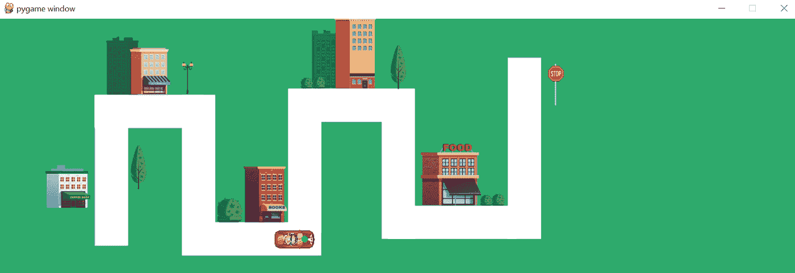

我们做到了。现在最后一件事就是再次制作方向`up`并处理好车和相机位置。

同样的条件是:

```
elif direction == 'right' and right_px != 255 and up_px == 255:
        direction = 'up'
        car_x = car_x + 30
        cam_x_offset = 0
        car = pygame.transform.rotate(car, 90)
```

让我们执行代码来查看输出:

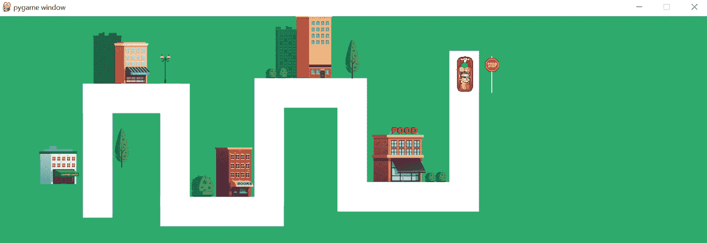

有用！我们已经处理了所有的方向，现在我们的汽车将能够在任何赛道上自动驾驶。试试`‘track6’`来验证一下。

```
track = pygame.image.load("track6.png")
```

最终执行会产生以下输出:

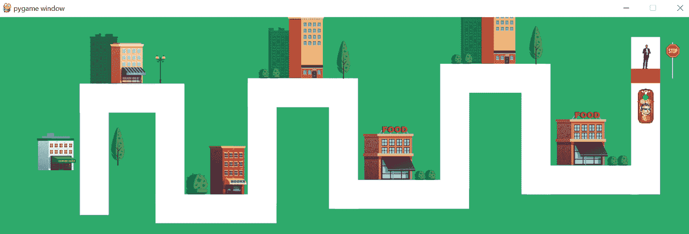

哇，我们做到了。你有自己的无人驾驶汽车。你奶奶和埃隆·马斯克会为你骄傲的。

# **整码**

程序员总能免费得到任何东西。特斯拉也不例外。享受旅程。