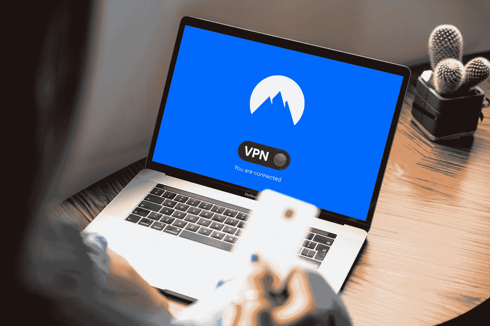
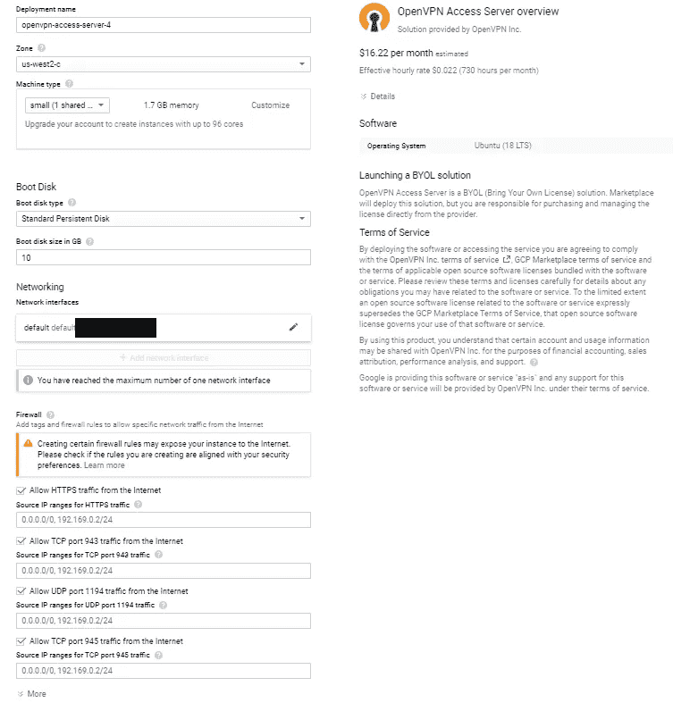
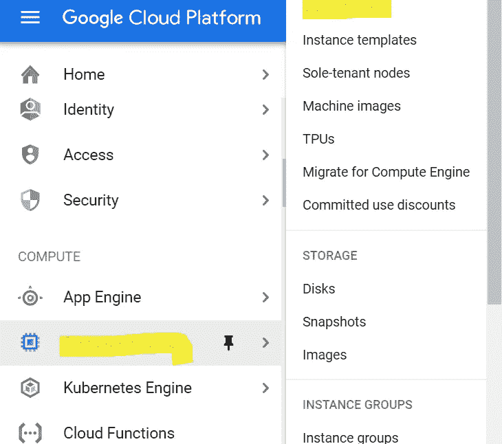
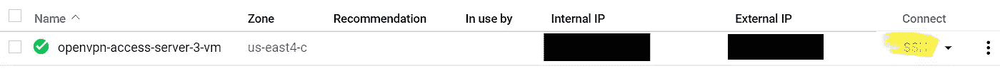
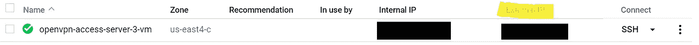
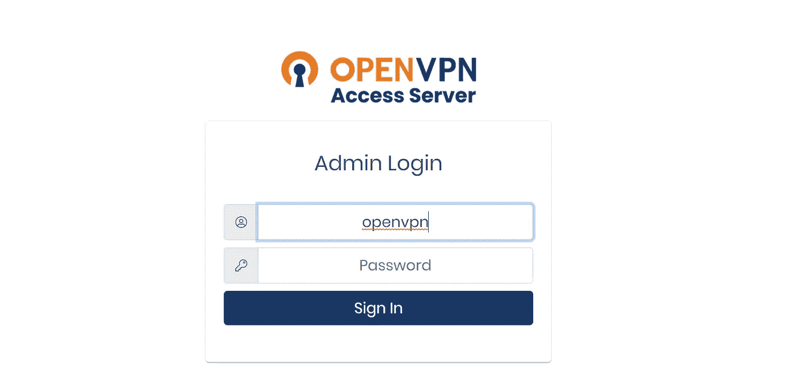
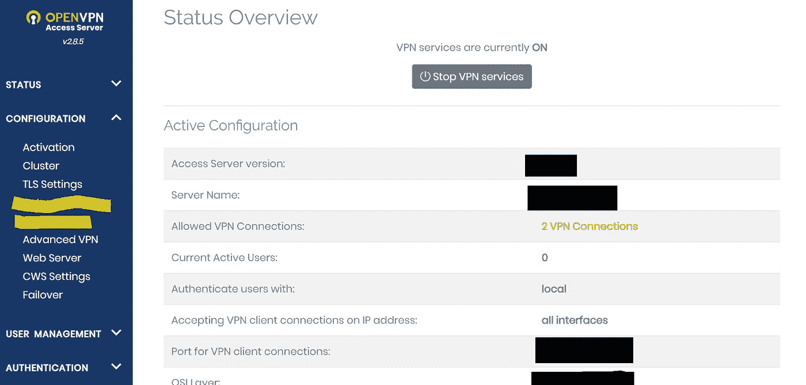
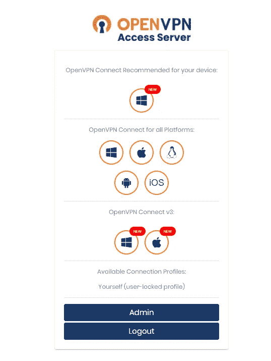

# 使用谷歌云平台构建自己的 VPN

> 原文：<https://betterprogramming.pub/build-your-own-vpn-using-google-cloud-platform-2e22b0a7d489>

## 创建您自己的免费解决方案来保持您的信息加密



彼得·拉格森在 [Unsplash](https://unsplash.com?utm_source=medium&utm_medium=referral) 上的照片。

VPN(或虚拟专用网络)是一种对您的信息进行加密的软件，这样黑客或您的互联网提供商就无法看到您的信息。然而，这带来了很大的溢价，你不能总是信任 VPN 提供商或任何人来保护你的在线信息安全。毫无疑问，对于敏感信息(如信用卡、搜索历史、密码)，你唯一应该信任的人就是你自己。

建立一个定制的 VPN 比使用 VPN 提供商有很多好处。它们包括对数据的控制、对设备的远程访问(例如打印机和色调灯)、定制的 VPN、改进的性能、经济性等等。

# 创建您自己的 VPN

1.  进入 [OpenVPN](https://openvpn.net/google-cloud-vpn/) 网站，找到“GCP 接入服务器”然后点击“开始”
2.  一旦点击，它会把你转到谷歌云平台网站。您应该看到 OpenVPN 访问服务器下面有一个启动按钮。点击“启动”
3.  它将提示您创建(或登录)一个 GCP 帐户。对于新会员，它提供一年的免费试用和 300 美元的信用(必须在试用期内使用)。
4.  在您创建或登录到您的帐户后，它会将您带到 GCP 部署管理器，并显示所有的 OpenVPN 设置。滚动到底部，然后按“部署”



OpenVPN GCP 配置

5.部署 OpenVPN 应该需要一段时间。部署后，导航至虚拟机实例控制面板(导航菜单



导航到虚拟机实例

6.在 OpenVPN 虚拟机面板中，您应该在“连接”下看到“SSH”点击它。它应该会打开一个新窗口，其中有一个终端。这是你的虚拟机。



导航到 SSH

7.我们已经正式创建了 VPN。现在我们必须访问它，但在此之前，让我们通过在终端中键入`sudo passwd openvpn`来更改 VPN 的密码。它应该输出一个输入字段。键入您的密码。键入密码时，看起来您没有键入任何内容，但它只是隐藏了您键入的内容。

8.回到 GCP 网站，特别是虚拟机实例控制面板。转到 OpenVPN VM，应该有一个外部 IP 列。复制那串数字。



导航到虚拟机外部 IP

9.打开一个新标签并键入:

```
https://{external IP}/admin 
```

*提示:如果显示连接不是私有的，请单击“高级”，如果您想继续下一步，请单击“转到外部 ip”。*

10.将显示一个登录页面。用户名是 OpenVPN，密码是您在终端中设置的。登录。



OpenVPN 登录

11.将显示一个仪表板。这是您可以编辑 VPN 的地方。开始时，只有几个设置需要更改。第一个是让客户端的流量通过 VPN。要启用它，请转到配置< VPN Setting < Routing < ”Should client Internet traffic be routed through the VPN?” < Enable. And the second one is to change the network setting. To edit it, go to Configurations < Network Settings. Make sure to save your changes.



OpenVPN dashboard

12\. To enable the VPN on a device, go to:

```
https://{external IP}
```

And download the supported app for the selected device.



OpenVPN download page

13\. After downloading, open the app. It should already be logged into your IP address. Enable the VPN. Now all of your information passed from that device is encrypted.

# Conclusion

You have made a full-fledged free VPN that can mask your IP, encrypt data, and more. This is one way that cloud computing can make your life cheaper, easier, and more efficient.

*注意:一年后，这种配置的虚拟机将需要付费。此外，OpenVPN 只允许两个用户同时访问 VPN。*