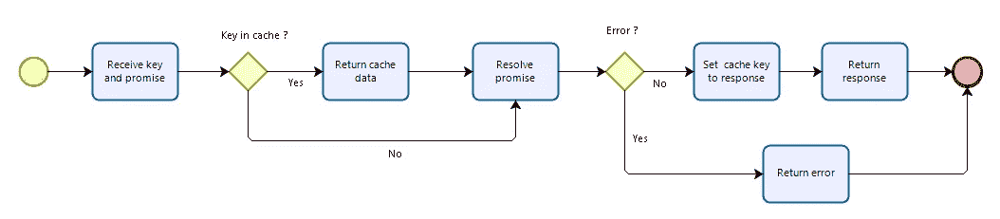

# 建立自己的 Vue 3 SWR 钩

> 原文：<https://betterprogramming.pub/build-your-own-vue-3-swr-hook-f54124ee6ed6>

## 管理和共享通用逻辑和功能


在 [Unsplash](https://unsplash.com?utm_source=medium&utm_medium=referral) 上由[米米·蒂安](https://unsplash.com/@mimithian?utm_source=medium&utm_medium=referral)拍摄的照片

版本 3 就在眼前，组合 API 带来了一些令人兴奋的可能性，比如构建类似 React Hook 的函数来帮助管理和共享公共逻辑和功能

我们可以利用钩子的一个例子是使用 SWR，*过时，而重新验证*。这是一种在即时性(立即加载缓存内容)和新鲜性(确保更新缓存内容)之间保持平衡的策略。

如今，现代浏览器已经支持动态使用这一特性，但为此，API 必须在响应中发送特定的头。您可以在本文的[中了解更多关于这种方法的信息。](https://web.dev/stale-while-revalidate/)

这种方法的问题是，有时您使用其他人的 API，改变响应头不是一个可行的选择。为了解决这个问题，我们将构建我们自己的定制钩子，可以在您的所有组件中重用。

因此，让我们动手做点什么，然后构建一个简单的解决方案。

# 这个计划

首先，让我们定义我们将要做什么。我制作了一个简单的流程图来解释这个钩子是如何工作的:



我们将收到一个密钥来标识要解决的请求和承诺。然后我们检查这个键是否已经存在于缓存中。如果是这样，我们通知调用者缓存的值。然后，我们解析承诺(无论是否有缓存的结果)并将结果通知调用者:如果成功，我们更新缓存并将更新后的值通知调用者，否则，我们通知调用者解析承诺时出错。

你可能会问为什么它是一个承诺，而不是我们调用的 API 的 URL。通过使用一个承诺作为输入，而不是 URL，我们给出了这个钩子在任何情况下使用的选项，结果依赖于一个承诺，不管它是不是一个 API 调用。即使它将仅用于 API 调用，我们也将保留调用者选择使用哪种方法的权利:原生获取 API、Axios、jquery 的 AJAX、Angular 的$http 或互联网上可用的许多解决方案中的任何其他解决方案。

# 开始项目

为了制作我们的小项目，我们将使用 [Vite](https://github.com/vitejs/vite) 。这是一个由尤雨溪(vue 的创建者)启动的开发服务器和生产捆绑器，它使用 es 模块导入服务代码，并使用 [Rollup](https://rollupjs.org/guide/en/) (一个由 Rich Harris 创建的捆绑器，Svelte 的创建者)捆绑代码用于生产。这比使用传统的基于 vue-CLI web pack 的方法要快得多，尤其是在开发模式下。由于不涉及捆绑，服务器启动和浏览器刷新几乎是即时的。

为了开始我们的项目，我们需要安装 node(如果你没有，点击[这里](https://nodejs.org/en/download/)下载并安装 LTS 版本)，我建议安装 yarn(了解如何安装它[这里](https://yarnpkg.com/getting-started/install))，一个取代 npm (node 的本地包管理器)的包管理器，因为 yarn 在大多数情况下比 npm 快。

安装了 node 和 yarn 后，转到您的终端的根文件夹，在那里您要创建您的项目，并使用以下命令:

```
yarn create vite-app my-swr-hook
```

几秒钟后，这个过程就完成了，我们可以使用下面的命令安装所有的依赖项并运行项目:

```
cd my-swr-hook
yarn
yarn dev
```

现在只需打开浏览器并导航到 [http://localhost:3000](http://localhost:3000) 来检查默认应用程序的运行情况。

# 钩子

现在是时候构建我们的定制钩子了。我们在 src 中创建一个 hooks 文件夹，然后创建一个 swr.js 文件。

我们将首先创建一个全局缓存和将被导出的函数，并完成我们需要的所有工作。通过将缓存放在返回的函数之外，我们确保它是唯一的，并且可以被所有调用者访问。该函数将接收一个键和一个承诺，并将返回缓存的值(如果存在)。之后，我们将解析承诺并更新缓存和/或返回相应的响应。我们将对函数使用命名导出(这只是个人偏好):

这段代码给我们带来了一个很大的问题，因为无论我们有没有缓存的值，我们都将解析承诺并返回更新后的值(或错误)。但是在我们的代码中，如果我们得到了缓存的值，它就会被返回，就这样。使用这种方法，我们无法继续前进，也无法兑现我们重新验证缓存的承诺。另一个问题是，我们返回两种响应，一种是纯数据(来自缓存)，另一种是承诺。错误处理有点粗糙。

为了完成这项工作，我们将使用 Vue 的组合 API [ref](https://composition-api.vuejs.org/api.html#ref) 。该实用程序创建一个反应性的可变对象。通过使用这个方法，我们所要做的就是返回反应常数，调用者会得到通知。我们将从缓存的键值或 null(如果键不存在)开始这个常量。为了避免调用者改变我们状态的可能性，我们将使用另一个组合 API 功能，`[readonly](https://composition-api.vuejs.org/api.html#readonly)`。我们的钩子代码的第二个版本现在看起来像这样:

好多了，但是还有提升的空间。我认为我们可以添加一个可选的参数来加载初始状态(如果还没有在缓存中)并返回其他参数，以便调用者知道我们是否在重新验证，是否发生了错误(以及是哪个错误)。因为现在我们返回多个值，所以创建一个包含所有键的状态对象并相应地更新它们是一个更好的主意。这种情况下，[电抗](https://composition-api.vuejs.org/api.html#reactive)比 ref 更合适。为了使调用者能够使用析构并获得单独的反应值，我们必须做的另一个改变是利用组合 API 实用程序`[toRefs](https://composition-api.vuejs.org/api.html#torefs)`。

另一个我认为很酷的功能是添加`localStorage`。有了这个附加功能，如果在过去的任何时候已经调用过该键，用户将立即获得数据。为了在数据改变时自动保存状态，我们可以使用`[watchEffect](https://composition-api.vuejs.org/api.html#watcheffect)`。我们将把`localStorage`的`setItem`方法包装在一个 try-catch 中，以避免当提取的数据超过限额时出现问题，这将使我们的应用程序停止工作。

经过这些最后的修改，我们的定制钩子已经可以使用了

# 演示应用程序

为了使用我们的钩子并展示它相对于原始承诺的优势，我们将使用 [cdnjs 公共 api](https://cdnjs.com/api) 构建一个简单的应用程序。我们将显示一个 JavaScript 库列表，当用户点击其中一个时，我们将获取该库的信息并显示在屏幕上。

让我们在 components 文件夹中创建一个新文件 Libraries.vue。该组件将负责获取和呈现库列表。我们将使用 composition API，并在用户单击任何项目时调度一个事件，因此应用程序组件可以知道选择了什么库，并因此触发库细节获取和呈现。

现在让我们更改 App.vue 文件来呈现列表。我们还将添加一个选定的 ref 来接收从`Libraries`组件发送的事件。

您会注意到，第一次加载应用程序时，`Library`组件会显示正在加载，几秒钟后列表就会呈现出来。由于我们已经将数据存储在浏览器的`localStorage`中，从第二次开始列表将立即呈现。但是如果你在浏览器的开发者工具中打开网络标签，你会注意到每次你刷新页面时，请求仍然会在后台发出。如果返回的数据与存储的不同，列表和`localStorage`值将由我们的`swr`钩子更新。

现在让我们构建我们的`Library`组件，它将负责获取和呈现关于所选库的信息。该信息将由从`App`组件传递的 props 接收。我们将呈现由`cdnjs`提供的一些信息。如果你想检查返回的数据格式，你可以在这里检查 vue 链接[。](https://api.cdnjs.com/libraries/vue)

让我们编码:

准备好`Library`组件后，是时候改变我们的`App`组件了，这样如果选择了一个库，就会呈现出`Library`组件。这里需要特别注意的一点是，如果我们在模板中使用`Library`组件，它将只被渲染一次，并且只获取关于第一个选择的库的信息。

有很多方法可以解决这个问题，比如在`Library`组件中给名称道具添加一个手表，但是有一个更简单的方法:使用关键道具。如果我们在每次选择一个新的库时添加一个与所选库名称相关联的密钥属性，密钥就会更新，并且`Library`组件会重新呈现，这样就解决了我们的问题。

所以我们的`App`组件看起来会像这样:

像在`Library`组件上一样，您会注意到第一次单击一个库时，会显示加载消息，并且在库信息呈现后不久就会显示。如果您单击另一个，然后单击您已经单击的一个，信息将立即呈现，并且将在后台发出获取请求，以检查响应是否仍然相同。

这样我们就实现了我们的目标——尽快将数据呈现给我们的客户，在后台重新验证并更新数据。您可以做一些改进，比如添加一个生存时间参数，以便在它之后立即进行重新获取，或者添加一些额外的错误检查。我将把这作为家庭作业:进行新的实现，使代码适合您的需要。

工作应用程序的源代码可以在我的 [github](https://github.com/n0n3br/medium-article-svelte-3-swr) 中找到。

一如既往地欢迎任何建议或意见。

希望你喜欢这篇文章，并学到一些新东西。

下一篇文章再见。