# 用 Next.js 和 Strapi 建立你的个人博客

> 原文：<https://betterprogramming.pub/build-your-personal-blog-with-next-js-and-strapi-e092bf11d3db>

## CMS 与前端集成指南

由[卢卡斯·布拉塞克](https://unsplash.com/@goumbik?utm_source=medium&utm_medium=referral)在 [Unsplash](https://unsplash.com?utm_source=medium&utm_medium=referral) 上拍摄。

在本文中，我们将了解以下内容:

*   内容管理系统的目的
*   如何使用 [Strapi](https://strapi.io/)
*   结合 [Next.js](https://nextjs.org/) 和 Strapi 构建一个静态网站

# 介绍

假设您正在使用 Next.js 框架构建一个博客。要添加博客文章，您需要执行以下操作:

*   导航到项目中的`/pages/article`文件夹。
*   在那里，您必须创建一个名为`1.js`的文件，这样如果用户前往`/article/1`路线，Next.js 就可以呈现您的第一篇博文。
*   稍后，要添加更多的博客文章，您需要创建`2.js`、`3.js`，等等。

虽然这种解决方案是可行的，但是请注意，随着时间的推移，它会变得更加乏味、耗时和重复。要添加更多内容，您需要手动创建一个新文件。有没有办法让这个过程变得更简单？

这就是 CMS(内容管理系统)的用武之地。通过这个软件，你可以毫无困难地编辑你网站的内容。你需要筛选代码来对你的网站进行简单编辑的日子已经一去不复返了。通过 CMS，你只需点击几下就可以修改或上传博客文章。

CMS 的一个著名例子是 Strapi。

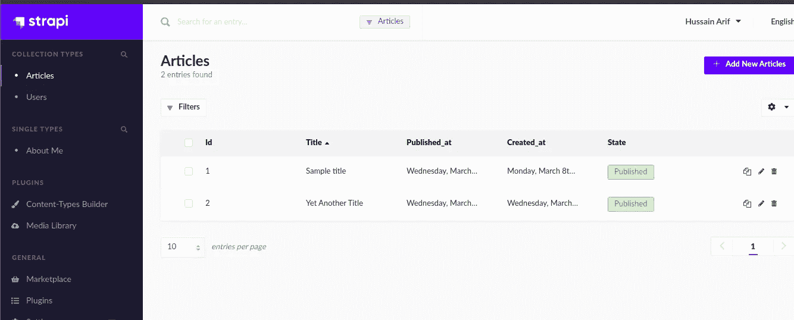

CMS 的一个关键优势是它允许作者在没有任何代码或麻烦的情况下写博客。事实证明，这对博客作者来说是一个很有吸引力的选择，因为这让他们的工作变得更容易。

总的来说，如果你想让你的博客更容易管理，CMS 真的能帮上忙。

既然我们已经介绍了基础知识，那就让我们开始吧！

# CMS

## 设置

要设置 Strapi，请运行以下终端命令:

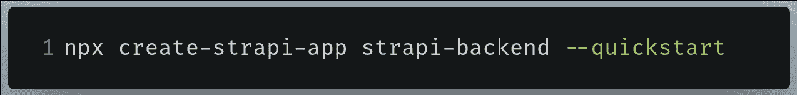

初始化 Strapi 的命令

接下来，运行以下命令来配置 CMS:

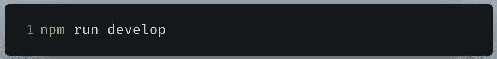

配置 CMS 的命令

这将是您终端中的输出:

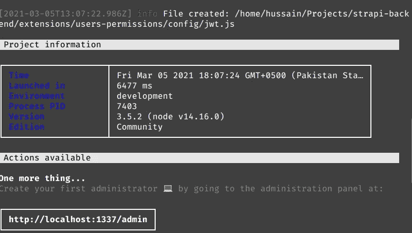

终端中的输出

如您所见，Strapi 请求我们配置我们的项目。为此，导航至`localhost:1337/admin`页面。在那里，创建您的凭证来设置您的 CMS。

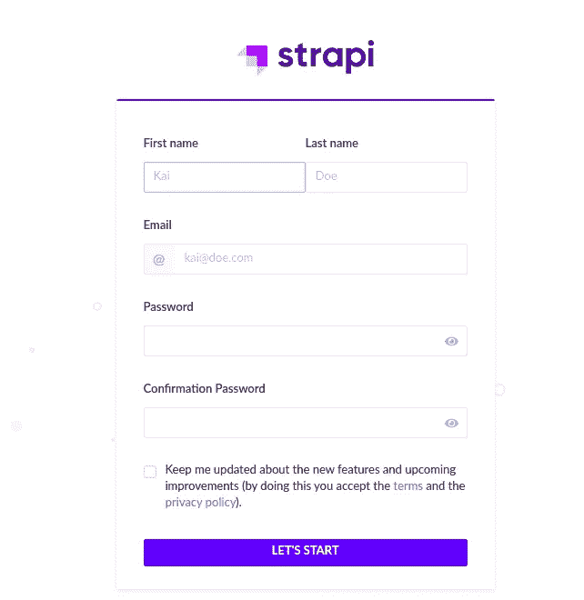

在此创建您的凭据。

创建凭据后，您将看到以下页面:

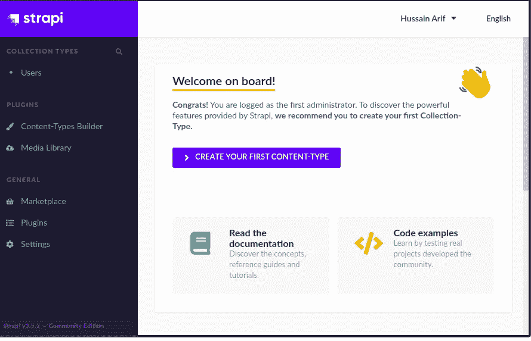

仪表板页面

我们现在完成了第一阶段。在下一步中，我们将学习内容类型插件。

## 内容类型生成器

根据 [Strapi 文档](https://strapi.io/documentation/user-docs/latest/content-types-builder/introduction-to-content-types-builder.html)，它是 CMS 最重要的插件之一。在这里，您将能够创建集合和单个类型。我们将在本文的后面了解这些。

在侧面板中，单击插件类别下的“内容类型生成器”。

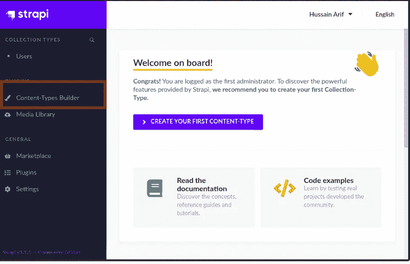

点击“内容类型生成器”

我们将首先构建一个简单的集合类型。为此，请单击“创建新的集合类型”

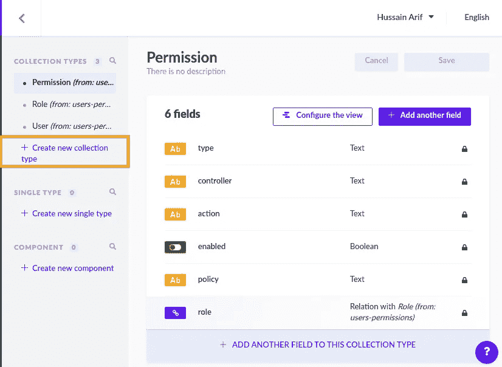

点击“创建新的收藏类型”

在对话框中，将“显示名称”字段设置为“文章”，然后单击“继续”继续:

在“显示名称”字段下填写“文章”。

之后，Strapi 会提示您向新创建的集合类型添加字段。创建一个名为“标题”的字段，然后单击“完成”继续:

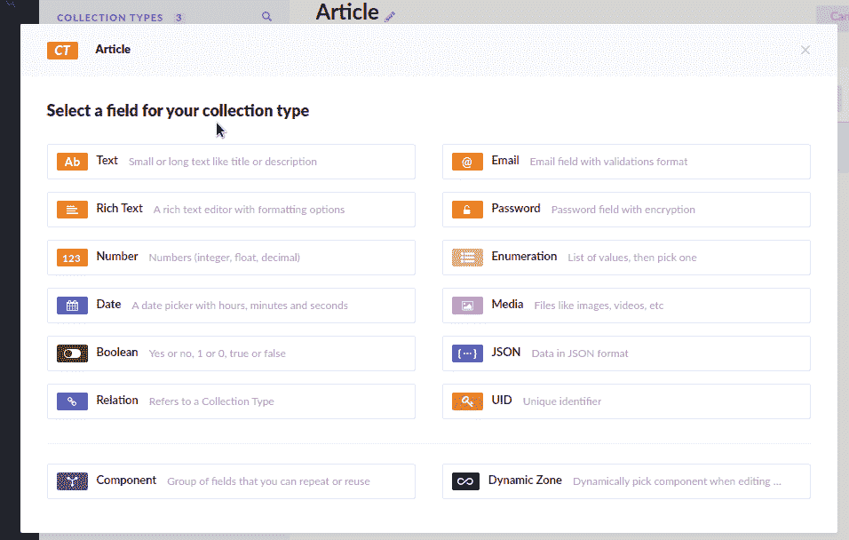

创建一个新字段。

现在点击“添加另一个字段”，然后点击“富文本”将此命名为“身体”:

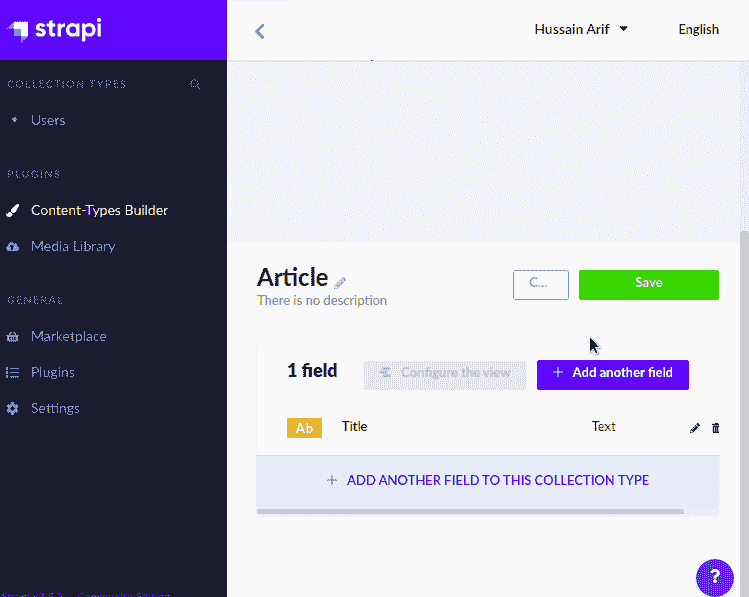

添加富文本字段。

现在让我们来分解这个过程。这是我们到目前为止所做的:

*   创建了名为“Article”的集合类型
*   告诉 Strapi 我们的文章将有两个字段。
*   第一个字段是“标题”，属于文本类型。
*   第二个字段是“Body”，属于富文本类型。

这意味着我们可以创建一个文章集合，稍后由 Next.js 呈现。

现在，我们需要做的就是保存我们的更改。点击右上角的“保存”按钮。

点击“保存”

如果我们的过程成功，那么您应该会在面板中的集合类型类别下看到“Articles”。

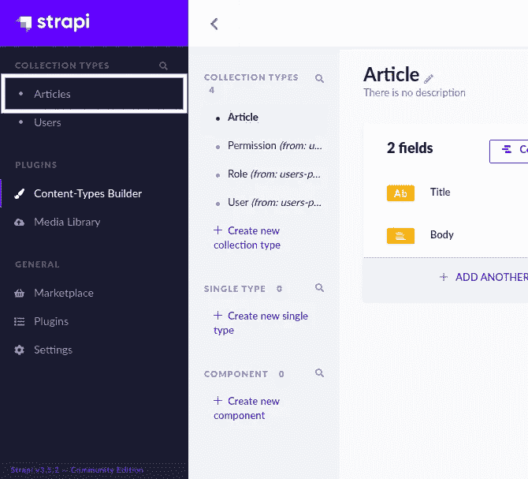

我们成功了！

如你所见，我们成功了！我们最终实现了一个“文章”集合。

我们现在需要创建一个单一类型。点击侧面板上的“创建新的单一类型”按钮。

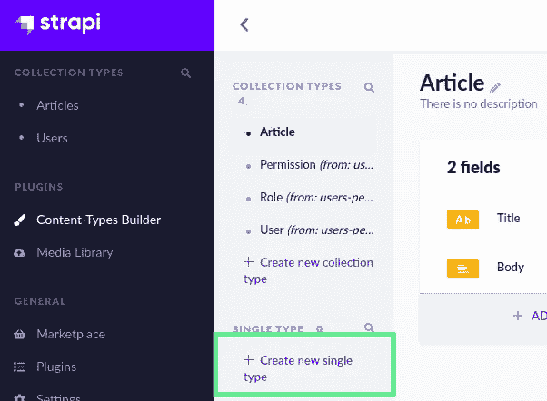

创建单一类型。

接下来，将这种类型命名为“关于我”，并为其分配一个名为“Body”的文本字段:

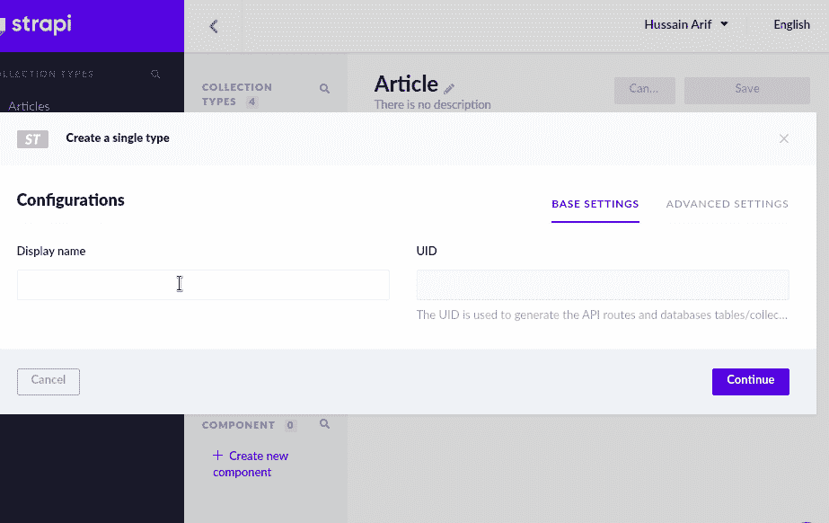

给我们的单个类型一个文本字段。

现在，单击“保存”以完成您的更改。“关于我”单一类型现在应该出现在侧面板中。

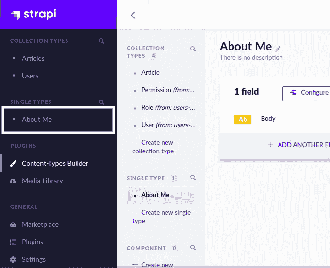

我们成功了！

到目前为止，这就是我们所做的:

*   告诉 Strapi 我们需要一个名为“关于我”的单一类型。
*   这种类型只有一个名为“Body”的文本字段

简单来说，单一类型是指不属于集合的内容(例如，餐馆菜单、关于我的页面或页脚)。

现在让我们用 Strapi 写第一篇文章。

## 写文章

在侧面板中，点击“文章”接下来，点击“添加新文章”按钮。这将允许您向“文章”集合添加新项目。

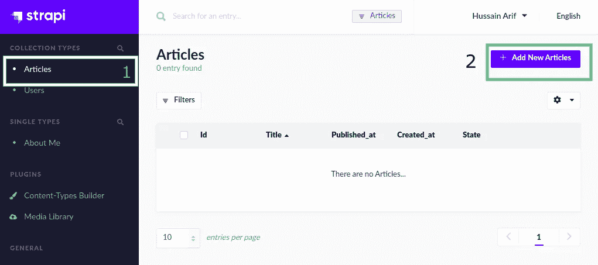

创作文章。

现在您将看到一个页面，允许您为集合创建一个条目。让我们创建一些数据。富文本字段接受降价代码。

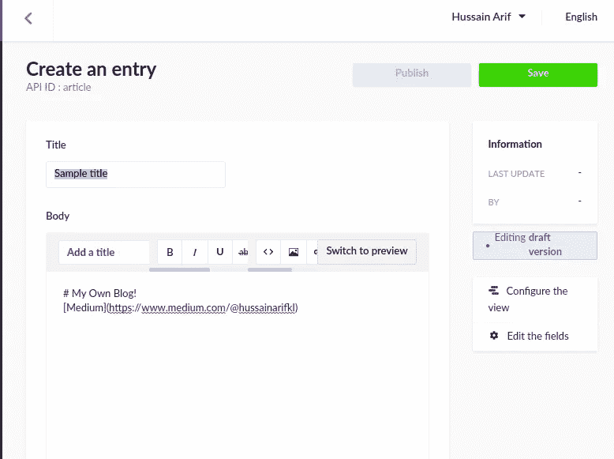

创建条目。

在这些字段中输入一些数据后，点击“保存”Strapi 保存您的条目后，单击“发布”按钮。

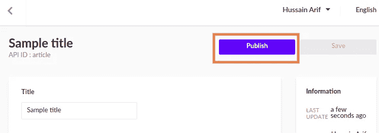

发表你的文章。

这将为您提供以下输出:

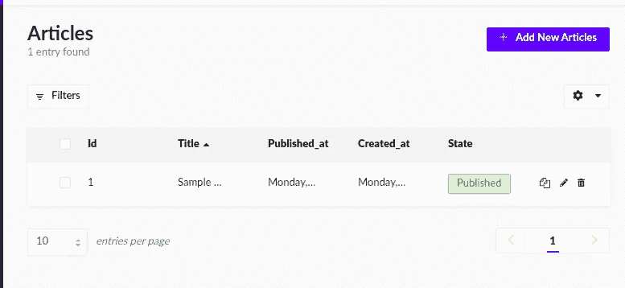

文章现已发表。

恭喜你！我们发表了第一篇博文。

我们现在已经完成了这一部分。现在，让我们将数据输入到“关于我”单一类型中。

## “关于我”页面

在侧面板中，单击“关于我”，并在文本字段中输入一些文本。完成此步骤后，单击“保存”

写一篇关于我的文章。

最后，发表你的参赛作品。

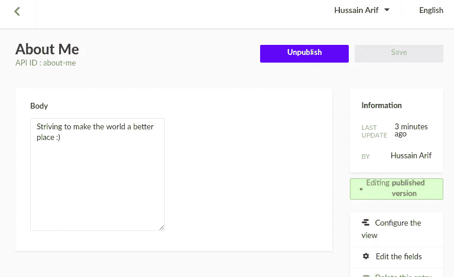

发布条目。

我们完了。我们现在将通过 GET 请求提取这些数据。

## 获取数据

既然我们已经写好了博客文章，我们需要执行一个简单的获取请求，这样我们就可以在前端显示它们。现在，让我们通过命令行执行一个`GET`请求，如下所示:

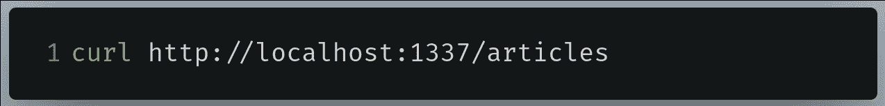

通过命令行获取文章。

这将是结果:

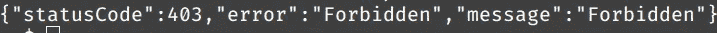

错误！

我们收到的不是我们的博客帖子列表，而是一个 403 错误。为了解决这个问题，我们需要在 Strapi 的安全设置中更改公共访问。

为此，单击侧面板中的“设置”。

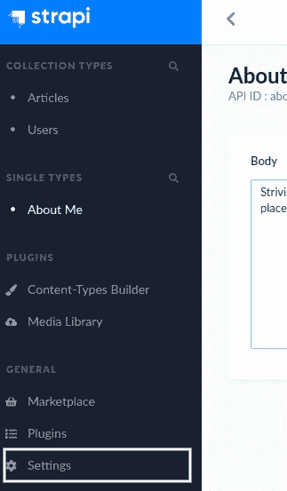

点击“设置”

现在点击“用户和权限插件”部分下的“角色”:

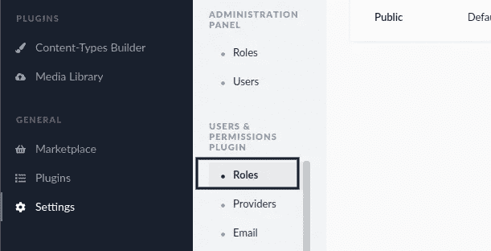

点击“角色”

之后，点击“角色”部分下的“公共”:

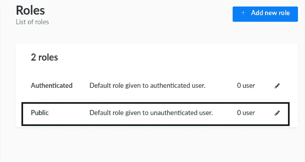

点击“公共”

完成后，向下滚动到“权限”部分。在“应用程序”下拉菜单下，检查以下选项:

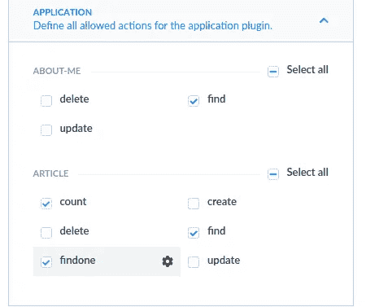

检查以下选项。

我们现在已经告诉 Strapi，以下信息应该公开:

*   “关于我”单式的内容(即`find`动作)。
*   “文章”集合中的内容和项目数。换句话说，`count`、`findone`和`find`动作是公共的。

让我们来测试一下。运行以下终端命令来获取文章列表:

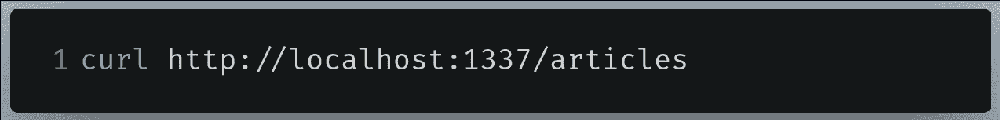

获取文章。

这将是输出:

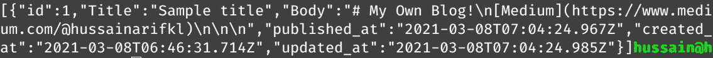

结果

如您所见，我们的“Articles”集合中有一系列项目。

接下来，运行命令以获取“关于我”单一类型中的内容:

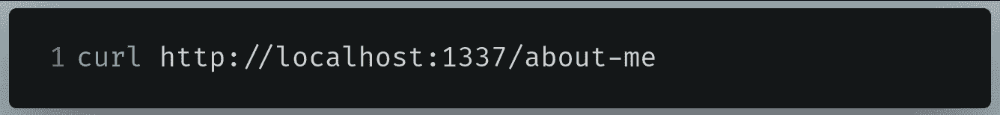

从“关于我”中获取数据

这将是输出:

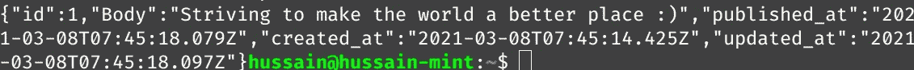

命令的结果

太好了！一切正常。

我们现在已经完成了这一部分。在下一节中，我们将使用 Next.js 开发一个前端来在网页上显示我们的文章。

# Next.js 前端

## 设置

要初始化 Next.js 项目，请运行以下终端命令:

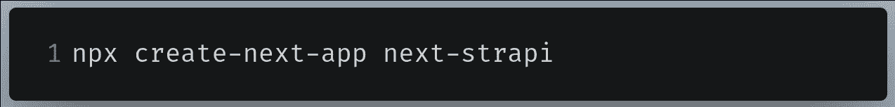

初始化我们的 Next.js 存储库。

在您的项目中，导航到`/pages/index.js`文件并找到下面这段代码:

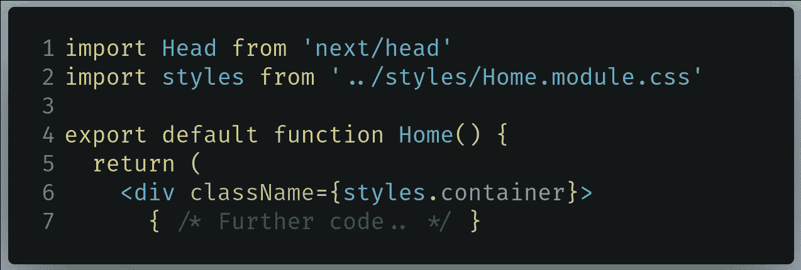

要在/pages/index.js 中查找的代码

删除父`div`标签之间的代码。最后，`/pages/index.js`应该是这样的:

*   第 7 行:设置主页的标题。

运行代码。这将是结果:

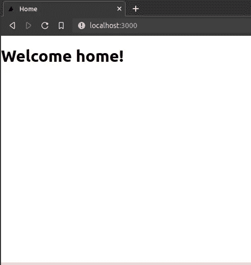

代码的输出

完成后，我们现在将设置我们的配置变量。

## 配置变量

现在，我们需要一个名为`url`的变量。这将指向我们的 Strapi CMS 的位置。在开发过程中，Strapi 的 URL 将是`http://localhost:1337/`。

在你的项目文件夹的根目录下，创建一个名为`config`的文件夹。在`/config`中，创建一个名为`next.config.js`的文件。

在`/config/next.config.js`中，编写以下代码:

*   第 1 行:`production`布尔值将告诉我们是否处于生产环境中。
*   第 3 行:如果我们在生产中，那么`url`变量应该是您部署的 Strapi 实例的 URL。否则应该指向`https://localhost:1337/`。

在下一步中，我们将安装这个项目所需的包。

## 安装所需的库

我们将只安装一个软件包:

*   react-markdown:由于我们的博客文章将用 markdown 编写，这个包将呈现 Markdown 代码并用 HTML 替换它。

运行以下终端命令:

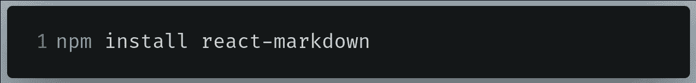

安装软件包。

现在让我们在网页上显示我们的博客文章列表。

## 显示数据

在`/pages/index.js`中，首先导入我们之前创建的`url`配置变量，如下所示:

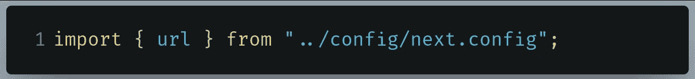

要写入/pages/index.js 的代码

现在，在文件末尾添加以下代码:

*   第 1 行:`getStaticProps`方法告诉 Next.js 应用静态端生成从我们的 CMS 获取数据。
*   第 2-3 行:获取文章列表，然后将这些数据转换成 JSON。
*   第 6 行:将这个列表导出为道具。
*   第 9 行:`revalidate`属性告诉 Next.js 重新生成页面需要等待多长时间。在这里，我们希望每秒后执行一次再生。

第二步，在`/pages/index.js`中找到以下代码:

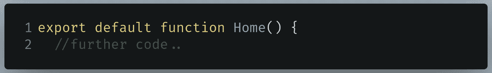

要在/pages/index.js 中查找的代码

像这样改变它:

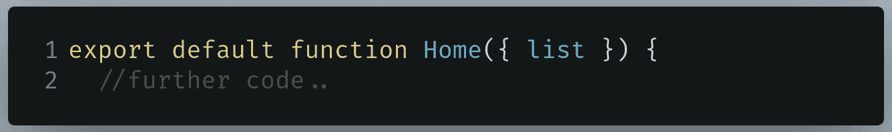

在/pages/index.js 中替换的代码

这条线允许我们在`Home`组件中引入`list`支柱。

现在找到`/pages/index.js`中的`return`块:

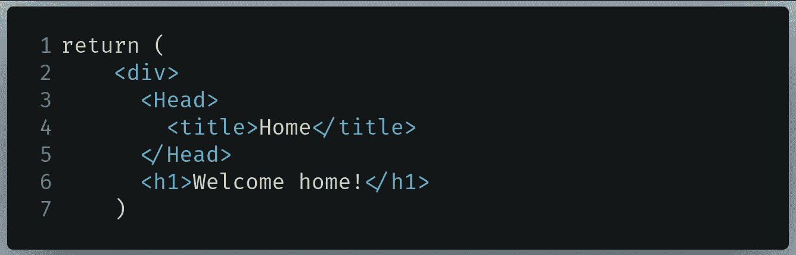

要在/pages/index.js 中查找的代码

然后像这样替换它:

*   第 8 行:使用`map`方法获取`list`数组中的所有项目。
*   第 10 行:当点击时，每一项都会指向`/article/$id` URL，其中`$id`是数组中该项的 ID。此外，该步骤实现了动态路由。
*   第 11 行:只显示项目的`Title`字段。

运行代码。这将是结果:

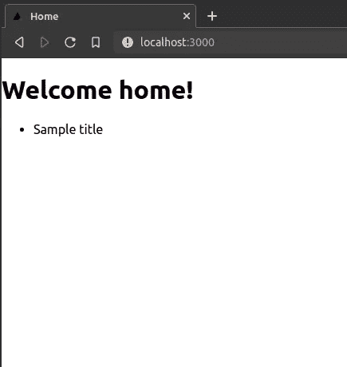

代码的输出

太好了！我们的代码有效。让我们通过添加另一篇博文来进一步测试它。为此，返回到 Strapi 管理面板，向您的“文章”集合添加另一个条目:

在 Strapi 中添加另一篇博客文章。

发布后，刷新页面。这将是结果:

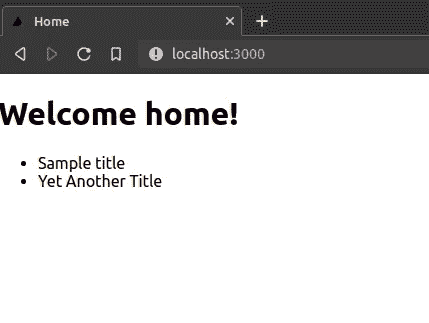

代码的输出

瞧啊。如您所见，我们现在可以生成新的博客文章，而无需进一步编码。

最后，`/pages/index.js`应该是这样的:

## 查看文章

以前，我们实现了动态路由。点击时，每一项都会将我们重定向到`/article/$id`页面。留给我们的就是处理这个 URL。

在您的`/pages`目录中，创建一个名为`article`的文件夹。在`/pages/article`文件夹中，创建一个名为`[id].js`的文件。

在`/pages/article/[id].js`中，编写以下代码:

要写入/pages/article/[id]的代码。射流研究…

现在运行代码。这将是结果:

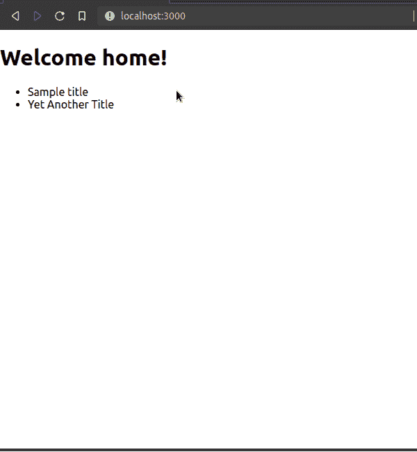

代码的输出

现在让我们从博客文章中提取内容，然后显示它们。

在`/pages/article/[id].js`中，首先导入`url`配置变量和`ReactMarkdown`包，如下所示:

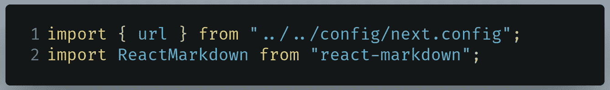

要写入/pages/article/[id]的代码。射流研究…

接下来，在文件末尾编写以下代码:

*   第 1 行:使用静态端生成来获取数据。`context`变量将帮助我们提取 URL 中的参数。
*   第 2-3 行:根据当前 URL 获取文章数据。例如，如果用户在`/article/3`处，则使用`3`的`id`对商品执行提取请求。
*   第 6 行:返回文章数据作为道具。
*   第 7 行:告诉 Next.js 每秒执行[增量站点再生](https://nextjs.org/docs/basic-features/data-fetching#incremental-static-regeneration)。
*   第 9 行:使用`getStaticPaths`静态生成路径。
*   第 13 行:将每个项目的所有`id`字段保存在一个单独的数组中。
*   第 17 行:返回 Next.js 需要生成的所有路径的列表。`fallback`属性告诉 Next.js，如果用户转到未生成的路径，则显示 404 错误。

现在我们已经导出了相关的文章数据，我们需要显示它们。在`/pages/article/[id].js`中，找到下面这段代码:

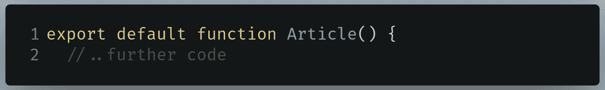

要在/pages/article/[id]中查找的代码。射流研究…

用下面这段代码替换它:

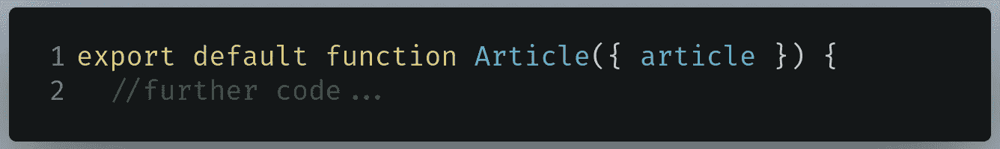

要写入/pages/article/[id]的代码。射流研究…

此外，找到您的`return`块:

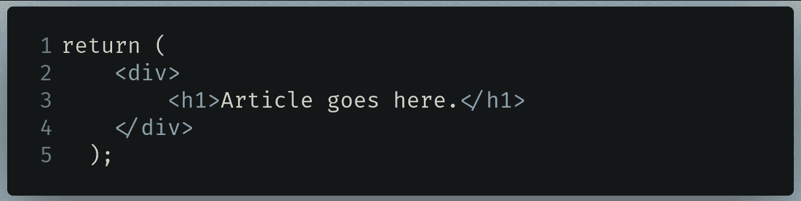

要在/pages/article/[id]中查找的代码。射流研究…

现在像这样替换它:

要写的代码/pages/article/[id]。射流研究…

*   第 3 行:在 header 元素中显示标题。
*   第 4 行:显示带有`ReactMarkdown`组件的主体。这将呈现 Markdown 代码并将其转换为 HTML。

运行代码。这将是结果:

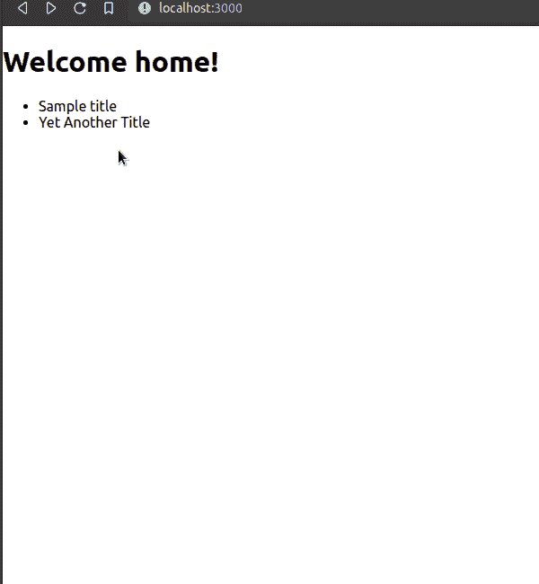

代码的输出

如您所见，我们的代码是成功的！我们的文章内容正在打印出来，一切都按预期进行。

最终，`/pages/article/[id].js`应该是这样的:

下一步，我们将展示我们的“关于我”页面。

## “关于我”页面

这个过程简单明了。在您的`/pages`目录中，创建一个名为`about.js`的文件。

在`/pages/about.js`文件中，编写下面这段代码:

*   第 1 行:导入指向 Strapi CMS 实例位置的`url`配置变量。
*   第 2 行:创建一个功能性的 React 组件。我们也带来了`data`道具。
*   第 8 行:显示`data`对象的`Body`字段。
*   第 13-21 行:使用静态端生成获取相关数据。稍后，将这些数据导出为道具。

现在转到`localhost:3000/about`。这将是输出:

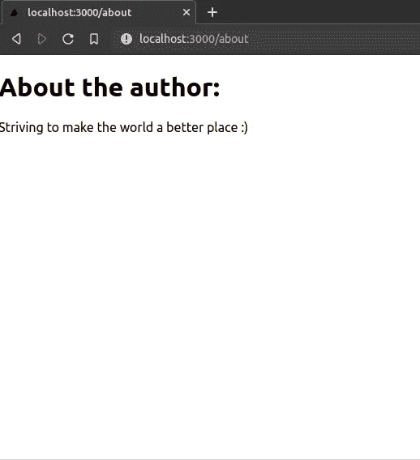

代码的输出

瞧啊。我们成功了。

# 更多资源和代码

## GitHub 知识库

[这是这个项目](https://github.com/HussainArif12/next-strapi-learn)的 Github 库。

## 进一步阅读

*   [next . js 中的路由和数据提取](/routing-and-data-fetching-in-next-js-aa3c7f3e2481)
*   [Strapi.js 速成班—旅行媒体](https://www.youtube.com/watch?v=6FnwAbd2SDY)
*   [用 Strapi 和 Next.js 构建一个 Fullstack 应用](https://www.youtube.com/watch?v=WrmndNpWSJw)
*   [使用 Next.js 和 Strapi CMS 获取数据](https://blog.logrocket.com/introduction-to-data-fetching-with-next-js-and-strapi-cms/)

# 结论

使用像 Strapi 这样的 CMS 让博主们的生活变得更加轻松——主要是因为它节省了作者挖掘代码对他们的博客进行简单编辑的时间。此外，CMS 与令人惊叹的前端技术(如 Next.js)相结合，是在短时间内建立和运行您的博客的完美方式。

非常感谢你坚持到最后！

previous:[next . js 中的路由和数据提取](/routing-and-data-fetching-in-next-js-aa3c7f3e2481)