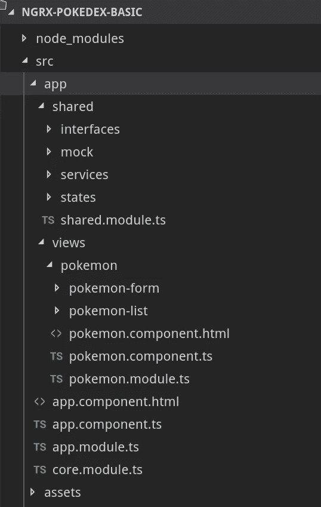
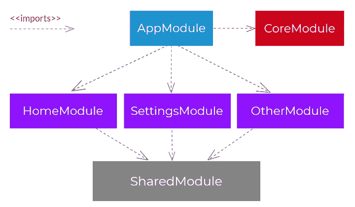
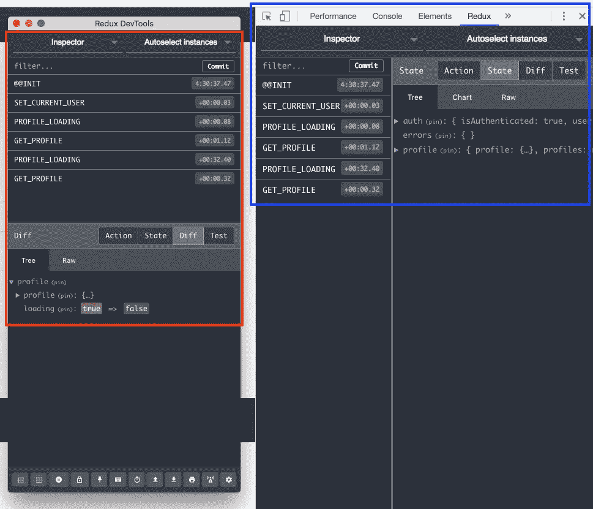
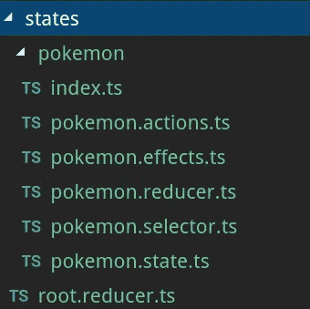
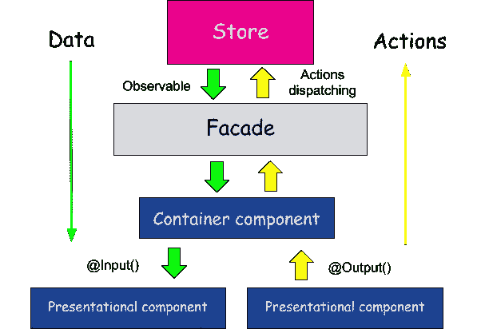
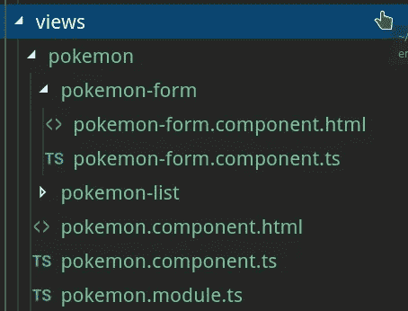

# 构建您的 Pokédex:第 1 部分 NgRX 简介

> 原文：<https://betterprogramming.pub/build-your-pok%C3%A9dex-part-1-introduction-to-ngrx-a89c3be0ea10>

## 角度教程— NgRX 一步步

这篇文章是一系列文章的一部分，在这些文章中，我描述了从初学者到忍者如何使用 NGRX 构建你的 Pokédex。想了解更多，可以看以下帖子:

1.  [第一部分。构建你的 pokédex:NGRX 简介](https://medium.com/p/a89c3be0ea10/)
2.  [第二部分。构建您的 Pokédex: @ngrx/entity](https://medium.com/better-programming/build-your-pok%C3%A9dex-part-2-ngrx-entity-6e9d7256e6a8)
3.  第三部分。构建你的 Pokédex:使用 create*函数改进 NgRX】
4.  第四部分。构建你的 Pokédex: [@ngrx/data](http://twitter.com/ngrx/data)
5.  第五部分。构建您的 Pokédex:测试 NgRX


在这篇文章中，我们将使用 [Angular](http://angular.io) 框架和 [NgRX](https://ngrx.io) 作为状态管理库来开发一个 **pokédex** 。

为了正确理解这篇文章，你应该知道如何在中级水平上管理 Angular，并知道什么是状态管理库，因为在这个系列中，我们将展示一个具体的例子是如何开发的(Pokédex)，这可以作为你 NgRX 学习的补充。

首先，下面的 GIF 展示了我们根据这些帖子构建的结果。


我们项目的目录结构如下所示(你可以从 [AngularAcademy](https://angular-academy.com/angular-architecture-best-practices/) 阅读关于 Angular 架构的帖子):



应用程序的结构分为两个明显不同的部分:

*   **共享**。在这里，我们将放置在每个模块之间共享的所有元素，例如管道、指令、服务、模型和状态。
*   **状态**。状态又分为子状态，允许我们管理存储应用程序状态的数据结构。在我们的应用程序中，我们将只有一个名为神奇宝贝的状态，其中存储了与神奇宝贝相关的信息。
*   **观点**。在这里，您将找到应用程序的视图/页面。该应用程序由模块构成:
*   **核心模块**。对应用程序来说必不可少的服务，需要在最初进行实例化。
*   **共享模块**。所有功能模块共享的模块。
*   **功能模块**。按应用程序中的功能组织的模块。在我们的具体应用程序中，我们将只有一个功能模块(PokemonModule)。



教程的第一步是使用 CLI 创建新的角度项目。然后，显示创建我们的项目的结果和正在使用的具体版本。

```
ng new ngrx-pokedex
```

# tsconfig.json &&环境

在我使用 TypeScript 的项目中，我喜欢配置`path`来访问`shared`的子目录，而不必使用几级向后缩进(`../../ ..`)。`tsconfig.json`文件允许您轻松地为路线配置这些别名。

另一方面，我认为在开发过程中尽快配置环境变量是很重要的，这样可以避免在你决定从开发进入生产后不得不进行配置。因此，我们开发的伪后端的路径将在如下所示的`environment.ts`文件中定义:

将使用`in-memory-web-api`模块，而不是开发一个在数据库或内存上执行 CRUD 操作的后端。这允许我们模拟 REST 上的操作。

这个模块拦截 Angular `Http`和`HttpClient`请求，否则这些请求会发送到远程服务器，并将它们重定向到您控制的内存数据存储中。

创建一个实现`InMemoryDbService`的`InMemoryDataService`类。

至少，我们必须实现一个`createDb`方法来创建一个“数据库”散列，其键是集合名称，其值是要返回或更新的集合对象的数组。此外，我还实现了`genId`方法，它为来自假服务器的每个新神奇宝贝生成一个唯一的 ID。

```
npm i angular-in-memory-web-api
```

数据来自具有以下结构的模拟文件:

最后，服务器中会为每个神奇宝贝存储一个静态图像。这些图像存储在使用`photo`字段识别的`assets/images/pokemon/`路径中。

用根`AppModule.imports`中的`HttpClientInMemoryWebApiModule`注册您的数据存储服务实现，用这个服务类和一个可选的配置对象调用`forRoot`静态方法:

这个内存中的 web api 服务处理一个 HTTP 请求，并以 RESTy web api 的方式返回一个可观察的 HTTP 响应对象。它以`:base/:collectionName/:id?`的形式处理 URI 模式

示例:

`//`用于请求从*英雄*集合
`GET api/heroes //`所有英雄
`GET api/heroes/42 //`id = 42
`GET api/heroes?name=^j //`【j】的英雄是一个正则表达式；返回名字以‘J’或‘J’开头的英雄
`GET api/heroes.json/42 //`忽略`.json`

内存中的 web api 服务根据您在设置过程中定义的一个数据库*处理这些请求。*

# @ngrx/store

*Store* 是 RxJS 供电的状态管理，用于角度应用，灵感来自 Redux。Store 是一个受控状态容器，旨在帮助在 Angular 之上编写高性能和一致的应用程序。

关键概念:

*   **动作**描述了从组件和服务分派的独特事件。
*   **状态变化**由称为 reducers 的纯函数处理，它采用当前状态和最新动作来计算新状态。
*   **选择器**是用于选择、导出和组合状态片段的纯函数。
*   **状态访问**与存储，一个可观察的状态和一个观察的行动。

您只需要安装以下软件包:

```
npm install @ngrx/store
```

# @ngrx/effects

Effects 是一个 RxJS 驱动的商店副作用模型。Effects 使用流来提供新的动作源，以减少基于外部交互(如网络请求、web 套接字消息和基于时间的事件)的状态。

## 介绍

在基于服务的角度应用程序中，组件负责直接通过服务与外部资源进行交互。相反，Effects 提供了一种与这些服务进行交互的方式，并将它们与组件隔离开来。Effects 是您处理任务的地方，比如获取数据、产生多个事件的长时间运行的任务，以及其他外部交互，在这些交互中，您的组件不需要这些交互的明确知识。

## 关键概念

*   Effects 将副作用从组件中分离出来，允许更纯粹的组件选择状态和分派动作。
*   Effects 运行长期运行的服务，监听从商店发出的每个可观察的动作。
*   效果根据他们感兴趣的动作类型过滤这些动作。这是通过使用运算符来完成的。
*   Effects 执行同步或异步任务，并返回一个新动作。

您只需要安装以下软件包:

```
npm install @ngrx/effects
```

# @ngrx/store-devtools

Store Devtools 为 Store 提供开发人员工具和工具。

配置该工具的步骤如下:

1.  安装包:`npm install @ngrx/store-devtools`。
2.  安装[Chrome](https://chrome.google.com/webstore/detail/redux-devtools/)/[Firefox](https://addons.mozilla.org/es/firefox/addon/reduxdevtools/)扩展。
3.  在您的`AppModule`中，使用`StoreDevtoolsModule.instrument`向模块导入添加插装:

在这些步骤之后，当您打开 web 浏览器元素检查器时，您将获得一个新的 redux 选项卡。在这个新选项卡中，您可以看到已经触发的操作和应用程序的状态。



按照 [Angular 团队构建 Angular 应用架构](https://angular.io/guide/architecture)的指示，将定义两个模块:

*   **共享模块**。该模块导入和导出功能模块中共享的模块。注意，已经导入了一组属于`@angular/material`的模块，这些模块可以在一个名为`shared.material.module`的特定模块中导入和导出。但是，为了简化问题，它已经直接从`SharedModule`模块导出。有必要导入`StoreModule`模块，因为它负责加载应用程序中的存储。最后，导入与表单相关的模块，以构建用户界面。
*   **核心模块。**在此模块中，使用`StoreModule`和`EffectsModule`模块初始化减压器和效果。

角形材料的安装非常简单，因为我们只需要安装以下软件包:

```
npm install @angular/material 
npm install @angular/flex-layout 
npm install @angular/cdk
```

当我们必须使用 NgRX 服务时，我们减去了所有与应用程序状态相关的逻辑。传统上，当您在 Angular 中开发服务时，您有一组属性来建模应用程序的子状态。

使用 NgRX，这个问题大大减少了，因为所有与状态管理相关的逻辑都被委托给了商店，因此从服务中消失了。事实上，我们的`Pokemon.service`服务可以被认为是一个更大的服务，它封装了与`HttpClient`服务相关的逻辑，因为它唯一的任务就是与 b。

当您不打算包含与数据相关的方法时，没有必要构建一个类。因此，我们决定创建一个界面，其中每个神奇宝贝的属性都按照如下所示进行建模。

NgRx 是一个在 Angular 中构建反应式应用程序的框架。NgRx 提供了状态管理、副作用隔离、实体集合管理、路由器绑定、代码生成和开发人员工具，这些工具可以增强开发人员在构建许多不同类型的应用程序时的体验。

NgRX 由以下概念组成:

*   **状态**。我们想要建模的`state`在这里定义。理想情况是设计组成完整状态的子状态。
*   **动作**。可对商店执行或有影响的操作列表。
*   **减速器**。转换状态的方法(因为使用了不变性，所以创建了一个新状态)。
*   **选择器**。允许您在存储的子状态上创建可观察对象的方法。选择器非常有用，因为它们允许我们只在每个组件中感兴趣的片段上创建可观察的东西，而不需要观察整个商店。
*   **效果**。那些不改变悬挂物的方法在这里被合并。在我们的例子中，我们将使用它来创建操作执行是否令人满意的通知。此外，在服务的操作执行得令人满意或不正确的情况下，这些效果用于触发操作。

因此，`@shared/state/pokemon`目录由以下文件组成:



`index.ts`文件仅用于提高神奇宝贝目录中导入的详细程度。

# 状态模型

我们现在在`pokemon`文件中创建一些状态模型。

`pokemon`状态由下面定义的两个属性组成:

*   **ids** 。这是一个数字数组，包含了按一定顺序排列的对象的键。在第一篇文章中，我们不会使用这个数组，它是由我们将在下一篇文章中解释的`@ngrx/entity`模块提供的。
*   **实体**。这是一个键值对象，其中的键是一个字符串，对应于每个神奇宝贝的 ID。这样，我们可以通过每个神奇宝贝的键直接访问它，而不必在数组中搜索。

# 行动

我们必须定义的第一件事是可以对商店执行的一组操作。

传统的操作是那些组成众所周知的缩写 CRUD 的操作。每个操作由两个额外的操作来补充:`XX_SUCCESS`和`XX_FAILED`。

这样，不带后缀的操作被用作服务执行的触发器，服务与后端通信。

根据服务返回的值，将触发成功或失败的操作。

如果触发了成功操作，将执行修改存储的相关缩减器和带有操作已成功执行的消息的通知。另一方面，当执行失败的操作时，我们不需要修改存储，但是会有一个通知指出发生了错误。

因此，我们定义的一组动作及其对应的名称空间`[Pokemon]`如下:

实现`Action`接口的类用于构建 NgRX 生态系统中的每个动作。在每个类的构造函数方法中都指定了`payload`。这个`payload`是减速器的参数，它修改状态。

作为一个例子显示了`AddSuccess`类。`type`属性用于定义该类对应的动作类型。最后，与这个动作相关联的`payload`是来自后端的一个`Pokemon`。

`pokemon.actions.ts`文件如下所示:

# 还原剂

NgRx 中的 Reducers 负责处理应用程序中从一个状态到下一个状态的转换。Reducers 函数通过基于动作的类型确定要处理的动作来处理这些转换。

在 NgRX 生态系统中，只需要导出一个函数还原到`CoreModule`。在我们的具体问题中，这个函数是`pokemonReducer`。状态变化在函数缩减器中定义。

该函数具有以下特征:

其中接收到两个参数:

*   **状态**。修改前的当前状态。如果没有当前状态，将使用函数中定义的初始状态。
*   **动作**。将对状态执行的操作。

reduce 函数由一个`switch`组成，其中必须返回一个新的`PokemonState`。

请注意，修改状态的情况是“成功”,其中使用了[扩展操作符](https://developer.mozilla.org/en-US/docs/Web/JavaScript/Reference/Operators/Spread_syntax)来构建新状态。

例如，`ADD_SUCCESS`案例返回一个新的对象，其中组合了当前状态(`... state`)和对`entities`属性的修改。`entities`属性是由旧的`state.entities`组合而成的新对象，其中`action.pokemon.id`位置被新的`action.pokemon`修改。

值得注意的是，在接收到的有效负载对象中将有一个名为`pokemon`的属性，它是作为参数从创建的动作传递过来的对象。

`pokemon.reducer.ts`文件如下所示。`arrayToObject`函数是将数组转换成对象的辅助函数。

# 选择器

选择器为[纯函数](https://www.carloscaballero.io/understanding-javascript-typescript-memoization/)，用于获取存储状态的切片。@ngrx/store 提供了一些帮助函数来优化这个选择。在选择状态片段时，选择器提供了许多功能。

NgRX 提供了两个函数来创建选择器:

*   **创建特征选择器**。这个函数允许我们为子状态创建一个选择器。
*   创造选举人。这个函数允许我们使用两个参数创建选择器:1。选择器；2.定义我们想要选择什么值的函数。

在我们的 Pokédex 中，我们只需要一个选择器(全部加载)。如果我们有一个包含每个神奇宝贝详细信息的页面，我们可以创建一个名为`selectById`的特定选择器。

`pokemon.selector.ts`文件如下所示。

# 效果

这些效果是我们实现 Pokédex 的一个基本部分，因为我们已经委派了决定为此目的分派哪个动作的责任。以下是与载入神奇宝贝相关的效果示例。

`loadAllPokemon $`正在监听`LOAD_POKEMONS`动作的出现(将从组件中调度)。从这一点开始，NgRX 需要对 [RxJS 库](https://rxjs-dev.firebaseapp.com/)有最基本的了解，因为它将处理可观察的流。

首先，使用了`switchMap`操作符，它允许您丢弃来自发布者的值序列，只在每个时刻管理一个流。这就是使用`PokemonService`服务的地方，它从后端返回一个`Observable<Pokemon[]>`。如果后端的操作成功，则触发`LoadPokemonSuccess`动作，其中有效载荷是`pokemon`数组。另一方面，如果后端发生错误，则触发`LoadPokemonFailed`动作，其中有效载荷是服务器错误消息。

在我们的例子中，通过创建两个监听成功和失败操作的效果，这个问题被简化了。在这两种效果中，总是显示相同的通知消息。

值得注意的是，参数`dispatch: false`已经被指示给`Effect`装饰器，因为每个效果默认触发一个动作；如果没有定义，它会在最后触发相同的操作，这可能会导致无限循环。

两种效果都监听特定类型的动作(`POKEMON_ACTIONS_SUCCESS`或`POKEMON_ACTIONS_FAILED`)，并使用 Angular Material 的`snackBar`服务触发通知。

不要等待存储被修改的成功动作的效果，因为这正是我们先前定义的 reducer 所执行的任务。

最后，`pokemon.effects.ts`文件如下所示。

# 根.减速器

最后，同样重要的是，我们需要一个`root.reducer`文件，从中可以加载应用程序的所有子状态。在我们的特例中，我们只有`pokemon.reducer`。

现在我们将开始构建应用程序的可视化部分。请记住，应用程序状态的所有管理都委托给了 NgRX，因此我们不需要担心更改任何组件的状态。

这个事实大大简化了页面/视图，因为我们只需定义两种类型的组件:

*   **智能组件**。将通过`dispatch`方法或使用选择器执行商店任务的组件。
*   **dummy 组件**。只需向 SmartComponent 显示数据和管理事件的组件。

该架构在 [ng-conf](https://www.carloscaballero.io/p/8f9dc168-b63b-4ea1-9e4e-bd2f67081a79/(https://www.ng-conf.org/2019/angular-architecture-specific-layers/)) 中以稳定架构的形式出现。下图显示了所使用的架构，其中我们省略了 [Facade 模式](https://www.carloscaballero.io/design-patterns-facade/)，因为它对于我们的具体问题来说是不必要的，因为我们只有一个模块。



视图目录的结构如下:



回到我们的具体问题(Pokédex)，PokemonComponent 是智能组件。另一方面，与列表和表单相关的组件是虚拟组件。

我们的神奇宝贝模块的启动器是`app.component`，它非常简单，我接下来将向您展示。

# 口袋妖怪模块

Pokémon 模块只负责加载组成应用程序的三个组件，当然还有如下所示的 SharedModule。

# 口袋妖怪组件(智能组件)

神奇宝贝组件通过`dispatch`方法和选择器与状态交互。通过属性`[pokemon]`和事件`onUpdate`、`onAdd`、`onDelete`和`onSelect`完成与组件虚拟对象的通信。

`app-pokemon-list`组件通过`selectAll`选择器接收持续订阅商店的神奇宝贝列表。管道`async`是为神奇宝贝执行`subscribe`和`unsubscribe`任务的管道，因此组件 dummy 接收神奇宝贝列表，并且只专注于执行正确显示它们的任务。

该组件的构造函数负责使用代码中所示的`LoadPokemon`动作加载所有神奇宝贝:

CRUD 操作以非常简单的方法执行:

该组件的代码如下:

PokemonForm 组件专注于执行操作`add`和`update`。

该组件只需要关注与视图相关的内容:**表单验证**。

组件之间的通信使用`EventEmitter`完成。另一方面，这个组件从`smartComponent`接收一个神奇宝贝，因为你可以从`PokemonList`选择一个神奇宝贝进行编辑。

# 口袋妖怪列表组件(删除/选择口袋妖怪)

最后，`PokemonList`组件的任务是与`smartComponent`通信，以执行`delete`和`select`操作。这个组件与上一个组件非常相似。在这种情况下，我们应该只关注显示神奇宝贝的列表，而不必担心应用程序的状态。

最后，我们使用 Flex-Layout 和 Angular 材质设计了这个应用程序，使用了从 Angular 的`styles.css`文件配置的`Indigo-pink`主题。

在本帖中，我们构建了一个小示例，其中展示了大型 SPA 应用程序架构的基本要点:

*   分离可视组件的状态管理。
*   高效、轻松地创建管理状态的元素。
*   创建关注相关的组件:**视图**。
*   根据组件是否会与应用程序的状态进行通信，组件被分类到 SmartComponent 和 DummyComponent 中。

本系列中的以下帖子将涵盖有趣的主题，例如:

*   自动创建状态，因为使用@ngrx/entity 非常重复。
*   通过`@ngrx/data`包使用外观模式。
*   测试应用程序的状态。

真正重要的是概念，而不是使用的技术或库。因此，对于那些开始有大角度应用并需要应用架构原则的人来说，这篇文章应该作为一个指南。

**这里是本帖的** [**GitHub 分支**](https://github.com/Caballerog/ngrx-pokedex/tree/ngrx-part1) **。**