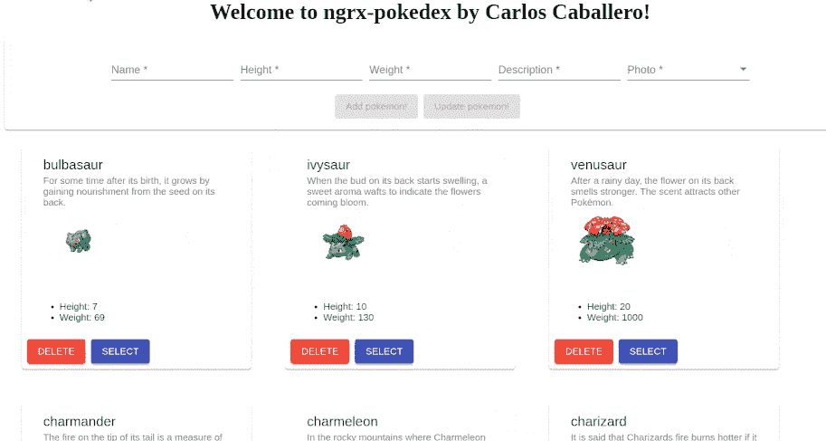

# 构建您的 Pokédex:第 3 部分——使用 Creator 函数改进 NgRx

> 原文：<https://betterprogramming.pub/build-your-pok%C3%A9dex-part-3-improve-ngrx-using-create-functions-21e59ace65e>

## 循序渐进的角度教程

这篇文章是我描述如何从初学者到忍者使用 [NgRx](https://ngrx.io/) 构建你的 [Pokédex](https://www.pokemon.com/us/pokedex/) 的系列文章的一部分。如果您想阅读更多内容，可以在本文底部找到该系列其余部分的链接。


照片由 [Grandy02](https://commons.wikimedia.org/wiki/User:Grandy02) 在[维基共享资源](https://commons.wikimedia.org/wiki/File:Pokedex-German.jpg)上拍摄

# 介绍

在这篇文章中，我们将使用 [Angular](http://angular.io) 框架和 NgRx 作为状态管理库来开发一个 Pokédex。我们将使用 NgRx 8 中发布的新的 creator 函数。

为了正确理解这篇文章，最好了解如何在中级水平上管理 Angular 以及什么是状态管理库。在这个系列中，我们将展示如何开发一个具体的例子(Pokédex ),它可以作为您学习 NgRX 的补充。

首先，沿着这些帖子构建的结果显示在下面的 GIF 中。



必须阅读本系列的第一部分和第二部分才能理解正在构建的内容。在这篇文章中，我们将通过使用`@ngrx/entity`包中的 creator 函数来改进代码，这将简化创建动作、减少器和效果所需的样板代码。

# 创建操作

在 NgRx 中，当您想要创建动作时，需要大量的样板代码。您经常需要创建枚举、动作类型、类和联合类型。在这个新版本中，您可以以更简单的方式创建操作。

NgRx 核心团队使用了著名的工厂功能设计模式来达到这个目标。工厂功能是`createAction`。`createAction`函数接收两个参数:

1.  `action types`是用来标识动作的著名字符串。
2.  `props`是动作元数据(例如有效载荷)。

为了比较两者，下面的代码说明了如何在 Pokédex 中使用新的`createAction`函数。

之前:

之后:

在 before 代码中，您需要创建一个实现`Action`接口的类，定义`type`属性，并使用构造函数定义`payload`。

另一方面，在 after 代码中，您只需要使用`createAction`创建动作，其中第一个参数是`type`，第二个参数是`props`属性(在我们的上下文中，它将是`payload`)。

尽管核心团队声明不需要使用枚举，但在我的特定编码风格中，我更喜欢定义一个动作枚举来了解动作集。

因此，`pokemon.action.ts`的前后如下:

我已经导出了一个`action const,`，它是一个字典，包含动作名称作为键，动作本身作为值。

`createAction`是一个工厂函数，返回一个名为`ActionCreator`的函数，调用时返回一个 action 对象。因此，当您想要分派一个动作时，您必须调用`ActionCreator`。

```
this.store.dispatch(addSuccess(pokemon: Pokemon));
```

不再需要创建与动作的类相关联的对象，现在可以直接调用该函数。

因此，下面的重构必须应用于所有创建动作的效果。

之前:

之后:

效果本身将在下一节使用`createEffects`函数进行重构。

# 创建效果

NgRx 8 提供了`createEffect`方法，它是`@Effect()`装饰器的替代方法。使用`createEffect`代替装饰器的主要优点是它是类型安全的——也就是说，如果效果没有返回`Observable<Action>`，它将给出编译错误。

在下面的代码片段中，我将向您展示应用新的`createEffect`方法前后的`loadAllPokemon$`效果。迁移非常容易。

之前:

之后:

因此，`pokemon.effects.ts`前后为:

之前:

之后:

注意，之前传递给每个效果的参数`dispatch: false` 现在是在`createEffect`方法中传递的第二个参数。记住选项`{ dispatch: false }`是用于不分派新动作的效果(添加这个选项也消除了效果必须返回一个`Observable<Action>`的限制)。

# 还原剂

新的`createReducer`方法允许用户创建一个没有`switch`语句的缩减器。有一个新的`on`方法来区分动作类型，它返回一个新的引用。另一个有趣的事实是不需要处理 reducer 中未处理动作的默认情况。

因此，`pokemon.reducers.ts`之前和之后是:

之前:

之后:

注意，`createReducer`方法接收一个参数列表:第一个参数是初始状态，第二个参数是一个`on`方法列表。在`on`方法中，第一个参数是相关的动作。

在我的例子中，我维护了动作`enum`，因为我喜欢这种数据结构。当然，您可以不使用枚举直接导出操作。

`on`方法的第二个参数是接收`state`和`payload`的回调。之后，我们可以使用强大的`EntityAdapter`来执行最常见的操作。

# 结论

在这篇文章中，我们通过使用`@ngrx/entity`包的`create*`函数重构了我们的 Pokédex。使用`create*`函数将减少我们应用程序状态管理中不必要的复杂性。此外，适配器用于执行最常见的操作(例如 CRUD)。

因此，在这篇文章中，我们讨论了以下主题:

*   使用`@ngrx/entity`自动创建状态，因为这是非常重复的
*   使用`@ngrx/entity`自动创建效果和动作并简化 reduce 功能

本系列中的以下帖子将涵盖有趣的主题，例如:

*   门面模式将通过`@ngrx/data`包使用
*   测试应用程序的状态

成功的主要因素是展示的概念，而不是使用的技术或库。因此，这个帖子应该作为那些开始有大角度应用程序和需要架构原则的人的指南。

# 该系列的其他部分

1.  第一部分。构建你的 pokédex:NgRx 简介
2.  [第二部分。构建你的 Pokédex: @ngrx/entity](https://medium.com/better-programming/build-your-pok%C3%A9dex-part-2-ngrx-entity-6e9d7256e6a8)
3.  第三部分。构建您的 Pokédex:使用 Creator 函数改进 NgRx
4.  第四部分。构建您的 Pokédex: @ngrx/data(即将推出)
5.  第五部分。构建您的 Pokédex:测试 NgRx(即将推出)

# 资源

*   [安诺宁 NgRx 8](https://medium.com/ngrx/announcing-ngrx-version-8-ngrx-data-create-functions-runtime-checks-and-mock-selectors-a44fac112627)
*   [角度架构最佳实践](https://angular-academy.com/angular-architecture-best-practices/)
*   [棱角分明的建筑——ng-conf](https://www.ng-conf.org/2019/angular-architecture-specific-layers/)
*   [棱角分明的建筑(官方文件)](https://angular.io/guide/architecture)
*   [NgRx](https://ngrx.io/)
*   [RxJS](https://rxjs-dev.firebaseapp.com/)