# 将 Python 脚本转换为命令行工具

> 原文：<https://betterprogramming.pub/build-your-python-script-into-a-command-line-tool-f0817e7cebda>

## 使用 pip 将 Python 脚本打包成一个可安装的命令行工具


Python 打包(在 PowerPoint 中设计的图像)

Python 是一种编写脚本和构建工具的便捷语言。大多数 Python 开发人员经过一些培训就能写出很好的脚本或包。

随着他们编写更多有用的代码，他们开始考虑如何共享他们编写的工具，以便其他人可以轻松地安装和使用它们，而不用担心源代码在哪里。在本文中，我们将有一个关于如何将 Python 脚本包装成命令行工具的实践教程，可以通过 Python 的包管理器如`pip`来安装。

假设您开发了一个名为`download.py`的很棒的 Python 脚本来从 web 上下载资源(给定 URL)。每次你想调用你的工具时，你导航到包含这个脚本`download.py`的目录并通过

`$ python3 download.py <url> # or "python download.py <url>" on windows`

在使用这个令人敬畏的下载脚本几千次之后，您开始厌倦每次需要调用它时都要导航到源代码目录。你开始将你的脚本与另一个不太棒的叫做`wget`的下载工具进行比较(无意冒犯作者，你知道)。

> “嗯。如何将我的脚本转换成真正的工具，让我可以在任何目录下简单地运行`download <url>`”

简而言之，你希望安装它的人运行，而不是`python3 download <url>`

```
download <url>
```

在这篇文章中，我将一步一步地介绍如何使用 Python 官方支持的`setuptools`来实现这一点。作为概述，我们将使用提供的所有代码一步一步地执行以下操作:

1.  我们将编写一个极其简单(10~20 行代码)但几乎成熟的 Python 模块。
2.  我们将添加一个`setup.py`来使这个包可以安装。
3.  我们将使用 Python 的`argparse`包定义一个简单的(另外 20 行)命令行接口。
4.  最后，我们讨论一些包装和分发工具的方法，以及如何`pip`安装发行版。

如果您在本教程的任何步骤中遇到问题，请参考最后的“故障排除”部分。如果问题依然存在，非常欢迎大家留下评论，我会尽力帮忙的。

# 演示的代码库

本项目中使用的代码可在[https://github.com/liuzheng1990/python_packaging_demo](https://github.com/liuzheng1990/python_packaging_demo)与文件字符串一起找到。但是，所有代码都直接包含在本文中。除去文档字符串，总共只有不到 100 行代码。这篇文章更多的是关于打包而不是编码。

# 1.编写“下载程序”包

让我们从创建一个`download` 函数并将其放入一个`downloader`包开始。在项目的根目录下(可以是你机器上的任何文件夹)，创建一个名为`downloader`的目录。在这个`downloader`目录下，创建两个文件，一个叫做`__init__.py`，另一个叫做`downloader.py`。此时，您的项目文件夹应该具有以下层次结构:

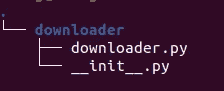

最初，项目根目录只包含一个名为“downloader”的子文件夹，其下有两个文件，“__init__”。py”和“downloader.py”。

在`downloader.py`中，让我们把非常简单的函数(可能过于简化，再次强调，更多的是关于打包而不是编码):

“downloader.py”中一个过于简化的“下载”功能。这里不包括文档字符串。有关文件字符串的完整版本，请参见“[https://github.com/liuzheng1990/python_packaging_demo](https://github.com/liuzheng1990/python_packaging_demo)

注意，这个函数使用了`requests`包，这是一个流行的包，但是并没有内置到 Python 中。我们需要确保在测试`download`功能之前安装了这个包(如果你只是简单地使用`pip``pip install requests`)。

在`__init__.py`文件中，简单地放一行:

```
from .download import download
```

现在，您可以在 Python shell 中测试这些函数。确保当前工作目录位于项目的根文件夹(我们在上面创建的`download`文件夹的父文件夹)，并启动一个 Python shell。

```
$ ls # make sure "downloader" folder is in current directory.
downloader$ python3
Python 3.8.10 (default, Mar 15 2022, 12:22:08) 
[GCC 9.4.0] on linux
Type "help", "copyright", "credits" or "license" for more information.
>>> from downloader import download
>>> download("[https://www.python.org/static/img/python-logo.png](https://www.python.org/static/img/python-logo.png)", dest_path="python_logo.png")
10102
>>>
```

在`download`函数运行完成后，您应该会在当前工作目录中看到一个名为`python_logo.png`的图像文件。

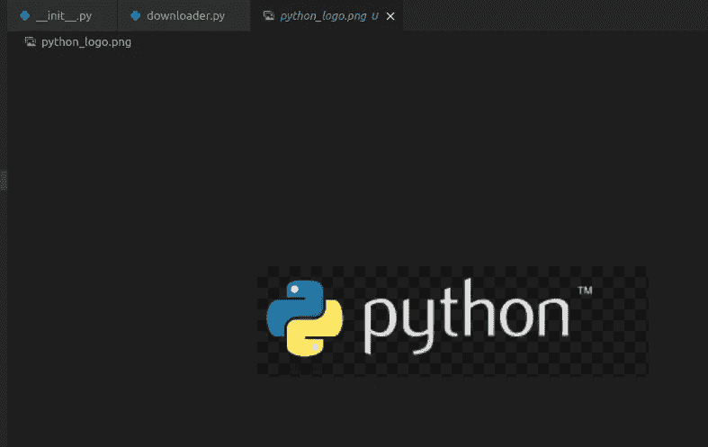

通过调用“下载”函数将“python_logo.png”下载到当前工作目录。

# 2.为打包创建“setup.py”和“pyproject.tmol”

模块可以导入，并且`download`功能已经过测试。是时候把项目变成一个合适的 Python 包了。我们通过在项目根目录下创建一个`setup.py`文件和一个`pyproject.toml`文件来实现。这两个文件告诉 Python 的安装工具关于这个包的一些基本信息以及如何安装它。

`pyproject.toml`文件相当固定，如下所示:

[官方教程](https://packaging.python.org/en/latest/tutorials/packaging-projects/#creating-pyproject-toml)推荐的“pyproject.toml”

`setup.py`文件是我们在本教程中需要理解的主要文件。(注意[官方文档](https://packaging.python.org/en/latest/tutorials/packaging-projects/)现在推荐标准项目的静态版本`setup.cfg`而不是`setup.py`。尽管如此，我今天还是将重点放在动态的`setup.py`上。对`setup.cfg`的图式感兴趣的读者，请参考[官方文档](https://packaging.python.org/en/latest/tutorials/packaging-projects/)。)

关于传递给`setup`函数的参数的更详细讨论，请参考[文档页](https://packaging.python.org/en/latest/tutorials/packaging-projects/#configuring-metadata)(点击`setup.py dynamic`选项卡切换到`setup.py`方法，而不是静态`setup.cfg`方法)。

在这里，我只想强调与我们的任务相关的几个参数:

1.  `name`:这是发行包的名称。安装后，您可以在例如`pip freeze`中看到这个包名(更多细节见下文)。不要将这个名称与要导入 Python 代码的模块的名称混淆。如上一节所示，在你安装了这个包之后，如果你想在某些 Python 代码中使用`download`函数，你做的是`from downloader import download`，而不是`from over-simplified-downloader import download`(后者甚至语法都不正确)。
2.  `version`:你可以给这个包一个你喜欢的任何版本，但是在使用`pip`或者`conda`这样的包管理工具时，如果你指定了版本相等(比如`over-simplified-downloader==0.0.1`或者不相等(比如`over-simplified-downloader>=1.0.0`，包管理工具会检查这个字段。
3.  `long_description`:可以是任意字符串。它甚至不需要真的比`description`字段长。然而，在项目中创建一个`README.md` markdown 文件并将该文件加载到该参数的字符串中是一个好习惯，如本项目所示。如果你对我创建的`README.md`的内容感兴趣，可以[在我的 GitHub repo](https://github.com/liuzheng1990/python_packaging_demo/blob/master/README.md) 中找到。
4.  `install_requires`:该参数声明该包所依赖的包。当您安装此软件包时，将自动安装此列表中的软件包。在这里，由于我们使用了`requests`包，我们将它添加到这个参数中。
5.  `packages`:如果你只想安装这个项目中的一些子模块，你可以给这个参数指定包名。如果在这个项目中安装了所有的 Python 模块，可以使用`setuptools.find_packages`函数来检测所有的 Python 模块。在我们的项目中，`downloader`是唯一存在的模块。因此，`packages=setuptools.find_packages()`相当于`packages=["downloader"]`。
6.  `entry_points`:这是本教程中最重要的参数。我们将用整个下一节来讨论它。

在跳到下一节之前，确保`setup.py`保存在项目根文件夹下。该项目现在应该如下所示:

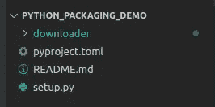

创建“pyproject.toml”和“setup.py”后的项目文件夹结构。注意，我创建了一个 README.md，其内容可以在[github repo 中找到。](https://github.com/liuzheng1990/python_packaging_demo/blob/master/README.md)

# 3.“端点”和命令行工具

即使没有`end_points`参数，您也可以安装我们到目前为止构建的包(有关安装的详细信息，请参见第“4。安装 Python 包的各种方法”和任何 Python 代码中的`from downloader import download`。(注意，一旦安装了这个包，您就不必在作为当前工作目录的项目根目录中运行 Python。该模块已经被添加到 Python 自己的包列表中。)然而，我们的最终目标不仅仅是从其他代码中导入`download`函数。

我们的最终目标是在命令行的任何位置运行以下命令:

```
$ download [https://www.python.org/static/img/python-logo.png](https://www.python.org/static/img/python-logo.png) -o pyhon_logo.png
Download successful! (size: 10102 B)
$
```

为了实现这一目标，我们需要两步:

1.  为包创建命令行界面。
2.  使用上述`setup`函数中的`end_points`参数将该命令行界面注册到包中。

让我们简单看一下这两个步骤。

## 该工具的命令行界面

命令行界面需要接受一个名为`url`的位置参数和一个可选的目标位置参数`-o`或`--output`。让我们首先在`downloader`文件夹中创建一个名为`cli.py`的文件。项目文件夹结构现在如下所示:

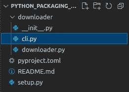

项目的最终文件夹结构(在“downloader”文件夹下添加“cli.py”后)

在`cli.py`内部，我将创建一个`main`函数来进行参数解析，并调用实际的`download`函数。对于参数解析，我简单地使用了 Python 的标准`argparse`模块。不熟悉这个模块的读者可以在这里找到[的官方教程](https://docs.python.org/3/howto/argparse.html)。

## 将要打包的命令行界面注册为“端点”

现在应该已经清楚了前面显示的`setup.py`中的`end_points`参数的含义。

```
entry_points={
    "console_scripts": [
        "download = downloader.cli:main",
    ]
}
```

这告诉`pip`安装一个名为`download`的可执行文件。运行中的`download`应该等同于运行`cli.py`中定义的`main`功能。

就是这样！我们已经完成了所有的编码！

# 4.安装 Python 包的各种方法

现在你已经构建了一个合适的 Python 包，是时候分发它了，这样其他人就可以安装它并使用`download`工具。有许多方法可以使软件包可安装。

## 直接从源代码安装

实际上你的模块已经可以安装了！在项目的根文件夹中(T1 所在的位置)，简单地运行下图所示的`pip install .`。

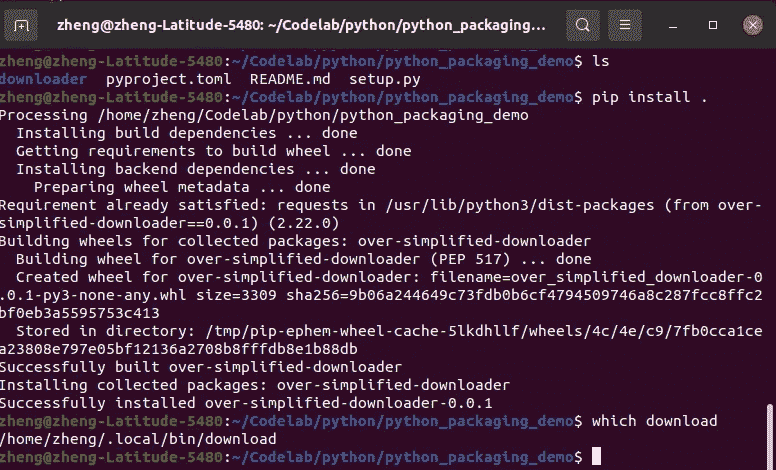

直接从项目文件夹安装软件包。运行“pip 安装”很重要在项目根文件夹中(“setup.py”所在的位置)。

## 从源归档安装

您可以将整个项目压缩到一个归档文件中(`.zip`或`.tar.gz`)。Python 的`pip`可以检测出它是一个归档文件，并将其解压缩以便安装。在这里，我创建了一个名为`over-simplified-downloader-0.0.1.zip`的 zip 存档。归档文件的名称完全由您决定，但是按照包名和版本来命名是一个惯例。

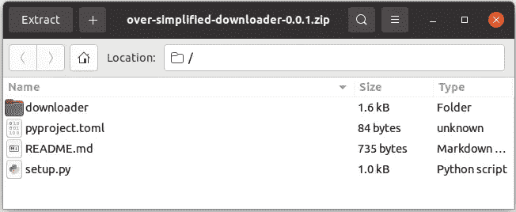

源 zip 存档(也可以是“. tar . gz”tar-ball)。

现在，您可以将此档案发送给任何人，并要求他们 pip 安装它:

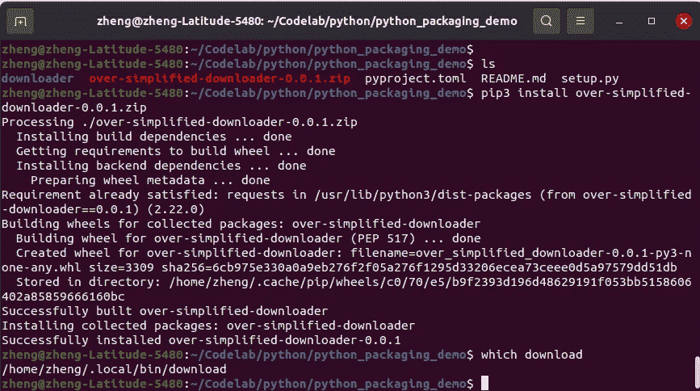

Pip 可以直接安装源文件。

## 从 PyPI 安装

如果你准备将你的包分享给这个星球上的每个人，Python 的包索引(缩写为 PyPI)是最自然的选择之一。由于两个原因，我将这一选项推迟到最后提及:

1.  网上已经有很多教程在讨论上传一个包到 PyPI。一个很好的例子是这里的官方教程。
2.  许多“Pythoners”不知道`pip`可以从本地源或 URL 安装包。`pip`比 PyPI 的下载器更强大。

## 卸载软件包

要卸载这个包，只需运行`pip3 uninstall over-simplified-downloader`。

# 5.最终演示和故障排除

我们终于准备好在命令行的任何地方运行`download`。这里有一个演示:

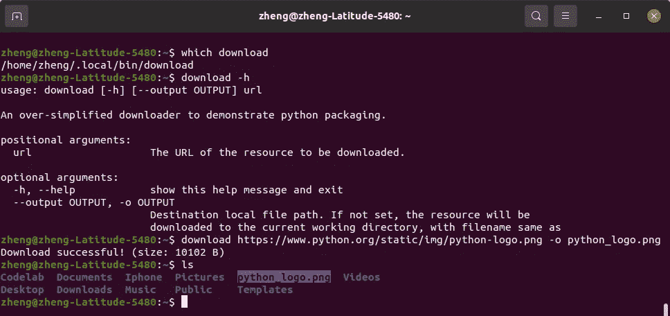

检查是否安装了“下载”工具，并使用它来下载 Python 徽标。

注意，在这个演示中，我不再在项目文件夹中，因为`download`工具已经安装在本地 bin 目录中(在 linux 发行版中，路径应该是`$HOME/.local/bin/download`)。我们用这个工具从[https://www.python.org/static/img/python-logo.png](https://www.python.org/static/img/python-logo.png)下载了 Python logo `png`文件。

## 疑难解答 1:找不到“下载”命令

在 Linux 或 MacOS 上，如果你以普通用户的身份做`pip3 install`(没有`sudo`)，可执行的命令行工具应该安装到`$HOME/.local/bin`目录。如果您没有将这个目录路径添加到系统`$PATH`环境变量中，那么您很可能找不到`download`命令。(`which download`命令也会返回一个空字符串。)

要验证这确实是环境变量`$PATH`的问题:

1.  运行`ls -l $HOME/.local/bin`并验证`download`可执行文件确实存在，并具有执行权限。
2.  运行`echo $PATH`以验证主目录中的`.local/bin`目录确实不存在。
3.  将此`.local/bin`目录的完整路径添加到`$PATH`。例如，我的本地 bin 目录的完整路径在`/home/zheng/.local/bin`，所以我运行的命令应该是`export PATH=/home/zheng/.local/bin:$PATH`。
4.  为了每次设置这个环境变量，我总是把这个导出行放在我的`~/.bashrc`文件中。

## 故障排除 2:系统安装软件包

如果你想让`download`成为一个系统范围的工具，以便这台计算机上的所有其他用户也可以使用它，你可以运行`sudo -H pip3 install over-simplified-downloader-0.0.1.zip`。`download`工具将被安装到`/usr/local/bin/download`(默认情况下通常自动安装在`$PATH`)。

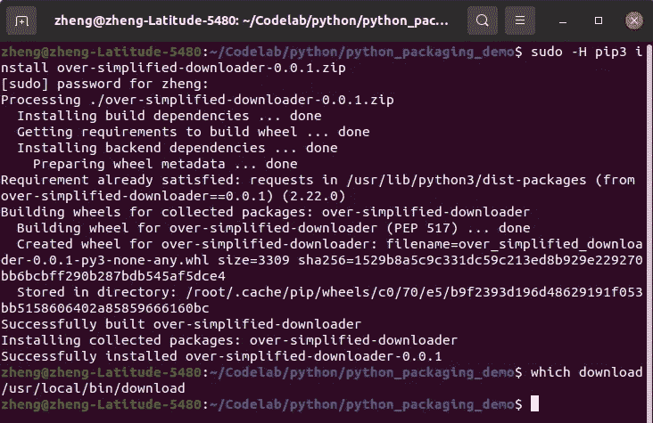

您可以使用“sudo -H pip3”在系统级安装该软件包。该工具将被添加到“/usr/local/bin”目录中。

## 疑难解答 3:在 windows 上安装

在 windows 上安装没有什么不同，因为 pip 是跨平台的(至少从用户的角度来看)。在下面的截图中，我检查了我的 Python 可执行文件、我的 pip 和 pip 版本在哪里。然后我干脆做了`pip install <zip file name>`。

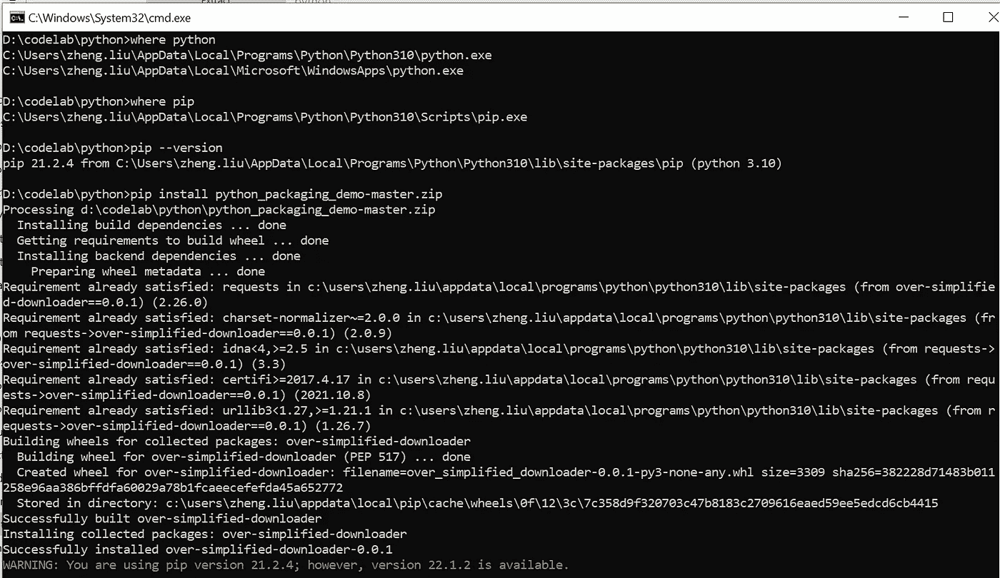

在 Windows 中安装软件包的演示。

之后，我可以在命令窗口中直接运行`download`命令。

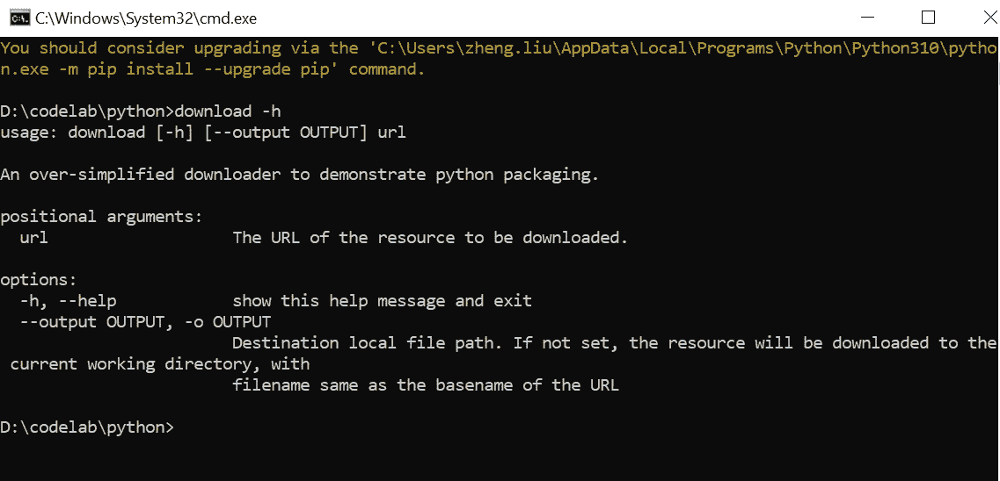

pip 安装后，在 cmd 窗口中可以使用“下载”命令

如果您未能安装软件包或运行`download`命令，很可能是因为在您的 Windows 机器上没有正确设置`PATH`或其他与 Python 相关的环境变量。你可以参考文章[来正确配置你的 Python。](https://www.alphr.com/pip-is-not-recognized-as-an-internal-or-external-command/)

如果您的计算机上安装了多个 Python 版本，事情可能会稍微复杂一些。在这种情况下，请确保您注册到`PATH`环境变量的 Python 版本与您使用`pip`安装包的版本相同。

如果你有任何问题，请随时给我留言。我很乐意尽我所能帮忙。

我希望您喜欢这篇文章，并学会了如何将自己的 Python 脚本打包成一个出色的命令行工具。

编码快乐！