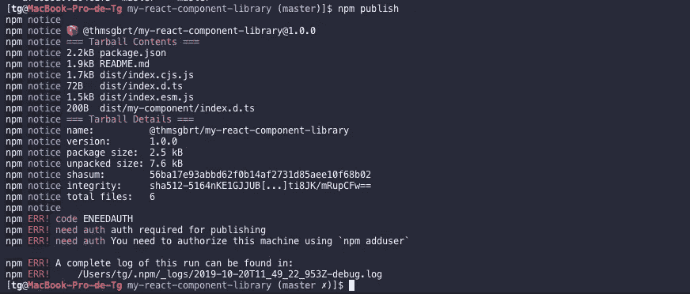
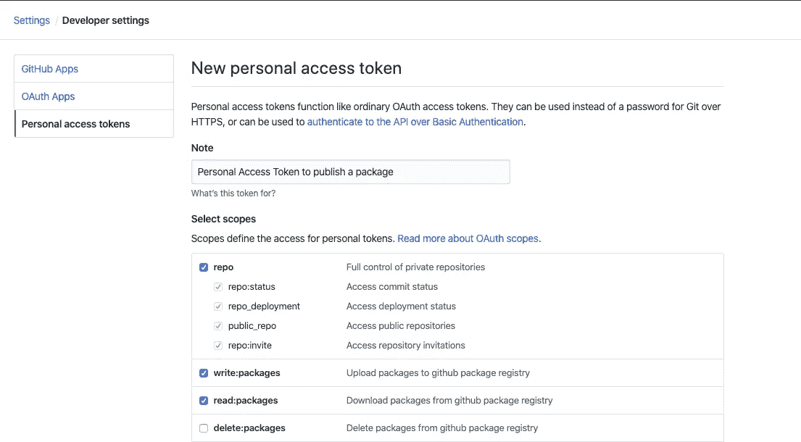
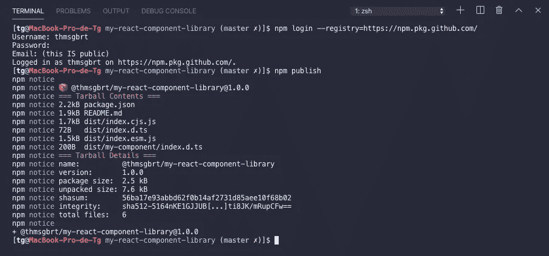
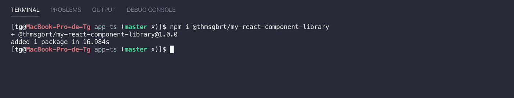

# 构建一个 React 组件库并发布到 GitHub 包注册中心

> 原文：<https://betterprogramming.pub/build-your-very-own-react-component-library-and-publish-it-to-github-package-registry-192a688a51fd>

## 当跨多个项目工作时，它总是很方便


图片由 [Artem Sapegin](https://unsplash.com/@sapegin?utm_source=unsplash&utm_medium=referral&utm_content=creditCopyText) 在 [Unsplash](https://unsplash.com/s/photos/react?utm_source=unsplash&utm_medium=referral&utm_content=creditCopyText) 上拍摄

你有没有一套设计精美的组件，完美到可以从一个项目复制到另一个项目？你梦想过用`npm install`把它放到你的下一个应用中，而不是必须复制/粘贴它吗？如果是这样，你来对地方了！

今天，您将学习如何构建自己的 React 组件库，并将其发布到全新的 GitHub 包注册表中！

你将会用到以下这些很酷的东西:

*   [**打字稿**](https://www.typescriptlang.org/) :这个不用介绍了，希望！
*   [**Rollup.js**](https://rollupjs.org/guide/en/) :一个 Javascript 模块 bundler 来编译我们的代码，
*   [**Create-react-App**](https://github.com/facebook/create-react-app):创建一个简单的 React 应用程序的简单方法，我们将用它作为测试你的组件的平台。
*   [**【Npm-run-all】**](https://www.npmjs.com/package/npm-run-all):一个 CLI 工具，可以并行运行多个 Npm 脚本，
*   [**GitHub 包注册表**](https://github.com/features/package-registry) : GitHub 的包管理服务，可以很方便的在你的源代码旁边发布公有或者私有的包。

像往常一样，我的作品的所有代码都可以在我的 GitHub 上找到。


克劳迪奥·泰斯塔在 [Unsplash](https://unsplash.com?utm_source=medium&utm_medium=referral) 上拍摄的照片

# 时间就是金钱，让我们开始吧！

## package.json

在您选择的目录中，创建一个新的`package.json`文件并安装我们需要的第一个`devDependencies`。

```
$ npm init -y
$ npm i -D @types/react @types/react-dom @types/styled-components typescript
```

## tsconfig.json

正如我所说的，我们将使用 TypeScript，因此，我们的项目需要一个 TypeScript 配置。

要生成一个，通过运行`$ npm i -g typescript` 确保您的环境中已经全局安装了 TypeScript，然后只需运行`$ tsc --init`。

这个命令生成一个 json 文件，我们将在其中修改一些东西:

*   取消对`jsx`键的注释，将其值改为`react`
*   将`module`设置为`ESNext`
*   取消注释`outDir`并将其设置为`./dist`
*   取消注释`declaration`
*   取消注释`moduleResolution`
*   在编译器选项下面，添加`"include":["src/**/*"].`

您的`tsconfig.json`文件应该如下所示:

# 创建我们库的第一个组件

我们库的所有组件都在一个`./src`文件夹中。

该结构将如下所示:

```
-- src/
   |-- my-component/
       |-- index.tsx 
   |-- index.ts
```

`index.ts`将是我们的主文件，导出我们将创建的所有组件。当我们谈论它时，这是创建我们的第一个 React 组件的好时机！

在`my-component/index.tsx`内部，编写一个简单的 React 组件。

这里有一个例子:

```
import React from 'react';
import styled from 'styled-components';

const StyledMyComponent = styled.div<{ color?: string }>`
  color: ${p => p.color || 'pink'};
`;

interface MyComponentProps {
  text: string;
  color?: string;
}

const MyComponent: React.FC<MyComponentProps> = ({ text, color }) => (
  <StyledMyComponent color={color}>{text}</StyledMyComponent>
);

export { MyComponentProps, MyComponent };
```

不是最有用的组件，但这只是为了测试。

从`./src`文件夹的`index.ts`中导出该组件:

```
import { MyComponent } from './my-component';

export { MyComponent };
```

# 使用 Rollup.js 构建我们的库

太好了—我们已经创建了一个奇妙的 React 组件！

现在，要建立我们的图书馆，我们必须做三件事:

*   需要安装`devDependencies`
*   创建`Rollup`配置，
*   向`package.json`添加新脚本。

首先，让我们来关注一下`devDependencies`。我们需要:

*   [**Rollup**](https://www.npmjs.com/package/rollup) :我们的模块捆绑器，
*   [**roll up-plugin-delete**](https://www.npmjs.com/package/rollup-plugin-delete):一个插件，会负责每次构建之间的垃圾(清理`./dist`文件夹)，
*   [**Rollup-plugin-typescript 2**](https://www.npmjs.com/package/rollup-plugin-typescript2):一个用于 TypeScript 的 roll up 插件，

```
$ npm i -D rollup rollup-plugin-delete rollup-plugin-typescript2
```

接下来，在根文件夹中创建一个`rollup.config.js`文件。它应该是这样的:

```
import typescript from 'rollup-plugin-typescript2';
import del from 'rollup-plugin-delete';
import pkg from './package.json';

export default [
  {
    input: 'src/index.ts',
    output: [
      {
        file: 'playground/src/component-lib/index.js',
        format: 'esm',
        banner: '/* eslint-disable */',
      },
      { file: pkg.main, format: 'cjs' },
      { file: pkg.module, format: 'esm' },
    ],
    plugins: [
      del({ targets: ['dist/*', 'playground/src/component-lib'] }),
      typescript(),
    ],
    external: Object.keys(pkg.peerDependencies || {}),
  },
];
```

我们要求`Rollup`做的事情:

*   将`src/index.ts` 作为输入
*   将生成的库的一个副本输出到我们的 playground(我们将在下一步中创建它)，一个副本输出到一个具有两种格式的`./dist`文件夹中: *EsModules 格式* (esm)和 *CommonJS 格式* (cjs)。我们的`package.json`需要知道它们，所以让我们修改它:

```
{
  ...
    "main": **"dist/index.cjs.js"**,
    "module": "dist/index.esm.js",
  ...
}
```

*   我们使用两个插件，`TypeScript`和`Del`T23。我们为`Del`提供了两个目录来在每次构建之后进行清理，
*   *外部*键告诉`Rollup`我们不希望它与我们的项目捆绑在一起的依赖项。它们来自我们的`package.json`，所以让我们把它们写在那里:

```
{
  ...
    "peerDependencies": {
      "react": "^16.10.2",
      "react-dom": "^16.10.2",
      "styled-components": "^4.4.0"
    },
  ...
}
```

我们几乎完成了`Rollup`！我们需要做的最后一件事是向我们的`package.json`添加两个脚本:

```
{
  ...
    "scripts": {
      "build": "rollup -c",
      "build-watch": "rollup -c -w",
    },
  ...
}
```

# 在我们的项目中添加一个测试平台

如果有一个地方让我们可以玩我们的组件，那不是很酷吗？`Create-react-app`非常适合这种情况。

在您的环境中全局安装一个 CRA 的副本，并在项目的根目录下创建一个`playground`。

如果您计划使用 styled-components 库创建组件，不要忘记在 playground 的依赖项中安装它的副本:

```
$ npm i -g create-react-app
$ create-react-app playground --typescript
$ cd playground && npm i styled-components
```

添加这三个脚本，让所有的东西一起工作:

```
{
  ...
    "scripts": {
      "build": "rollup -c",
      "build-watch": "rollup -c -w",
      **"start-playground": "cd playground && npm run start",
      "i-all": "npm i && cd playground && npm i",
      "dev": "npm-run-all --parallel build-watch start-playground"**
    },
  ...
}
```

注意:我们正在使用`npm-run-all`同时运行多个进程，不要忘记将其安装为`devDependencies`:

```
$ npm i -D npm-run-all
```

很好！用`$ npm run i-all`安装 node_modules 之后，您应该能够运行`$ npm run dev`。

这将构建我们的库，观察修改，并在`[http://localhost:3000](http://localhost:3000.)` [运行 Playground App。](http://localhost:3000.)

在我们操场的源文件夹(`playground/src`)里，你应该可以在一个`./component-lib`文件夹里找到我们库的副本。


照片由在 [Unsplash](https://unsplash.com?utm_source=medium&utm_medium=referral) 上拍摄

# 将我们的库发布到 GitHub 包注册表

恭喜你建立了自己的组件库！

本教程的最后一步是教你如何将你的库发布到 [GitHub 包注册表](https://github.com/features/package-registry)。

在发布我们的库之前，我们有一些事情要做

## **重命名您的包**

到目前为止，你的`package.json`应该有你的文件夹的名字。为了发布你的包，你需要像这样重命名它:
`@<github_name>/<repo>`。在我的例子中，它看起来像这样:

```
{
  ...
  "name": "@thmsgbrt/my-react-component-library",
  ...
}
```

## 我们想发布什么？

当然，我们希望包含我们生成的库，它可以在`./dist`文件夹中找到。

```
{
  ...
  "files": "dist",
  ...
}
```

## 在哪里可以找到我们的类型定义文件？

```
{
  ...
  "typings": "dist/index.d.ts",
  ...
}
```

## 我们在哪里发布我们的包？

```
{
  ...
  "publishConfig": {
    "registry": "https://npm.pkg.github.com"
  },
  ...
}
```

我们现在应该可以出版了。

让我们跑`$ npm publish`。

如果你以前从未发布到 GitHub 包库，你可能会有一个错误…



npm 要求您先登录🤷‍♂️

## 登录 GitHub，然后发布你的包(我发誓)

首先，您需要生成一个令牌。转到你的 GitHub 的开发者设置，在个人访问令牌标签中([如果你懒的话点击这里](https://github.com/settings/tokens)，按*生成新令牌*)。

您需要的最小范围是`write:packages`和`read:packages`(这也将检查回购范围)。



生成新令牌，选择范围

点击页面底部的*生成令牌*将生成一个令牌。复制它！

回到您的终端，运行以下命令:

```
$ npm login --registry=https://npm.pkg.github.com
```

系统会提示您填写您的 GitHub 用户名、电子邮件和密码。

***使用令牌作为您的密码*** ，您就应该登录了！

它将在您的环境的`.npmrc`文件中添加一个新条目，如下所示:

```
//npm.pkg.github.com/:_authToken=<YOUR_TOKEN>
```

现在试着运行`$ npm publish`，应该会成功！



您的包现在可以在 Github 上看到了。

```
https://github.com/<name>/<repo>/packages
```

## 在您的项目中安装软件包

> 太棒了，托马斯，但是，我如何在我的项目中安装它呢？

好问题！答案很简单。\

在与项目的`package.json`相同的目录下创建一个`.npmrc`文件。

用一个 GitHub 注册表的链接填充它，用你的 GitHub 名字。

```
registry=https://npm.pkg.github.com/<github_name>
```

就是这样！

现在，尝试运行安装命令:

```
$ npm install @<github_name>/<package>
```



它有效

您已到达本教程的结尾！恭喜你！

我希望你学到了一些东西，我学到了很多！

想看看完成的项目吗？下面是你的链接: [GitHub](https://github.com/thmsgbrt/my-react-component-library) 。

觉得这篇文章有用？在 Medium 上关注我([托马斯·吉伯特](https://medium.com/@th.guibert))，看看我下面最受欢迎的文章！请👏这篇文章分享一下吧！

*   [帮助你成为更好的开发者的日常活动](https://medium.com/better-programming/everyday-activities-to-become-a-better-developer-3d00ec8d14a5)
*   [将您的 Javascript React 应用程序转换为 TypeScript，这是一个简单的指南](https://medium.com/swlh/convert-your-javascript-react-app-to-typescript-the-easy-guide-631592dc1876)
*   [使用 React 和 TypeScript 创建一个 Chrome 扩展](https://medium.com/better-programming/create-a-chrome-extension-using-react-and-typescript-50e94e14320c)