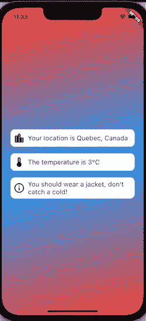
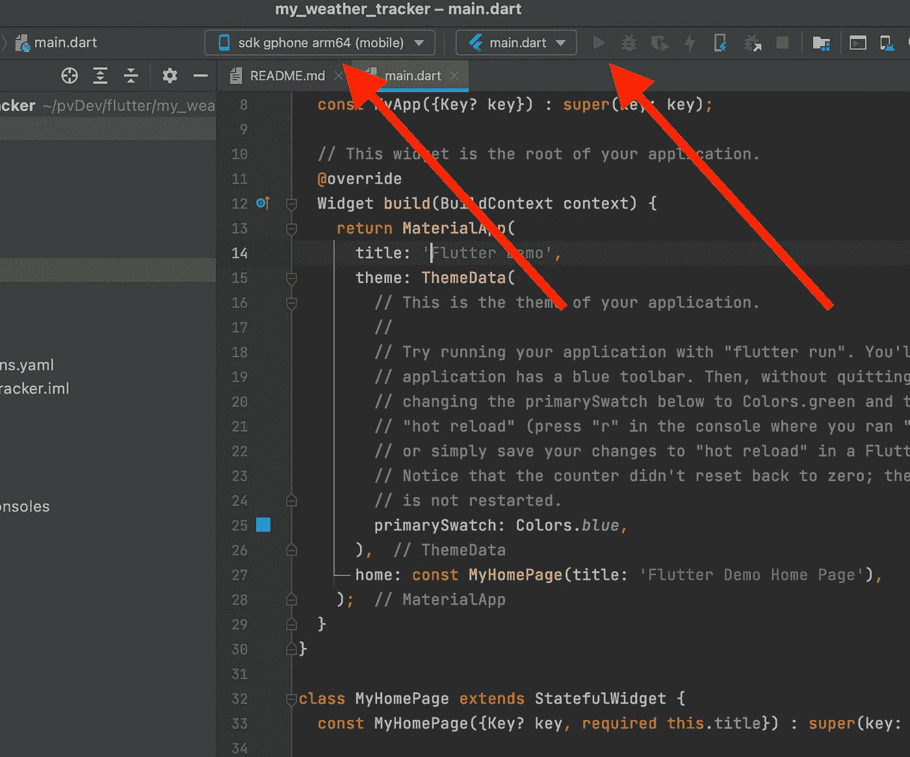
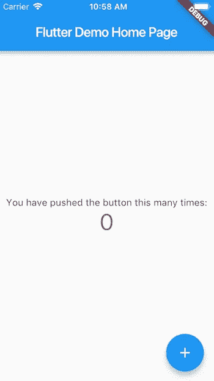
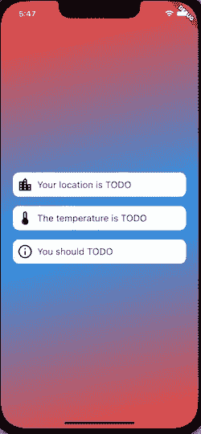
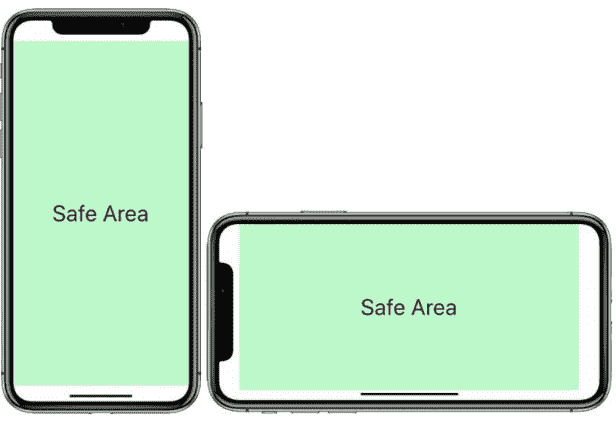
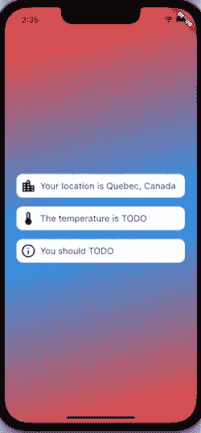
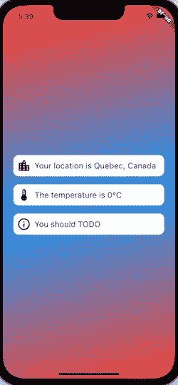

# 使用 GetX 构建您的天气跟踪应用程序

> 原文：<https://betterprogramming.pub/build-your-weather-tracking-mobile-app-with-flutter-using-getx-3650d17c3d9e>


照片由[都铎巴休](https://unsplash.com/@baciutudor)拍摄

你对 Flutter 很感兴趣，但不知道如何或从哪里开始构建你的第一个应用程序？或者，也许，你对 GetX 感兴趣？今天是你的幸运日！您刚刚找到了您正在寻找的内容:)

在这篇文章中，我们将探讨如何使用 GetX 状态管理来构建我们的跨平台 Android 和 iOS 移动应用程序。拿起你的咖啡或任何其他喜爱的饮料，让我们开始吧！

# 我们在建造什么？

一个简单的天气跟踪应用程序，带有一些附加信息:



**你将学到什么:**

1.  建立一个颤振项目
2.  发出 HTTP 请求以从 API 中检索数据
3.  执行异步任务
4.  定义一个可靠且可扩展的基础架构
5.  使用`Get`以被动方式管理数据

## 先决条件

在本教程中，我将使用 Android Studio IDE。如果您对 Visual Studio 代码感觉更舒服，它也能很好地工作。你挑吧！

我们必须下载 **Flutter SDK** ，可以在这里[找到](https://docs.flutter.dev/get-started/install)。你可以按照官方网页上的说明去做，它清晰明了。设置完成后，运行命令行`flutter doctor`(如文档中所述)以确认一切顺利。

如果您在设置时遇到问题，请务必参考他们的官方文档。你可以在那里找到几乎所有的解决方案。

# **创建您的项目**

从这里开始，IDE 相关的指令将针对 Android Studio。Visual Studio 代码应该足够相似。

要创建一个新的颤振项目，点击`**File > New > New Flutter Project**`。指定您的 SDK 位置并设置您的项目位置。确保检查了 Android 和 iOS。您可以选择项目的名称:)

一旦创建了项目，您将进入带有大量默认代码的文本编辑器。它是著名的点击计数器颤振演示应用程序的代码基础。为了运行演示代码，您必须首先创建一个 Android 或 iOS 模拟器。至于 iOS 模拟器，你需要一台 Mac 来运行它。

要创建 Android 模拟器，请点击`Tools > AVD Manager > Create Virtual Device > Pixel 4 (for example) > Choose an Android Image from Recommended > Finish`

现在，您有了一个运行应用程序的设备。在顶部菜单中选择设备，并点击**运行**。



编译成功后，你应该在模拟器上运行 Fluter 演示点击`Counter`应用程序，得到类似下图的显示。



点击计数器应用程序

您可以花一些时间探索不同的存储库。此时，您将了解 3 个关键存储库:

*   `android/`:包含所有原生 Android 相关的数据。如果有任何 Android 特定的设置要做，你将不得不更新这个库中的文件。即:在清单中添加权限、设置版本、更新 Gradle 或 Kotlin 版本等。
*   `ios/`:包含所有与原生 iOS 代码相关的数据。任何特定于 iOS 的设置都在这里完成。即:设置目标操作系统、权限、登录配置等。
*   `lib/` :这是我们的颤振相关代码将生活的地方。注意包含所有演示代码的初始`main.dart`文件。

该编码了！

# 步骤 0:导入 GetX

还记得 GetX 吗？这是我们的国家管理包。它基本上帮助我们制作一个反应式用户界面，并组织我们的应用程序的代码，使其易于扩展，同时减少样板文件。为了建立一个这样的包，我们需要进入`pubspec.yaml`文件。这就是我们对第三方包的依赖性的设置。打开文件，在`dependencies:`下将 [GetX 包](https://pub.dev/packages/get)添加到项目中。

```
dependencies:
 flutter:
 sdk: flutter
 cupertino_icons: ^1.0.2
 **get: ^4.6.1**
```

当您添加完这一行后，您将不得不在项目目录下的终端中使用命令行`flutter pub get`，这将在`pubspec.lock`中下载所有新的依赖项代码。

在 Android Studio 中，你可以在顶部看到一个快捷按钮`Pub get`。

# 步骤 1:添加主页

进入`main.dart`文件，从删除全部内容开始。这个文件是我们用来运行我们的应用程序。启动一个 Flutter 应用程序的核心函数是`runApp()`函数，它将创建我们的小部件树。

默认情况下，Flutter 使用`MaterialApp`根窗口小部件，但是`GetX`包要求将它改为`[GetMaterialApp](https://pub.dev/packages/get#counter-app-with-getx)`以利用包的特性。

此时，您的文件应该如下所示:

**提示:**如果你写下`stless`或`stful`并按下`return`键，Android Studio 会自动为你分别创建`[StatelessWidget](https://api.flutter.dev/flutter/widgets/StatelessWidget-class.html)`和`[StatefulWidget](https://api.flutter.dev/flutter/widgets/StatefulWidget-class.html)`的样板代码。

`GetMaterialApp`发生了什么？

*   这将包含我们的应用程序的所有页面。每个页面小部件都将被包装在`GetPage()`对象中。
*   `HomePage()`:根页面的用户界面(也叫:'/')。
*   `HomeBinding()` **:** 包含了主页正常工作所需的所有类(例如:控制器、存储库等。).我们稍后将讨论这些问题。

首先，让我们使用`stless`快捷方式定义一个新的`HomePage`小部件。新页面的主要小部件通常是一个`[Scaffold](https://api.flutter.dev/flutter/material/Scaffold-class.html)`。我们还将添加一些包含模拟数据的 UI 来展示一些东西。我们将使用`[Column](https://api.flutter.dev/flutter/widgets/Column-class.html)`来对齐我们的`[Text](https://docs.flutter.dev/development/ui/widgets/text)`小部件，这些小部件包含一些垂直的字符串和一些图标，以使它看起来更漂亮。

更新`HomePage` 小部件，如下所示:

并添加我们之前看到的`home_binding.dart`。这个类必须扩展`Bindings`，我们必须重写`dependencies()`函数。简而言之，这就是我们在`get`中注入依赖的方式。使用以下代码创建类:

```
import 'package:get/get.dart';class HomeBinding extends Bindings {
  @override
  void dependencies() {
     // TODO: We will add the dependencies later.
  }
}
```

⚠️确保将这两个新类导入到`main.dart`中，然后运行应用程序，你的仿真器中应该会有这样的东西:



如果你仔细看，你会发现我们的`Row`的项目是多次重复的。稍后，我们将把代码提取到一个单独的小部件中，以使其可重用并避免重复。

您可能还注意到了`SafeArea`小部件。它的目的是定义用户界面的边界。通常，设备要求主页按钮底部和状态栏顶部都有间距。



安全区域小部件

# 步骤 2:添加控制器

我们有自己的用户界面，但我们想获取一些数据，使其动态。让我们在`lib/` 文件夹中创建一个名为`home_controller.dart`的新`Controller` 类。
控制器必须扩展`GetxController`以利用 Get 库。

您的控制器将如下所示:

```
import 'package:get/get.dart';

class HomeController extends GetxController {

  getCurrentLocation() {
    // *TODO add the logic to fetch current city* }

  getTemperatureForCurrentLocation() {
    // *TODO add the logic to fetch temperature for current city* }
}
```

此时，我们需要两个数据模型。该数据模型将保存城市信息，另一个数据模型将保存天气信息。

首先，我们来了解一下如何获取当前城市信息。我们将使用端点`[http://ip-api.com/json/](http://ip-api.com/json/)`。这个请求根据用户的 IP 地址向我们提供数据。这不是很准确，因为它取决于互联网提供商的位置，但它允许我们忽略`location`许可请求。使用加拿大 IP 地址的一个例子是:

```
{
  "status": "success",
  "country": "Canada", // We need this
  "countryCode": "CA",
  "region": "QC",
  "regionName": "Quebec", // We need this
  "city": "Montreal",
  "zip": "H3G",
  "lat": 45.4995, // We need this
  "lon": -73.5848, // We need this
  "timezone": "America/Toronto",
  "isp": "Le Groupe Videotron Ltee",
  "org": "Videotron Ltee",
  "as": "AS5769 Videotron Telecom Ltee",
  "query": "24.48.0.1"
}
```

让我们创建一个名为`location_data.dart`的模型来保存位置信息。

**注意:**`.fromJson`函数的目的是将我们从 HTTP 请求中获得的 JSON 数据转换成我们可以在应用程序中使用的 dart 对象。

我们的下一个任务是在我们的应用程序中发出 http 请求。为了做到这一点，我们需要另一个名为`[**http**](https://pub.dev/packages/http)`的软件包的帮助，这个软件包是来自 Flutter 团队的官方版本。⚠️不要忘记，每次我们需要第三方库时，我们都需要将它添加到我们的`pubspec.yaml`文件中，后面跟着一个`flutter pub get`命令来检索包的代码。

```
dependencies:
  flutter:
    sdk: flutter
  cupertino_icons: ^1.0.2
  get: ^4.6.1
 **http: ^0.13.4**
```

一旦我们添加了这个包，我们就可以使用它的代码向一个端点发出 HTTP 请求，并检索 JSON 对象。

让我们添加一个存储库来执行调用，并为我们的控制器准备数据。创建一个名为`weather_repository.dart`的存储库，如下所示:

`Note` : 该函数体被包装在`async`内，返回一个`Future<LocationData?>`类型。这意味着此操作将异步运行，并且需要一些时间来完成。它将来会返回一个可空的`LocationData`对象。`await`告诉函数在继续之前停止并等待获取端点的数据(耗时的操作是该特定行)。

现在，还记得应该包含 UI 正常工作的所有要求的`Binding`吗？我们`HomePage`将需要`WeatherRepository`和`HomeController`。我们必须在依赖函数中实例化这两个对象。让我们更新`Binding`如下:

```
import 'package:get/get.dart';
import 'package:my_weather_tracker/module/home_controller.dart';
import 'package:my_weather_tracker/repository/weather_repository.dart';

class HomeBinding extends Bindings {
  @override
  void dependencies() {
    Get.lazyPut(() => WeatherRepository());
    Get.lazyPut(() => HomeController());
  }
}
```

`Get.lazyPut(() => abc())`是一个函数，它将在需要时创建对象的实例。例如，当我们调用它们的方法时，如果对象还不存在，我们将创建一个。如果它已经创建，我们将使用现有的。

现在我们可以将这个存储库导入到我们的控制器中，并在其中使用`getCurrentLocation`函数。像这样更新您的控制器:

**注意:**`Rxn`对象是一个可观察但可空的类型。在这种情况下，因为我们在发出请求之前不知道位置，所以它最初被设置为 null。更多 Rx 类型[此处](https://pub.dev/packages/get#breaking-changes-from-20)。

现在，我们要做的就是用检索到的值更新我们的 UI。我们必须在`home_page.dart`文件中获得这个控制器的一个实例，并观察`locationData`上的变化，以显示用户的当前城市。
在`HomePage()`构造函数下添加这一行:

```
final HomeController _controller = Get.find();
```

**注意:**变量名称上的前缀下划线使其成为私有的。

为了让我们的 UI 对控制器的变化做出反应，我们需要用一个`Obx`小部件包装`SafeArea`小部件。每当一个可观察值改变时，这将通知并更新`SafeArea`的内容。

```
///...
child: Obx(
  () => SafeArea(
    child: Column(
///...
```

现在我们可以在`Text`中添加控制器的`address`变量。由于`address`引用了一个`Rx`可观察对象，小部件树中更高层次的`Obx`包装器将在其值改变时被触发，它将通知 UI 用新值重新创建小部件。

```
//...
Expanded(
  // We will fetch the user's current city
  child: Text(
    "Your location is ${_controller.address}",
    style: const TextStyle(fontSize: 18),
  ),
),
//...
```

**注意:**如果您得到任何错误，尝试删除一些`const`关键字，因为它们不再是常量。

尝试运行您的应用程序，您现在应该可以看到这座城市了！



# 步骤 3:添加附加数据

我们需要知道此时的温度，为了获得该数据，我们将使用[开放天气图 API](https://openweathermap.org/api) 。确保创建一个帐户来获得免费的 API 密钥。您将需要它来发出 HTTP 请求。

下面是数据响应的一个片段，以及我们将从 API 调用中需要的属性:

```
{
  //...
  "main": {
    "temp": 280.58, // What we need, default unit is Kelvin.
    "feels_like": 280.03,
    "temp_min": 278.5,
    "temp_max": 281.33,
    "pressure": 1011,
    "humidity": 84
  },
  //...
}
```

让我们创建一个`WeatherData`类来包含天气相关的信息:

现在，为了检索这些数据，我们将把这个新的`getWeatherForLocation`函数添加到我们的`WeatherRepository`中。API 将请求一些额外的数据，如纬度、经度等。我们将在`params`内通过。我们将把 JSON 响应解析成一个`WeatherData`对象。

现在我们需要利用它来检索控制器中的温度。

最后，我们必须在 UI 小部件`HomePage`中使用这个新的`temperature`变量:

```
///...
Expanded(
  // We will use the city data to fetch the weather
  child: Text(
    "The temperature is ${_controller.temperature}°C",
    style: const TextStyle(fontSize: 18),
  ),
),
///...
```

运行应用程序和 tada🎉



# 额外步骤:添加信息文本并重构行部件

我们将完成最后一行项目，这是一个基于天气的信息文本。当然，这取决于多种因素(湿度、压力、最高和最低温度等)。)但为了简单起见，我们只使用温度。我们将有以下 4 个场景:

1.  **温度≤ 0** →“务必穿厚衣服！外面冷死了！”
2.  **气温≤ 15** →“穿件外套，别感冒了！”
3.  **else** →“享受天气，真好！”
4.  **温度为零** →“未知”

```
/// inside HomeController
_getInfoText(int? temperature) {
  if (temperature == null) {
    infoText.value = "unknown";
  } else if (temperature <= 0) {
    infoText.value =
        "make sure to dress thick cloths! It's freezing out there!";
  } else if (temperature <= 15) {
    infoText.value = "wear a jacket, don't catch a cold!";
  } else {
    infoText.value = "enjoy the weather, it's nice!";
  }
}
```

用如下所示的新变量更新`HomeController`,并将其添加到小部件中。

```
///...// A reactive String to display informative text. default is '...'.
RxString infoText = '...'.obs;///...getTemperatureForCurrentLocation() async {
  // Verify if location is not null first
  if (locationData.value != null) {
    // We assign the response from our API call to our Rx object.
    weatherData.value =
        await _repository.getWeatherForLocation(locationData.value!);
    _getInfoText(weatherData.value?.temp); **// make the call here**
  }
}
```

最后一个任务是用一个新的可观察对象更新我们的 UI，就这样！

```
///...
Expanded(
  // We will give advice on what to do
  child: Text(
    "You should ${_controller.infoText.value}",
    style: TextStyle(fontSize: 18),
  ),
),
///...
```

让我们看看结果！


这里的最后一件事是重构我们的行部件。我们可以清楚地注意到他们每个人的模式。容器中的前导图标和尾随文本。我们将创建自己的`RowItem`小部件，它将是之前列出的小部件的集合。

更好，可读性更强，对吗？永远记住尝试将相同的模式提取到不同的小部件中。您甚至可以通过创建一个包含名为`RowItem`的`StatelessWidget` 的新文件来使这些小部件全球化。这将允许您在应用程序中任何地方重用行自定义小部件。

那辆`StatelessWidget` `RowItem`会是这个样子:

试着用这个新的`RowItem`替换`_rowItem`，你会发现它的工作原理完全一样；)

```
///...
RowItem(
  icon: Icons.*thermostat_outlined*,
  text: "The temperature is ${_controller.temperature}°C",
),
///...
```

您可以在 [my GitHub](https://github.com/ademgunay/my_weather_tracker) 上查看整个项目🚀

# 增强创意

*   您可以在调用 API 时添加错误处理。更多信息[点击此处](https://dart.dev/codelabs/async-await#example-async-and-await-with-try-catch)。
*   您可以在`weather`内添加一张根据天空状态更新的图像

```
"weather": [
    {
      "id": 800,
      "main": "Clear", **// here**
      "description": "clear sky",
      "icon": "01d"
    }
  ],
///..
```

*   要有创意！

就这样了，伙计们。感谢阅读，我希望它能帮助你使你的扑动之旅更容易！请继续关注，将会有使用 Get 的页面导航的第 2 部分！下次见；)

```
**Want to Connect?**Caffeinate me to write: [https://www.buymeacoffee.com/gunayadem](https://www.buymeacoffee.com/gunayadem)
```