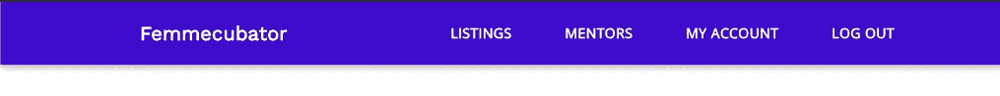
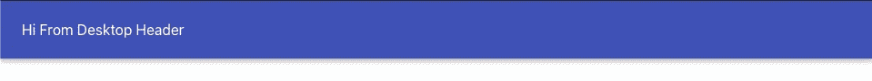
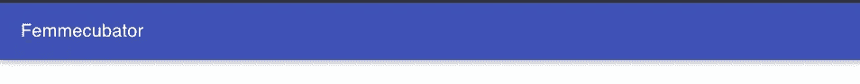
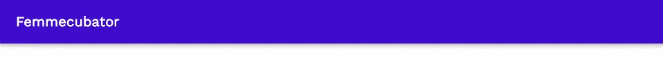
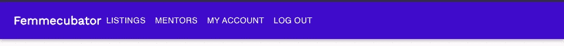
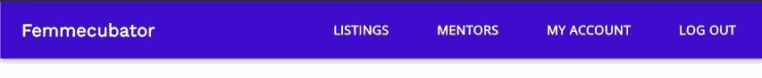

# 用 MaterialUI 和 React 构建一个基本的头

> 原文：<https://betterprogramming.pub/building-a-basic-header-with-materialui-and-react-js-d650f75b4b0a>

## 继续阅读如何建立一个干净、简单的标题


伊恩·穆斯塔法在 [Unsplash](https://unsplash.com?utm_source=medium&utm_medium=referral) 上拍摄的照片。

嘿，大家好。我是安。我是一名网络开发人员，最近帮助为 [Femmecubator](https://www.linkedin.com/company/femmecubator/) 创建了一个响应标题，这是一个崭露头角的网络应用程序，旨在为科技领域的有色人种女性提供资源和支持。在本文中，我将指导您如何使用 MaterialUI 和 React 创建自己的简单桌面标题。

在本教程结束时，您应该完成以下结果:



# 1.设置

*   通过在终端中运行`npx create-react-app header-app`创建一个新的 React 应用。
*   `cd`变成`header-app`。
*   运行`npm i @material-ui/core react-router-dom`安装材质 UI 库和 React Router DOM。
*   由于我们将在本教程后面使用来自`react-router-dom`的`Link`组件，我们需要将`App.js`组件包装在`BrowserRouter`中。如果没有这一步，当我们试图使用`Link`时，我们的应用程序将会崩溃。

# 2.创建标题组件

*   在`Header.js`中创建一个标题组件。
*   从`@material-ui/core`导入`AppBar`和`ToolBar`。这些是预制的组件，将简化我们的头组件的创建。创建一个名为`displayDesktop`的函数，并在这里添加带有一些问候文本的`ToolBar`组件。然后，将函数调用包装在`Header` `return`语句中的`AppBar`组件之间:

*   将`Header.js`导入`App.js`:

*   现在运行`npm start`，我们应该看到以下内容:



# **3。创建一个标志**

*   在我们的`Header`组件中，创建一个名为`femmecubatorLogo`的新变量。从`@material-ui/core`导入`Typography`组件。让我们的`femmecubatorLogo`指向一个`Typography`组件，其变量为`h6`，组件为`h1`。`variant="h6"`将确保我们的标志尺寸与`h6`的尺寸一致。然而，我们希望这个 logo 在 DOM 上显示时仍然保留一个`h1`的元素。可访问性方面，屏幕阅读器将首先自动读取一个`h1`元素。指定`component="h1"`将确保这种情况发生。
*   接下来，我们将定义的`femmecubatorLogo`添加到`displayDesktop`函数中的`ToolBar`组件:

*   目前，我们有:



# 4.更改页眉的背景颜色和设计徽标的样式

*   我们可以利用 MaterialUI 提供的`makeStyle` hook API 来做一些定制的样式。首先，从`@material-ui/core`导入`makeStyle`。然后，使用`makeStyle`创建一个类`header`，并在我们的`Header`组件之外添加`backgroundColor`属性和一个颜色值(如下所示):

```
const useStyles = makeStyles(() => ({
   header: {
      backgroundColor: "#400CCC",
   },
}));
```

*   在我们的`Header`组件中调用`useStyles`，析构`header`键:

```
export default function Header() {
   const { header } = useStyles();
...
```

*   将类名`header`添加到我们的`AppBar`组件中:

*   为了设计我们的 logo，导入`Open Sans`和`Work Sans`字体。将下面一行添加到`index.css`:

```
@import url('https://fonts.googleapis.com/css2?family=Open+Sans&family=Work+Sans&display=swap');
```

*   类似于上面的步骤，在我们的`makeStyles`回调函数中创建类`logo`，并添加属性和值。然后，析构键`logo`以将其用作变量。并将类名`logo`添加到我们的`femmecubatorLogo`中。参见下面的代码:

*   现在，我们有以下内容:



看起来不错！

# 5.创建菜单选项

除了显示徽标，我们还想为用户添加一些菜单选项。它们包括“列表”、“导师”、“我的帐户”和“注销”每一个都是一个按钮。点击它们将把用户带到特定的路线。理想情况下，我们希望从 API 中获得这些菜单选项。然而，为了使本指南简单，我将使用一个数组来表示这些数据。

*   在我们的`Header`组件之外的`Header.js`中添加以下内容:

*   接下来，在我们的`Header`组件中创建一个名为`getMenuButtons`的函数，该函数将映射通过我们的`headersData`数组中的每一项，并将每一项转化为我们将放置在我们的`Header`上的按钮。我们还想从`@material-ui/core`导入`Button`组件，并从`react-router-dom`导入`Link`作为`RouterLink`，因为这些按钮中的每一个都将链接到一条路线。最后，我们在`displayDesktop`函数中调用`ToolBar`内部的`getMenuButtons`:

*   现在我们有以下内容:



# 6.完成一些更多的造型

*   要设计菜单按钮的样式，给每个`Buttons`添加一个类名`menuButton`，如下所示:

*   将`menuButton`定义为`useStyles()`中的一个析构键:

```
const { header, logo, menuButton } = useStyles();
```

*   然后在`makeStyles()`中添加以下样式:

*   我们还希望菜单选项被定位在标题的右侧。为此，我们可以将菜单按钮包装在一个`div`中:

*   然后我们将`Toolbar`做成一个 flexbox，并将`justify-content`指定为`space-between`:



*   最后，我们希望使用填充在标题周围添加一些空间:

我们的最终结果:


感谢您的关注。

[点击此处进入本博客系列的第二部分——让这款页眉响应！](https://vuonganht.medium.com/making-a-basic-header-responsive-with-materialui-and-react-2198fac923c8)