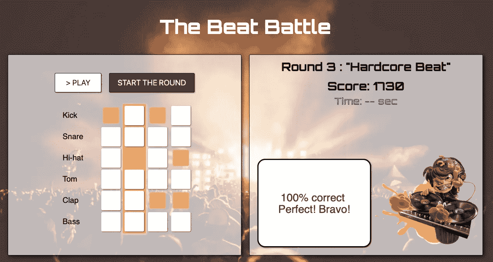
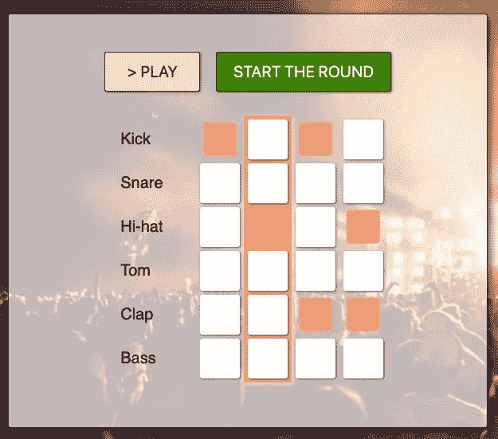

# 用 JavaScript 构建音乐游戏:第 1 部分

> 原文：<https://betterprogramming.pub/building-a-beatbox-game-in-javascript-bd9c2d06e1b2>

## 创建具有和异步功能的基本节拍制作工具


照片由[埃里克·诺帕宁](https://unsplash.com/@rexcuando?utm_source=unsplash&utm_medium=referral&utm_content=creditCopyText)在 [Unsplash](https://unsplash.com/s/photos/music?utm_source=unsplash&utm_medium=referral&utm_content=creditCopyText) 拍摄

对于我在 Ironhack 的第一个项目，我必须在四天内构建一个迷你游戏。我选择使用 DOM 操作和 HTML audio 元素来构建一个 4x6 的 pad，其中 4 列是“节拍时间”, 6 行是可以在这些时间播放的不同声音。

为了增加趣味性，玩家必须听到一种节奏，然后在有限的时间内再现出来以得分。

GitHub 上有完整的代码[。这是一个无框架的应用，只使用了普通的 JavaScript 来构建。最终结果如下所示:](https://github.com/iourisorokine/The-Beat-Battle)



我将去掉游戏中所有真正让它成为游戏的部分(分数、听音和重复、计时器)，并专注于左侧可以看到的 beat-maker 组件。

# 灵感

我从跟随 Dev Ed 的[音乐机器](http://appsbuilders.org/guides/build-a-music-app-with-javascript-tutorial/)教程开始(Wes Bos 的[鼓机](https://www.youtube.com/watch?v=VuN8qwZoego)教程也是这方面的推荐资源)。

现在，让我们创建一组按钮，在“播放”按钮打开时进行迭代，而不是在点击/按下按钮时播放音符。为此，我们将需要 JS 文件中的几个循环，然后将它们连接到我们的 DOM 元素。

# 导入声音

声音从波形文件加载到 HTML，如下例所示:

```
<div class="note-def">              Kick              
<audio class="sound" src="assets/sounds/kit1/kick2.wav"></audio>            </div>
```

共有六个，我们将把它们加载到 JS 文件中:

```
const soundsArr = document.querySelectorAll(“.sound”);
```

结果是一个包含六个元素的数组。我可以通过调用相应元素上的`.play()`方法来播放它们，例如:

```
soundsArr[1].play()
```

# 通过一系列声音同步迭代

如果我们提供一个包含六个布尔的数组来迭代，我们可以管理包含六个声音的数组，并播放接收到一个`true`值的声音:

```
const beatArr = [true, false, true, false, false, false]playBeat=(soundsArr, beatArr)=>{
   beatArr.forEach((s, i) => {    
      if (s) {           
         soundsArr[i].play();    
      }  
   });
}playBeat()
```

我们倾向于认为:“但是循环一个接一个地遍历声音，它应该如何工作呢？”

在迷你游戏的规模上，确实如此，因为这些操作的执行速度并没有让人耳感知到声音之间的延迟。

但是下一步会增加一些乐趣。

# 通过数组的数组进行异步迭代

现在，我们必须考虑我们的整个垫，其中有四个所谓的“节拍”。分区看起来应该更像一个 2D 阵列:

```
const partition1 = [[true, false, false, false, false, false],
                    [true, false, false, false, false, false],
                    [false, true, false, false, true, false],
                    [false, false, false, false, false, false]]
```

对于我们的`playBeat`函数，我们必须添加一个处理程序，每当我们遍历一系列音符时，该处理程序将声音倒回到`time=0`:

```
playBeat = (soundsArr, beatArr) => {  
   beatArr.forEach((s, i) => {    
      if (s) {      
         soundsArr[i].currentTime = 0;      
         soundsArr[i].play();    
      }  
   });
}
```

注意:在这些例子中，我经常对变量和函数参数使用相同的名称，以更好地说明什么去哪里。在实际应用中，我避免这样做，因为这会导致混乱。

然后，我们使用`setInterval`创建一个异步循环，它将在定义的时间间隔内处理数组的元素。`SetInterval`需要一个回调函数，我们将把我们的`playBeat`部分和一个区间放入其中，这个区间是一个变量，我们称之为`tempo`。

速度必须以毫秒为单位，因此对于 120 bpm 的八个音符，我们将有:

`60000 / (120 * 2) = 250ms`

```
playMusic = (soundsArr, partition, tempo) => {  
   let counter = 0;  
   musicPlaying = setInterval(() => {    
      playBeat(soundsArr, partition[counter]);   
      counter++;    
      counter = counter%partition.length
   }, tempo);
}
```

现在让我们用上面的数据执行我们的函数:

```
playMusic(soundsArr, partition1, 250)
```

它应该会产生一个短循环的重复节拍。第一次迭代可能会滞后一点，但总体结果应该是令人满意的。

# 用 DOM 元素连接分区

HTML 文件[有一大堆 div，代表玩家可以与之交互的 pad。大致是这样的:](https://github.com/iourisorokine/The-Beat-Battle/blob/master/index.html)

```
<div class="notes-col">
   <div class="note" id="note-2-0"></div>            
   <div class="note" id="note-2-1"></div>        
   <div class="note" id="note-2-2"></div>            
   <div class="note" id="note-2-3"></div>  
   <div class="note" id="note-2-4"></div> 
   <div class="note" id="note-2-5"></div>          
</div>          
<div class="notes-col">            
   <div class="note" id="note-3-0"></div>            
   <div class="note" id="note-3-1"></div>            
   <div class="note" id="note-3-2"></div>            
   <div class="note" id="note-3-3"></div>            
   <div class="note" id="note-3-4"></div>            
   <div class="note" id="note-3-5"></div>          
</div>
```

有很多 id 和编号，但这允许我们智能地向每个元素添加事件监听器，切换我们的`partition1`数组值，还添加 CSS 类来提供视觉反馈:

```
window.addEventListener("load", () => {
   notes.forEach(note => {
   note.addEventListener("click",() => {
      note.classList.toggle("highlighted");            
      const rowsToggle = note.id.split("-")[1];            
      const colsToggle = note.id.split("-")[2];
      partition1[rowsToggle][colsToggle] = 
      !partition1[rowsToggle][colsToggle];        
      });    
   });
});
```

现在我们只需创建一个播放按钮，并添加一个 onclick 属性，该属性将触发我们上面编写的函数:

```
<button onclick="playMusic(soundsArr, partition1, 250)">
   Play
</button>
```

为了不永远陷入这个循环，让我们创建一个停止按钮:

```
<button onclick="stopPlaying()">
   Stop
</button>stopPlaying = () => clearInterval(musicPlaying)
```



在应用样式后，衬垫

# 瞧啊。

由于有了异步循环，我们可以根据自己的速度以一定的间隔播放节拍。关于播放哪些声音以及何时播放的信息存储在 2D 布尔数组中，用户可以通过与相应的 DOM 元素交互来更改该数组，这些 DOM 元素被处理为一个 pad。

我希望你喜欢这个迷你教程，我期待着在下一篇文章中更深入地研究游戏机制。