# 建造一个更好的地下城关卡

> 原文：<https://betterprogramming.pub/building-a-better-dungeon-level-b04d133a6ca>

## 我如何更新算法以更好地匹配图形

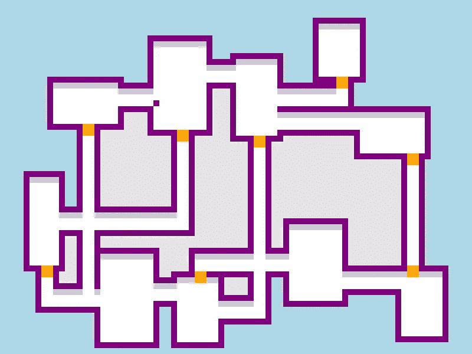

图片由作者提供。

在过去的七个月里，我一直在用 JavaScript 和 HTML5 Canvas 构建一个地牢游戏。这款游戏类似于众所周知的 *Roguelike* ，因为我没有自己建造关卡，而是使用了一种算法——一系列我翻译成代码的指令。

不同的算法产生不同类型的地下城。例如，当我实现了一个叫做*随机漫步的算法时，*它产生了一个类似下面的地牢。

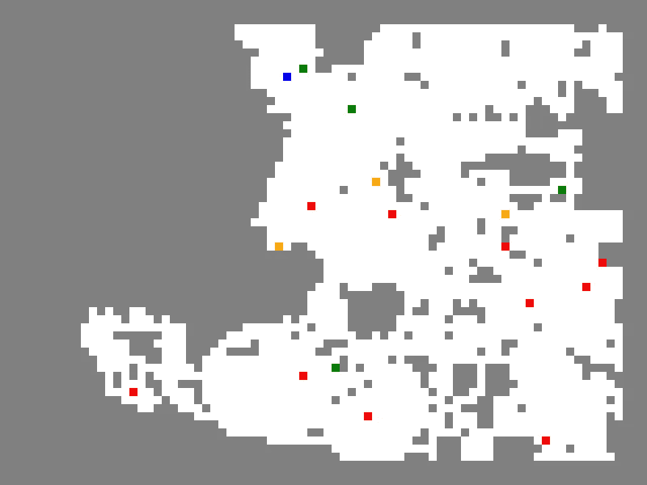

一个游戏关卡示例。玩家蓝，敌人红，物品蓝黄。

顾名思义，一个“挖掘者”会从中心向外随意摸索，并在坚硬的岩石中挖掘出隧道。然后它回到中心，继续前进，直到产生一定量的空间。

在实现了随机行走之后，我写了一些逻辑，在地图上随机放置房间，然后用狭窄的走廊将它们连接起来。虽然我也为同一个游戏用 JavaScript 写了这个，但它是基于不同的算法。

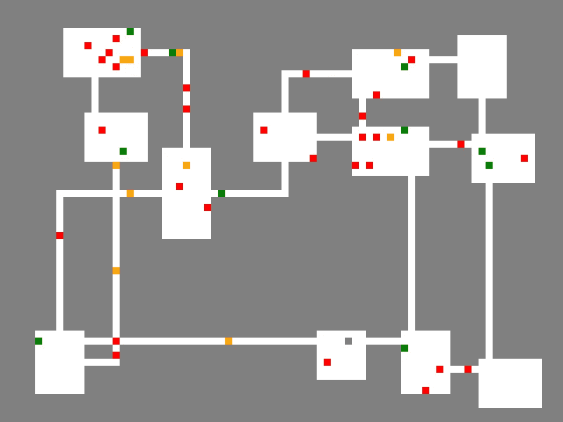

这两种算法都会产生 0 和 1 的 2D 数组。`0`代码产生灰色墙砖，而`1`代码产生白色地砖。例如，下面是一个被墙包围的 4 x 4 房间的地图。

```
[[0,0,0,0],
 [0,1,1,0]
 [0,1,1,0]
 [0,0,0,0]]
```

在我最近的游戏原型中，名为*Rhondar 的 Rogue*，地牢的墙壁和地板由称为瓷砖的正方形图像组成，这个 2D 阵列决定了瓷砖的放置位置。

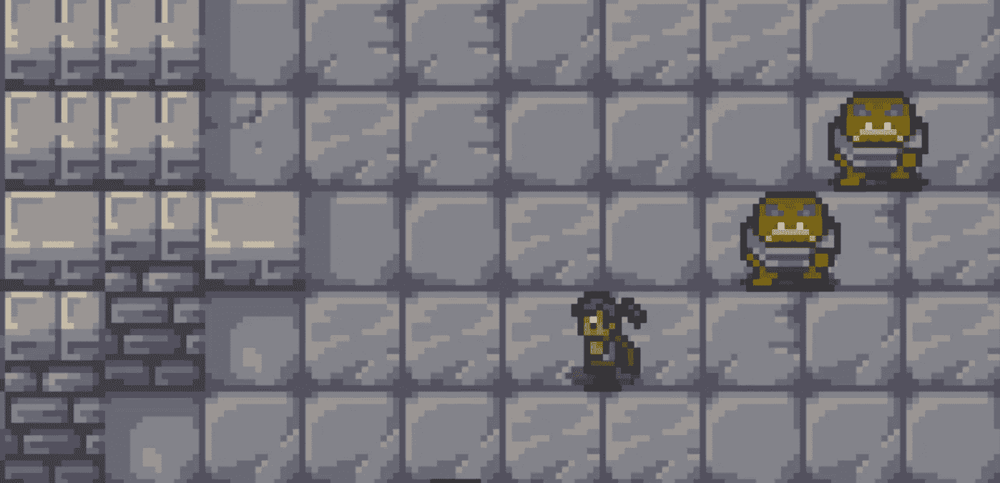

一个游戏原型的图像。通过 [TMT Art](https://www.facebook.com/TMT-Art-collection-405885289760848/) 平铺图像；作者笔下的流氓和妖精。

每当我的 2D 数组中有一个零(`0`)时，就会出现一个墙砖；只要地图上有(`1`)的地方，就会出现一个地砖。

所以下面的 2D 阵列部分—

```
0,0,0,0
0,0,0,0
0,0,0,1
0,0,0,1
1,0,1,1
1,1,1,1
```

—会转化为类似下面的游戏内区域。

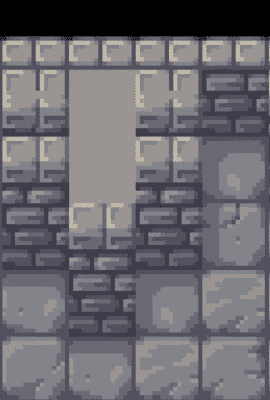

如你所见，这里有一系列墙砖和地砖。

# 放置瓷砖的方法

为了将 0 和 1 转换为正确的瓷砖，我编写了逻辑，首先将瓷砖识别为墙壁或地板，然后根据该位置周围的瓷砖选择特定的图像。为了确定使用哪种瓷砖，程序必须仔细检查瓷砖代码的 2D 阵列，检查每个代码，并寻找其周围的图案。虽然程序会在任何现有的牌中寻找模式，但它也会在 0 和 1 中寻找模式。

确定贴哪种瓷砖比我想象的要困难，因为只有两种瓷砖代码——0 代表墙壁，1 代表地板——以及大约 20 种不同类型的瓷砖。

例如，给定下面四种类型的墙砖—

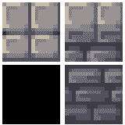

四面可能的墙

—该算法必须根据周围的单幅图块决定将哪个单幅图块用于下方的中心正方形。

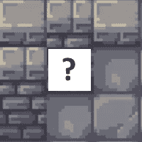

[TMT 艺术](https://m.facebook.com/ArtOfTMT/posts/)瓷砖。

如果周围区域中的一些瓷砖还没有被放置，所有程序必须进行的是附近的瓷砖代码是`0`还是`1`。

虽然找出地砖很简单，但墙砖可以是空白空间、边界、实心墙或孤立的块，这取决于周围的瓷砖。

不幸的是，这种方法将我的代码变成了摇摇欲坠的积木塔。有太多不同的模式需要跟踪，编写代码来识别所有这些模式并正确地响应它们变得很笨拙。我很确定从长远来看这很难维持。

下面是第一次尝试出来的测试游戏截图。

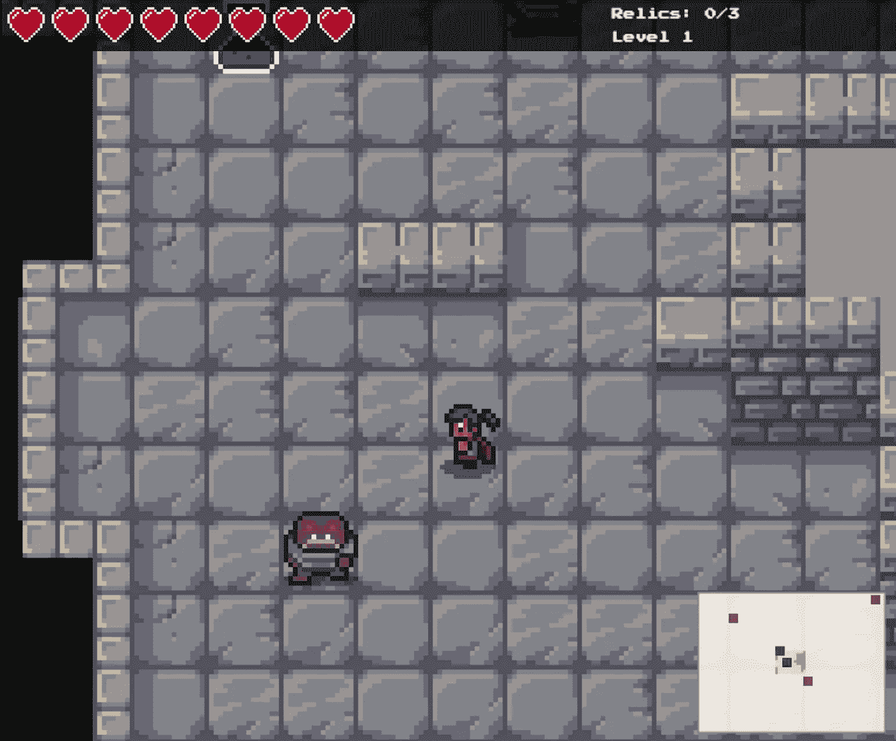

一张早期的游戏截图。

上面的游戏版本使用了我前面提到的随机行走算法。虽然它是实现起来比较容易的算法之一，但是处理它可以生成的所有不同的模式——并在这个过程中使它看起来不错——是非常棘手的。(只要看看下面的水平，它类似于罗夏墨迹。)我开始想，因为随机漫步关卡更像洞穴，而不是地牢，所以洞穴瓷砖会更适合。

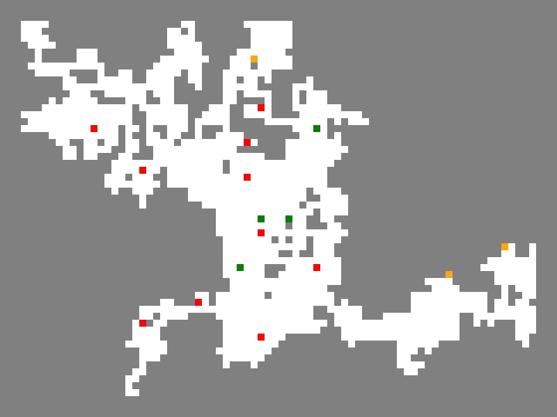

所以我知道我想切换回一个房间的算法，但我对使用我之前设计的算法感觉不是很好，如下所示。只有两个瓷砖代码，房间有时被放置在奇怪的位置，还有太多又长又细的走廊。

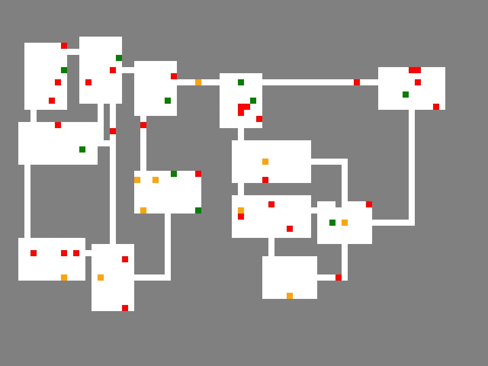

# 从头再来

在进一步进行瓦片放置之前，我需要一个更好的基础——一个更合适的算法来匹配我的瓦片集，并帮助我编写更易于维护的瓦片放置代码。所以我决定回到房间构建算法，做一些修改。

我的目标是产生更宽的走廊和更均匀放置的房间。至于图块代码，我想要的不只是 0 和 1。为了使模式检测更易于管理，我在图块代码中加入了以下内容:

*   0-边界正下方的墙
*   1-楼层
*   2-房间之间的封闭空间
*   3-门
*   4-迷宫周围的空白空间
*   5-边框

我添加了这些更具体的瓷砖代码，以帮助程序识别它正在处理的墙砖或地砖的类型，并减少它必须检查的周围瓷砖图案的数量。

在建立了新的代码之后，我改进了房间生成算法，直到生成的地图看起来像下面这样。

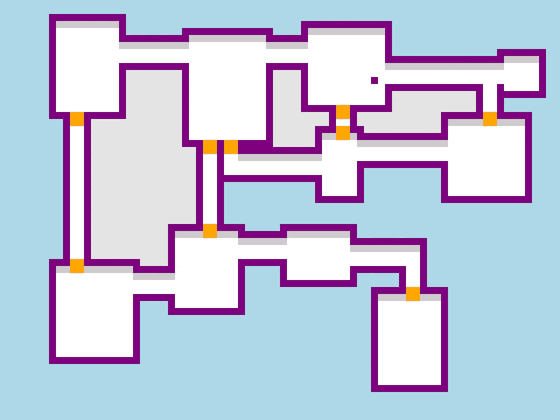

由更新的房间生成算法生成的级别。

每种颜色代表一种特定的瓷砖类型，例如，边框是紫色的，地板是白色的，门是橙色的。虽然代码不需要特定的图块集，但我在编写时考虑了地牢图块集。

# 算法是如何进化的

除了一组更多样化的图块代码之外，下面是该算法发展的一些其他方式。

## 更宽的走廊

我原来的走廊只有一个瓷砖宽，而我的新大厅有两个瓷砖宽，以适应瓷砖集，并给玩家更多的活动空间。

根据朝向不同，每个大厅都有各自的特点。

*   垂直的大厅通常在一端或两端有一扇门。
*   水平的大厅顶部有一面墙。

在等级生成过程中也存储了大厅位置，以便更容易检查大厅之间的重叠。

## 门

门是我打算加入的一个新元素。下面是我打算用的门砖。

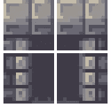

四门瓷砖由 [TMT 艺术](https://www.facebook.com/TMT-Art-collection-405885289760848/)制作。

以下是具体的限制因素:

*   门只出现在房间和走廊的顶部和底部。
*   它们组成了四块瓷砖。
*   有一排墙砖与一扇门的下半部分对齐。

下面是另一张地牢地图，上面有许多大厅和门。

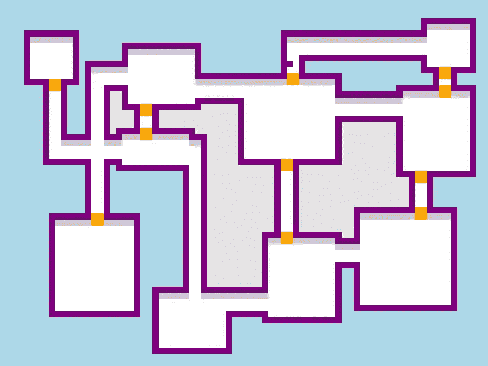

灰色墙壁的水平大厅和带门的垂直大厅。

## 将房间放置在象限中

我早期的房间算法将房间放置在随机的位置，没有真正的限制，除了它们必须有特定的尺寸并适合地图。为了让房间分布更加均匀，我把地下城分成了四个象限。

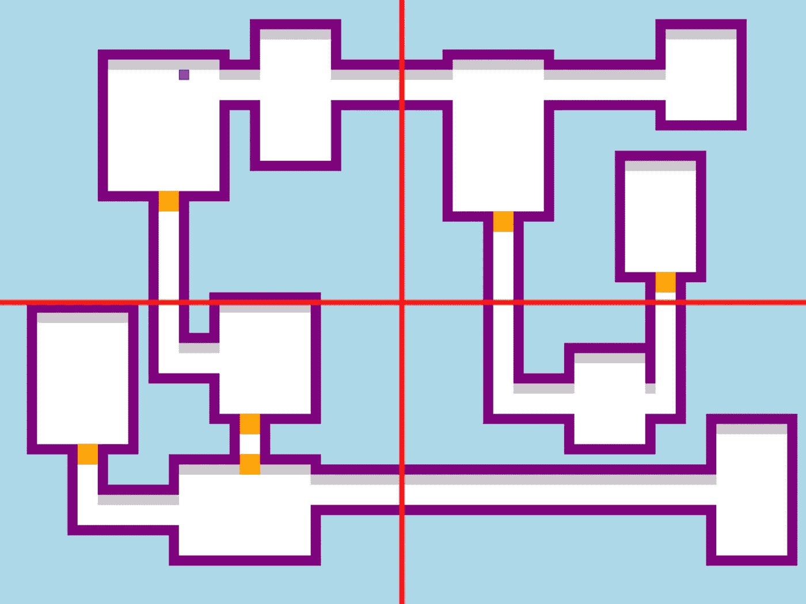

因此，尽管早期的算法在放置每个房间时会考虑整个地图，但新算法每次都会尝试在特定的象限内添加一个房间。过程是这样的:

*   重复象限 1 到 4。
*   在每个象限中，尝试放置一个房间。
*   如果房间与另一个房间重叠，不要放置它。
*   重复此操作，直到达到最大房间数。
*   把房间和走廊连接起来。

这种方法确实使房间的布局更加均匀。有一种更复杂的方法叫做[二进制空间分割](http://www.roguebasin.com/index.php/Basic_BSP_Dungeon_generation)，尽管象限法对于我想要创建的层次也能很好地工作。

# 调试示例

在编写新逻辑的整个过程中，调试工具是必不可少的。如果我需要解释房间不相连或走廊看起来不对的问题，打印每个房间和走廊的`id`会有所帮助。此外，分隔象限的渲染线帮助我看到每个房间在哪个象限。


一张游戏地图，分成四个象限，标有路径和房间。

## 添加拐角

然而，连通房间并不是唯一的问题。我还遇到了一个问题，那就是在正确的位置给特定的路径边界添加拐角。


一个角落瓦片丢失的地牢区域。

用不同的颜色突出一个关键的角落，如下图所示，有助于确定问题并将其放在正确的位置。

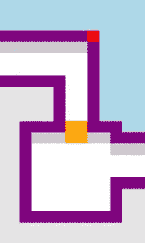

角落贴有标签的房间。

## 监控清理

后来在这个过程中，我添加了一个功能，将浅灰色的瓷砖放在封闭的空间中，并将周围区域作为蓝色的空白空间。然而，我遇到过一些开放空间部分被不需要的灰色瓷砖填满的情况。该死。


渗透到开阔区域的灰色瓷砖。

我决定，我需要一个清理阶段，一旦发现不正确放置的灰色瓷砖所在的空间没有被封闭，就将它们移除。为了实现这一点，我编写了一个快速擦除函数，它检查相邻的图块并递归地调用自己。

为了测试擦除逻辑，我用蓝色和红色瓷砖来表示擦除开始的位置。然后我用绿色来突出灰色瓷砖被移除的区域。

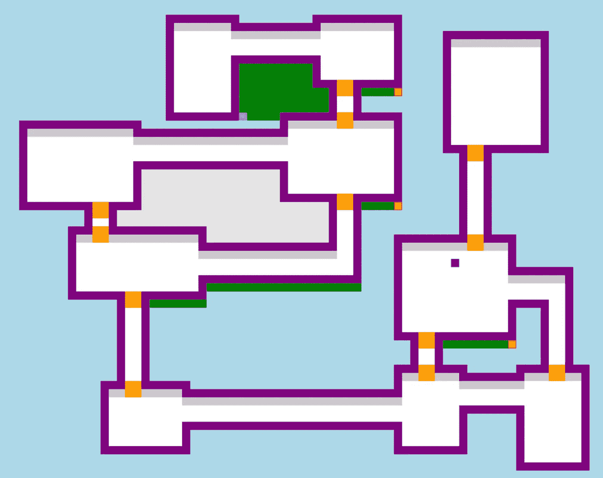

平铺突出显示有助于我跟踪擦除功能的进度。

所有的调试指示器都被放置在一个`<canvas>`元素上，这个元素直接位于持有游戏的`<canvas>`之上。这样，放置在地图上的图块就不会覆盖指示器。

# 外卖食品

对于我的游戏，我开始意识到建造一个好的地下城需要两个过程。

*   一个用于构建图块代码的映射
*   一个用于放置平铺图像

对于有程序生成关卡的游戏，地图构建算法是平铺图像放置的重要基础。太多的瓦片代码和初始地图构建变得太复杂和太特定于瓦片地图；太少，并且放置平铺图像时要检测的图案数量变得难以处理。

特别是，我发现更多的瓷砖代码对于区分边界、空白空间和真正的墙壁是必不可少的。我遇到的大多数自顶向下的图块集都有这些图块类型，所以这个逻辑也应该可以转移到其他图块集。更精细的算法应该有望使瓦片映射更容易。

我希望这是一篇有帮助的阅读，给你一些可以带回你的编程或游戏开发之旅的东西。下次见！

# 信用

看看 [o_lobster](https://o-lobster.itch.io/) 的精灵作品。他的玩家精灵对我创建自己的玩家精灵非常有帮助。

非常感谢 [TMT Art](https://www.facebook.com/TMT-Art-collection-405885289760848/) 提供的非常棒的地牢瓷砖套装。

我欣赏这两位艺术家在作品中展现的技巧和才华。

[](/creating-a-game-loop-in-javascript-4b4d51c18f67) [## 用 JavaScript 创建游戏循环

### 让我们用一个循环的过程来平滑玩家的移动。

better 编程. pub](/creating-a-game-loop-in-javascript-4b4d51c18f67)