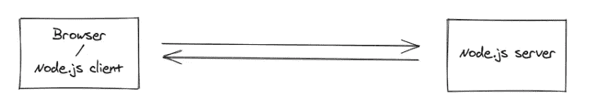
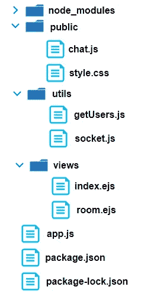
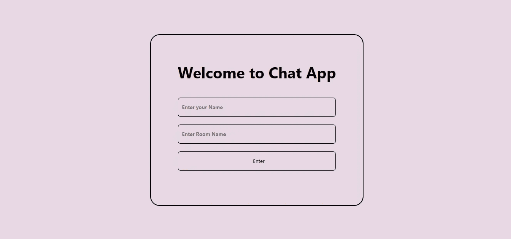
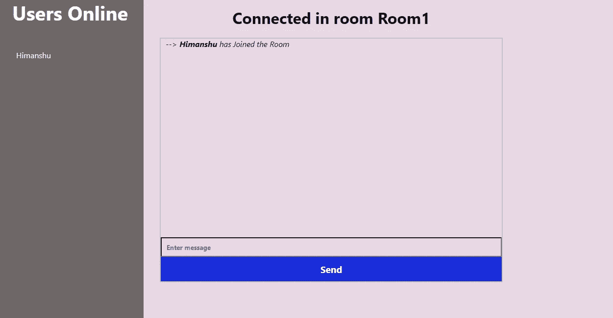
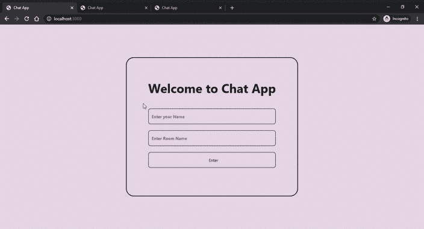

# 使用 Node.js 和 Socket.io 从头构建一个聊天应用程序

> 原文：<https://betterprogramming.pub/building-a-chat-application-from-scratch-with-room-functionality-df3d1e4ef662>

## 提供代码的分步指南


照片由[贾里德·布拉舍](https://unsplash.com/@jaredbrashier?utm_source=medium&utm_medium=referral)在 [Unsplash](https://unsplash.com?utm_source=medium&utm_medium=referral) 上拍摄

在本文中，我们将构建一个具有房间功能的实时聊天应用程序，您可以在其中创建自己的房间，并与您的朋友共享房间名称，以便进行基于文本的交流。

# 我们会用什么来建造？

我们将使用 Node.js 作为后端，它将负责创建房间和管理这些房间中的用户。此外，我们将使用 [Socket.io](https://socket.io) 来实现 web 服务器和客户端(浏览器)之间的实时双向通信。

# WebSocket 和 Socket.io

WebSocket 是一种通信协议，用于在 web 服务器和浏览器之间进行实时、双向和低延迟的通信。Socket.io 基本上是一个 JavaScript 库，使用 WebSocket API 来实现所有这些功能。



Web 服务器和浏览器之间的双向实时通信

要了解有关 WebSocket 和 Socket.io 的更多信息，请访问:

 [## WebSocket

### 是一种计算机通信协议，通过单一 TCP 连接提供全双工通信通道。的…

en.wikipedia.org](https://en.wikipedia.org/wiki/WebSocket) [](https://socket.io) [## 插座。超正析象管(Image Orthicon)

### 插座。IO 3.0 在这里以最快和最可靠的实时引擎为特色~/Projects/tweets/index . js var IO =…

socket.io](https://socket.io) 

# 我们开始吧！

*N* 注:GitHub 上提供了所有代码，您可以从这里派生/克隆它:

[](https://github.com/himanshuagarwal190/ChatApp) [## himanshuagarwal190/ChatApp

### 一个基于网络的聊天应用程序，使用 Node.js 和带有房间功能的网络套接字…

github.com](https://github.com/himanshuagarwal190/ChatApp) 

# 1.创建工作目录

创建一个空文件夹来存放我们所有的代码:

`$ mkdir ChatApp`

然后将目录更改为新创建的目录:

`$ cd ChatApp`

在项目结束时，我们的文件夹结构看起来会像这样



ChatApp 的文件夹结构

# 2.初始化包. json

使用`npm init`创建一个`package.json`文件。该文件包含项目相关信息，如名称、作者、版本等。输入上述命令后，输入终端中显示的信息。

# 3.安装软件包

我们将为我们的项目使用四个节点包。

*   Express —用于在 Node 中构建 web 应用程序的 web 应用程序框架
*   socket . io—支持服务器和浏览器之间的实时通信
*   EJS(嵌入式 JavaScript) —一种为您的前端构建 HTML 标记的模板语言
*   body-parser——用于从`req.body`读取 JSON 对象的主体和传入对象

# 4.密码

让我们动手实际构建应用程序。

现在让我们导入上面的包。在终端中运行以下命令进行导入。

`npm install express socket.io ejs body-parser --save`

接下来，创建`app.js`文件并将上述包包含到我们的代码中。此外，设置其他选项，如主体解析器、视图引擎、公共目录和端口地址。

创建路由渲染`index.ejs`，绑定 app 监听指定端口。

现在，让我们通过在终端中键入`node app.js`来启动我们的应用程序，以确保它正常工作。

在您看到消息“服务器正在端口 3000 上运行”后，打开浏览器并转到 [http://localhost:3000](http://localhost:3000) 检查应用程序是否正在运行。

```
app.get('/', (req, res) => {    
        res.render('index')
})
```

这里，`res.render('index')`正在提供文件`index.ejs`(在视图文件夹中)，看起来像这样:



索引. ejs

`index.ejs`的代码:

在这里，用户会看到一个表单，他们可以在其中输入自己的名字和房间名。

提交的用户名和房间名将被传递到 route room 并呈现`room.ejs`。在`app.js`文件中包含以下代码。

旁注:我们还将增加查看当前在线用户的功能。



room.ejs

`room.ejs`的代码:

房间路由会将其传递给 URL params。它看起来会像这样:

```
[http://localhost:3000/room?username=xyz&roomname=friends](http://localhost:3000/room?username=xyz&roomname=friends)
```

我们将从客户端获取用户名和房间名以实现通信。

## 在服务器端和客户端处理套接字

**客户端**

为了在客户端处理套接字，创建一个文件`chat.js`(在公共文件夹中)。另外，在`room.ejs`中包含以下脚本，以导入套接字库和`chat.js`。

```
<script src="https://cdnjs.cloudflare.com/ajax/libs/socket.io/2.3.1/socket.io.js"></script><script src="/chat.js"></script>
```

`chat.js`的代码:

我对代码进行了大量的注释，以解释每个部分的作用。

简单解释一下`chat.js`正在做的事情:当用户写下一条消息并点击发送时，房间名、消息和用户的名字被发送到服务器。它还从服务器接收关于其他用户的消息和当前在线用户的消息，并将它们显示到 HTML 页面上。

**服务器端**

为了在服务器端处理套接字，创建一个文件`socket.js`(在 utils 文件夹内)。这将负责接收用户消息、房间名称和用户名。然后，根据房间名称，消息将被发送到相应的房间。

不要忘记在`app.js`中包含这段代码。将以下代码添加到`app.js`中以导入套接字。

## 显示当前在线的用户

你可能已经注意到了`socket.js`里面的`const {getUsers, users} = require('./getUsers');`。

`users`是一个在内存中存储当前在线用户的对象。`getUsers`是一个函数，每当有新用户连接时，该函数将用户 WRT 的房间名存储在`users`对象中。

创建一个名为`getUsers.js`的文件(在 utils 文件夹中)。向其中添加以下代码。

# 5.运行应用程序

如果一切都设置正确，尝试运行应用程序。在终端中键入以下命令:

`$ node app.js`

现在去浏览器打开 [http://localhost:3000](http://localhost:3000.) 。

下面是演示聊天 app 的 GIF。



# 结论

我们现在已经成功地构建了一个实时聊天应用程序，并且对消息如何从一个用户交换到另一个用户有了相当好的理解。

目前的应用程序部署在 Heroku 上。如果你有兴趣去看看，去[https://a-chatting-app.herokuapp.com](https://a-chatting-app.herokuapp.com)。

您可以尝试添加的一些功能:

*   建立一个登录系统，有能力有一个好友列表。
*   把它连接到数据库，保存所有过去的信息。
*   添加“关于”和“个人资料”部分。
*   尝试实现类似 WhatsApp 的功能。

感谢您的阅读，祝您度过愉快的一天:)。