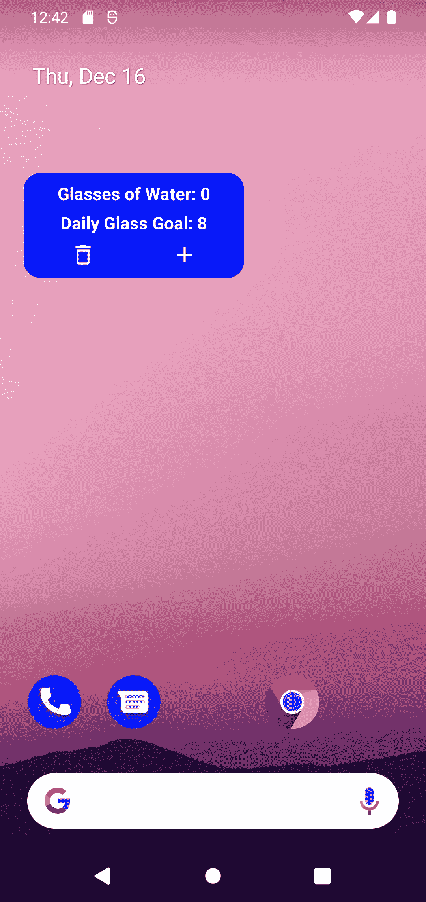
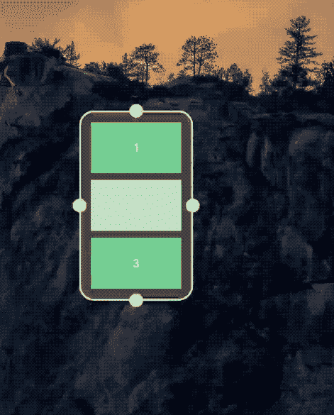
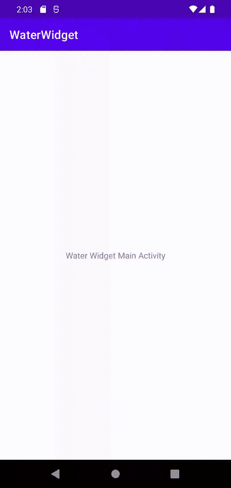

# 使用 Jetpack Glance 构建撰写小部件

> 原文：<https://betterprogramming.pub/building-a-composewidget-using-jetpack-glance-2a65227f9cf2>

## 保持水分

照片由[曼基·金](https://unsplash.com/@kimdonkey?utm_source=medium&utm_medium=referral)在 [Unsplash](https://unsplash.com?utm_source=medium&utm_medium=referral) 上拍摄

最近，Android 宣布了 Jetpack Glance 的 [Alpha 版本，这是一个基于 Jetpack Compose 构建的小部件构建框架。](https://android-developers.googleblog.com/2021/12/announcing-jetpack-glance-alpha-for-app.html)

随着 Android 12 的发布，应用程序小部件得到了彻底的改进，从而极大地改善了开发者和用户的体验。

因此，Glance 提供了一种方便、简化的方式，用少得多的代码创建小部件。该框架提供了一组基本的组件，可以用来创建美观实用的用户体验。

作为利用 Glance 的介绍，将设计一个简单的应用程序小部件来跟踪用户一天喝了多少杯水。Github 库可以在这里找到。

水部件

# 初始设置

要开始创建应用程序小部件，需要执行一些预备步骤。

Glance 与 Android Studio 的最新稳定版本兼容，因此需要进行相应的更新。

至于该项目，将需要几个梯度依赖。

浏览并撰写依赖关系

因为 Glance 是基于组合框架的，所以除了 Glance 本身之外，还需要几个组合依赖项。此外，需要为项目启用 compose。

启用撰写

由于 Glance 只能作为快照使用，快照是在`androidx.dev`存储库中定期生成的构建，因此需要包含在`settings.gradle`中:

包括快照存储库

# 声明和预览小部件

在编写任何组件之前，必须在 android 清单中用额外的定义信息声明小部件。

## 小部件信息

Glance 小部件就像不可组合的小部件一样，需要一个 xml 定义来定义它们的属性。

在该项目中，可以创建一个名为`xml`的新资源目录，其中将包含它。在`xml`内，一个新的文件`water_widget_info.xml`将被制作。

小部件信息

`appwidget-provider`为 android 提供了关于小部件的属性。

*   小部件名称(在本例中为`WaterWidget`)
*   DP 中的最小尺寸信息
*   用户如何调整小部件的大小
*   小工具的默认大小是 Android 12 中的新功能，自动设置为 2x2，但可以从 2x1 扩展到 4x3
*   类别，定义小部件的类型；这可以是主屏幕、键盘守卫或搜索框

Android 12 [演示](https://cs.android.com/androidx/platform/frameworks/support/+/androidx-main:glance/glance-appwidget/integration-tests/demos/src/main/java/androidx/glance/appwidget/demos/ResponsiveAppWidget.kt)中的 Widget 调整大小

有了这些基本信息，这个 xml 信息就可以包含在清单中了。

## Android 清单

为了正确声明小部件，需要在 Android 清单中编写一个接收器。

作为初步步骤，将编写一些样板代码来创建 receiver 和 widget 类。

首先，将创建一个名为`WaterWidget.kt`的文件，其中包含这两个组件。

水部件和接收器

`WaterWidgetReceiver`扩展了作为小部件提供者的`GlanceAppWidgetReceiver`。

这个提供的小部件`WaterWidget`包含一个可组合的函数`Content()`，该函数将包含小部件布局。

一旦定义了这些类，就可以将接收者添加到清单中。

水部件的清单接收器

*   `name`将利用之前创建的接收器类:`WaterWidgetReceiver`
*   意图过滤器被声明为接收对小部件的更新
*   元数据将使用先前在`water_widget_info.xml`中定义的属性

## 初始和预览布局

作为这个初始过程的最后一步，需要定义一个初始和预览布局，以便小部件正常工作。

不幸的是，这些布局需要用 xml 编写，因为这里还不支持 compose。由于这部分代码仍然基于 RemoteView，因此需要一种受支持的 xml 布局:

*   框架布局
*   线性布局
*   相对布局
*   网格布局

ConstraintLayout 不适用于小部件的初始或预览布局。

初始布局是一个遗留项目，它包含用 xml 声明的小部件的布局。

目前，Glance 的文档解释说需要一个初始布局，但这在将来会被删除。因此，一个简单的框架布局将作为一个占位符，直到它可以被即将到来的更新删除。

初始布局

当用户从窗口小部件菜单中选择窗口小部件并将其拖动到主屏幕上时，预览布局将显示窗口小部件的预览。

预览布局

这个预览是为了模仿小部件在 Compose 中构建时的样子而构建的。这些可以添加到`water_widget_info.xml`中的属性:

添加到小部件信息的预览和初始布局

注意:在 Android 12 之前，预览使用`android:previewImage`属性，并使用图像而不是 xml 来显示预览。为了向后兼容，也使用这个方法。

希望随着 Glance 的更新，它将不再需要创建任何 xml 组件，因为同时创建 xml 和 compose 布局是违反直觉的。

# 创建小部件布局

所有这些都准备好了，是时候为小部件编写一些组件了。小部件本身很简单，它将包含四个主要组件:

*   显示用户喝了多少杯水的计数器的文本
*   显示每日建议饮用玻璃杯数量的文本
*   向柜台添加玻璃杯的按钮
*   重置计数器的按钮

## 编写可组合的内容

可以创建一个名为`WaterWidgetContent.kt`的单独文件，可组合函数将驻留在该文件中。

注意:因为这些是 Glance 组件，所以使用的组件将来自 Glance 框架，而不是标准的 compose。因此，他们会用`GlanceModifier`而不是`Modifier`来改变他们的行为。

从计数器文本开始，这个函数将检索一个格式化的字符串，并将喝了多少杯作为参数传递给它。

水部件计数器

这个格式化的字符串采用数字类型(在本例中是一个`Int`)来显示用户的进度。注意这些组件是由 Glance 提供的，而不是由通常的 Androidx 库提供的。这些 UI 组件和 Glance 修改器的行为与它们的 Androidx 对应物非常相似。

接下来，目标文本将包含根据用户是否达到目标来选择字符串的逻辑。

水部件目标

常数`RECOMMENDED_DAILY_GLASSES`可以在伴随对象的`WaterWidget.kt`中定义。

推荐日常眼镜

现在，可以声明添加和重置计数器的按钮。首先，每个图像的矢量资产需要添加到`drawable` res 包中。

加上矢量资产

垃圾向量资产

为了添加到计数器，将使用一个`plus`资产，而计数器重置将使用一个“垃圾桶”资产。这些图像可以在`Row`中声明，以便水平对齐它们。

小部件按钮布局

为了编写点击处理，必须为两个按钮中的每一个创建一个扫视`ActionCallback`。

## 操作回调

这一瞥`ActionCallbacks`正是它们所暗示的；当被通知时，它们执行一个动作。

在一个名为`WaterWidgetActions`的新文件中，可以创建两个扩展`ActionCallbacks`的类。

操作回调

这些函数利用了父类`onRun()`的暂停函数；当回调被调用时，将执行`onRun()`中的逻辑。

结合使用`actionRunCallback<T>()`和`clickable(…)`，这些回调可以被附加到它们相应的图像按钮上。

带有可点击修饰符的按钮

然而，在实现这些回调中的实际逻辑之前，必须检查状态处理。

## 使用状态一览

为了让小部件正确地记录用户增加计数器的次数，它需要记录状态；这可以通过 Glance 提供的组件来完成。

回到`AddWaterClickAction`，可以修改`onRun()`功能:

加水逻辑

这里，挂起函数`updateAppWidgetState(…)`提供了访问和编辑数据存储的范围。

在这种情况下，因为`PreferencesGlanceStateDefinition`是作为参数传递的，所以使用 android 的数据存储。根据预期的返回值类型，可以使用适当的`Preferences.Key`从数据存储中检索值。在这种情况下(对于水的杯数)，使用`intPreferencesKey`。

一旦检索到，该函数将存储的玻璃杯数与定义的上限进行比较(在这种情况下使用 999 只是为了防止用户无限制地增加计数器)，如果没有超出界限，则该值加 1。一旦执行了这个操作，就会调用`WaterWidget().update(context, glanceId)`用新数据更新小部件状态。

`WATER_WIDGET_PREFS_KEY`和`MAX_GLASSES`的常量可以在`WaterWidget`类的伴随对象中定义:

WaterWidget 的常数

对于`ClearWaterClickAction`来说，逻辑更简单:

清水逻辑

与另一个回调类似，这个回调访问相同的存储的玻璃杯数值。然而，该功能将存储值设置为零，重置用户的每日进度。

正确存储这些值后，可以从小部件本身的状态中访问它们。

## 把所有的放在一起

在`WaterWidgetContent.kt`中，可以创建一个可组合的函数来封装小部件的每一个单独的组件，并向它们中的每一个暴露上下文和状态。

水部件内容

这里，Glance 使用`LocalContext.current`为每个可组合组件提供小部件上下文，而`stateDefinition`被覆盖以提供状态。因为 DataStore 以前被用来存储回调中的值，所以再次使用`PreferencesGlanceStateDefinition`来访问它们。现在，可以在 composable 函数中使用`currentState<Preferences>()`来检索必要的数据。就像以前一样，用户今天喝了多少杯可以使用`WATER_WIDGET_PREFS_KEY`检索并传递给每个文本组件。

如前所述，`GlanceAppWidget`包含一个可组合的`Content()`函数，这是调用这个可组合函数的地方。布局完成后，功能部件就可以添加到主屏幕了！

包含内容的小部件

将 Widget 添加到主屏幕

由于 Glance 仍处于早期阶段，这段代码可能会有变化，但希望这一早期版本能对即将到来的事情有所帮助！