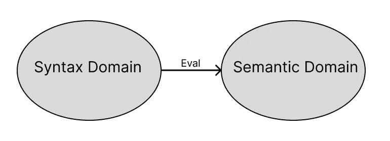
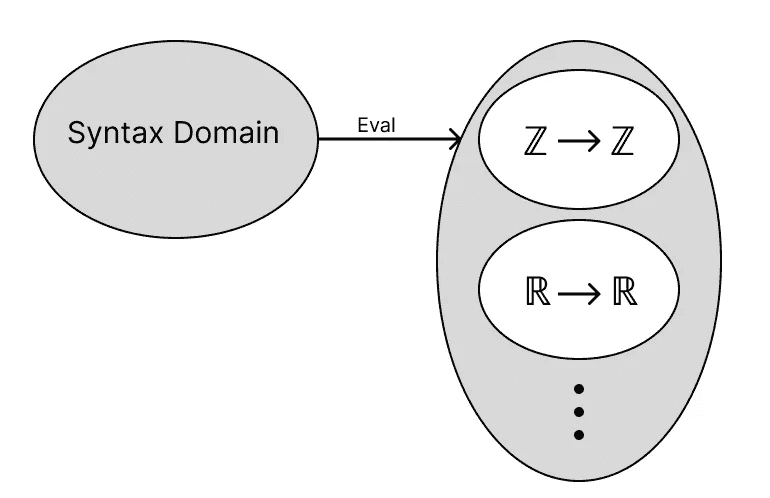
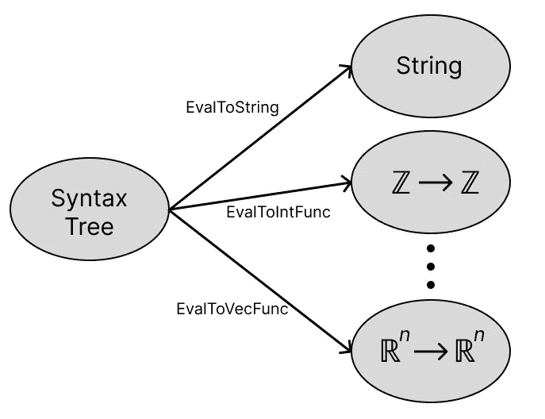
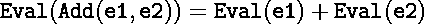
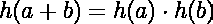
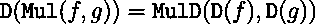
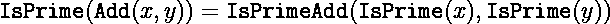

# 在 Go 中构建计算机代数系统，第 1 部分:多元表达式和微分

> 原文：<https://betterprogramming.pub/building-a-computer-algebra-system-in-go-part-1-multivariate-expressions-and-differentiation-291d948aa0e4>

## 探索计算机代数系统的内部运作

照片由[上的](https://unsplash.com?utm_source=medium&utm_medium=referral)[面](https://unsplash.com/@surface?utm_source=medium&utm_medium=referral)拍下

刚开始编程的时候，觉得纸笔数学和计算机数学的距离很大。

无论导数在纸上计算有多简单，我在计算机上最多只能近似计算。当我遇到像 Mathematica 和 Maple 这样专门从事符号计算的语言时，这一切都改变了。从那以后，我就迷上了不同编程语言中符号功能的实现。

本文是我探索计算机代数系统内部工作的系列文章的第一篇。

我的探索将通过在 Go 中实现自己的计算机代数系统来完成。有时，我还会深入研究我的系统的一些理论方面。

在这篇文章中，我将做到以下几点:

*   讨论语法和语义之间的差异，
*   实现可以表示多元代数表达式的抽象语法树，
*   创建一个可以区分这些表达式的函数，
*   构造一个评估函数，该函数采用表达式的语法表示并将其转换成其语义对应物，
*   讨论这个评价函数的一些数学性质。

这些文章将只包含要点来表达我的观点，但完整的代码可以在这个 [GitHub repo](https://github.com/victorbrun/gosymbol) 中找到。此外，这种努力基本上是我充实了一种用于代数表达式的基于语法树的特定领域语言，这是我已经写了一篇初学者友好文章的内容。因此，如果你以前从未听说过[抽象语法树](https://en.wikipedia.org/wiki/Abstract_syntax_tree) (ASTs)或[特定领域语言](https://en.wikipedia.org/wiki/Domain-specific_language)(DSL)，我强烈建议你在继续之前阅读那篇文章。

# 语法与语义

图 1:语法和语义域的可视化，以及 Eval 函数是如何在它们之间映射的。

符号计算的世界是建立在语法和语义的概念之上的，但是它们是什么呢？让我们以一句简单的“Hello World！”程序为例。在没有进一步通知的情况下，你可以用几种语言来实现它。这种知道特定语言中的字母如何组合在一起创建程序的能力是一个语法问题。你记得足够多的一些编程语言可能非常不同的语法，以至于终端吐出“Hello World！”。语法决定你是否使用花括号，是否需要一个`main`函数，等等。

另一方面，我们不同程序的语义基本上是相同的。这是因为语义解决了我们程序的含义，在我们的例子中是产生一个“Hello World！”在终点站。更具体地说，计算机程序的语义是计算机在执行它时遵循的指令，对于我们的简单程序来说，不管语言是什么，语义都是非常相似的。如果你对计算机程序的语义感兴趣，可以在这里阅读更多[。](https://en.wikipedia.org/wiki/Semantics_(computer_science))

从图 1 中可以看出，语法和语义是两件不同的事情，这是我们将从中受益匪浅的事情。因此，需要在它们之间进行转换，这可以通过同一图中的`Eval`功能来实现。在我们的“你好世界！”例如，编译器或解释器做这种翻译。

然而，我们不是在构建一个编译器或解释器，我们是在构建一个计算机代数系统。因此，我们正在区分代数表达式的语法和语义表示。

# 语法领域

图 2:代数表达式 4+6x 表示为抽象语法树。

有了语法、语义及其区别的概念，我们开始开发一种从语法上表示代数表达式的方法。代数表达式是非常递归的结构，如果你不相信我；尝试将`4 + 6x`中的`x`替换为`4 + 6x`，然后对结果表达式做同样的操作，然后一次又一次，以此类推。如果您没有收集任何术语，您将为每个替换添加另一层，而[抽象语法树](https://en.wikipedia.org/wiki/Abstract_syntax_tree) (ASTs)非常适合对这种行为进行建模。

顾名思义，ast 是基于树的数据结构。从图 2 中，我们认识到节点由运算符组成，例如`+`、`*`，或者由常量和变量组成。操作符节点也有代表其参数的子节点，而常量和变量节点是 AST 中的叶节点，因为它们没有子节点。从递归的角度来看，这意味着表示常量和变量的节点是基本情况。

为了在 Go 中建模这种树形结构，我们将使用[类型嵌入](https://go101.org/article/type-embedding.html)，简单来说，这可以看作是 Go 的继承。为了做到这一点，我们利用了这样一个事实，即树中的每个节点，无论是独立的还是相连的，无论是运算符、常数还是变量，都可以被视为一个代数表达式。因此，我们定义了接口`Expr`。

利用这种相似性，我们可以将不同的节点:`constant`、`variable`、`add`、`mul`、`pow`定义为它们自己的数据类型。

这里有几件有趣的事情值得指出。首先，所有节点类型定义中的未命名字段类型`Expr`就是我所说的类型嵌入。这意味着该类型实现了`Expr`-接口，并且由于`add`、`mul`和`pow`的参数属于类型`Expr`，因此可以用多种方式组合这些操作来创建树结构。其次，`add`和`mul`都有切片作为操作数，意味着它们是 n 元运算符，需要实现它们的操作数。这是可能的，因为乘法和加法是相联的。

最后，为了使我们的生活更容易，我们为不同的知名企业创建了一些简单的工厂。请注意，上述五种节点类型也足以实现求反、减法和除法。

## 分化:语法树的转换

在我们转到语义之前，我们将看看语法域内部的操作，特别是微分。如果你要寻找一个没有语法表示的函数的导数，例如一个 lambda 函数，最好的方法是一个数值近似值。在我们的例子中，我们能够象征性地操作我们的表达式，就像你可以用笔和纸一样，来得到导数的代数表达式。

就像在学习如何用笔和纸进行区分的时候，我们需要纠正我们的区分规则，但也仅此而已。通过为每个运算符类型定义微分规则，例如，`mul`成为乘积规则，然后递归调用每个操作数上的微分函数，我们可以很容易地使用我们定义的运算符来区分每个可能的表达式。

为了在实践中实现这一点，我们需要重新定义`Expr`来包含`D`函数。

这迫使我们为每个节点类型定义一个`D`-函数，即`const`、`variable`、`add`、`mul`和`pow`各一个，它捕捉了每个特定类型的区分规则。在代码中，区分规则如下所示:

这种将语法树转换成用笔和纸就能轻松完成的东西的概念首先让我对这个领域感到兴奋。因此，在本系列的稍后部分，我将花时间添加更多的符号变换，如拉普拉斯和傅立叶变换。

# 语义领域

图 3:语义域如何包含几个不同的依赖于上下文的子域的可视化。

对语法领域有了一些了解后，我们可以转到语义领域。如上所述，语义是我们抽象语法表示的底层含义，那么一个代数表达式的底层含义是什么呢？代数表达式由运算符、符号和常数组成，在我们的例子中，符号由`variable`表示。

当使用笔和纸时，这些变量可以用从整数到向量等任何东西来代替。，当在表达式中执行所有不同的运算时，我们只剩下一些量，从整数到向量，等等。对我来说，接受一个输入(变量的值)并产生一些输出量听起来很像一个函数。

因此，代数表达式的语义或潜在含义可以被认为是将某种类型的输入映射到某种类型的输出的函数。图 3 展示了这一点，其中的`Eval`函数将语法域带到了语义域。但是在同一个图中，也可以看出语义域是由几个依赖于上下文的子域组成的。

在一些上下文中，表达式的语义对应部分可以将整数作为输入和输出整数，而在一些其他上下文中，相同的表达式可以将实数作为输入和输出实数，等等。

# 评估:将语法域映射到语义域

图 4:语法域如何映射到几个不同的语义域的可视化。

如上所述，从语法到语义的评估是依赖于上下文的。为了实现这一点，我们需要一种方法来决定我们所处的上下文，或者等价地，我们想要将我们的表达式映射到哪个语义子域。简单的方法，也是我们将使用的方法，是在评估过程中明确指定上下文。这可以在图 4 中看到。

为了使这种评估成为可能，我们再次需要扩展我们对`Expr`接口的定义。我们将限制不同上下文的实现，只包括实值函数(返回浮点数的函数)和字符串的计算。这是通过让`Expr`接口实现`String`和`EvalToRealFunc`来实现的，如下所示。

值得注意的是，在这种情况下，`String`对应于图 4 中的`EvalToString`，因为它允许我们在表达式中使用大量的`fmt`包。此外，我们在下面定义了一些类型，帮助我们保持代码的描述性，比如`VarName`、`Arguments`，它们存储变量值(这有时被称为“赋值函数”或“查找表”)，以及`RealFunc`。

现在我们的`Expr`接口包括了所有的必需品，剩下的唯一事情就是实现评估。为了做到这一点，我们将像微分实现一样，利用表达式的递归性质。如果我们让`e1`和`e2`是两个表达式，那么`Add(e1, e2)`的评估模式可以在下面的图 5 中看到。

图 5:两个表达式相加的求值模式示例。

换句话说，这种模式意味着我们的语法表示法`add`被语义表示法`+`所取代，并且语法操作数也被递归地评估。当然，这需要对我们的评估函数的递归调用停止的基本情况。这自然发生在表达式的叶节点，因为它们没有任何进一步的子节点(表达式基本情况没有进一步的参数)。

这个操作符翻译的实现，让`add`映射到`+`，`mul`映射到`*`等等。其中，`constant`的基本情况只是映射到它的值，而`variable`映射到您指定的值，这是在下面的代码中完成的:

`String`的实现如下所示:

# 从数学角度看评估和语法转换

## 同态，一个例子

作为一个数学书呆子，我不会让你轻易脱身的。这里有相当多的数学机制在起作用，我将借此机会谈谈它。但是不要担心，我会尽力省去尽可能多的技术细节，并尽可能简单地解释这一切！

在幕后，一个叫做[同态](https://en.wikipedia.org/wiki/Homomorphism)的东西一直在努力工作。同态是映射的一个特征。更准确地说，对于我们的意图和目的来说，它是两个集合之间的结构保持映射，每个集合都有一个关联的操作符。

这种集合和运算符的一个例子是 1。被加的实数`(R,+)`，和 2。乘法运算中的正实数`(R_+,*)` (感兴趣的读者可以注意到，这些结构被称为[群](https://en.wikipedia.org/wiki/Group_(mathematics)))。因此，这两个集合之间的同态是保持它们各自结构的函数`h`。

这实际上意味着对于实数中的每个`a`和`b`，`R`；`h(a)`和`h(b)`都是正实数，`R_+`和`h(a + b) = h(a) * h(b)`。最后一部分是结构保持属性，查看这种关系的一种方式是`h`分布在总和上，并将加法转换为乘法。

图 6:结构保持属性。

为了找到从`(R,+)`到`(R_+,*)`的同态，我们仔细看看图 6 中呈现的结构保持属性。这看起来就像幂之间相乘的指数法则。因此，通过让，例如，`h(x) = exp(x)`我们有 1。对于`R`中的`x`，图像`exp(x)`位于`R_+`，2 .那个`exp(a + b) = exp(a) * exp(b)`。因此我们知道指数函数是从`(R,+)`到`(R_+,*)`的同态。

## 同态，如何适用于我们？

现在，为了让您相信同态对我们起着核心作用，我们可以观察到图 5 中呈现的评估模式与图 6 中呈现的结构保持属性具有相同的形式，但是用`Add`代替了`+`，用`+`代替了`*`。这意味着当计算一个表达式时，我们只是使用不同的集合和操作符，但是同态的结构保持特性仍然存在。在`Eval`函数的情况下，我们的集合是语法和语义域，而运算符是我们定义的运算符，即`add`、`mul`、`pow`及其语义对应项，例如`+`、`*`、`math.Pow`。

好，所以我们希望我们的`Eval`函数，对于每个语法操作符，是从语法域到语义域的同态，以符合我们的求值模式。但是如果不是呢？我们已经讨论了一个完美的例子，即微分。

当我们在上面定义我们的微分函数`D`时，我们称之为语法转换，但我们也可以将其视为评估过程。但是，它不是将语法域映射到语义域，而是将语法域映射到自身，这样的映射也可以是同态的。然而，对于我们的微分函数来说，情况并非如此。`D`不是同态。让我告诉你为什么。

图 7:产品的微分成为同态所需的评估模式，其中 f 和 g 是表达式。注意，不能仅用导数的信息来构造 MulD。它还需要原始函数的信息，因为(f*g)' = f'*g + f*g '

观察我们的语法操作符`mul`的区别就足够了。在图 7 中，我们可以看到`D`需要的评估模式是`mul`的同态。现在，根据实现细节，我们可以将`MulD`视为一个独立的语法元素，或者我们可以尝试将其定义为一个函数，给定`D(f)`和`D(g)`，返回`Mul(f,g)`导数的表达式。

无论哪种方式，问题都变成了是否有可能只使用`D(f)`和`D(g)`来表示两个表达式之间乘积的导数，因为当我们遵循图 7 中的模式时，这是唯一可访问的信息。答案当然是否定的，我们试图做的是用仅仅`f'`和`g'`来表示乘积法则`(f*g) = f'*g + f*g'`，这是不可能的。

当试图只使用每个表达式的导数来表示乘积规则时，问题是我们没有足够的信息。我们也需要表达本身。当无法构造同态时，这是一种常见的模式；映射的目标域不包含足够的信息。

这方面的另一个例子(我要偷的)可以在领域特定的数学语言中找到，扬松等人，2022 年(可在本报告中找到)。

在这个例子中，我们考虑一个语法域，在这个语法域中我们可以表示表达式，但是这一次没有变量，使我们的生活更容易。此外，为了减少混淆，我将把计算表达式的过程调用到数字语义域来计算表达式，例如，计算`4*8 — 10`将导致`26`。

现在考虑函数`IsPrime`。如果表达式计算出一个质数，该函数返回`true`，否则返回`false`。这样，语义域就变成了只包含`true`和`false`的集合。

实现这一点的幼稚方法是首先计算表达式，然后检查它是否是质数，但这不是我们想要的。我们想直接根据是否是素数的语义来评估语法。

图 IsPrime 的评估模式。Add 语法被替换为 IsPrimeAdd，它的参数被递归计算。

图 8 所示的`IsPrime`的评估模式与图 5 所示的`Eval`相同。但是由于`IsPrime`评估为一个不同的语义子域，我们用`IsPrimeAdd`代替了`+`，如图 5 所示。`IsPrimeAdd`是一个语义函数，有两个布尔输入和一个布尔输出，我们需要自己定义。

那么，我们可以构造这个函数`IsPrimeAdd`吗？从图 8 中，我们可以看到它需要获取两个数是否为质数的布尔信息，并计算它们的和是否为质数。换句话说，如果我们知道`x`和`y`是否是质数，那么在不知道数字实际值的情况下，我们能否判断出`x + y`是否是质数？

这个问题的答案是否定的；这个证明在图 9 中以矛盾证明的形式给出。该证明利用了以下事实:在步骤 3-5 中，`IsPrime`丢弃了可以用`3`替换`2`的信息，因此表明对于使用可用信息的`IsPrimeAdd`，必须使`false`等于`true`，这是不可能的。

图 9:用反证法证明 IsPrime 不是 Add 到 IsPrimeAdd 的同态，因为 true 不能等于 false。

正如`D`一样，`IsPrime`映射到的域不包含足够的信息使评估模式有效，即评估是同态的。有时可以扩展域使映射成为同态，但这是我不会在本文中讨论的(但可能在将来)。

## 同态，我们为什么要在意？

在写这篇文章的时候，我很兴奋地解释了我们如何在评估模式中利用同态。但是当我悬停在发布按钮上时，我意识到我没有回答这个问题:为什么需要同态？它们是很酷的数学对象，但它们真的有必要吗？毕竟，我们的微分函数`D`工作起来就像一个魔术，使用了与`Eval`相同的递归计算技巧，但它不是同态。

这花了我一段时间，但我对此的回答是，从语法域到语义域的评估不需要同态，但它们允许进一步的抽象。从语法域到语义域的每一个映射都有相同的评估模式，这将允许我们创建一个叫做[变形](https://en.wikipedia.org/wiki/Catamorphism)的东西。

我不会详细解释这个概念，主要是因为我还不理解它，但它可能对我们稍后尝试扩展我们可以映射到的语义子域的数量有用，例如图 4 中的`EvalToVecFunc`。如果你对这个抽象感兴趣，我在这里找到了一篇关于它的有趣文章[。](https://medium.com/@olxc/catamorphisms-and-f-algebras-b4e91380d134)

# 结论

我们现在已经看到区分语法和语义是多么有用。它是计算机代数系统的构建模块，允许我们拥有代数表达式的符号表示，我们可以通过例如微分来操纵它。我们还看到了如何使用抽象语法树在 Go 中实现所有这些。

另一个重要的焦点是从语法到语义的映射或评估。我们已经彻底地检查了它，讨论了它是如何依赖于上下文的，并且确定了如果评估模式是同态的，它在进一步的抽象中是有帮助的。尽管如此，它对评估过程并不重要。

如果你已经走了这么远，谢谢你！这是一篇很长，但我认为很有趣的文章(至少对于写作来说)。在下一篇文章中，我将实现一个表达式简化器，敬请关注！