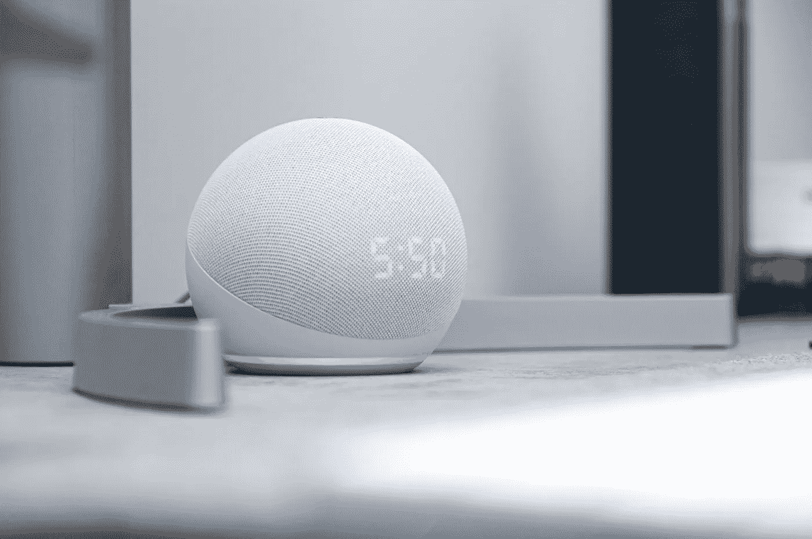
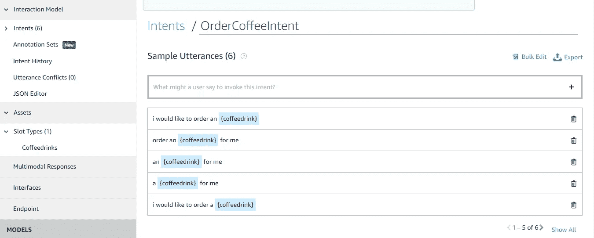
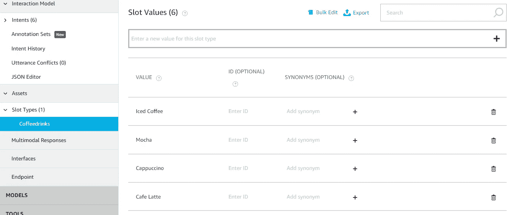
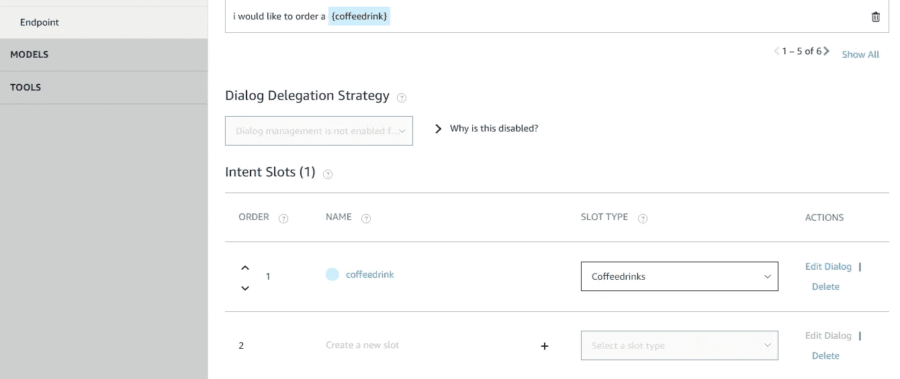
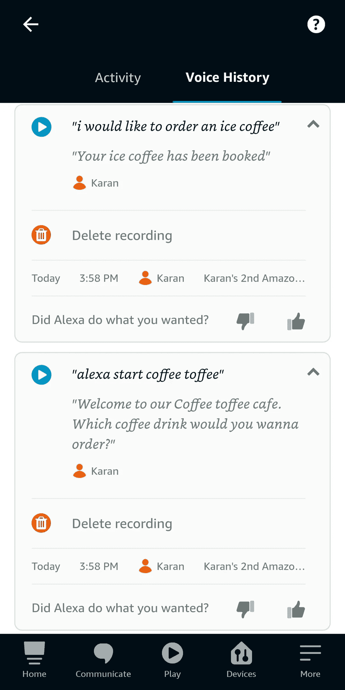

# 建立一个定制的 Alexa 技能——给我点一杯咖啡

> 原文：<https://betterprogramming.pub/building-a-custom-alexa-skill-challenges-faced-and-whats-the-solution-part-1-2948e2578563>

## 第 1 部分:面临挑战的完整解决方案

echo Dot——支持 Alexa 的设备

这将是一个多部分的系列，我将分享我应对挑战的经验，例如:

1.  如果您正在考虑扩展您的技能客户群，则需要掌握支持不同语言的不同地区的多语言技能
2.  使用实时位置进行反向地理编码以获得位置敏感技能
3.  如何解决延迟问题以改善用户体验等等

这部分将是所有关于自定义 Alexa 技能的基础建筑师。

好吧，我们开始吧。尽情享受吧！

# Alexa 技能介绍

好吧，让我们从基础开始:什么是 Alexa 技能？

就像你可以使用谷歌 Play 商店中的应用程序一样，技能商店中也有专门针对 Alexa 设备所在地区的技能。您可以使用这些命令执行多组操作。就是这样。

例如，假设我在本地商店的 Alexa 设备中有一项名为“咖啡太妃糖”的技能。我可以转到该技能，启用它并检查它是如何被调用和使用的。可以通过说“Alexa，附近有咖啡太妃糖店吗？”你可以通过说“点一杯卡布奇诺”来点一杯咖啡，并在旅途中使用。

# 获得 Alexa 自定义技能基础架构️

以下是你创建自己的 Alexa 技能的步骤。(我们也要这么做):

1.  规划和设计你的技能
2.  在开发者控制台中设置技能
3.  使用声音设计来构建您的交互模型
4.  编码并测试您的技能
5.  测试你的技能
6.  提交您的技能进行认证

# 规划和设计你的技能

首先，确定你的技能的价值主张:你的技能将为客户提供什么价值？“我们的技能将是‘咖啡太妃糖’，所以我们将帮助我们的顾客在旅途中点他们最喜欢的咖啡。

然后，直奔设计，设计一个语音用户界面。这映射出了交互以及你的用户将如何与你的技能交互。

# 在开发人员控制台中设置技能

首先，在开发人员控制台中创建一个新技能。我使用了以下内容:

*   “咖啡太妃糖”作为我的技能名称
*   主要区域设置英语(输入)
*   为我的技能定制模型
*   Alexa 托管的(Python)资源为我的技能的后端资源
*   托管区域欧盟(爱尔兰)
*   没有模板(从头开始)

你可以在使用 Alexa 托管的资源时遇到问题，因为它们是有限的。我建议创建你自己的 AWS 帐户，并使用它作为后端资源，因为它为你提供了更多的灵活性和尽可能多的资源。

# 使用声音设计来构建您的交互模型

交互模型指的是您的调用名、意图集合、示例语句和插槽。

*   调用`name`——你在 Alexa 中用来调用技能的名字，比如咖啡太妃糖
*   `Intents` —你的技能可以处理的请求，比如点一杯咖啡
*   示例话语——它将意图映射到用户可以说的单词和短语，以与您的技能进行交互，如“我想点一杯卡布奇诺”、“为我点一杯卡布奇诺”、“为我点一杯卡布奇诺”等等
*   你的意图可以选择性地包含称为老虎机的参数，例如，“我要一杯卡布奇诺”，“我要一杯浓缩咖啡”，或者“我要一杯拿铁咖啡”我们看到，咖啡饮料是一个论证，即`slot`在这个特定的意向中。

我使用开发人员控制台，构建→交互模型→意图，并添加意图、示例语句和花括号{}中的位置。当创建话语时，您可以使用预定义的类型，如槽类型的`AMAZON.Person`。这使用一个人的名字或创建一个自定义的名字，就像我们正在做的通过在槽类型中创建槽类型，然后在意向中分配它。

添加意图、示例话语和时段

定义自定义插槽及其值

指定插槽及其对应的类型

您可以进入交互模型→JSON 编辑器来检查为您对应的语音交互模型生成的 JSON。下面是一些代码:

JSON 编辑器

您可以利用 JSON 编辑器、开发人员控制台或 CLI 来创建您的交互模型；这完全取决于你是否方便。

# 编码并测试您的技能

让我们来看看开发人员控制台中的代码部分，

我们被提供了一个 AWS Lambda(一个 [Amazon Web Services](http://aws.amazon.com/) 产品)，它让我们可以在云中运行代码，而无需管理服务器。

您的技能的主要编码任务是创建一个可以接受来自 Alexa 服务的请求并发回响应的服务，这是我们利用类的帮助实现的。

我们为我们从 Alexa 服务中收到的每一种类型的请求创建类，这取决于我们为我们的技能指定的意图。此外，我们为启动请求预定义了几个类，并内置了支持我们技能的`intents`。

每个类有两个主要功能，即:

1.  `can_handle` —检查已定义的目的名称
2.  `handle` —它利用从 Alexa 服务发送的请求及其属性向用户发送适当的响应

对于我们的订单咖啡意向处理程序，您可以在`can_handle`函数中看到以下内容:

1.  使用`is_intent_name`检查其定义的意图是否为“订购咖啡意图”
2.  然后在`handle`中，它使用`handler_input. request_envelope. request. intent. slots[‘coffeedrink’] .value`获取“coffeedrink”槽的槽值
3.  然后使用来自用户输入的值，它为用户构建输出，同时使用`handler_input. response_builder. speak(speak_output). set_should_end_session(True)`结束该技能的特定会话
4.  然后它返回相同的响应

代码如下:

如果您想知道我们是如何访问这些值的，您可以查看从 Alexa 服务发送的示例请求。看看我们是如何从 JSON 请求中的`request. intent. slots[‘coffeedrink’]. value`之后的请求中访问槽值的。

以下是更多代码:

然后我们将每个请求处理程序添加到技能的最后；那是非常重要的。我已经按照我的意图编写了代码，但我没有触及内置意图。

AWS Lambda 代码

如果您在开发人员控制台中使用自定义 AWS 资源，请使用您的端点(例如，Lambda ARN)更新您的技能。

然后我们直接进入测试部分，在那里我们检查我们的技能是否有效。

这对我们来说很好。

# 测试你的技能

一旦你的技能完成，你可以选择为你的技能设置一个测试。通过 beta 测试，您可以将您的技能提供给您个人选择的有限的测试人员群体，而不是普通大众。

让我们来看看开发人员控制台中的分发会话。

在我们的语言环境的技能预览中，添加一句话的描述、详细描述、示例短语(意图)、小技能图标、大技能图标、类别、关键字和隐私策略 URL。对该技能的隐私和法规遵从性部分进行同样的操作。

然后在“可用性”部分，授予公共访问权限。在 beta 测试中，添加 beta 测试管理员的电子邮件地址，然后添加测试人员的电子邮件地址，用“，”分隔。输入测试人员的电子邮件地址后，启用 beta 测试。

如果你跳过任何选项，你可能无法对你的技能进行测试，因为所有这些都是 Alexa 技能商店所需要的。

然后，测试人员会收到一封邀请邮件，邀请他们对技能进行 beta 测试，并且可以选择在邮件中启用该技能。做必要的，然后做测试。

如果你点击“更多”，然后前往你的 Alexa 的活动部分，你可以看到你的声音历史。它看起来会像这样:

然后你继续增加更多的技能。当您认为您的技能可以向公众发布时，您可以提交您的技能进行认证。这有一个清单；你可以在这里找到更多相关信息。

 [## 构建自定义技能的步骤| Alexa 技能包

### 本指南提供了创建新的自定义技能的步骤。自定义交互模型是否适合您…

developer.amazon.com](https://developer.amazon.com/en-US/docs/alexa/custom-skills/steps-to-build-a-custom-skill.html) 

好了，暂时就这样了。我很快会带着同一系列的另一部分回来。