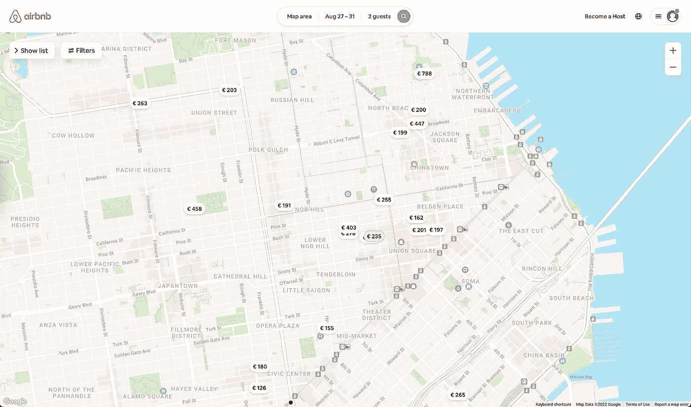
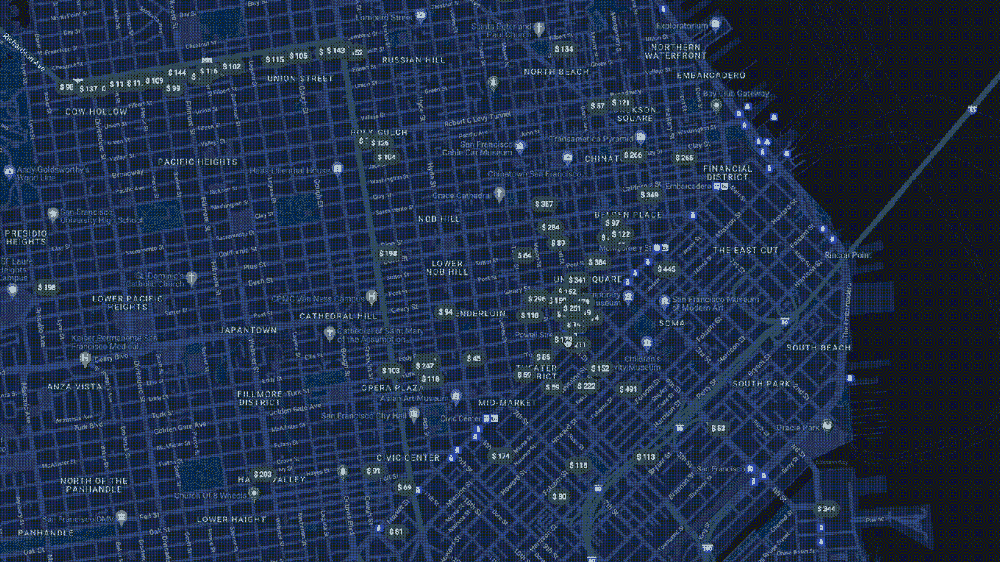
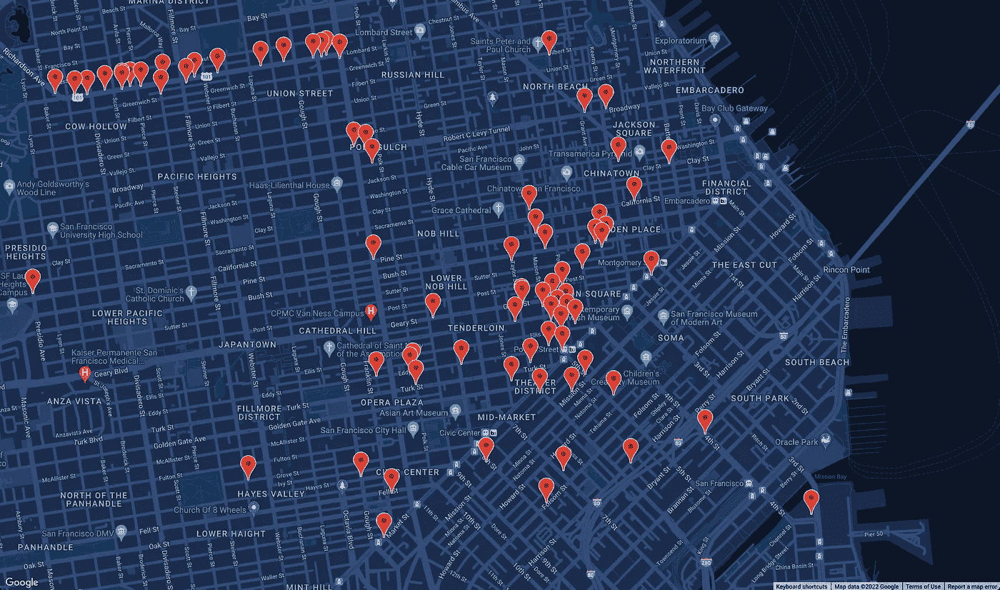
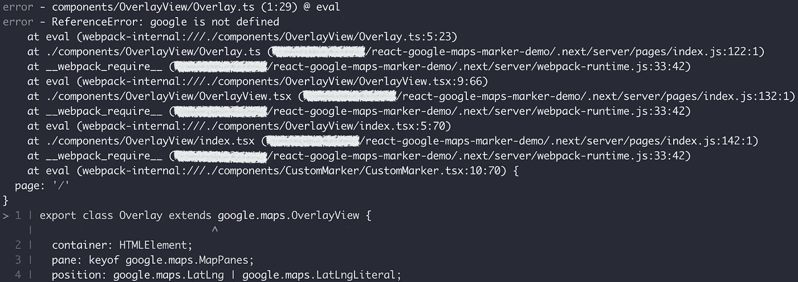
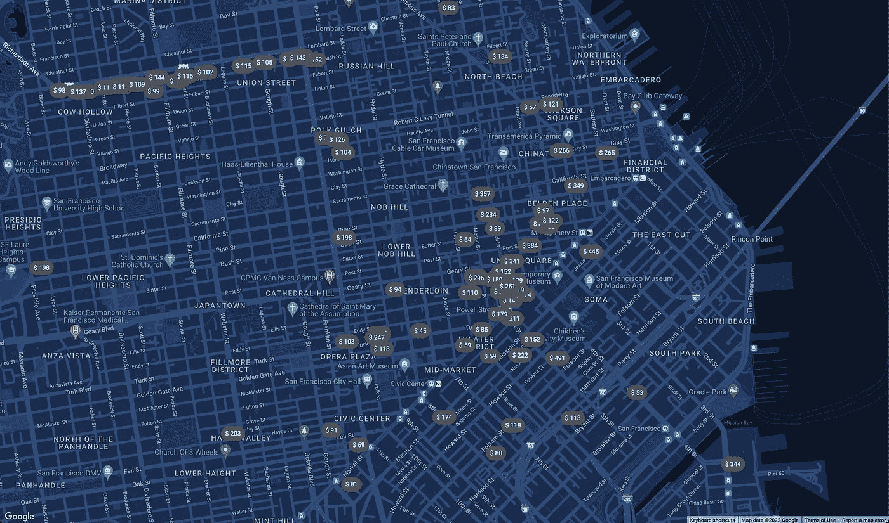
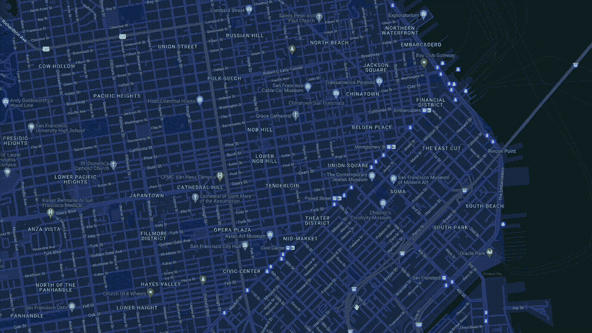

# 构建一个自定义的 Google Maps Marker React 组件，如 Next.js 中的 Airbnb

> 原文：<https://betterprogramming.pub/building-a-custom-google-maps-marker-react-component-like-airbnb-in-next-js-52fb37ccfabb>

## 帮助您创建应用程序并避免错误的深入指南


# TL；速度三角形定位法(dead reckoning)

*   我们将学习如何使用任何 React 组件构建一个自定义的 Google Maps 标记。
*   我们将学习如何使用自定义标记创建动画和用户交互。
*   我们将在 Next.js 中讨论如何在构建期间避免编译错误。

我很好奇像 Airbnb 一样在谷歌地图上做[标记。](https://www.airbnb.com/s/San-Francisco--CA--United-States/homes?tab_id=home_tab&refinement_paths%5B%5D=%2Fhomes&flexible_trip_lengths%5B%5D=one_week&query=San%20Francisco%2C%20CA%2C%20USA&place_id=ChIJIQBpAG2ahYAR_6128GcTUEo&date_picker_type=calendar&checkin=2022-08-27&checkout=2022-08-31&adults=2&source=structured_search_input_header&search_type=user_map_move&ne_lat=37.8053501277308&ne_lng=-122.37779937848381&sw_lat=37.77496292220189&sw_lng=-122.44955383405022&zoom=15&search_by_map=true)



[Airbnb 地图查看截图](https://www.airbnb.com/s/San-Francisco--CA--United-States/homes?tab_id=home_tab&refinement_paths%5B%5D=%2Fhomes&flexible_trip_lengths%5B%5D=one_week&query=San%20Francisco%2C%20CA%2C%20USA&place_id=ChIJIQBpAG2ahYAR_6128GcTUEo&date_picker_type=calendar&checkin=2022-08-27&checkout=2022-08-31&adults=2&source=structured_search_input_header&search_type=user_map_move&ne_lat=37.8053501277308&ne_lng=-122.37779937848381&sw_lat=37.77496292220189&sw_lng=-122.44955383405022&zoom=15&search_by_map=true)

这些标记比谷歌地图的默认标记包含了更多的功能。除了定制样式，每个标记显示动态价格和[状态](https://xd.adobe.com/ideas/process/ui-design/designing-interactive-buttons-states/)。当与自定义 React 组件交互时，您将看到用数据呈现的自定义 React 组件。

我发现它非常有趣和有用，所以让我们一起打开它！

我们将构建一个概念验证，使用任何 React 组件创建客户标记。



我们走吧。

# 设置项目

> *演示是 GitHub* *上的* [*。随便叉吧。*](https://github.com/DawChihLiou/react-google-maps-marker-demo)

我按照[官方教程](https://developers.google.com/maps/documentation/javascript/react-map)在一个 [Next.js](https://vercel.com/solutions/nextjs) 项目中集成了谷歌地图 API。该教程解释了如何在 React 应用程序中渲染谷歌地图和标记。

项目中还包括一些集成:

*   RapidAPI — Priceline com 提供者:获取酒店列表作为我们的数据集。
*   [Tailwind CSS](https://tailwindcss.com/) :提供 CSS 样式。
*   [成帧器动作](https://www.framer.com/motion/):在 React 组件上应用动画。

谷歌地图的默认标记如下所示:



# 使用谷歌地图覆盖自定义标记

Google Maps API 提供了一个 [OverlayView 类](https://developers.google.com/maps/documentation/javascript/reference/overlay-view#OverlayView)来在地图上放置 DOM 元素。我们可以使用`OverlayView`在地图上放置一个 [React 门户](https://reactjs.org/docs/portals.html)的容器，并在容器中呈现一个定制的 React 组件。

按照官方教程[创建自定义覆盖类](https://developers.google.com/maps/documentation/javascript/customoverlays)，我们将实现三个基本方法:

*   `onAdd`:将我们的门户容器添加到目标[窗格](https://developers.google.com/maps/documentation/javascript/reference/overlay-view#MapPanes)。
*   `draw`:定位集装箱。
*   `onRemove`:从 DOM 中移除容器。

# 连接谷歌地图和 React

现在我们有了自己的定制`Overlay`类，我们可以创建一个 React 组件来:

*   创建一个容器
*   实例化`Overlay`类
*   将覆盖图添加到地图实例中
*   并创建一个 React 门户来呈现容器中的组件

让我们使用`OverlayView`组件和一个按钮创建一个标记。

# 解决 Next.js 中的错误

如果您已经启动了您的开发服务器或试图构建项目，您可能会看到一个引用错误，说“google 未定义”:



这是因为 Webpack 在构建时不识别“google”。在构建时，Google Maps JavaScript API 尚未加载，因此 Webpack 无法在模块级评估`Overlay`类。我们可以将该类包装在一个[工厂函数](https://www.patterns.dev/posts/factory-pattern/)中来解决构建错误。

让我们相应地重构`OverlayView`组件:

现在，我们应该能够再次看到我们的地图和自定义标记没有错误！



# 添加动画和用户交互

因为我们的定制标记是 React 组件，所以我们可以定义用户体验并使用 React 生态系统中可用的工具。让我们实现以下内容:

*   过渡标记外观的软动画
*   一个切换按钮状态的 click 事件处理程序和一个显示酒店详细信息的 card 组件

动画看起来像这样:



按钮状态开关和卡片开关也已就位:


# 最后的想法

创建一个自定义标记看起来需要很多代码，但是心理模型很简单:

*   我们通过一个覆盖实例将一个 DOM 元素呈现为地图中的容器。
*   在覆盖图中，我们可以将容器放置在地图上的正确位置。
*   该容器也是 React 门户的目的地。
*   当 React 标记组件准备好呈现时，我们将组件导入到地图中的容器。

# 参考

*   [网站:向 React 应用程序添加地图和标记](https://developers.google.com/maps/documentation/javascript/react-map)
*   [网站:谷歌地图 JavaScript API — Markers](https://developers.google.com/maps/documentation/javascript/markers)
*   [网站:谷歌地图 JavaScript API——自定义标记](https://developers.google.com/maps/documentation/javascript/custom-markers)
*   [网址:谷歌地图 JavaScript API — OverlayView 类](https://developers.google.com/maps/documentation/javascript/reference/overlay-view#OverlayView)
*   [网站:谷歌地图 JavaScript API —自定义覆盖图](https://developers.google.com/maps/documentation/javascript/customoverlays)
*   [网站:谷歌地图 JavaScript API — MapPanes 接口](https://developers.google.com/maps/documentation/javascript/reference/overlay-view#MapPanes)
*   [网站:Airbnb](https://www.airbnb.com/s/San-Francisco--CA--United-States/homes?tab_id=home_tab&refinement_paths%5B%5D=%2Fhomes&flexible_trip_lengths%5B%5D=one_week&query=San%20Francisco%2C%20CA%2C%20USA&place_id=ChIJIQBpAG2ahYAR_6128GcTUEo&date_picker_type=calendar&checkin=2022-08-27&checkout=2022-08-31&adults=2&source=structured_search_input_header&search_type=user_map_move&ne_lat=37.8053501277308&ne_lng=-122.37779937848381&sw_lat=37.77496292220189&sw_lng=-122.44955383405022&zoom=15&search_by_map=true)
*   [网站:设计按钮状态& UI 交互— Adobe XD Ideas](https://xd.adobe.com/ideas/process/ui-design/designing-interactive-buttons-states/)
*   [网站:制宪者议案](https://www.framer.com/motion/)
*   [网站:React 门户](https://reactjs.org/docs/portals.html)
*   [网址:Next.js](https://vercel.com/solutions/nextjs)
*   [网站:RapidAPI — Priceline com 提供商](https://rapidapi.com/tipsters/api/priceline-com-provider/)
*   [网站:工厂模式—模式](https://www.patterns.dev/posts/factory-pattern/)
*   [GitHub:谷歌地图 JavaScript API React Wrapper](https://github.com/googlemaps/react-wrapper)
*   [GitHub:react-Google-maps-marker-demo](https://github.com/DawChihLiou/react-google-maps-marker-demo)

```
**Want to Connect?**This article is originally posted on [Daw-Chih’s website](https://dawchihliou.github.io/articles/building-custom-google-maps-marker-react-component-like-airbnb-in-nextjs).
```