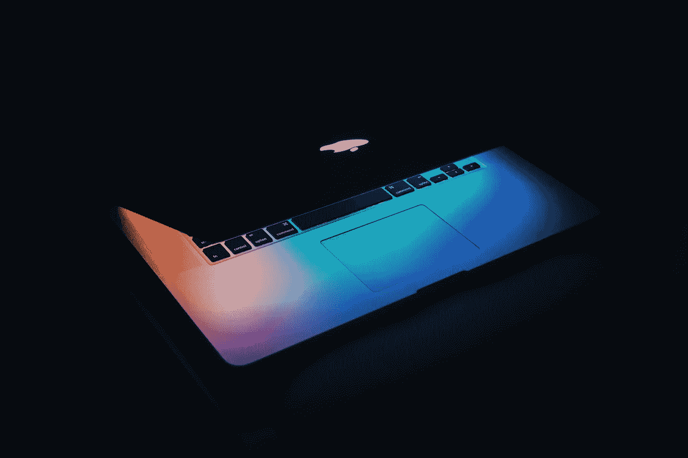
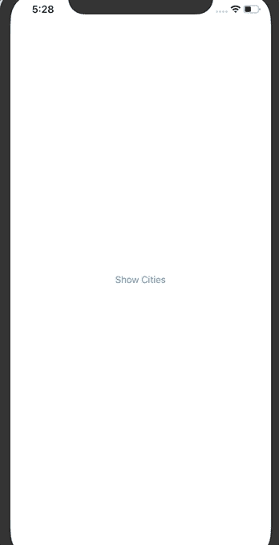
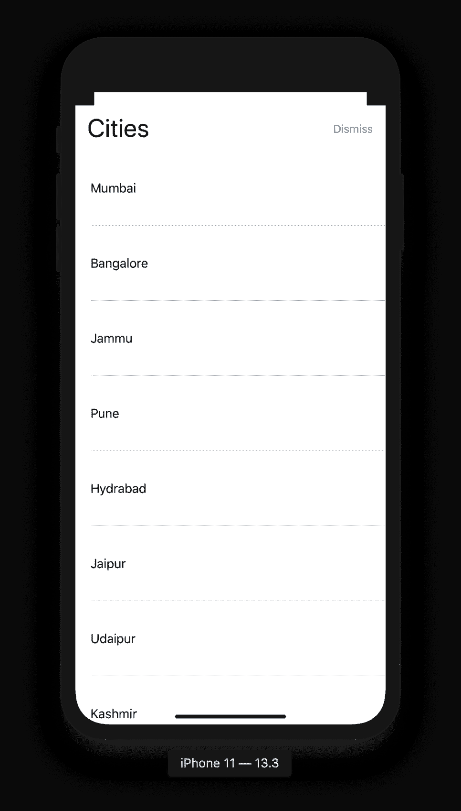
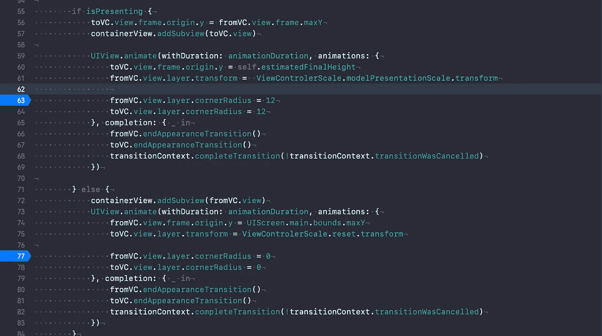
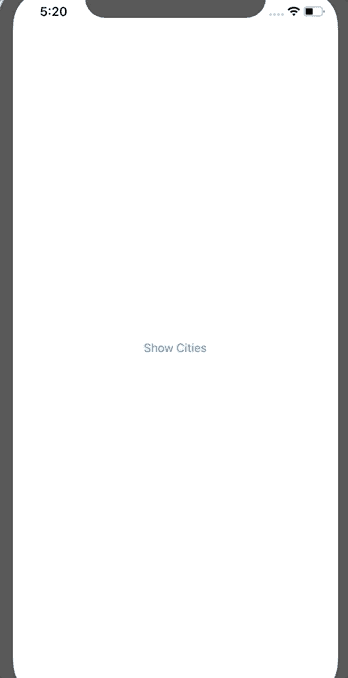

# 在 iOS 中为 ViewController 构建自定义过渡

> 原文：<https://betterprogramming.pub/building-a-custom-transitioning-for-viewcontroller-in-ios-13-cbf9b4de3d9b>

## 让我们在 appsybill bed 中构建自定义过渡



照片由[威森王](https://unsplash.com/@wesson?utm_source=unsplash&utm_medium=referral&utm_content=creditCopyText)在 [Unsplash](https://unsplash.com/s/photos/mac?utm_source=unsplash&utm_medium=referral&utm_content=creditCopyText) 上拍摄

# **概述**

每一个新的 iOS 都有设计上的改变。这次我们看到了新的视图表示风格，，它为视图控制器提供了 3D 外观。

尽管 Swift 是开源的，但苹果的框架不是。你可能想知道苹果是怎么做到的——我当然想知道。我发现它不是一个黑匣子。

在本文中，我们将尝试重现苹果一直在做的事情——又名*破解 iOS 代码！*

# **先决条件**

熟悉`UIViewControllerTransitioningDelegate`和`UIViewControllerAnimatedTransitioning`。如果你不是，你最好先看看这篇[雷·温德里奇](https://www.raywenderlich.com/322-custom-uiviewcontroller-transitions-getting-started)的文章。

# 入门指南

[下载项目](https://github.com/arjunbaru/customTransitioning)。

让我们来探索一下起始项目。构建并运行:



iOS 13 演示

浏览代码，我们有一个带有`Show Cities`按钮的`PresentingViewController`类和一个显示一些城市数据的`PresentedViewController`类。

如果你想知道如何制作导航条动画，请查看[在 Swift](https://medium.com/better-programming/building-an-animating-navigation-bar-in-ios-13-96355c6822ce?source=your_stories_page---------------------------) 中构建一个动画 UINavigationBar。

# **让我们编码**

我们将从给项目添加`CustomAnimatedController.swift`开始。

首先，在文件中添加这个助手`enum`:

```
enum ViewControlerScale {
case modelPresentationScale
case resetvar transform: CATransform3D {
switch self {
case .modelPresentationScale:
return CATransform3DMakeScale(0.88, 0.88, 1)
case .reset:
return CATransform3DMakeScale(1, 1, 1) 
     }
  }
}
```

这将有助于我们在新的`viewController`弹出时实现背景收缩，并在`viewController`消失后重置它。一旦我们使用它，你会有一个更好的主意。

现在，让我们添加下面的类:

```
//1
class CustomAnimatedController: NSObject, UIViewControllerAnimatedTransitioning {//2
func transitionDuration(using transitionContext: UIViewControllerContextTransitioning?) -> TimeInterval {}//3
func animateTransition(using transitionContext: UIViewControllerContextTransitioning) {}
}
```

我们从创建一个符合`UIViewControllerAnimatedTransitioning`的`CustomAnimatedController`开始。这个委托有两个强制方法(`2`和`3`)。

`//2`该功能询问动画的持续时间。

这就是我们增加魔力的地方。该功能负责从当前`ViewController`到未来`ViewController`的转换。

根据上面的理解，这个班需要什么？持续时间(针对代表)、估计的最终高度，以及我们是展示还是解散`viewController`(我们稍后将讨论这一部分)。

将以下代码添加到该类中:

```
let estimatedFinalHeight: CGFloat
let animationDuration: TimeInterval
var isPresenting: Boolinit(estimatedFinalHeight: CGFloat, animationDuration: TimeInterval, isPresenting: Bool) {self.estimatedFinalHeight = estimatedFinalHeight
self.animationDuration = animationDuration
self.isPresenting = isPresenting}
```

下面我们来探讨一下`func animateTransition(using transitionContext: UIViewControllerContextTransitioning)` *。*

添加以下代码:

```
// 1
guard let fromVC = transitionContext.viewController(forKey: .from),
let toVC = transitionContext.viewController(forKey: .to) else { return }//2
let containerView = transitionContext.containerView//3
fromVC.beginAppearanceTransition(false, animated: true)
toVC.beginAppearanceTransition(true, animated: true)
```

`//1`这条线将为我们提供两个视图控制器(to 和 from)。

`//2`容器视图负责动画。我们添加将呈现和消除的视图，以相应地激活它。

`//3`当我们进行自定义演示时，我们的`viewController`的生命周期没有被调用，这将导致突然的行为。建议我们永远不要直接调用生命周期方法。这个函数负责处理这个问题。

让我们添加代码，以便在另一个视图控制器之上呈现一个视图控制器:

```
if isPresenting {// 1
toVC.view.frame.origin.y = fromVC.view.frame.maxY
containerView.addSubview(toVC.view)UIView.animate(withDuration: animationDuration, animations: {// 2
toVC.view.frame.origin.y = self.estimatedFinalHeight
fromVC.view.layer.transform = 
ViewControlerScale.modelPresentationScale.transform}, completion: { _ in//3
fromVC.endAppearanceTransition()
toVC.endAppearanceTransition()transitionContext.completeTransition(!transitionContext.transitionWasCancelled)
  })
}
```

`//1`我们将在当前呈现的 ViewController 底部固定“待呈现”ViewController。将`toVC`添加到容器视图中(因为它负责保存呈现的 ViewController)。

`//2`在`Animation`中，我们将`toVC`的 Y 轴从最大值改变到所需的高度。同样，在上面声明的`enum`的帮助下，我们将我们的背景`ViewController`进行缩放以给出一个 3D 效果。

一旦我们完成了动画，我们就通知`system`以便生命周期方法可以被正确调用。

如果不出席，那就应该解散。让我们在上面的代码中添加`else`部分:

```
else {// 1
containerView.addSubview(fromVC.view)UIView.animate(withDuration: animationDuration, animations: {// 2
fromVC.view.frame.origin.y = UIScreen.main.bounds.maxY
toVC.view.layer.transform = ViewControlerScale.reset.transform}, completion: { _ in// 3
fromVC.endAppearanceTransition()
toVC.endAppearanceTransition()transitionContext.completeTransition(!transitionContext.transitionWasCancelled)
  })
}
```

问题是:我们也使用相同的函数来消除`ViewController`。此时，我们将从`PresentedViewController`(现在将是`fromVC`)到`presentingViewController`(将是`toVC`)。形势逆转了！

`//1`我们正在将弹出窗口`ViewController`转换到底部，以免它被关闭。这个视图被添加到`containerView`。

`//2`将我们之前缩小的`toVC` ( `PresentingViewController`)重置为其原始比例。

`//3`让系统知道我们已经完成了`Animation`，以便调用适当的生命周期方法。

# 设置转换委托类

让我们添加另一个文件`CustomTransitioningController.swift`，并向其中添加以下代码:

`//1`这个类将获取初始高度和持续时间，然后传递给我们的`CustomAnimatedController`类。此外，这也是我们的`Viewcontroller` s 将会使用的前置舱。

`//2`我们将有一个私有变量`animatorController`，它将指导视图控制器的呈现和删除。

我们的`CustomTransitioningController`类符合委托`UIViewControllerTransitioningDelegate`，这个委托带有两个可选函数——让我们来看看它们。

```
// 1
func animationController(forPresented presented: UIViewController,
presenting: UIViewController,
source: UIViewController)
-> UIViewControllerAnimatedTransitioning? {animatorController.isPresenting = true
return animatorController}// 2
func animationController(forDismissed dismissed: UIViewController)
-> UIViewControllerAnimatedTransitioning? {animatorController.isPresenting = false
return animatorController}
```

`//1`第一个功能引导我们呈现流程。我们得到`presented`(我们当前的 VC)和`presenting`(被呈现的 VC)。在制作动画之前，对`viewController`的任何其他更改都可以在这里完成。

`//2`这个函数给出了将要解除的控制器。在此功能中，可以对视图进行任何最后调整。

# 是时候连接我们的定制演示了

向`PresentingViewController`类添加一个属性:

```
let customTransitioningDelegate = CustomTransitioningController()
```

用下面的代码替换`onTapOfShowCities`函数的主体。

```
guard let vc = UIStoryboard(name: "Main", bundle: nil).instantiateViewController(identifier: "PresentedViewController") as? PresentedViewController else { return }vc.modalPresentationStyle = .custom
vc.transitioningDelegate = customTransitioningDelegateself.present(vc, animated: true, completion: nil)
```

我们将演示风格设置为 custom，并让系统知道我们新的转换委托。

建造并运行！



正如我们所料。但是等等，为什么角那么尖？让我们修理他们。

转到`CustomAnimatedController`类并添加以下代码(在断点处提到，第 63 和 77 行)。



我们在演讲时转弯，在解散时恢复。

# 最后的结果



自定义演示文稿。

干得好！我们现在有一些类似于苹果的东西。如果你观察苹果的动画，我们会看到滑动消除和一个很好的背景渐变。我们能做到吗？当然，但这是本教程第 2 部分的主题！

感谢阅读！