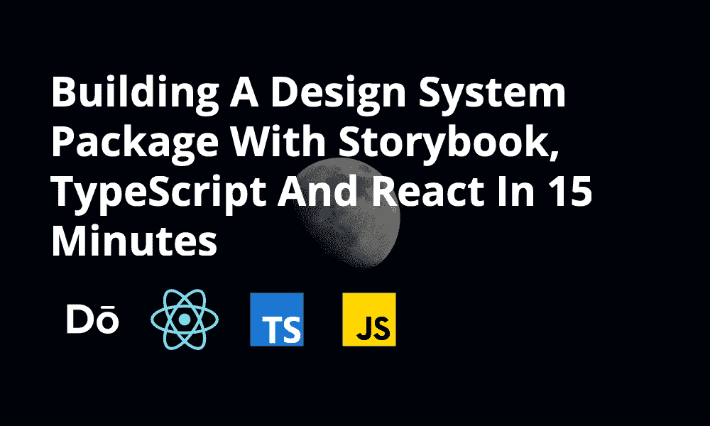
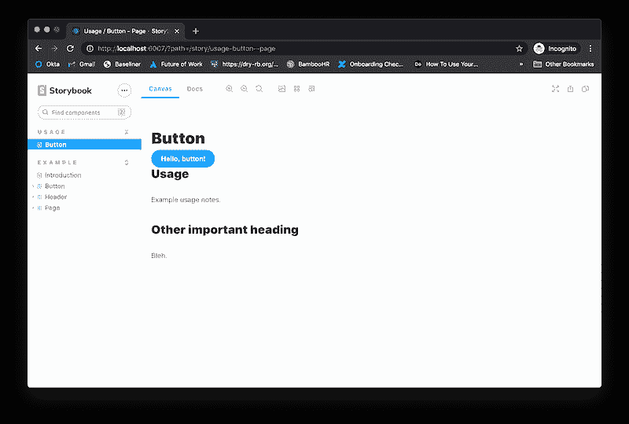
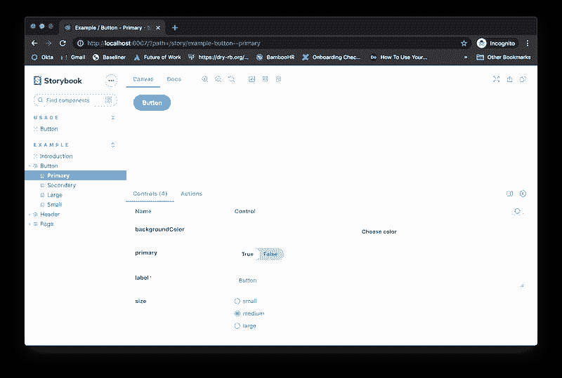
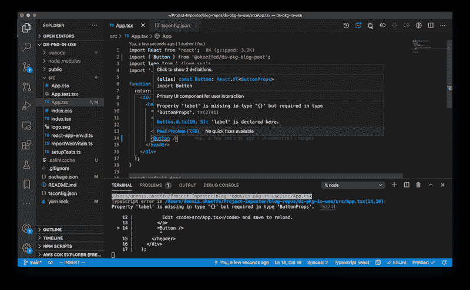
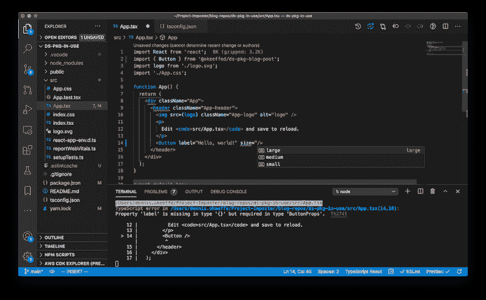

# 在 15 分钟内用故事书、打字稿和反馈建立一个设计系统包

> 原文：<https://betterprogramming.pub/building-a-design-system-package-with-storybook-typescript-and-react-in-15-minutes-b5fd5711339e>

## 设计系统会让你更有效率，并帮助你更快地构建新的特性和组件

尼尔斯·约翰·加布里埃尔森在 [Unsplash](https://unsplash.com/) 上拍摄的背景照片。

当我为自己的工作构建一个 UI 组件库时，我在搜索如何创建一个简单的“正常工作”的工作流时遇到了一些棘手的问题。

我看到的大多数关于 TypeScript 组件库的教程都使用了构建工具(这有时会引起麻烦)，而我目前的工作采取了相反的极端做法，将 UI 组件库发布为 TypeScript，并依靠单个项目直接从库本身将其转换为 JavaScript(如果你来自我的公司……你什么都没读过)。

本教程将向您展示如何设置一个`create-react-app`项目来用 TypeScript + Storybook 创建组件，然后演示在另一个 React 项目中作为一个包使用的同一个设计系统。

# UI 组件库与设计系统

虽然这些对我来说可能是次要的语义，但是在组件库和设计系统的构成上有一些重要的区别，你可能想要深入研究和理解(除非你像我一样乐于一直被纠正)。

本质上，我们将创建一个简单的单组件 UI 组件库作为主要演示，但 Storybook 的安装将使我们能够标记编写原则、模式、语气等的指南。

你更新这些指南的意愿(对于所有意图和目的来说)将把这个项目从一个简单的组件库带到能够交流构成“设计系统”定义的其他方面，如上所列。

# 入门指南

我们将首先使用`create-react-app`建立一个 React 项目，然后添加 Storybook 来帮助组件开发:

因为我们将使用 TypeScript 进行构建，所以我使用`copyfiles`来帮助我们复制 TypeScript 编译器不处理的文件类型(比如 CSS 文件、图像资源等等)。).这有助于我们保持构建工具尽可能简单。

我们将使用`rimraf`作为一个简单的预构建清理来删除我们的输出文件夹(将是`./lib`)。

# 更新我们的 Package.json 配置

我们将向我们的`package.json`文件添加一些元信息。在我的例子中，我将创建一个托管在 GitHub 上的私有 npm 包。

你可以看到一篇关于创建 GitHub 包的旧文章。否则，你想怎么发表就怎么发表！

我还更新了构建脚本，以构建来自`tsconfig.json`的配置。

# 更新 tsconfig.json

我们希望更新配置以发出文件和发出声明文件:

这里，我们已经更新了文件，删除了`noEmit`，然后使用`declaration`来发出声明文件。

这将确保我们创建的任何自定义类型都将在构建期间发出，以供其他支持 TypeScript 的库使用。

*注意:我们更新的* `*package.json file*` *包含对“构建”脚本的更改，该脚本使用 TypeScript 编译器而不是* `*react-scripts*` *。*

# 我们通过故事书的第一个组成部分

运行`npx sb init`将会为我们创建一个`src/stories`文件夹来存放一些文件。

让我们将`src/stories/Button.*.*`文件移动到`src/components/Button`。

一旦完成，我们将把组件装桶出来。我们通过创建`src/components/index.ts`来做到这一点。

在`src/components/index.ts`内，添加以下内容:

然后从我们的库中导出它，我们将创建一个文件`src/main.ts`并添加以下内容:

我们在`package.json`文件中的类型、主关键字和模块关键字行将指向创建的文件。

# 故事书的工作流程

让我们添加`src/components/Button/Button.stories.mdx`并添加一些基本的降价:

把这个看作是原始的，以获得更好的想法。感谢 gists 将代码转换为 markdown…

虽然这是一个超级基本的例子，但它将创建一些交互式的降价，我们可以用它来记录用法，并添加到我们的“设计系统”指南和原则中。

现在让我们运行`yarn storybook`来启动故事书环境。

*注意:你还需要调整* `*src/stories/Header.tsx*` *来确定* `*Button*` *从哪里导入。*

一旦 Storybook 启动并运行，您可以前往 localhost 端口查看一个`Usage`部分，其中有我们关于使用按钮的注释(尽管样式糟糕且乏味),并且您可以在`Examples/Button`下看到一些示例和使用组件本身的交互方式。

太神奇了！我们有一个开发组件的工作环境。

此时，我将把故事书部分留在那里(这更像是概念性的证明)，然后继续发布库。Storybook 有很多内容，但是从现在开始检查文档，以构建比我们上面所做的简单设置更进一步的内容。

# 发布图书馆

假设我们对我们的`Button`很满意，并且它将构成我们难以置信的多功能组件库的唯一组件，那么让我们继续发布这个包吧！

对于我自己，我将运行以下内容:

这将把包构建到`lib`文件夹中，然后为我发布到 GitHub。这种配置和“为什么”的大部分来自我们之前在`package.json`和`tsconfig.json`做的设置。

*注意:如果您也发布到 GitHub，请确保您在 remote 上创建了 repo。对我来说，我通过运行* `*gh repo create okeeffed/ds-pkg-blog-post --public -y*` *使用 GitHub CLI，然后推送到 remote。您还需要确保您已经正确设置了* `*.npmrc*` *(无论是在本地项目中还是在全局范围内)。如果你不熟悉发布包，请查看我上面关于创建 GitHub 包的链接。*

# 试用新图书馆

现在我们的包已经发布了，让我们开始另一个`create-react-app`项目并安装我们的包:

让我们更新`src/App.tsx`以使用我们的新`Button`:

在这个项目中使用`yarn start`运行我们的应用程序，并前往 localhost 将向我们展示我们正在使用的组件！单击该按钮也将注销我们的“单击”以查看所有操作。

令人惊奇的是，我们仍然显示我们的类型安全，正如我们不提供标签时所证明的那样:

我们也得到我们的类型建议，比如我们的道具(如 VS 代码所示):

成功！我们已经从头到尾完成了我们的设计系统设置，并让它在另一个项目中作为类型安全包工作。

# 结论

今天的文章无论如何都不是完美的或包罗万象的，但是我很惊讶关于在没有遇到问题的情况下完成这一切的内容是如此之少。

拥有一个基本的 TypeScript 编译的解决方案对我来说非常有用，它是一个快速的开始，可以让事情一起工作，而不会有太多的差异或问题。

我们已经从一个简单的`create-react-app`命令发展到拥有一个支持开发和文档故事书的类型脚本设计系统。然后我们将它作为一个 npm 包发布在 GitHub 上，并最终在另一个项目中看到了它的运行——所有这些都在几分钟内完成。

# 资源和进一步阅读

1.  [你以为你的元件库就是你的设计系统？再想想。](https://uxdesign.cc/do-you-think-your-component-library-is-your-design-system-think-again-7e2c902b5275)
2.  [5 分钟后你的第一个 GitHub npm 包](https://blog.dennisokeeffe.com/blog/2020-07-05-your-first-github-npm-package-in-five-minutes/)
3.  [在 GitHub 上完成打包](https://github.com/okeeffed/ds-pkg-blog-post)
4.  [使用中的包的示例报告](https://github.com/okeeffed/ds-pkg-in-use)