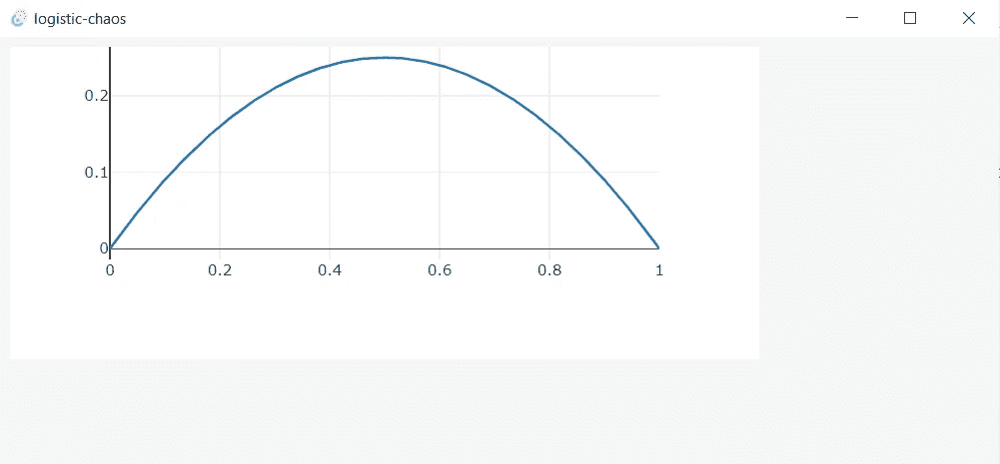
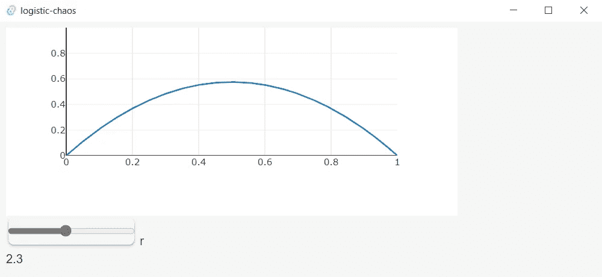

# 如何使用 Tauri 构建桌面应用程序

> 原文：<https://betterprogramming.pub/building-a-desktop-app-with-tauri-8e281b8c4f64>

## 在 Rust 中绘制函数值

[](https://medium.com/@applied-math-coding/membership) [## 通过我的推荐链接加入 Medium-applied . math . coding

### 获得我所有的故事，以及其他作家在媒体上发表的成千上万的故事。我坚信，媒介是…

medium.com](https://medium.com/@applied-math-coding/membership) 

你很可能已经听说过帮助创建桌面应用的框架 [Tauri](https://tauri.app/) 。如果没有，没问题，在这个故事中，我们将看看其他东西的基本功能。

你可能想知道为什么这个故事和铁锈有关。简单的回答是，Tauri 内置于 Rust 中，而且使用 Rust 作为运行时。特别是，它允许我们在 Rust 中定义自己的函数，并从 UI 中调用它们！在 Tauri 中，UI 是在一个本地浏览器中运行的，这个浏览器通常不需要和应用程序一起发布。所以构建 UI 的语言是 JavaScript、HTML 和 CSS。

在浏览器中运行 Rust 实现的代码的典型方式是将代码编译成 WebAssembly。除了便携性的优势，这也带来了一些基本的缺点。一个使用 Rust 的工具来编写超级高效和高性能代码(如科学计算、模拟和机器学习)的 Rust 开发人员，如果代码被编译成像 WebAssembly 这样效率低得多的语言，他不会很满意。此外，当涉及到多线程和并行计算时，WebAssembly 的事情变得棘手到不可能。

从这个意义上说，Tauri 是完全不同的。在这里，我们可以不受任何限制地编写 Rust 代码，并且可以确保代码在生产环境中运行时具有与目标相同的性能。但是记住，Tauri 是针对桌面应用的！因此，如果你需要一个在网络上运行的应用程序，你最好选择 PWA。在撰写本文时，Tauri 已经有了支持移动应用的严肃计划。当然，这将成为许多其他技术的重大改变(见[这里](https://www.youtube.com/watch?v=UDEx8fZ-gxs))。

像往常一样，我的重点是科学计算。我想介绍一个快速设置，说明如何在 Tauri 中对一个动态系统进行一些很好的模拟(暂时抛开 Python 和 Julia 的世界)。理解这篇文章的先决条件是一些 Rust 的基础知识(如果你需要总结的话，请看这里的[)和一些非常基础的 web 开发知识。](https://applied-math-coding.medium.com/list/an-introduction-into-rust-22c99777c5e5)

# 设置

在能够用 Tauri 构建一些东西之前，有一些东西必须安装在您的系统上(所有这些东西对于最终的可执行产品来说都不是必需的)。

详细的先决条件在[这里](https://tauri.app/v1/guides/getting-started/prerequisites/)有很好的记录。它还包含了如何安装 Rust 的详细说明。除了 Rust，我们还需要安装与包管理器`npm`一起提供的 [Node.js](https://nodejs.org/en/) 。如果你使用 Windows，安装`[webview2](https://developer.microsoft.com/en-us/microsoft-edge/webview2/)`是必要的——Tauri 使用它作为嵌入式浏览器。

Tauri 提供了一个实用函数，允许您快速自动生成一个新项目。你可以这样使用它:

```
npm create tauri-app
```

您将被问及几个问题(我在旁边给出了我的选择):

```
name of the project: **logistic-chaos**
package-manager: **npm**
ui-template: **vanilla-ts**
```

之后，它会要求您运行以下步骤，这实际上是下载软件包，然后在开发模式下运行应用程序:

```
cd logistic-chaos
npm install
npm run tauri dev
```

经过几分钟的编译后，应该会打开一个包含 UI 的新窗口。

# 应用程序结构

使用 Tauri 构建应用程序时，有两个文件夹非常重要。

第一个是包含所有 UI 资产的`src`，第二个是`src-tauri/src`。

后者在一个`Cargo.toml`中包含一个`main.rs`，它使我们能够定义可以从 UI 中调用的 Rust 函数。

生成的项目中已经包含了这样一个小例子:

```
#[tauri::command]
fn greet(name: &str) -> String {
    format!("Hello, {}! You've been greeted from Rust!", name)
}
```

但是我们很快会创造自己的。这个函数可以从 JavaScript 代码中调用，如`src/main.ts`所示:

```
import { **invoke** } from '[@tauri](http://twitter.com/tauri)-apps/api'async function greet() {
  await invoke('**greet**', { name: 'applied.math.coding' });
}
```

这真的非常简单，而且所有的调用都是异步的。特别是，这意味着我们不必创建复杂的 WebWorker 结构来保持浏览器窗口响应用户事件，以防这样的函数调用需要更长时间才能返回。

根目录包含一个支持`npm`管理前端资产的`package.json`。除此之外，一些配置文件如`vite.config.js` 和`tsconfig.json`也可以在那里找到。这些文件可用于微调前端源代码的构建和编译过程。

让我们直接跳到一个例子，这个例子向您展示如何用更少的努力创建一个好的应用程序。当然，实际上关于 Tauri 的配置和功能还有很多要讲的，但是我这个故事的目的是展示如何快速地用它做一些有用的事情。

# 构建示例应用程序

我们的目标是画出在 Rust 中计算的函数值。我们已经了解到，交给客户端的 Rust 函数必须在`main.rs`注册。我们在那里添加了以下代码:

```
**#[tauri::command]**
fn plot_logistic_map(a: f32, b: f32, delta: f32, r: f32) -> (Vec<f32>, Vec<f32>) {
    let mut res = (vec![], vec![]);
    let mut x = a;
    while x <= b {
        res.0.push(x);
        res.1.push(logistic_map(r, x));
        x += delta;
    }
    res
}fn logistic_map(r: f32, x: f32) -> f32 {
    r * x * (1.0 - x)
}
```

暴露在前端的功能是`plot_logistic_map`。它采用了一些参数，这些参数本质上描述了应该在哪个区间内生成函数值。重要的是宏`**#[tauri::command]**` 告诉 Tauri 把这个函数作为一个命令来使用。有了这个，前端就能够调用它了。使用的函数参数和返回值几乎是任意的。唯一的事情是，`serde`必须能够反序列化它们。

此外，指导函数`main`我们必须向 Tauri 的调用处理程序注册我们的方法:

```
...
.invoke_handler(tauri::generate_handler![greet, **plot_logistic_map**])
...
```

如你所见，之前考虑的功能`greet`已经存在。

为了出图，我们准备用高超的出图库 [plotly](https://plotly.com/javascript/) 。我们通过以下方式将其添加到我们的前端资源中

```
npm i plotly.js-dist
```

接下来就是在前端定义一个绘图区域。为此，我们将`index.html`修改如下:

```
<!DOCTYPE html>
<html lang="en">
  <head>
    <meta charset="UTF-8" />
    <link rel="stylesheet" href="/src/style.css" />
    <meta name="viewport" content="width=device-width, initial-scale=1.0" />
    <title>Logistic Chaos</title>
    <script type="module" src="/src/main.ts" defer></script>
  </head> <body>
    **<div id="plot" style="width:600px;height:250px;"></div>**
  </body>
</html>
```

粗体部分是将要绘制图形的区域。此外，正如您在`index.html`中看到的，JavaScript 的入口代码托管在`src/main/ts`中。在这里，我们调用来计算函数值并绘制它们:

```
import { invoke } from '[@tauri](http://twitter.com/tauri)-apps/api';
import * as Plotly from 'plotly.js-dist';const plotLayout = {
  margin: { t: 0 },
  yaxis: {
    range: [0, 1]
  }
};async function **getData**(a: number, b: number, r: number)
  : Promise<{ x: number[], y: number[] }> {
  const [x, y] = await **invoke**(
    '**plot_logistic_map**',
    { **a**, **b**, **delta**: 0.001, **r** }
  ) as [number[], number[]];
  return { x, y };
}window.addEventListener('DOMContentLoaded', async () => {
  Plotly.**newPlot**('plot', [await **getData**(0, 1, 1)], plotLayout);
});
```

我们通过传递参数来计算带有宽度为`0.001`的网格的间隔`[0, 1]`的值，从而`invoke`命令`plot_logistic_map`。然后将结果作为数据传递给`Plotly.newPlot`。

现在，我们可以运行:

```
npm run tauri dev
```

将出现一个窗口，其中显示了绘制的函数:



像这样运行 Tauri，无论你在代码中做什么改变，前端都会重新渲染。这对于快速绘制函数和测试不同的参数非常方便。

由于我们的前端在浏览器中作为 web 应用程序运行，我们可以使用它提供的各种典型功能。例如，菜单、样式、使用像 Vue.js 这样的 web 框架以及用户交互。对于后者，让我们添加一个小例子——您可能已经认识到所绘制函数中的参数`r`。我们将使用户能够从 UI 中按需更改它，同时绘图将刷新为新值:

首先，将以下代码片段添加到`index.html` —该代码支持`r`的数字滑块:

```
<div>
    <input type="**range**" id="**rParam**" name="rParam"
           min="1" max="4" value="1" step="0.1">
    <label for="rParam">r</label>
    <div id="**rValue**">1</div>
</div>
```

在`main.ts`,我们将添加一个处理程序，通过用`r`的新值触发 Rust 函数来对滑块的变化做出反应，然后重新渲染图形:

```
document.getElementById('**rParam**')?.addEventListener(
  '**change**',
   async e => {
      const **r** = +(e.target as any).value;
      document.getElementById('rValue')!.innerText = `${r}`;
      Plotly.newPlot('plot', [await **getData**(0, 1, **r**)], plotLayout);
   }
);
```

保存代码时，Tauri 将重新呈现窗口，因此我们只需测试我们的更改:



# 小额奖金

在结束并解释如何构建和发布这样一个应用程序之前，让我给你更多的情节来解释我为这个应用程序选择的名称。当然，如果你想快速开始使用自己的 Tauri 应用程序，可以跳过这一部分。

对应于逻辑映射的动力系统如下:

```
**x_{n+1} = r*x_n*(1-x_n)**
```

当从某个`x_0`开始时，这个迭代产生一个值列表。关于这种动态的有趣事实是，对于不同的`r`值，它显示出非常不同的行为。特别是上述动态具有长度为`3`的周期点的区域，也就是说，从这样的`x_0`开始，在`3`迭代(`x_3 = x_0`)之后，将我们带回到`x_0`，显示出有趣的模式。对于`r`的这些值，存在不显示任何周期模式但看起来有点混乱的起始点`x_0`:

如果你想玩玩这个，可以在[库](https://github.com/applied-math-coding/tauri-example)下随意克隆你。当然，为了正确运行，您必须使您的系统满足上述要求，并从项目根目录中发出以下命令:

```
npm inpm run tauri dev
```

# 构建和发布应用程序

我们在这里只涉及最基本的内容。你会在 Tauri 的文档中找到更多关于这个主题的内容。其中，Github actions 支持跨平台编译和应用程序签名！

为了确保所有运行没有错误，我们必须在`tauri.conf.json`更改以下条目:

```
tauri > bundle > identifier
```

你可以在这里输入任何值——我把它改成了“逻辑混乱”。

要构建这个项目，我们只需运行

```
npm run tauri build
```

这将编译所有资源，并在以下位置创建一个可执行文件:(如果您在 Windows 上)

```
src-tauri/target/release/logistic-chaos.exe   (executable)src-tauri/target/release/bundle/msi   (installer)
```

同样值得注意的是，Tauri 提供了如何处理所需的`webview2`的选项。其中，它可以选择在安装过程中下载和安装，甚至与应用程序捆绑在一起。当然，所有这些对构建规模有很大的影响。

# 结论

我希望我已经展示了 Tauri 提供了一个有希望的选择，或者至少是一个值得的选择。

当然，在这个时候，Rust 在矩阵操作或其他数值算法方面的能力非常有限，但我认为 Tauri 正在以一种新的方式前进，并邀请许多开发人员和科学家来认识 Rust 的能力。例如，如果你将 [mathjax](https://www.mathjax.org/) 放到 UI 中，你可以将你的应用程序作为一个交互式演示来使用。

感谢阅读！