# 为以太坊区块链搭建 DevOps 管道

> 原文：<https://betterprogramming.pub/building-a-devops-pipeline-for-the-ethereum-blockchain-3d30cba87ffb>

## Web3 遇上 DevOps


由 [Unsplash](https://unsplash.com/@theshubhamdhage?utm_source=unsplash&utm_medium=referral&utm_content=creditCopyText) 上的 [Shubham Dhage](https://unsplash.com/@theshubhamdhage?utm_source=unsplash&utm_medium=referral&utm_content=creditCopyText) 拍摄的照片

我在推特上发布了我为一个 Web3 项目创建的 DevOps 管道，它获得了比我预期的更多的参与。

这些回复鼓励我完成这个项目，并创建一个博客系列，向其他人展示我的成果。

在本指南中，我将展示如何为运行在以太坊区块链上的分布式应用程序(dApp)实现 DevOps 最佳实践。

这不是对 DevOps 或 Web3 开发的介绍。网上有很多资源可以帮助你了解 Web3 和 DevOps。因此，这两个主题的先验知识是假定的。这将简单地展示如何将 DevOps 应用于 Web3 开发。

使用 [Azure Pipelines](https://docs.microsoft.com/en-us/azure/devops/pipelines/get-started/what-is-azure-pipelines?view=azure-devops) 构建的最终管道将有一个开发、质量保证和生产环境。开发环境将使用运行在容器中的 [Ganache](https://next-stack.github.io/ganache/) 将应用程序部署到个人以太坊区块链。QA 将部署到 [Rinkeby testnet](https://www.rinkeby.io/#stats) ，最后 Prod 将部署到[以太坊 mainnet](https://www.ethstats.net/) 。前端将托管在 [Azure 静态 Web Apps](https://docs.microsoft.com/en-us/azure/static-web-apps/overview) 中。

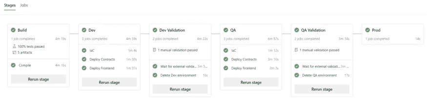

Web3 项目的 Azure DevOps 管道

# 编译和测试

首先，我们需要一个项目。对于这个例子，我将使用 [Truffle](https://trufflesuite.com/) 来搭建我的分布式应用程序(dApp)。

```
truffle unbox react myapp
```

这个命令创建了一个带有 React 前端和用 [Solidity](https://soliditylang.org/) 编写的契约的项目。我用 JavaScript 编写了我的测试，所以我删除了测试文件夹中的 *TestSimpleStorage.sol* 文件。我还用 NPM 代替了 Yarn，所以我从*客户端*文件夹中删除了 *yarn.lock* 文件。清理完项目后，我用 git 初始化并提交了我的代码。

```
git init
git branch -m main
git add -–all
git commit -a -m “init”
```

我为这个部分创建了一个名为“ [blog/part1](https://github.com/DarqueWarrior/TruffleDevOps/tree/blog/part1) 的新分支。

```
git checkout -b blog/part1
```

在深入之前，我想确定如何使用 Truffle 在本地编译、测试和部署代码。我将在最终的管道中复制这些命令。

## 契约

## 收集

为了编译合同，我运行了以下命令:

```
truffle compile
```

这就在`client/src` 文件夹下创建了一个新的`contracts` 文件夹。

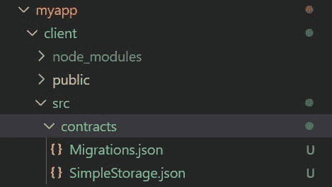

客户/src 文件夹下的新合同文件夹

因为我将在管道中编译这些文件，所以我将它们添加到客户端项目的`.gitignore`文件中。在我的`.gitignore`底部，我添加了以下内容:

更改为。gitignore

一旦我知道如何编辑合同，我需要测试它们。

## 测试

我使用以下命令对我的智能合约进行了测试:

```
truffle test
```

测试运行并成功，但是我注意到没有结果文件。对于要在我的管道中显示的结果，测试结果必须位于可以在管道中发布的文件中。用 Truffle 运行的 JavaScript 测试使用了[摩卡](https://mochajs.org/)。我可以配置 Mocha，通过更新项目根目录下的 *truffle-* `config.js`文件来创建一个结果文件。在网络部分下面，我添加了以下代码块:

truffle-config.js 的摩卡部分

现在运行 truffle test 命令，一个`TEST-results.xml` 文件被创建在项目的根目录中。这将用于在我的管道中发布结果。git 不应该跟踪这个文件，所以我添加了一个*。gitignore 将*文件添加到项目的根目录，并将`TEST-results.xml` *添加到文件中。*

将 TEST-results.xml 添加到。gitignore

# 前端

## 建筑物

随着合同的编译和测试，我开始构建和测试前端。切换到*客户端*目录，运行以下命令构建前端:

```
npm run build
```

## 测试

构建前端后，我使用以下工具运行测试:

```
npm test
```

在尝试运行测试时，我很快意识到我有一个问题。前端正在使用 [Jest](https://jestjs.io/) 运行测试，它提示我输入。

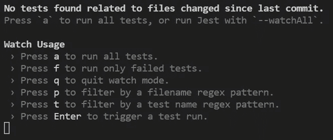

Jest 提示输入

这在自动化管道中是行不通的。经过一些研究，我发现我可以通过设置一个环境变量来运行测试，因此让 Jest 知道它正在 CI 中运行。

```
CI=true npm test
```

这很有效，但是现在我又回到了以前的问题上。我需要一份测试结果的文件。获得与我的管道兼容的结果文件需要 jest-junit 包。使用 npm，我安装了它，并将其保存为一个开发依赖项。

```
npm install --save-dev jest-junit
```

安装了这个包之后，我需要向我的 npm 测试命令添加一些参数来生成这个文件。

```
CI=true npm test -- --reporters=default --reporters=jest-junit
```

这生成了一个`junit.xml`文件。这个文件不应该被跟踪到我的*底部。gitignore* 文件在`client` 文件夹中我添加了以下内容:

所有的编译和测试都解决了，我提交了所有的修改。

```
git commit -a -m "compile and test"
```

然后我将我的修改合并到`main`中。

```
git checkout main
git merge blog/part1
```

接下来要做的是部署我的智能合约，这是事情变得非常棘手的地方。

# 部署合同

现在是时候部署智能合约了，并向您展示如何部署它们而不需要重新编译前端。

我为这个部分创建了一个名为“ [blog/part2](https://github.com/DarqueWarrior/TruffleDevOps/tree/blog/part2) ”的新分支。

```
git checkout -b blog/part2
```

正如我在本系列的上一篇文章中提到的，部署智能合约是这个过程变得棘手的地方。为了理解为什么，让我们来看看当一个契约被部署到一个网络时会发生什么。

我使用 [Ganache](https://trufflesuite.com/ganache/) 作为本地开发的测试网络，并将在我的管道的开发环境中使用它。要在本地启动 Ganache，我输入了以下命令:

```
ganache
```

在部署到 Ganache 之前，我必须通过在 networks:

truffle-config.js 的开发部分

添加该部分后，我运行以下命令来部署我的合同:

```
truffle migrate
```

将合同部署到网络时，会分配一个地址。前端需要此地址来与链上的合同进行通信。该地址被写入合同的 JSON 文件，该文件位于合同编译时创建的`client/src/contracts`文件夹下。JSON 文件有一个 networks 部分，其中填充了每个部署了契约的网络的地址。

带有合同地址的 JSON 文件的网络部分

因此，对于与契约通信的前端，它必须在每次部署后构建。这意味着前端必须构建在开发、QA 和生产环境中。**多次重新构建代码是一种 DevOps 反模式。**代码应该只编译一次，所产生的工件不加修改地部署到每个环境中。任何需要针对每个环境进行调整的值都必须从代码中具体化，并在运行时注入。

查看`client/src`文件夹中的`App.js`文件，我可以在第 2 行看到 JSON 文件的导入。第 20 行使用该信息来获取已部署契约的网络细节，包括地址。

前端默认代码

我更改了这段代码，以便从外部来源读取地址。我仍然加载了 JSON 文件，因为它还包含应用程序二进制接口(ABI ),该接口不会改变，并且是部署代码所必需的。

我希望代码能像最初用于本地开发时那样工作，但如果在 JSON 文件中找不到地址，代码也能工作。如果代码无法在 JSON 文件中找到地址，它将调用外部服务来获取该地址。因为我决定使用 [Azure Static Web Apps](https://docs.microsoft.com/en-us/azure/static-web-apps/) 来托管我的前端，所以我使用内置的 [Azure Function](https://docs.microsoft.com/en-us/azure/static-web-apps/add-api?tabs=vanilla-javascript) 支持来托管返回合同地址的服务。

首先，我更新了代码来调用服务。包括第 20 行在内的所有内容都保持不变。我在创建契约实例之前添加了代码来定位地址。在第 22 行，我存储了从 JSON 文件返回的值。然后，在第 26 行，我测试了这个值，看它是否为空。如果地址返回为空，将在第 28 行调用服务，传递网络 Id 以返回该网络的合同地址。最后，在第 33 行，我使用 ABI 和计算出的地址构建了一个契约实例。文件的其余部分与原始文件保持不变。

更新的代码

通过外部化地址，前端只构建一次。从开发到 QA，最后到生产，代码不会改变。在管道的第一阶段，我编译了契约和前端，并将结果文件作为构建的工件发布。那些工件将通过管道不加修改地移动。

有了代码，我现在可以编写第 28 行调用的服务，Azure 函数，我将在下一节中完成。

# 写地址服务

在这一节中，我将编写一个 Azure 函数向前端提供地址。

该函数的优点是可以在运行时检索地址，并且可以在不改变前端的情况下动态地改变地址。

我为这个部分创建了一个名为“ [blog/part3](https://github.com/DarqueWarrior/TruffleDevOps/tree/blog/part3) 的新分支。

```
git checkout -b blog/part3
```

我使用了 [Visual Studio 代码](https://code.visualstudio.com/)作为我的编辑器，并且安装了 [Azure Static Web Apps 扩展](https://marketplace.visualstudio.com/items?itemName=ms-azuretools.vscode-azurestaticwebapps)。我使用 Azure Static Web Apps:Create HTTP function…命令在项目根目录下的 API 文件夹中添加一个名为`GetContractAddress`的 JavaScript 函数。

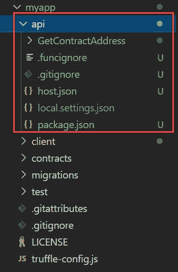

API 项目文件夹结构

这是一个非常简单的服务，它返回从环境变量中读取的值。从我的管道中，我将获得契约地址，并将其存储在函数基础结构的环境变量中。

该功能将使用 [Jest](https://jestjs.io/) 作为测试框架(Jest 也用于前端测试)。我为这个功能实现了测试驱动开发(TDD ),所以我首先编写了我的测试。因为我使用了 Jest，所以我在函数项目的`GetContractAddress`文件夹中的`index.js`文件旁边创建了一个名为`index.test.js`的新文件。

服务的契约需要一个名为`networkId`的查询参数。我写了两个测试。一个在提供了`networkId`时返回值，一个在没有提供`networkId` 时返回错误。

我使用 [dotenv](https://www.npmjs.com/package/dotenv) 来管理环境变量，所以我将它与 Jest 和 Jest-Junit 一起安装，并将它们存储为开发依赖项。我确保并运行了 API 文件夹中的命令:

```
npm install --save-dev dotenv jest jest-junit
```

安装完依赖项后，我编写了我的测试。

传递给 Azure Functions 的第一个参数是公开日志函数的上下文对象。因此，我创建了一个模拟上下文对象，用于在 API 文件夹中名为 TestMocks 的文件夹中进行测试。我将文件命名为`defaultContext.js`，并添加了以下代码:

默认上下文. js

这个模拟让我跟踪调用，记录和检查消息。

模拟就绪后，我编写了我的测试。首先，我需要 dotenv，保存我的函数的索引文件和保存我的 mock 的`defaultContext`。

索引.测试. js

每次测试后，我需要清除对任何模拟的调用，所以我添加了一个`afterEach`函数并调用了`clearAllMocks`。

索引.测试. js

第一个测试验证了快乐路径的有效性。如果调用者提供一个`networkId`作为查询参数，那么应该从一个环境变量返回地址。在 API 文件夹的根目录下，我创建了一个. env 文件来保存测试的环境变量。

。包封/包围（动词 envelop 的简写）

的。dotenv 将加载 env 文件，因此测试可以读取环境变量。

索引.测试. js

如果没有提供`networkId`，第二个测试将返回一个错误。

索引.测试. js

写完测试后，我在我的`package.json`的第 7 行更新了测试脚本:

package.json

在真正的 TDD 方式中，我运行测试来查看它们是否失败。

```
npm test> api@1.0.0 test
> jestFAIL  GetContractAddress/index.test.js
  ✕ Should return address (3 ms)
  ✕ Should return 400 error● Should return addressexpect(received).toBe(expected) // Object.is equalityExpected: 2
Received: 1  16 |
  17 |     // Assert
> 18 |     expect(context.log.mock.calls.length).toBe(2);
     |                                           ^
  19 |   expect(context.res.body).toEqual('0x7a063c7e4A0EC2fB4dC0F73103Fd45F17b46Ae52');
  20 | });
  21 |at Object.toBe (GetContractAddress/index.test.js:18:43)● Should return 400 errorexpect(received).toBe(expected) // Object.is equalityExpected: 1
Received: 2  30 |
  31 |     // Assert
> 32 |     expect(context.log.mock.calls.length).toBe(1);
     |                                           ^
  33 |     expect(context.res.status).toEqual(400);
  34 | })at Object.toBe (GetContractAddress/index.test.js:32:43)Test Suites: 1 failed, 1 total
Tests:       2 failed, 2 total
Snapshots:   0 total
Time:        0.224 s, estimated 1 s
Ran all test suites.
```

然后我更新了`index.js`来匹配下面的代码:

索引. js

最后，我使用 jest-junit 运行测试，以验证是否会创建一个结果文件用于我的管道。

```
CI=true npm test -- --reporters=default --reporters=jest-junit> api@1.0.0 test
> jestPASS  GetContractAddress/index.test.js
  ✓ Should return address (2 ms)
  ✓ Should return 400 error (1 ms)Test Suites: 1 passed, 1 total
Tests:       2 passed, 2 total
Snapshots:   0 total
Time:        0.279 s, estimated 1 s
Ran all test suites.
```

`junit.xml`文件按预期创建。这个文件不必被跟踪，所以在我的底部。gitignore 文件在 API 文件夹中我添加了以下内容:

最后，我签入了我所有的更改。

随着所有项目的到位，是时候开始建设我的管道了。

# 创建管道的初始结构

在开始构建管道之前，我需要将我的更改发布到远程 git 服务。虽然我使用 [Azure Pipelines](https://docs.microsoft.com/en-us/azure/devops/pipelines/get-started/what-is-azure-pipelines?view=azure-devops) 作为我的 DevOps 管道，但是我使用 [GitHub](https://github.com/) 来存储我的源代码。Azure Pipelines 和 GitHub 配合得非常好，我得到了两个世界的好处。

如果您需要帮助创建 Azure DevOps 项目(以保存您的 Azure 管道)或创建您的代码并将其推送到 GitHub 存储库，您可以使用以下链接:

*   [在 Azure DevOps 中创建一个项目](https://docs.microsoft.com/en-us/azure/devops/organizations/projects/create-project?view=azure-devops&tabs=browser)
*   [在 GitHub 中创建一个回购](https://docs.github.com/en/get-started/quickstart/create-a-repo)

我为这个部分创建了一个名为“ [blog/part4](https://github.com/DarqueWarrior/TruffleDevOps/tree/blog/part4) ”的新分支。

```
git checkout -b blog/part4
```

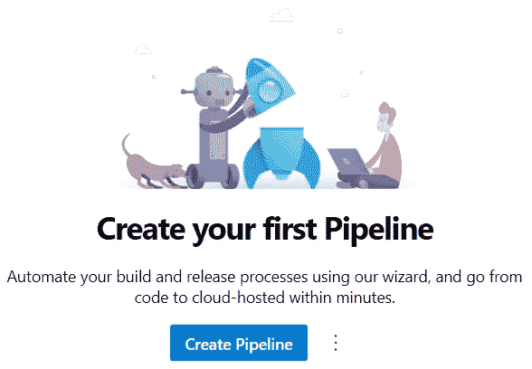

管道菜单和创建管道按钮

将我的代码推送到 GitHub 后，我导航到 Azure DevOps 的 Pipelines 页面并点击了 Create Pipeline 按钮。

然后在被问到“你的代码在哪里”的时候我选择了 GitHub。我用我的代码选择了回购，然后选择了启动管道。

Azure 管道可以由[阶段、作业和](https://docs.microsoft.com/en-us/azure/devops/pipelines/process/stages?view=azure-devops&tabs=yaml)步骤组成。为了开始，我决定列出我的阶段和工作。这允许我定义阶段和作业之间的依赖关系，并查看我的整个管道。

## 初始结构

使用 web 编辑器，我更新了代码来定义我的管道结构。我的管道有六个阶段:

1.  `build`:编译、测试和打包工件
2.  `dev`:部署基础设施、合同和前端
3.  `dev_validation`:等待手动验证开发并删除开发环境
4.  `qa`:部署基础设施、合同和前端
5.  `qa_validation`等待`qa`的手动确认，删除`qa`环境
6.  `prod`:部署基础设施、合同和前端

初始管道结构

我保存并运行了我的管道，以确认一切都被正确构建并运行。

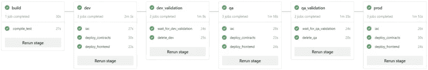

管道的成功运行

在管道的初始运行之后，我将我的更改同步到我的本地开发机器上，以将`azure-pipelines.yml`文件拉下来。这是包含我的管道定义的文件。

为了使我的管道更容易创建，我在我的项目的根目录中添加了一个包含 Truffle 依赖项的`package.json`文件。Azure 管道使用微软托管的代理来运行。它们包含最常见的包，我可以通过一个`package.json`文件添加额外的包。

在这种情况下，我需要添加松露。此处列出了预安装的软件包[。必须安装 Truffle 来编译、测试和迁移合同。在根目录中安装 Truffle 将创建一个不需要被跟踪的`node_modules`文件夹。所以，我把它添加到项目根目录下的`.gitignore`文件中。](https://docs.microsoft.com/en-us/azure/devops/pipelines/agents/hosted?view=azure-devops&tabs=yaml)

向添加了 node_modules。gitignore

然后，我运行了以下命令:

```
npm install --save-dev truffle
```

我决定创建一个`package.json`文件，以防将来需要额外的包。

package.json

最后，我提交了所有的更改。

```
git add package.json
git add package-lock.json
git commit -a -m "adding pipeline yaml"
```

然后我把我的改动合并到了`main`。

```
git checkout main
git merge blog/part4
```

接下来，我将完成管道的构建阶段。

# 管道，构建阶段

在这一节中，我将完成编译、测试和打包工件的构建阶段。

为了使编辑管道 YAML 更容易，我为 VS 代码安装了 [Azure 管道扩展](https://marketplace.visualstudio.com/items?itemName=ms-azure-devops.azure-pipelines)。这增加了语法突出显示和自动完成功能。

我为这个部分创建了一个名为“ [blog/part5](https://github.com/DarqueWarrior/TruffleDevOps/tree/blog/part5) 的新分支。

```
git checkout -b blog/part5
```

为了完成构建阶段，我在第 11 行的`compile_test`作业下面添加了 steps 元素。第一步调用`npm install`安装松露。

安装块菌的步骤

我添加了一个`displayName`，以便在管道日志中更容易识别这个步骤。

## 契约

安装了 Truffle 之后，我就可以编译和测试合同了。因为我按照 [Web3 DevOps: Part 1 —编译和测试](https://medium.com/@donovan.brown/web3-devops-part-1-compiling-and-testing-9188aa7a0209)中的讨论配置了 test 命令来输出结果文件，所以我也发布了测试结果。

此时，我决定签入我的代码，看看是否一切都如预期的那样工作。令我惊讶的是，测试步骤失败了！

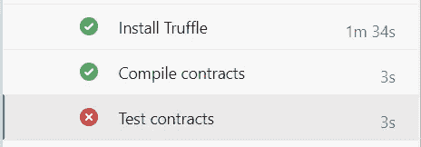

测试合同失败

我的构建日志显示了以下信息:

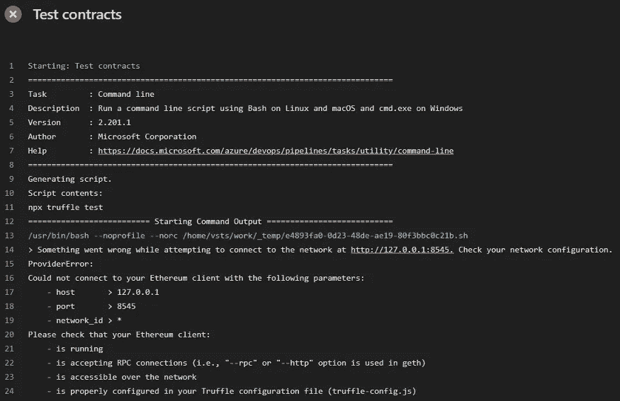

测试失败日志

经过一些研究，我发现错误是由于将开发节点添加到了**部署合同**部分的`truffle-config.js`文件中。默认情况下，`truffle test`命令使用内置测试网络。

然而，一旦您定义了一个开发网络，它就会切换到使用该网络。这对于我在本地运行 Ganache 的本地开发来说很好，但是在管道的第一阶段，我想使用默认的测试网络来运行测试。

为此，我更新了`truffle-config.js`文件。因为配置文件是执行 JavaScript 代码，所以如果设置了环境变量，我会更改逻辑来动态定义开发环境。在名为`DEV_NETWORK`的环境变量中，我放置了 Ganache 实例的 IP 地址。

当我在本地运行它时，我将其设置为`127.0.0.1`。当运行在管道的 Dev 环境中时，它将被设置为运行在云中的 Ganache 实例的 IP。在管道的构建阶段，将不会设置这个环境变量，从而导致使用内置测试网络来执行测试。

我决定使用 dotenv 来读取环境变量，所以我安装了它，并将其作为一个依赖项保存在我的根文件夹中。

```
npm install --save-dev dotenv
```

有了我的依赖项，我更新了`truffle-config.js`文件以匹配下面的代码:

接下来，我更新了我的`.gitignore`文件，忽略任何未来。我创建的 env 文件。我的根级`.gitignore`文件现在看起来像这样:

然后我提交并推送我的代码来测试我的更改。

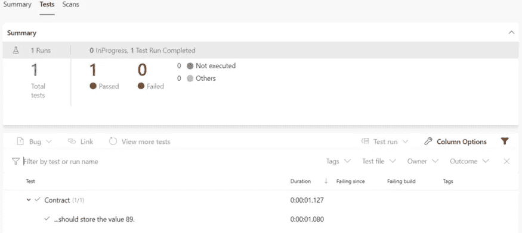

合同测试结果

随着我的测试通过，我继续将我的合同和合同测试打包并作为工件发布。代码如下:

打包和发布工件的任务

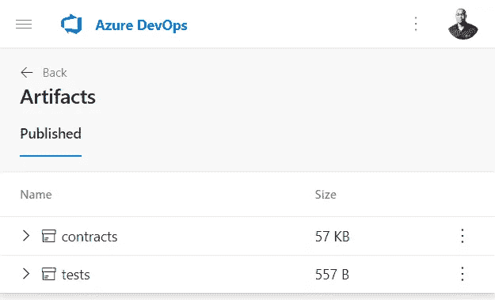

合同工件

将这些文件打包成工件将使它们对我的管道中的其他阶段可用。

## 前端

随着合同的结束，我搬到了前台。目标是相同的:作为工件编译、测试、打包和发布。注意，我将测试步骤中的 CI 环境变量设置为`true`。或者，您可以为整个阶段或管道设置该变量。

前端任务

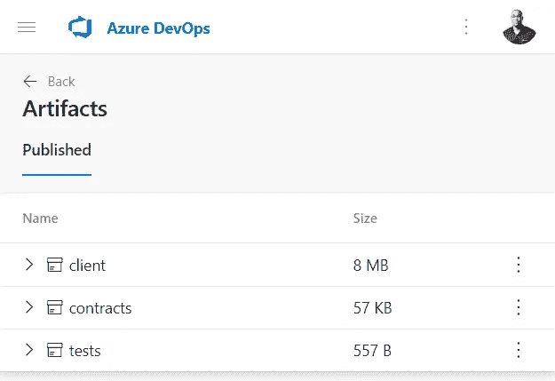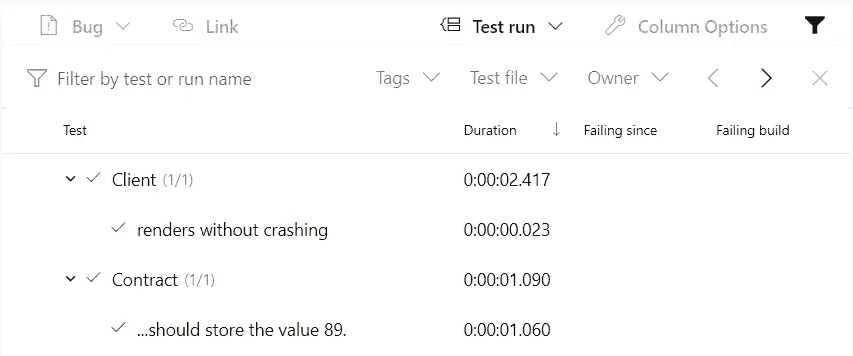

前端测试结果和工件

## 应用程序接口

最终的项目是 Azure Function API。请注意，发布任务在安装依赖项之前运行。

API 的任务

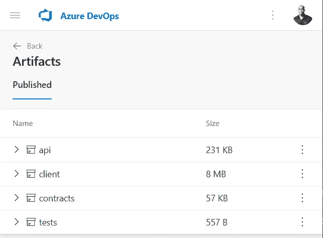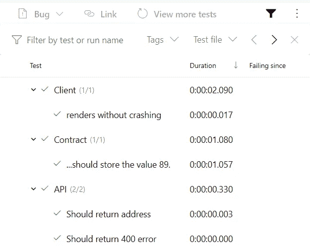

API 工件和测试结果

随着所有项目被编译、测试并打包成工件，接下来我将开发代码形式的基础设施(IaC)。

## [管道，IaC](/web3-meets-devops-pipeline-iac-72f88e1d3d55)

现在，我将开发部署用于托管前端的 [Azure 静态 Web 应用](https://azure.microsoft.com/en-us/services/app-service/static/)所需的基础设施代码(IaC)。

IaC 是 DevOps 的最佳实践，其中托管应用程序所需的基础设施被编码，存储在源代码控制中，并部署在管道中。为了托管我的分布式应用程序(dApp)的前端，我使用了 Azure Static Web Apps (SWA)。为了部署 SWA，我使用了 [PowerShell](https://github.com/powershell/powershell) 和[二头肌](https://docs.microsoft.com/en-us/azure/azure-resource-manager/bicep/overview?tabs=bicep)的组合。PowerShell 是跨平台的，安装在所有 Azure DevOps 代理上。我发现它比 Bash 更容易使用，也更强大。

我的部署的开发环境将需要一个 SWA 来托管前端，并需要一个 Ganache 实例来托管智能合约。我使用 Azure 容器实例来运行 Ganache，使用了我在自己的博客[中记录的技术，即如何使用 Azure 容器实例来托管 Ganache](https://www.donovanbrown.com/post/How-to-use-Azure-Container-Instances-to-host-Ganache) 。

我为本文创建了一个名为“ [blog/part6](https://github.com/DarqueWarrior/TruffleDevOps/tree/blog/part6) ”的新分支。

```
git checkout -b blog/part6
```

我首先在项目的根目录下创建了一个 *iac* 文件夹，在那里我存储了部署基础设施的所有文件。

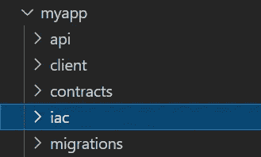

用于保存 PowerShell 和 Bicep 文件的新 iac 文件夹

## 二头肌

使用 Bicep，我将我的部署分成模块，这些模块处理我的 Azure 静态 Web 应用程序和 Azure Contain 实例的创建。我还创建了一个主模块，它调用其他模块，收集输出，并将它们提供给我的 PowerShell 脚本。对于这个部署，我需要三个文件: *main.bicep、ganache.bicep、*和 *swa.bicep.*

## 纳米比亚

*swa.bicep* 返回两个值:用于设置 Azure 函数返回的网络地址的静态 web app 的名称，以及我用来部署我的前端的 AzureStaticWebApp 任务所需的部署令牌。

部署静态 Web 应用程序的 Bicep 文件

## 加纳切

此模块返回分配给容器的 IP 地址，以便将网络添加到元掩码 wallet 中。我还支持传入一个 *fqdn* 参数来设置一个完全限定的域名。因此，即使 IP 地址发生变化，元掩码网络也不必改变。我还传入了— wallet.deterministic 标志，以确保它在每次创建时都生成相同的帐户。这消除了导入帐户来测试应用程序的需要。

command 元素覆盖默认命令，将附加参数传递给 Ganache。你可以在我的文章[如何在运行带有 ACI 的容器时覆盖入口点](https://www.donovanbrown.com/post/how-to-override-the-entrypoint-when-running-an-container-with-aci)中读到更多。

## 主要的

我使用了订阅级别的部署，因此资源组与我的所有资源一起创建。这允许我删除 Dev 和 QA 的整个资源组，并在下一次部署开始时创建它们。显然，我不会删除 Prod，但是在发生灾难时，我会简单地启动一个部署，让一切重新创建，而无需进一步的人工干预。

## PowerShell

在我的 PowerShell 脚本中，我使用 Azure CLI 来部署我的基础设施，捕获所有输出，并将它们暴露给管道。写主机调用的最后三行使这些值可供管道使用。

deploy.ps1

## 管道

最后，我更新了管道的构建阶段，将 IaC 文件打包并作为工件发布。

打包和发布 IaC 文件的任务


IaC 伪影

随着所有项目被编译、测试并打包成工件，在下一节中，我将把所有东西部署到一个开发环境中。

# 管道，部署基础设施

在本节中，我将使用在这些任务中开发的基础设施代码(IaC)来部署基础设施。

我为这个部分创建了一个名为“ [blog/part7](https://github.com/DarqueWarrior/TruffleDevOps/tree/blog/part7) ”的新分支。

```
git checkout -b blog/part7
```

## 服务连接

为了将基础设施部署到 Azure 中，我在 Azure DevOps 和 Azure 之间创建了一个服务连接。按照以下步骤为 Azure 管道创建服务连接:

1.  登录您的组织(`https://dev.azure.com/{yourorganization}`)，并选择您的项目。
2.  单击项目设置，然后单击服务连接。
3.  单击新建服务连接。
4.  选择 Azure 资源管理器。
5.  滚动到列表底部，然后单击下一步。
6.  选择服务主体(自动)，然后单击下一步。
7.  选择您的订阅。
8.  输入服务连接名称。
9.  选中授予对所有管道的访问权限。
10.  单击保存创建服务连接。

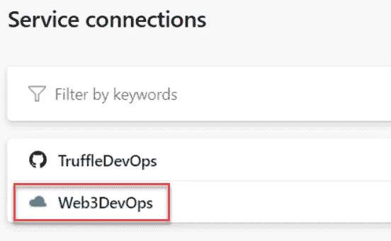

Azure 的新服务连接

## 管道

随着服务连接的创建，我更新了`azure-pipelines.yml`来部署基础设施。在文件的顶部，我定义了一个带有默认值的`resourceGroup`变量。

然后，在开发阶段的 iac 作业下，我添加了两个任务，如下所示:

第一个任务下载在管道的前一阶段创建的 iac 工件。这个工件包含三个 Bicep 文件和一个 PowerShell 脚本。

第二个任务执行 PowerShell 脚本，该脚本使用三个 Bicep 文件来部署一个 Azure 静态 Web 应用程序和一个运行 Ganache 的 Azure 容器实例。注意，我之前创建的服务连接被用作 inputs 下 azureSubscription 的值。

随着管道的更新，我进行了修改并运行了构建。

基础设施被部署到 Azure。日志显示了可用于测试我的智能合约的 Ganache 服务器的 IP 地址。这项任务将所有需要的基础设施部署到我的 Azure 订阅中。

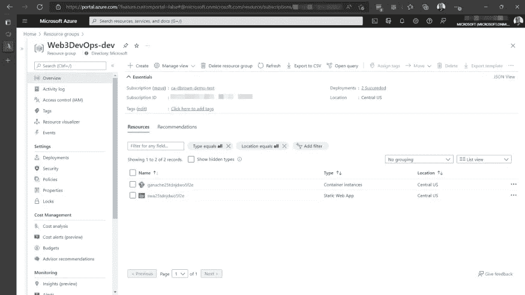

使用 IaC 部署的 Azure 静态 Web 应用程序和 Azure 容器实例

部署好基础设施后，在下一节中，我将把我的单页面应用程序(SPA)部署到 Azure Static Web 应用程序中。我还将把我的智能合约部署到 Azure 容器实例中托管的 Ganache 中。

# 管道，部署 dApp

在本节中，我将把我的智能合同和前端部署到该基础设施中。

我为这个部分创建了一个名为“ [blog/part8](https://github.com/DarqueWarrior/TruffleDevOps/tree/blog/part8) ”的新分支。

```
git checkout -b blog/part8
```

## 契约

这些契约被部署到在上一篇文章中部署的 Azure 容器实例中运行的 Ganache 实例中。在`dev`阶段的`deploy_contracts`工作下，我添加了以下内容:

首先定义这个工作需要的变量:`ganacheIp`和`ganacheName`。变量值是在我执行`iac`任务中的`deploy.ps1`脚本时设置的。如果我不定义它们，它们将不可用于此工作。

在这些步骤下，脚本下载了在前面的文章中创建的工件。为了部署合同，Truffle 必须安装在代理上，这是我和`npm install`一起做的。

一旦安装了 Truffle，脚本就会重启运行 Ganache 的容器。当容器启动时，它显示帐户和私钥的列表。

当`iac`作业运行时，如果容器已经存在，则不会重新启动。随着时间的推移，如果运行了足够多的构建，日志将不再有帐户和私钥。通过在此作业中显式重新启动容器，它确保帐户和私钥在下面的作业中可用，因此它们被提取出来并可用于管道摘要以在元掩码中使用。

Ganache 重启后，我用`truffle migrate`命令部署了契约。该命令将网络设置为开发，因此使用了 Ganache。`truffle migrate`命令执行了需要将`DEV_NETWORK`环境变量设置为`ganacheIp`的`truffle-config.js`文件。

最后，PowerShell 任务获取网络 ID 和合同地址，并输出它们以用于部署前端。

## 前端

前端将被部署到上一篇文章中部署的 Azure Static Web App 中。在`dev`阶段的`deploy_frontend`工作下，我添加了以下内容:

与合同一样，我在这项工作中需要的变量首先被定义。在`iac`任务中执行`deploy.ps1`脚本时，设置了一些变量值。其他来自合同部署期间运行的 PowerShell 脚本。

下载工件后，AzureStaticWebApp 任务部署前端和 Azure 功能。

接下来，调用 Azure CLI 任务来运行`az staticwebapp appsettings set`命令。这设置了一个 Azure 函数将使用的环境变量。该功能在**写地址服务**部分描述。

最后，more PowerShell 提取配置 MetaMask 连接到我的 dApp 所需的所有重要信息。该脚本收集所有变量，并将它们格式化为 Markdown。然后，降价被写入磁盘并附加到“管道扩展”选项卡。

有了这些信息，我可以在 MetaMask 中将 Ganache 添加为一个网络，导入一个帐户，并连接到 dApp。

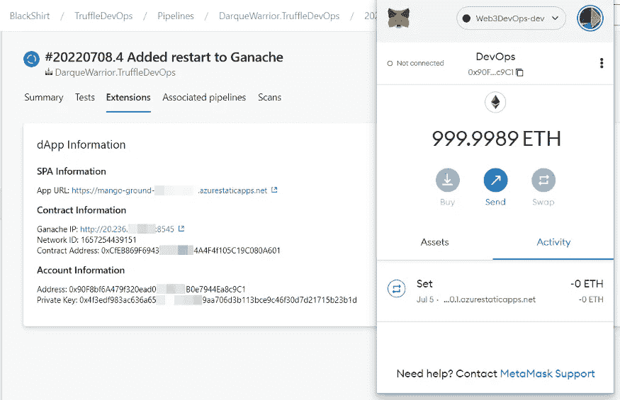

显示连接元掩码信息的“扩展”选项卡

为了省钱和测试我的 IaC，我喜欢删除不再需要的回复。在删除开发环境之前，我希望有机会审查代码。为此，我使用手动验证作业。一旦我批准了验证步骤，下一个作业就会删除 Azure 中的 Dev 资源组，移除我的所有资源。在`dev_validation`阶段，我添加了以下内容:

现在我已经部署到我的开发环境中，在下一节中，我们将使用 [Rinkeby](https://www.rinkeby.io/#stats) 作为我的 QA 环境。

# 质量保证管道

在这一节中，我将使用 Rinkeby 测试网络将所有东西部署到我的 QA 环境中。

我为这个部分创建了一个名为“ [blog/part9](https://github.com/DarqueWarrior/TruffleDevOps/tree/blog/part9) 的新分支。

```
git checkout -b blog/part9
```

为了部署到 Rinkeby 测试网络，我需要一个 Infura 节点和一个 test Ether 帐户。我在[*https://in fura . io*](https://infura.io/)创建了一个免费账号和一个名为 *My1stEthProject* 的项目。一旦我创建了项目，我就可以访问 *API 密钥*和*网络端点*。

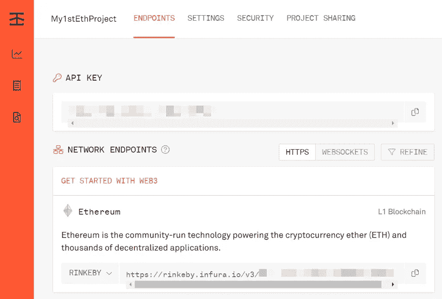

Infura 项目设置(Rinkeby Testnet)

我还在网上搜索了“ *rinkeby 水龙头*”，用一个给钱包加乙醚。

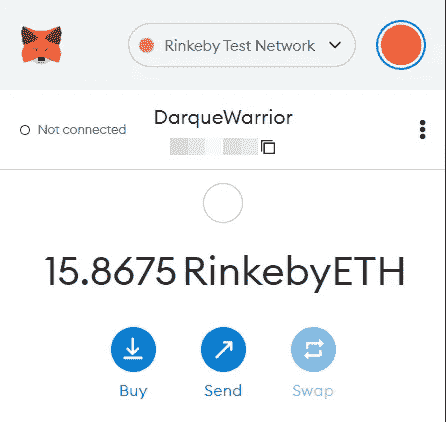

要部署到 Rinkeby，必须将网络添加到*Truffle-config . js。*添加网络的最佳资源是官方 [Truffle 套件文档](https://trufflesuite.com/docs/truffle/reference/configuration/#networks)。查看文档后，我意识到我需要一个`HDWalletProvider`。使用 npm，我安装了它并将其保存为一个依赖项。

```
npm install --save truffle-hdwallet-provider
```

安装了这个包之后，我需要更新 *truffle-config.js* 。我添加了来自我的 Infura 项目的 *API 键*作为环境变量，以及来自我的测试帐户的*助记符*。

使用`HDWalletProvider`，我将 Rinkeby 网络添加到*网络*部分。

## 基础设施

在 *qa* 阶段的 *iac* 作业下，在`azure-pipelines.yml`中，我增加了两个任务，如下图所示:

第一个任务下载在管道的*构建*阶段创建的 *iac* 工件。这个工件包含三个 Bicep 文件和一个 PowerShell 脚本。

第二个任务执行 PowerShell 脚本，该脚本使用三个 Bicep 文件来部署 Azure 静态 Web 应用程序。我使用`-rgName $(resourceGroup)-qa`参数，它将我的 QA 环境的所有资源放在一个资源组中。注意，我之前创建的服务连接被用作 inputs 下的 *azureSubscription* 的值。

## 契约

使用 Infura 节点将合同部署到 Rinkeby 测试网络中。在`qa`阶段的`deploy_contracts`工作下，我添加了以下内容:

注意第 12 行，我将 *rinkeby* 传递给`--network`参数，并为 *API 键*和*助记符*设置适当的环境变量。

## 前端

前端部署到部署在`qa`阶段的`iac`作业中的 Azure 静态 Web 应用程序中。在`qa`阶段的`deploy_frontend`作业下，我添加了以下内容:

正如我对开发环境所做的那样，我想在完成之后删除 QA 环境。在删除 QA 环境之前，我希望有机会审查代码。为此，我使用了手动验证作业。一旦我批准了验证步骤，下一个作业就删除了 Azure 中的 QA 资源组，移除了我所有的资源。在`qa_validation`阶段，我添加了以下内容:

## 变量

接下来，我通过 [Azure DevOps UI](https://learn.microsoft.com/azure/devops/pipelines/process/set-secret-variables) 向我的管道添加了两个秘密变量。这些将设置我们在 *truffle-config.js* 文件中使用的环境变量。

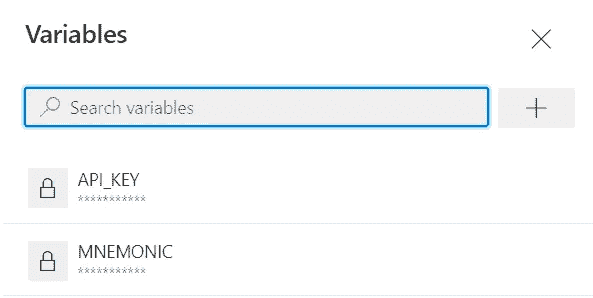

管道中增加了两个变量

一旦管道完成了 QA 环境，信息就被添加到运行的*扩展*部分。

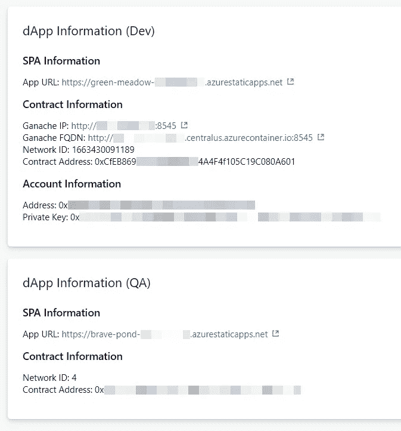

使用提供的链接，我能够测试应用程序。

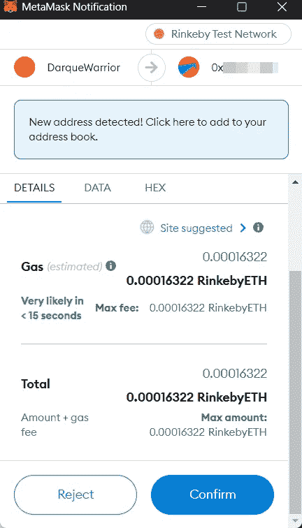

连接到 Rinkeby 上运行的 Dapp 的 Metamask wallet

现在我已经部署到了我的 QA 环境，在下一节中，我将展示如何部署到 Mainnet。

# 管道，产品

在这最后一部分，我将介绍部署到以太坊主网需要做些什么。

我为这个部分创建了一个名为“ [blog/part10](https://github.com/DarqueWarrior/TruffleDevOps/tree/blog/part10) 的新分支。

```
git checkout -b blog/part10
```

为了部署到 Mainnet，我需要一个 Infura 节点，就像我在 Rinkeby 中使用的那样。不像用 Rinkeby，我需要一个用 ***真实*** 以太的账号。使用我在上一篇文章中创建的同一个项目，我得到了 Mainnet 的*网络端点*。 *API 密钥*对于所有网络都是相同的。

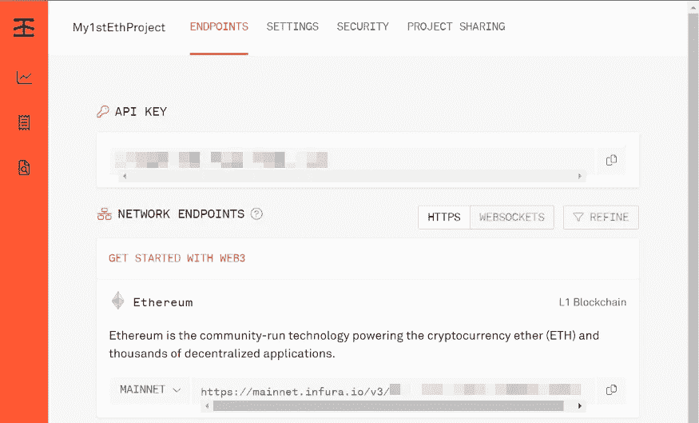

Infura 项目设置(Mainnet)

要部署到 Mainnet，必须将网络添加到 *truffle-config.js 中。*添加网络的最佳资源是官方的 [Truffle 套件文档](https://trufflesuite.com/docs/truffle/reference/configuration/#networks)。

和 Rinkeby 一样，使用`HDWalletProvider`，我将 Mainnet 添加到 *networks* 部分。

# 基础设施

在 *prod* 阶段的 *iac* 作业下，在`azure-pipelines.yml`中，我增加了两个任务，如下图所示:

第一个任务下载在管道的*构建*阶段创建的 *iac* 工件。这个工件包含三个 Bicep 文件和一个 PowerShell 脚本。

第二个任务执行 PowerShell 脚本，该脚本使用三个 Bicep 文件来部署 Azure 静态 Web 应用程序。我使用`-rgName $(resourceGroup)-prod`参数，它将我的生产环境的所有资源放在一个资源组中。注意，我之前创建的服务连接被用作 inputs 下的 *azureSubscription* 的值。

## 契约

使用 Infura 节点将合同部署到 Mainnet 中。在`prod`阶段的`deploy_contracts`工作下，我添加了以下内容:

注意第 12 行，我将 *mainnet* 传递给`--network`参数，并为 *API 键*和*助记符*设置适当的环境变量。

与开发和 QA 环境不同，不需要删除作为管道一部分的资源。因此，没有手动批准来删除资源组。

## 前端

前端将被部署到部署在`prod`阶段的`iac`作业中的 Azure 静态 Web App 中。在`prod`阶段的`deploy_frontend`工作下，我添加了以下内容:

## 变量

该阶段重复使用在第 9 部分的[QA 环境中创建的变量。](/web3-meets-devops-pipeline-qa-d513d63ec0e)


管道中增加了两个变量

一旦管道完成，生产环境信息被添加到运行的*扩展*部分。

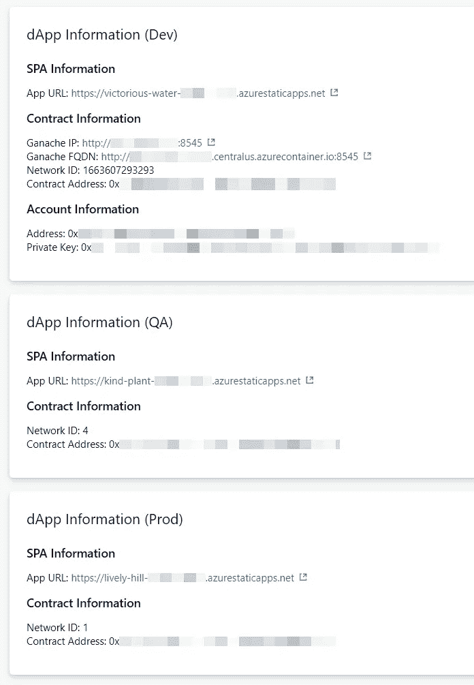

# 摘要

这篇文章记录了将 DevOps 最佳实践应用于 Web3 开发的过程。这可以通过添加额外的工具来扩展，例如代码和依赖扫描、静态代码分析和集成测试。

不管你开发的是什么类型的软件，实现 DevOps 最佳实践将会增加价值并提高你的团队的速度，同时减少错误。

## 信用

编辑:[切尔西·布朗](https://cbrownauthor.com/)
技术回顾:[布莱恩·本茨](https://www.linkedin.com/in/brianbenz)