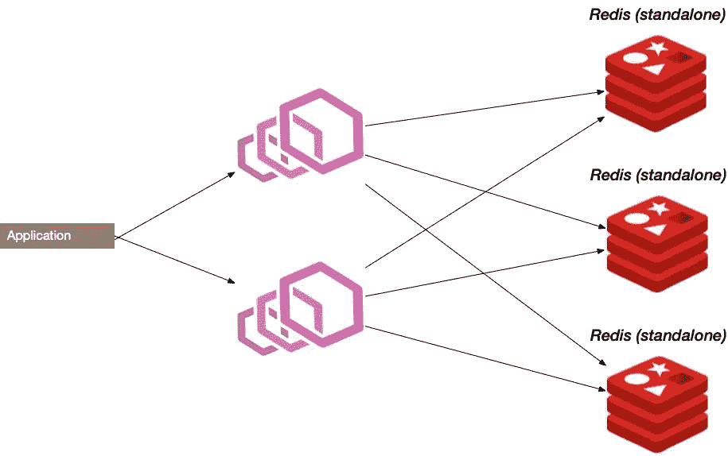
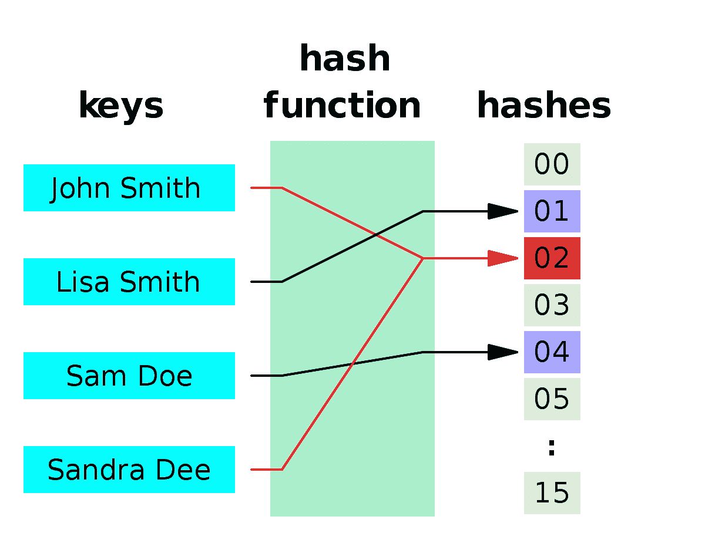
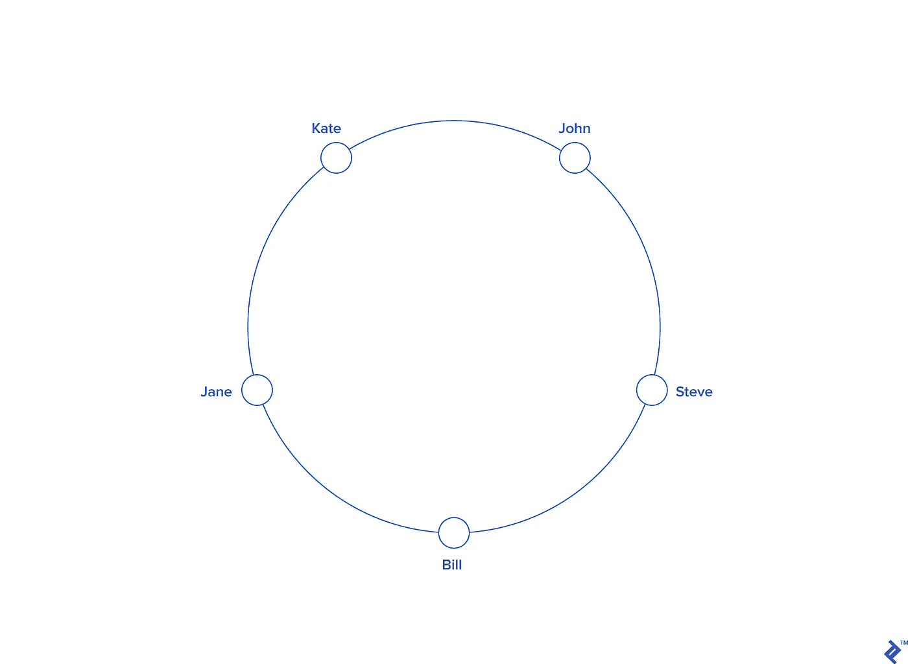
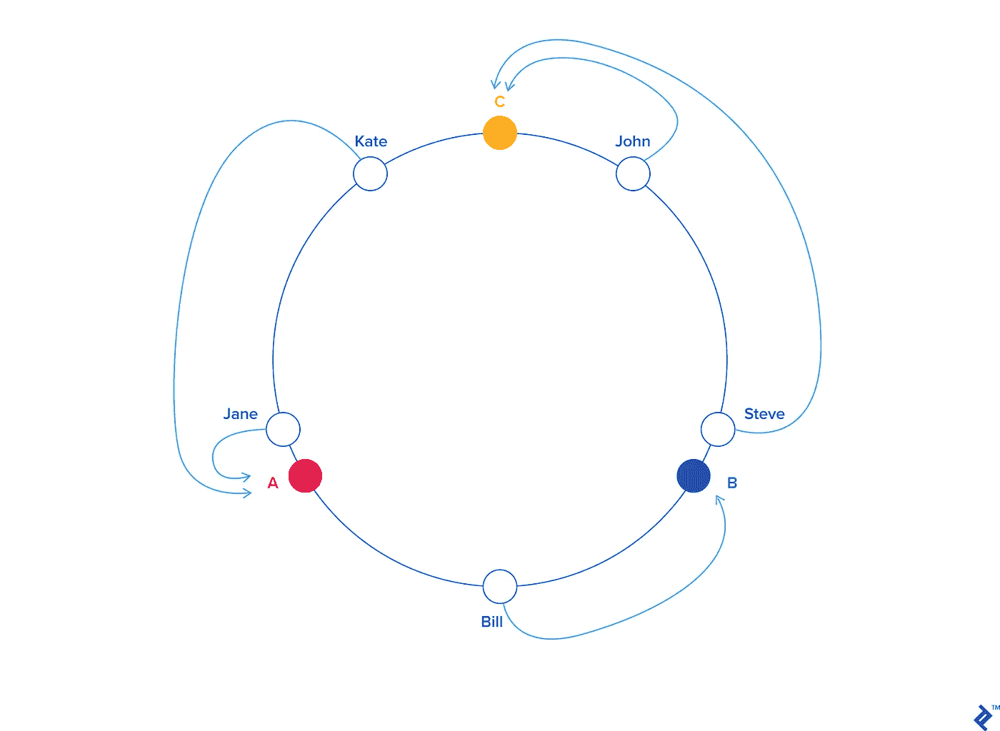

# 从头开始构建分布式 Redis 缓存

> 原文：<https://betterprogramming.pub/building-a-distributed-redis-cache-from-ground-up-2fa6c341c8c6>

## 纵向扩展内存缓存，实现水平扩展

Redis 与特使代理

为您的应用程序提供一个缓存层是大规模处理 API 请求的最常用和最有效的解决方案之一。拥有缓存的响应或部分响应比重做整个工作流来服务请求要快得多。

在本文中，我们关注的是基于内存的缓存，以及如何将内存缓存扩展为可水平伸缩的。也就是说，我们可以向我们的系统添加更多的缓存机器，所有机器都应该像一个实例一样工作，将所有缓存命中/写入作为一个缓存实例来服务。我们将使用 [Redis](https://redis.io/) 进行演示，但是您可以使用任何您喜欢的缓存层。

正如您可能已经知道的，有许多现成的解决方案，可以用来扩展 Redis。你可能听说过 [Redis 集群](https://redis.io/topics/cluster-tutorial)或者[特使代理](https://www.envoyproxy.io/)。今天，我们将尝试从表面上了解这些服务是如何由内向外构建的。有关现成解决方案的更多详细信息，我建议您查看[这篇很棒的文章](https://medium.com/dev-genius/redis-topologies-d9e16a7fa8e0)。

不做进一步介绍，我们来深入探讨一下这篇文章的核心。

# 我们试图解决的问题

让我们从一个基本架构开始。

简单的单实例客户端/缓存通信

通常，我们有一个 Redis 服务器的实例正在运行，任何对读/写缓存感兴趣的人都可以联系这个服务器并获得想要的结果。Redis 速度超快，因为它从内存中为您的操作服务。但是我们如何在不同的机器上分配内存呢？

我们希望能够像特使一样做一些事情。

我们需要一个代理服务器，它可以与任何想要从缓存中读写数据的客户端进行通信，并隐藏与我们实际使用了多少个 Redis 实例来存储缓存信息或这些信息如何在每个实例中路由/存储相关的所有信息。

这里出现的一个典型问题是我们如何分配数据。我们如何在代理级别记住，比如说，密钥 X 存储在哪里？

我们在写作上也有问题。我们需要能够在实例之间几乎均匀地分配密钥，这样我们就不会在其他实例空闲时使其中一个实例过载。

值得注意的是，我们在这里做的事情叫做*分片*。基本上，分片意味着我们希望将存储在一台机器上的数据分布到多台机器上，同时保留在对单台机器上的数据进行分片之前对新的分布式系统进行读写的方法。

## 散列法

*哈希*，简单来说，就是将数据映射到一个以更小的形式表示该数据的哈希，这对我们的目的很有用。

你可以把我们想要存储在 Redis 中的键想象成我们想要散列的数据。我们拥有的 Redis 实例的服务器名称是可用的简化散列字符串，我们应该将每个键映射到该字符串。

这实际上解决了我们两个的问题。通过使用下面的过程，我们可以知道每次我们有一个键时，在哪里存储和从哪里读取数据:

*   从客户端检索一个密钥和一个带参数的命令。
*   散列密钥
*   决定这个哈希值属于哪个服务器(可以是范围或离散值)

就是这样！我们现在可以轻松地构建分布式缓存了。

没那么快——我们仍然需要找到一个最佳的散列函数来散列我们的密钥。这是因为如果我们不断散列新的键，如果函数将我们选择的所有键名散列到同一个服务器，它们可能都在同一个桶或服务器中结束！

此外，我们还有另一个问题，那就是处理我们代理下的操作服务器数量的增加或减少。假设我们使用这个散列函数将值散列到服务器`server = hash(key) mod NumServers`。通过此功能，我们可以根据当前拥有的服务器数量来分配密钥。这种分配不是线性的，所以键没有排序，A、B、C 在 S1，D 在 S2，依此类推。

如果我们的一台服务器因为某种原因关闭了呢？现在我们必须将`NumServers`减少-1，对吗？这实际上是灾难性的，因为现在有了新的模，我们已经散列的值已经改变了。存放在 S1 的钥匙现在可能会被送往 S2，反之亦然。这将导致我们对所有服务器进行全面检查，以重新散列所有密钥——哎呀！

我们需要一种更好的方法来散列我们的密钥，以便每当我们必须从我们的池中添加/删除服务器时，我们只需付出最少的努力。

# 一致散列法

映射到一个圆的键(图片来源:[一致性散列指南](https://www.toptal.com/big-data/consistent-hashing)

假设我们从一个有 2π或 360 度的空圆开始。现在，我们不再使用像 modulo 这样的散列函数直接将值映射到服务器，而是将键映射到圆圈上的某个点或度数。

如上所示，对一些示例键进行这样的操作，我们可以得到一个类似上面所示的圆，键分布在整个圆上。

在圆周的某些预定义的度数上添加服务器(图片来源:[一致性散列指南](https://www.toptal.com/big-data/consistent-hashing)——再次感谢 Juan 关于一致性散列的精彩文章)

现在，我们将在圆的不同角度分配并均匀分布服务器，使它们之间的角度相等。

这创建了一种不同的哈希算法，即一致哈希算法。现在我们有了每个服务器的度数范围，每当一个新值被散列到圆圈中时，我们只需检查这个值属于哪个范围。

这如何解决我们添加新服务器或处理退役旧服务器的问题？

让我们看一个场景:添加一个新的服务器。

每当我们添加一个新的服务器，我们将为该服务器分配一个新的学位。让我们称这个服务器为 D。当然，这个服务器会落在圈里的其他两个服务器之间——比如 B 和 C——所以我们把 D 放在中间，在 B 和 C 之间。

为了适应添加新服务器的变化，我们将开始重新分配仅从服务器 B 窃取的密钥，因为现在服务器 D 已经占据了它的部分领土。与我们的第一个解决方案相比，这实际上非常高效。现在我们只需要从一台服务器上重新分发密钥。

让我们看第二个场景，服务器 A 停机了。服务器 B 现在不得不要求服务器 A 下的所有密钥，因为现在它拥有它在圆圈中的领土，加上 A 的领土。

这真的很棒。让我们重申一下我们的工作流程:

*   我们从在代理处接收来自客户机的命令细节和密钥开始。
*   然后，我们将密钥散列到循环中的某个程度。
*   检查此键属于哪个范围/地区。
*   向/从区域/范围的所有者(又名服务器)分配/读取密钥。
*   接收来自缓存服务器的响应，并将其返回给客户端。

就是这样！我们做了一个简单的架构，类似于特使代理在其主要控股框架。

我们的旅程到此结束。您可以在以下网址查看示例代码

 [## 卡里姆-艾玛德/雷迪斯网格

### 分布式缓存层的一个基本实现，主要面向 redis 服务器，支持数据分片和…

github.com](https://github.com/Kareem-Emad/redis-grid) 

谢谢你的耐心，如果你有任何疑问/意见/问题，请在评论中告诉我。