# 建立图像质量缺陷的通用分类系统

> 原文：<https://betterprogramming.pub/building-a-general-classification-system-for-image-quality-defects-beadbe026a19>

## 常见质量缺陷、当前识别方法和面临的挑战

由[普拉克里蒂·普里马尼](https://www.linkedin.com/in/prakritipritmani/)、[萨吉特·潘迪](https://www.linkedin.com/in/sachitpandey/)、[什雷思·拉纳](https://www.linkedin.com/in/shresthrana/)、[斯里达尔·琼娜拉](https://www.linkedin.com/in/sridhar-jonnala-12157116/)和[特拉皮·卡拉](https://www.linkedin.com/in/traptikalra/)

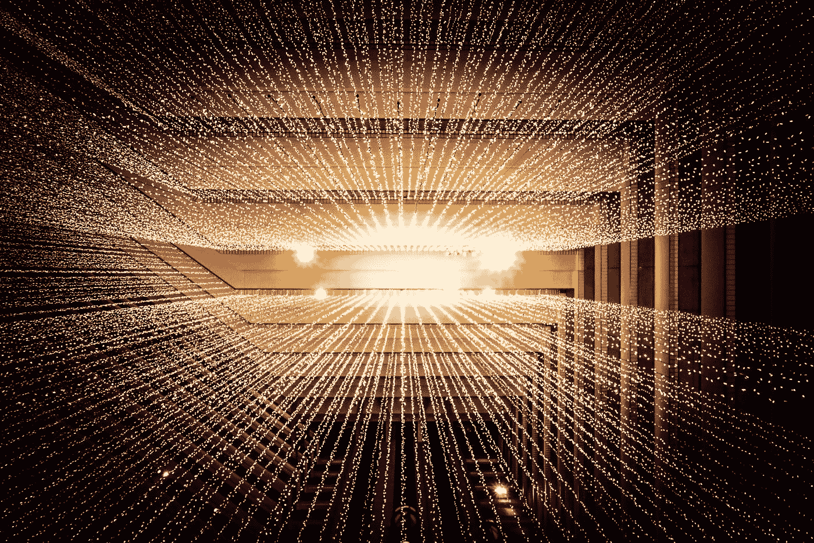

Joshua Sortino 在 [Unsplash](https://unsplash.com/?utm_source=medium&utm_medium=referral) 上拍摄的照片

几年来，针对各种不同的使用案例，开发了许多基于图像的智能解决方案。它们都有一个共同点，即用于构建和测试解决方案的原始图像数据集中存在一系列图像质量问题。

> 根据[**《福布斯》**](https://www.forbes.com/sites/gilpress/2016/03/23/data-preparation-most-time-consuming-least-enjoyable-data-science-task-survey-says/?sh=fdf9b9a6f637) **(2016)** ，“数据科学家 80%的时间都花在寻找、清理和试图组织数据上”。在清理图像数据集的过程中会进一步观察到这种趋势，其中也普遍存在人为错误。“一个坏的数据集将导致一个坏的模型”——如果图像质量缺陷是由于捕捉时的错误或不代表自然生活的条件，那么训练的模型肯定会失败。

当一幅图像被人类捕获时，它很容易被当场判断并被纠正或重拍。如今的智能手机内置了专有的校正软件，可以照亮黑暗的图像，或者在人像模式下检测人脸，以确保对焦准确。

在工业自动化工作流程等特定场景中，我们看到过这样的使用案例:机器人被编程执行任务，以捕捉室外/工厂环境中可能不安全的资产/设备的图像，供人类检查。这种图像将通过下游工作流程步骤自动发送处理。

模拟基于人的实时审查和纠正步骤——实施“通用”图像质量缺陷检测系统可以为解决方案设计和工作流程结果增加巨大的价值。一种图像质量检测框架，能够在边缘和移动设备上实时有效地工作。

在这种情况下出现了一个重要的问题:我们是否考虑主观(人)的意见，即即使鲁棒的模型可能能够正确地对图像进行分类，图像的质量也是差的，或者如果模型不能正确地检测到对象/分类，图像的质量是差的吗？

这个问题导致围绕可能存在什么缺陷以及如何识别质量差的图像要考虑许多因素。在本文中，我们将讨论一些最常见的缺陷、当前的识别方法——基于传统图像处理和深度学习，以及我们在尝试实施/运行复杂的自治系统时可能面临的挑战。

# 常见的图像质量缺陷

## 模糊:

来自 VizWiz 数据集的包含散焦模糊的图像示例

有两种类型的模糊，即运动模糊，在这种情况下，图像是在对象运动或相机不稳定时拍摄的；第二种类型是散焦模糊，在这种情况下，拍摄图像时感兴趣的对象不在焦点上，因此它在图像中是模糊的。

## 眩光:

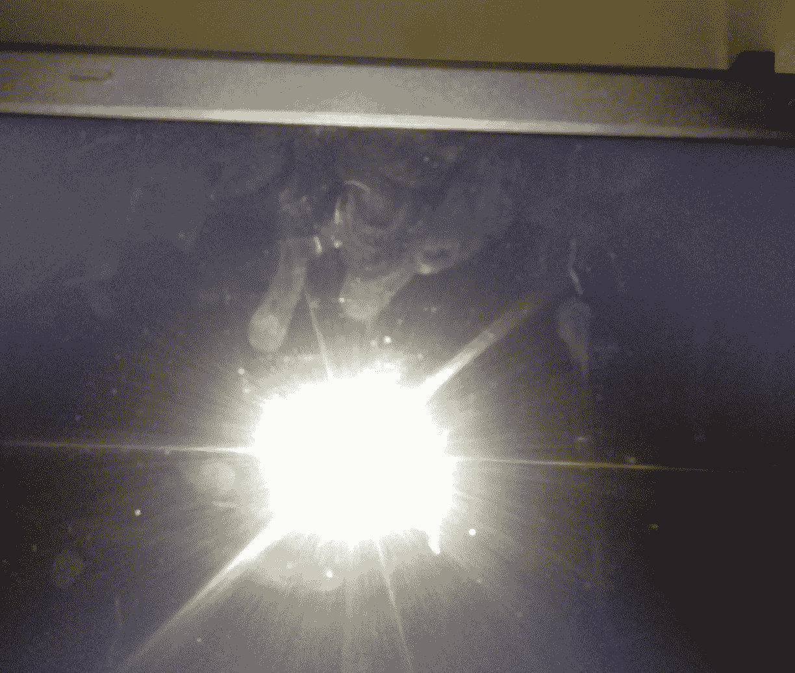

包含来自 VizWiz 数据集的反射眩光的图像示例

当图像上捕捉到非常强的发光物体时，会出现眩光。当你试图捕捉夜晚的太阳、鞭炮或街灯时，你一定注意到了这一点；以及它们如何在其位置上发出明亮的斑点，特别是如果相机设置没有相应校准的话。

## 黑暗:

前暗数据集的暗图像示例

顾名思义，这发生在黑暗/弱光环境(例如，夜间)中捕获图像时。当一个物体出现在发光源前面时，也会发生这种情况，使该物体看起来像一个黑暗的轮廓(有没有视频呼叫某人，当他们站在灯光前时，你看不到他们的脸？)

## 图像质量检测

图像质量检测是指由计算设备实现的识别图像中质量问题种类的能力。传统上，使用各种计算度量，已经开发了试探法来处理缺陷检测，这虽然对定义良好的情况有效，但是缺乏跨各种用例的通用性。这些方法本质上主要是分析性的，并且在启发式的上下文中应用人类的理解。后来，随着多模态人工智能的兴起，已经开发了图像质量检测通用机制，这些机制能够识别图像中的这种“关键特征”，这有助于图像缺陷识别。

这种功能可用于随时过滤现有数据集的质量问题，而不依赖于人工干预来为机器学习管道挑选数据集。这有助于减少数据专业人员清理影像数据集的时间。类似地，这也可以在数据收集的源处使用，其中在点击图像时，可以通知操作者任何缺陷的存在，或者在生产工作流程中作为用于部署的机器学习模型的图像过滤机制。

最后，这有助于节省时间和资源。这是因为效率的提高是自动化视觉检测任务的结果，而这些任务以前是手动完成的。底层自动化是通过使用图像质量检测功能生成的洞察来实现的。

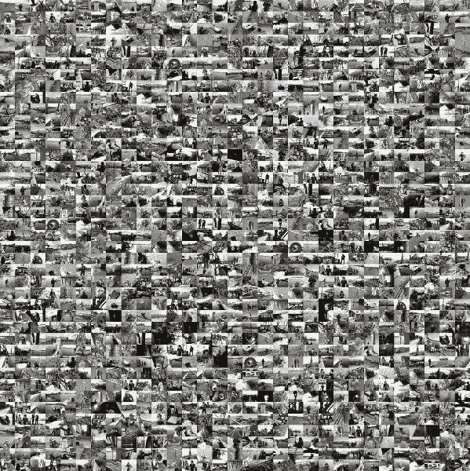

手动检查一个巨大的数据集的缺陷可能有点…乏味。[来源](https://www.picturemosaics.com/photo-mosaic-tool/share/id/M6439325/p/p0)

# 传统缺陷检测技术

## 模糊检测

**拉普拉斯算子**:该方法用于发现图片中的边缘。它突出显示图像中包含快速亮度变化的区域。它用于测量图像的二阶导数。如果图像包含高方差，则存在广泛的响应分布，包括边缘状和非边缘状，代表正常的聚焦图像。但是，如果方差非常低，那么响应的分布很小，表明图像中的边缘非常少。众所周知，图像越模糊，边缘就越少。该方法将输入图像与拉普拉斯算子进行卷积，并计算方差。在设置方差阈值之后，方差低于该阈值的图像被分类为“模糊的”。主要的挑战是设置一个给出最佳精度的正确阈值。阈值可以随着来自不同场景的图像而变化；因此，推广是困难的。要了解这种方法的内部运作，请参考[这篇博客](https://medium.com/@sagardhungel/laplacian-and-its-use-in-blur-detection-fbac689f0f88)。

**快速傅立叶变换**:这是一种数学算法，用于将图像从空间域转换到傅立叶/频率域。在频域中，每个点代表包含在相应空间域中的特定频率。当基于设定的频率水平存在低数量的频率时，则它声明图像是模糊的，否则，如果计算的频率高，则图像是清晰的。在这种情况下，根据用例，阈值取决于程序员。如需帮助实施，请参考[这篇文章](https://pyimagesearch.com/2020/06/15/opencv-fast-fourier-transform-fft-for-blur-detection-in-images-and-video-streams/)。

有关不同模糊检测技术之间的比较的更多信息，请参见[本](https://www.semanticscholar.org/paper/iBlurDetect%3A-Image-Blur-Detection-Techniques-and-Pagaduan-Aragon/955bc0d1b9ebbc3b3263adad2e7360ad757e1f11)。

## 眩光检测

图像特征，其在计算时返回具有原始尺寸的图像以及包含图像眩光的位置的概率。

选择的第一个图像图是强度图。所选择的第二图像图是饱和度图，其中色彩饱和度非常低的区域是眩光区域的良好候选。因此，输入图像的 HSV 颜色空间表示用于导出每个像素的颜色饱和度。所选择的第三图像图是局部对比度图，其中低亮度区域预期是图像眩光的良好候选。

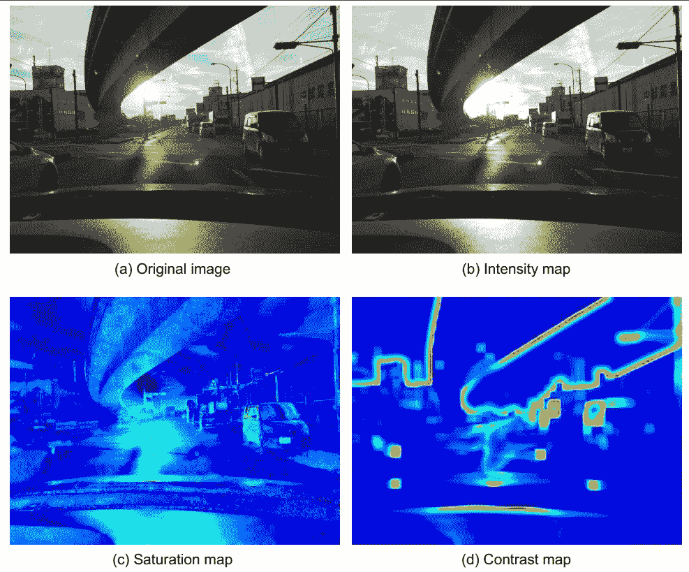

根据原始图像计算的光度贴图[使用 JET 色彩贴图]。[来源](https://library.imaging.org/ei/articles/29/19/art00013)

可以理解的是，这三张光度贴图都使用了数学公式来识别眩光区域。通过对图像的仔细观察，我们了解到具有较高色度值的区域(以红色突出显示)是眩光的识别候选区域。作者还提供了更多关于如何整合其他功能以提高性能的细节，但是分析方法的基础仍然是相同的。有关该方法的更多信息，请参考此处的。

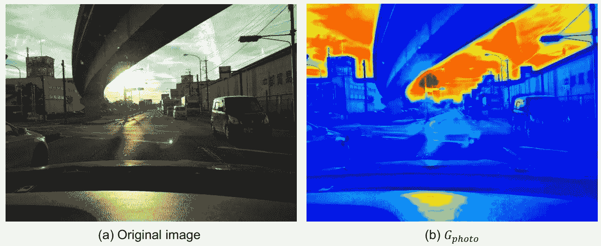

红色区域是图像中眩光的候选区域。[来源](https://library.imaging.org/ei/articles/29/19/art00013)

这里，面临的关键挑战是关于使用这种方法实现分类系统。由于镜面高光可能是很强的假阳性，因此重要的是，在最终图像中仅仅存在高值不能被归类为眩光。因此，相对于用户定义的阈值，高值与总值的比率可以帮助我们识别眩光区域的百分比，该百分比可以与自定义阈值进行比较，并帮助识别图像是否有眩光。这里，我们需要指定几个关键参数，如图像值的阈值和百分比眩光区域的阈值。这进一步意味着，对于每个用例，这些值必须根据经验确定(在训练集上)，而不是对所有用例都具有普遍性。

## 黑暗检测

已经使用了各种分析方法来确定图像是否是暗的。通常，使用固定大小的核来平滑图像的灰度近似值，以获得更高级别的近似值并降低图像尺寸。此后，计算图像矩阵中存在的所有值的平均值，并最终与阈值进行比较。像素值的灰度范围是(0–255)，127 位于中间。该阈值可以根据经验确定，或者使用 127 的理论近似值。如果该值小于阈值(127)，则图像被分类为暗的。然而，这被证明是非常粗略的近似，并且在实践中产生不太理想的结果。

因此，上述技术有几个缺点，因此，对 ML 技术的鲁棒性和可推广性进行了研究。

# ML 技术和数据集

## **模糊 CNN**

对于模糊检测，我们把它框架为二元分类问题，其中输入图像将被分类为“模糊”或“不模糊”。起初，迁移学习用于像 ResNet50 和 VGG-16 这样的预训练模型(在 ImageNet 上进行了预训练)。虽然与传统方法相比，这些方法在精度上有了显著提高，但这些模型的尺寸相当大，不适合边缘设备。因此，我们试图最大限度地提高我们的模型精度，并减少模型大小。我们从头开始训练了一个定制的 CNN 架构，它比迁移学习提供了更好的准确性，可能的原因是从 ImageNet 数据集学习(预训练)的低级特征对学习模糊特征没有帮助。

参考代码实现[此处](https://github.com/Nem3sisX/pretrained-image-quality-cnn)。

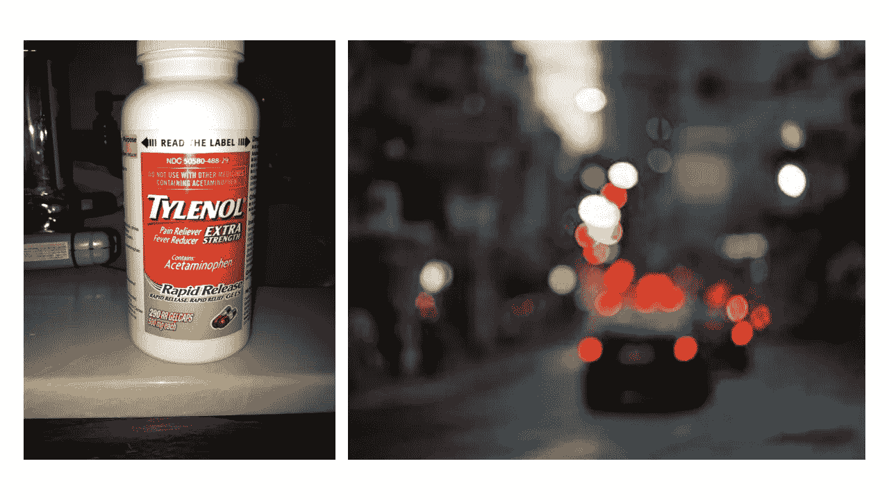

左边的图像(取自 VizWiz 数据集)被归类为“不模糊”，右边的([源](https://fineartamerica.com/featured/blurred-traffic-jam-victor-bezrukov.html))被归类为“模糊”

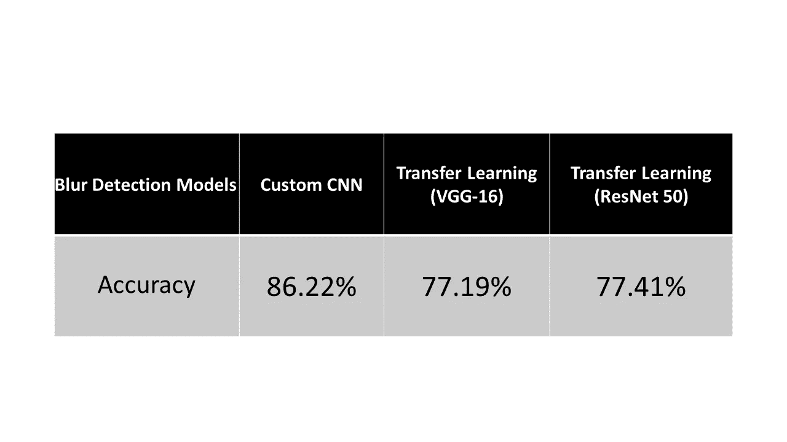

用于模糊检测的模型之间的精度比较

## **眩光 CNN**

为了检测每幅图像中的眩光，我们研究了学术文献中的方法。然而，代替快速推理时间的限制和对最小化模型大小的关注，定制 CNN 模型比预训练模型更受欢迎。

这是因为预训练模型关注于提高的准确性，但是具有较慢的推理时间和较大的模型尺寸，因此不适合边缘设备。随着模型训练的进一步改进，我们能够限制模型大小，同时强调眩光的分类性能。

对于该模型，检查点用于确定在验证集上表现最佳的模型。

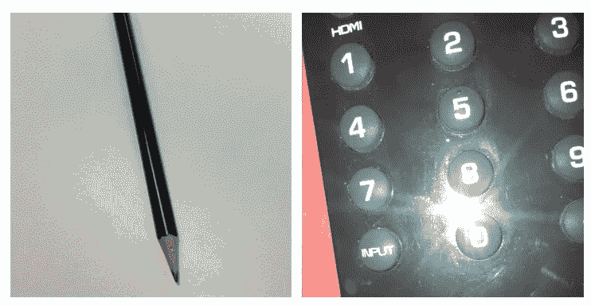

左边的图像(取自 VizWiz 数据集)被分类为“非眩光”，右边的图像(取自 VizWiz 数据集的 [t](https://fineartamerica.com/featured/blurred-traffic-jam-victor-bezrukov.html) aken)被分类为“眩光”

对于人工智能解释能力，流入最终卷积层的目标概念[ **眩光** ]的梯度用于产生定位图，该定位图突出显示图像中用于预测概念的区域。

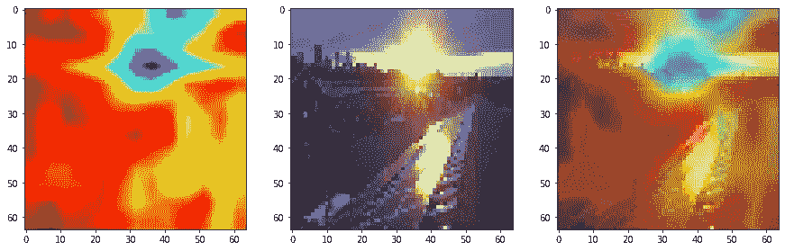

[左-右] GradCAM 热图，原始输入图像(缩小到 64x64)，热图叠加+输入图像

这里，我们可以清楚地划分局部区域。类别激活图显示眩光区域与类别激活图重叠。因此，通过视觉验证，我们可以观察我们的网络在“看”哪里，并评估它是否确实在看图像中表示眩光的正确图案。正如所观察到的，最终的卷积层在表示图像中存在眩光的图案周围被激活。

参考代码实现[这里](https://github.com/Nem3sisX/pretrained-image-quality-cnn)。

## **黑暗检测**

为了检测给定图像的暗度，计算像素值[范围从 0 到 255]的直方图表示，其中桶的大小以 15 为间隔固定。

这是对所有训练图像进行的。这些图像表示此后被存储在对应于每个图像的文件中。

此后，整个文件作为一个数据帧读取，并在其上训练一个随机森林模型。最后，将性能与验证分割进行比较，以准确确定模型的性能。

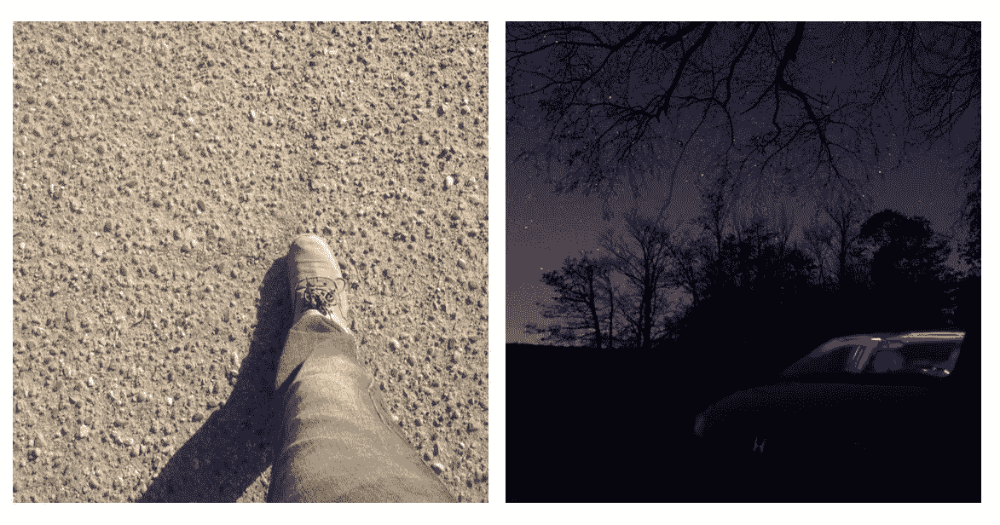

左边的图像(取自 VizWiz 数据集)归类为“不暗”，右边的图像( [t](https://fineartamerica.com/featured/blurred-traffic-jam-victor-bezrukov.html) 取自前暗数据集)归类为“暗”

对于模型构建，使用的基线数据集是 Ex-Dark 数据集的子集。这里，训练图像和验证分割也指这里所指的来自 Ex-Dark 的图像子集。

**ExDARK 数据集:**exclusive Dark(ex Dark)数据集是从极弱光环境到黄昏(即 10 种不同条件)的 7，363 幅弱光图像的集合，具有 12 个对象类(类似于 PASCAL VOC)，在图像类级别和局部对象边界框上都有注释。对于我们的使用，我们用它来评估我们的黑暗模型的性能。

**VizWiz 图像质量问题数据集**:viz wiz 大挑战的一部分，这是计算机视觉社区设计这种技术来帮助盲人克服日常视觉挑战的自然大挑战。该数据集是围绕 23，431 幅训练图像建立的，这些图像是由盲人拍摄的，他们真正试图了解他们使用 VizWiz 移动电话应用程序拍摄的图像。图像注释在一个 JSON 文件中给出，在那里它们被标记在一个基于投票的度量标准中，每张图像的质量缺陷和不可识别性，在 0 到 5 的范围内。标签如下:

a.【无】:无瑕疵

b.[BLR]:模糊

c.[BRT]:高亮度/眩光

d.[DRK]:暗/曝光不足的图像

e.[ROT]:旋转的图像

f.[OBS]:模糊/遮挡

g.[FRM]:对象超出了框架

h.无法识别:由于严重的质量问题，图像内容无法识别

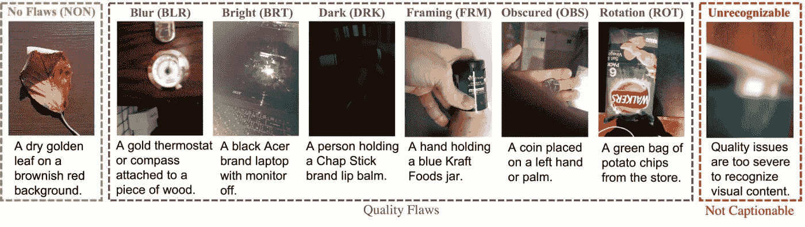

VizWiz 中不同类型的类:图像质量问题数据集。[来源](https://vizwiz.org/wp-content/uploads/2020/03/VizWiz-QualityIssues-1-1536x435.jpg)

## 挑战

由于以下原因，不管给定的场景/数据如何，将图像质量检测方法推广到具有类似性能的工作可能是一项复杂的任务:

在模糊检测中，重要的是确定图像的模糊程度可以被归类为“模糊”。还存在图像具有部分模糊的情况，这通常在摄影中看到，其中失焦部分被有意模糊，以将整个焦点给予感兴趣的对象和/或为了美学效果(例如，散景效果)。

通用图像质量检测系统应适应存在缺陷但不影响感兴趣对象(OOI)/感兴趣区域的异常情况。例如，无论图像中是否有眩光点，或者图像是否有上述散景效果，OOI 都不会受到它的影响，您可以清楚地看到它。在这些情况下，定位您感兴趣的区域变得非常重要。

我们试图用 VizWiz 数据集实现遮挡检测(使用[OBS]类)，但发现该模型在测试数据集上不能很好地推广。我们通常将遮挡与一些暗斑或“污点”联系起来，这些暗斑或“污点”使我们看不到感兴趣的物体。情况并非总是如此。有些情况下，适当的对象可能是遮挡对象。例如，自行车是一个对象，并且是对象检测数据集中的一个常见类，但是如果将其放在汽车前面并遮挡了汽车的一部分，它可能会成为遮挡对象。因此，需要基于上下文的遮挡检测来使图像质量检测系统通用化。

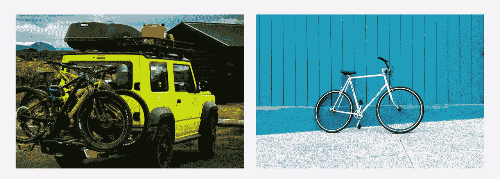

左图中的自行车是一个遮挡的物体([来源](https://images.unsplash.com/photo-1584126997295-f9327e5ee374?ixlib=rb-1.2.1&ixid=MnwxMjA3fDB8MHxwaG90by1wYWdlfHx8fGVufDB8fHx8&auto=format&fit=crop&w=1031&q=80)，右图中的 OOI([来源](https://images.unsplash.com/photo-1505705694340-019e1e335916?ixlib=rb-1.2.1&ixid=MnwxMjA3fDB8MHxwaG90by1wYWdlfHx8fGVufDB8fHx8&auto=format&fit=crop&w=1032&q=80)

通用的图像质量检测系统还应该考虑具有深色和/或亮色物体的图像，并且不应该分别将其与黑暗或眩光混淆。

黑暗物体。[来源](https://images.unsplash.com/photo-1532298229144-0ec0c57515c7?ixlib=rb-1.2.1&ixid=MnwxMjA3fDB8MHxwaG90by1wYWdlfHx8fGVufDB8fHx8&auto=format&fit=crop&w=822&q=80)

参考代码实现[此处](https://github.com/Nem3sisX/pretrained-image-quality-cnn)。

## 参考

[1] Mehran Andalibi，Damon M. Chandler，“通过光度、几何和全球定位信息进行自动眩光检测”，Proc .IS&T 国际公司。症状。电子成像:自动驾驶车辆和机器，2017 年，第 77-82 页

[图像质量问题— VizWiz](https://vizwiz.org/tasks-and-datasets/image-quality-issues/)

[https://github.com/cs-chan/Exclusively-Dark-Image-Dataset](https://github.com/cs-chan/Exclusively-Dark-Image-Dataset)

[OpenCV 快速傅立叶变换(FFT)用于图像和视频流中的模糊检测— PyImageSearch](https://pyimagesearch.com/2020/06/15/opencv-fast-fourier-transform-fft-for-blur-detection-in-images-and-video-streams/)

[[PDF] iBlurDetect:图像模糊检测技术评估与评价研究|语义学者](https://www.semanticscholar.org/paper/iBlurDetect%3A-Image-Blur-Detection-Techniques-and-Pagaduan-Aragon/955bc0d1b9ebbc3b3263adad2e7360ad757e1f11)

[拉普拉斯算子及其在模糊检测中的应用| Sagar | Medium](https://medium.com/@sagardhungel/laplacian-and-its-use-in-blur-detection-fbac689f0f88)