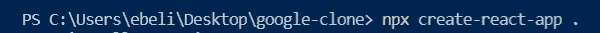
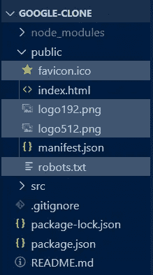
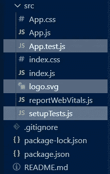
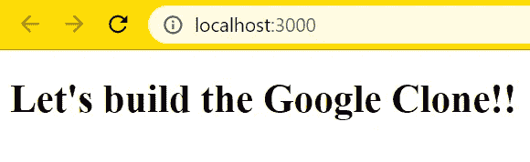
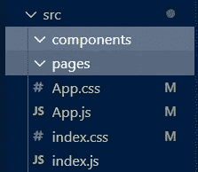
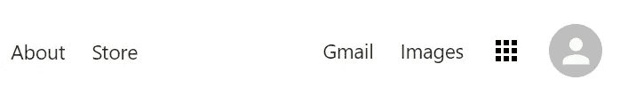
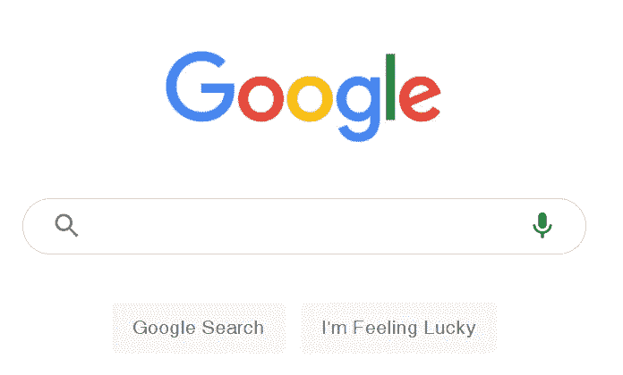

# 构建 Google 克隆—第 1 部分:设置 React

> 原文：<https://betterprogramming.pub/building-a-google-clone-part-1-setting-up-react-fb9c22b9662c>

## 用 React 和 Firebase 创建一个谷歌搜索克隆


眼睛盯着奖品:这将是最终结果。

你是想让你的开发者技能更上一层楼，还是想给你未来的雇主留下深刻印象？然后建立这个[谷歌克隆](https://medium-project-42d34.web.app/)！

在这个由四部分组成的系列中，我将向您展示如何从头开始构建一个功能完整的谷歌搜索克隆。如果你卡住了，不要担心！我将在每一节的结尾为您提供完整的代码。此外，在本教程的最后一期中，我将让您访问我的 GitHub 上的完整源代码。

# 在开始之前

在我们开始之前，让我们看一下我们将要使用的技术:

*   [React](https://reactjs.org/) —一个用于构建用户界面的 JavaScript 库。
*   [上下文 API](https://reactjs.org/docs/context.html) —通过组件树传递数据的有效方式。
*   [Material UI](https://material-ui.com/)—React 的顶级用户界面库之一，由 Google 开发。
*   [React Router](https://www.npmjs.com/package/react-router) —用于在 React 应用中创建路由的路由库。
*   [谷歌搜索 API](https://developers.google.com/custom-search/v1/overview) —一个定制的搜索 JSON API，允许你以 JSON 格式获得网络搜索结果。
*   Firebase——一个帮助你创建移动和网络应用的谷歌平台。

对于本教程，我将使用 [Visual Studio 代码](https://code.visualstudio.com/)，但是您可以使用任何代码编辑器。我个人喜欢 VS 代码，因为它让编码变得容易多了。

说够了…让我们编码吧！

# 1.设置 React 应用程序

首先，我们将创建并设置一个 React 应用程序:

*   新建一个名为`google-clone` 的文件夹，用 Visual Studio 代码打开。
*   现在你在 VS 代码中，按 Command+ⅱ(在 Mac 上)或 Ctrl+ⅱ**(在 Windows 上)打开终端。**
*   **在终端中键入以下内容并按回车键:`npx create-react-app .`**

**通过运行这个脚本，您将创建并设置一个新的 React 应用程序启动器，而不必处理 webpack 和 Babel 配置。末尾的圆点表示我们希望将 React 项目放在同一个文件夹中，而不是为它创建一个新文件夹。**

****

**现在让我们清理一下 React 应用程序启动器，这样我们就可以从 Google 克隆开始了。**

*   **从`public`文件夹中删除这些不相关的文件:`favicon.ico`、`logo192.png`、`logo512.png`、`robots.txt`。**

****

*   **从`src` 文件夹中删除这些无关文件:`App.test.js`、`logo.svg`、`setupTest.js`。**

****

*   **转到`App.css`并删除该文件的所有内容。**
*   **现在转到`index.css`，添加这段代码来删除默认的边距:`* {margin: 0}`。**
*   **在`App.js`文件内，移除`<header>`并添加一个简单的`<h1>`。**
*   **您的`App.js`文件现在应该看起来像这样:**

**现在我们终于可以在终端中键入`npm start`并启动我们的应用程序了。**

****

**React 模板终于设置好了，我们准备好构建克隆了！**

# **2.设置主页**

**让我们通过在`src` 文件夹中创建两个不同的附加文件夹来组织我们的环境:`components`和`pages`。`components` 文件夹将包括像搜索栏一样的可重用组件。`pages`文件夹将包含主页和搜索页面。**

****

**先从主页说起吧！**

*   **在`pages` 文件夹中，创建一个名为`Home.js`的文件。**
*   **一旦你在文件中，输入`rfce` 来使用来自 ES7 片段*的片段。*这将创建一个可以导出的 React 组件。**
*   **仍然在`pages` 文件夹中，制作一个`Home.css`文件，导入到你的`Home.js`组件中。**
*   **主页将由两个不同的元素组成:**

**标题:**

****

**身体:**

****

**主页的主体**

# **3.构建主页标题**

*   **在`Home.js`文件中，用`home__header`的`classNames`和`home__body`的*创建两个`divs` 。*`home__header`将进一步包含两个`<div>`子节点，分别为`home__headerLeft`的`className`和`home__headerRight`的*。***
*   **在这些`divs`里面，我们会有四个`<Link>`组件来自[反应路由器](https://reactrouter.com/web/guides/quick-start)，一个`<Icon/>` 组件，一个`<Avatar/>`组件来自[材质 UI](https://material-ui.com/) 。**
*   **为了给我们的`Home.js`组件添加一些样式，打开`Home.css`并添加以下代码:**

**为了渲染图标和头像，我们必须安装材质 UI *。***

*   **打开终端，键入以下命令:**

```
npm install @material-ui/core @material-ui/icons
```

*   **现在将网格图标和头像导入到`Home.js`文件中:**

```
import {Avatar} from "@material-ui/core";
import AppsIcon from “@material-ui/icons/Apps”;
```

*   **`<Link>`组件允许用户在不重新加载页面的情况下浏览应用程序。要使用它们，请安装 React 路由器。打开您的终端并输入以下命令来安装 react-router-dom:**

```
npm install react-router-dom
```

*   **在`Home.js`文件中，从 react-router-dom 导入`<Link>` 组件:**

```
import {Link} from “react-router-dom”;
```

*   **至此，您的`Home.js`文件应该如下所示:**

**为了让`<Link>`组件工作，我们必须设置 React 路由器。**

*   **转到`App.js`并导入以下依赖关系:**

```
import {BrowserRouter as Router, Route, Switch} from "react-router-dom";
```

*   **将整个应用程序包装在`<Router>`组件中，这样每个组件都可以访问路由器。**
*   **添加一个`<Switch>`组件。该组件将只呈现与当前 URL 匹配的第一条路线。**
*   **在`<Switch>`组件中，添加带有自己路径的路线。`<Route>` 组件在其路径与当前 URL 匹配时呈现特定的 UI。**
*   **导入`Home`组件，并在`<Route path=”/”>` 组件中渲染。**

**您的`App.js`文件现在应该是这样的:**

**我们刚刚建立了主页的标题！**

****

**主页标题**

# **4.添加主页徽标**

**现在，让我们开始通过添加和设计徽标来构建主页主体。**

*   **转到`Home.js`文件。在带有`home__body`的`className`的`<div>`内，添加谷歌标志:"[https://www . Google . com/images/branding/Google logo/2x/Google logo _ color _ 272 x92 DP . png](https://www.google.com/images/branding/googlelogo/2x/googlelogo_color_272x92dp.png)"**
*   **用 CSS 给主页主体添加一些样式。**

**最终的`Home.css`文件将如下所示:**

*   **回到`Home.js`文件，用`home__inputContainer`的`className`添加第二个`<div>` 子文件。在这个`<div>`里面，我们将渲染`<Search/>` 组件。**

**您的`Home.js`文件现在应该看起来像这样:**

# **结论**

**这部分到此为止。让我们总结一下到目前为止我们所做的工作:**

1.  **设置 React 应用程序。**
2.  **安装并设置 React 路由器。**
3.  **创建了主页标题。**
4.  **添加并设计了谷歌标志。**

**在[下一篇文章](https://medium.com/better-programming/building-a-google-clone-part-2-the-search-component-945e705d3b87)中，我们将创建`<Search/>` 组件，完成 Google 主页。敬请期待！**